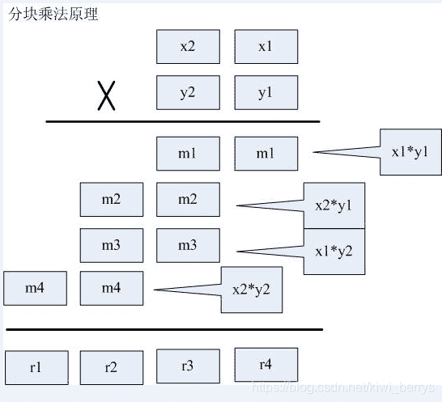
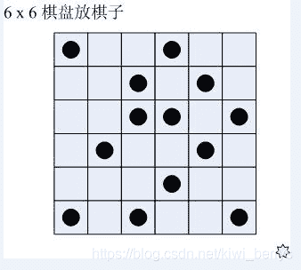
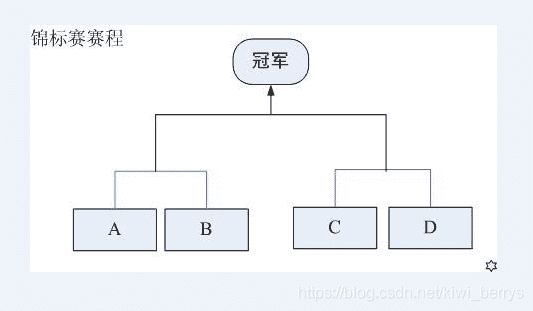

<!--yml
category: 蓝桥杯
date: 2022-04-26 11:23:47
-->

# 2012年第三届C B组蓝桥杯省赛真题_元气算法的博客-CSDN博客_蓝桥杯第三届省赛试题

> 来源：[https://blog.csdn.net/kiwi_berrys/article/details/111187699](https://blog.csdn.net/kiwi_berrys/article/details/111187699)

> 这里是蓝桥杯历年的题目专栏，将会陆续更新将往年真题以及解答发布出来，欢迎各位小伙伴关注我吖，你们的点赞关注就是给我最好的动力！！！

[全网最全蓝桥杯历年真题及详细解答](https://blog.csdn.net/kiwi_berrys/article/details/111186204)

### 第一题：微生物增殖

**题目描述**
假设有两种微生物X和Y，X出生后每隔3分钟分裂一次（数目加倍），Y出生后每隔2分钟分裂一次（数目加倍）。一个新出生的X，半分钟之后吃掉1个Y，且从此开始每隔1分钟吃掉1个Y。已知新出生的X=10，Y=89，求60分钟后Y的数目。若X=10，Y=90呢？
本题的要求就是写出这两种初始条件下，60分钟后Y的数目。题目的结果令你震惊吗？这不是简单的数字游戏！真实的生物圈有着同样脆弱的性质！也许因为你消灭的那只Y就是最终导致Y种群灭绝的最后一根稻草！
**题目分析**
蓝桥杯省赛第一题都比较简单，偏向于模拟题。
从题目中知道Y是每2分钟分裂一次，所以我们只要知道X的变化，每次X吃掉Y的数目后面算出来就可以了，这个也可以叫做控制变量法，从X得出Y.
本题需要从前几次的分裂情况可以发现X暗藏的规律，我列了一个表格如下：

| 时间 | 0 | 0.5 | 1 | 1.5 | 2 | 2.5 | 3 | 3.5 | 4 | 4.5 |
| --- | --- | --- | --- | --- | --- | --- | --- | --- | --- | --- |
| X | 10 | 10（吃Y） | 10 | 10(吃Y) | 10 | 10(吃Y) | <font>20(分裂)</font> | <font>20(新生的和以前的X都吃Y)</font> | 20 | 20（吃Y） |

从上面表格可以分析出不论是新出生的还是以前的X,都是每半分钟进行吃Y的操作，每3分钟进行一次分裂，故这题的操作如下
在60分钟内进行判断：

**1.如果为每个0.5分钟 Y=Y-X
2.如果为每个3分钟 X*=2
3.如果为每个2分钟 Y*=2**

为了代码计算简便，这里同时乘以2,便于计算

**题目代码**

```
 #include<iostream>
using namespace std;

int main()
{
	long long x = 10 , y = 89;
	for(int i = 0; i < 120; i++)
	{
		if(i%2==1)
		{
			y -= x;
		}
		if(i%6==0)
		{
			x *= 2;
		}
		if(i%4== 0)
		{
			y *= 2;
		}
	}
	cout << "x = "<< x << endl <<"y = "<< y;
	return 0;
} 
```

**题目答案**

```
x = 10485760
y = -979369984 
```

* * *

### 第二题：古堡算式 **题目描述** 福尔摩斯到某古堡探险，看到门上写着一个奇怪的算式：ABCDE*?=EDCBA。他对华生说：“ABCDE应该代表不同的数字，问号也代表某个数字！” 华生：“我猜也是！”，于是，两人沉默了好久，还是没有算出合适的结果来。 请你利用计算机的优势，找到破解的答案，把ABCDE所代表的数字写出来。

**题目分析**
暴力杯的由来，暴力枚举所有可能，这里用的可能跟其他不一样，使用next_permutation()函数，next_permutation的含义及其用法看这篇文章：[蓝桥杯之全排列函数 next_permutation()解析](https://blog.csdn.net/kiwi_berrys/article/details/54917252)
使用numArray数组的前6个数分别表示ABCDE和？,最后判断条件即可。
**题目代码**

```
#include<iostream>
#include<algorithm>
using namespace std;

int main()
{
	int numArray[10] = {0,1,2,3,4,5,6,7,8,9};
	while(next_permutation(numArray,numArray+10))
	{
		if(numArray[0]!=0&&numArray[4]!=0)
		{
			int leftVal = numArray[0]*10000+numArray[1]*1000+numArray[2]*100+numArray[3]*10+numArray[4];
			int rightVal = numArray[4]*10000+numArray[3]*1000+numArray[2]*100+numArray[1]*10+numArray[0];
			int temp = numArray[5];
			if(leftVal*temp==rightVal)
			{
				cout << numArray[0] << numArray[1] << numArray[2] << numArray[3] << numArray[4] <<endl;

				break;
			}
		}
	}
	return 0;
} 
```

**题目答案**

```
21978 
```

* * *

### 第三题：比酒量

**题目描述**
有一群海盗（不多于20人），在船上比拼酒量。过程如下：打开一瓶酒，所有在场的人平分喝下，有几个人倒下了。再打开一瓶酒平分，又有倒下的，再次重复----直到开了第4瓶酒，坐着的已经所剩无几，海盗船长也在其中。当第4瓶酒平分喝下后，大家都倒下了。等船长醒来，发现海盗船搁浅了。他在航海日志中写到：“…昨天，我正好喝了一瓶…奉劝大家，开船不喝酒，喝酒别开船…”
请你根据这些信息，推断开始有多少人，每一轮喝下来还剩多少人。如果有多个可能的答案，请列出所有答案，每个答案占一行。格式是：人数，人数，…
例如，有一种可能是：20,5,4,2,0

**题目分析**
暴力杯求解答案，这里要注意的两个点：
**1.用浮点型除以整型进行类型转换
2.判断浮点型之间是否相等用fabs
**题目代码****

```
#include<iostream>
#include<cmath>
using namespace std;

int main()
{
	for(int a = 1; a <= 20; a++)
	{
		for(int b = 1; b < a; b++)
		{
			for(int c =1; c < b; c++)
			{
				for(int d = 1; d < c; d++)
				{
					#浮点数与整数比较大小 
					if(fabs((1.0/a+1.0/b+1.0/c+1.0/d)-1 )<= 1e-5)
					{
						cout << a << ends << b << ends <<c << ends << d << "0" <<endl;
					}
				}
			}
		}
	}
} 
```

**题目答案**

```
12 6 4 20
15 10 3 20
18 9 3 20
20 5 4 20 
```

* * *

### 第四题：奇怪的比赛

**题目描述**
某电视台举办了低碳生活大奖赛。题目的计分规则相当奇怪：每位选手需要回答10个问题（其编号为1到10），越后面越有难度。答对的，当前分数翻倍；答错了则扣掉与题号相同的分数（选手必须回答问题，不回答按错误处理）。每位选手的起步分都是10分，某获胜选手最终得分刚好是100分，如果不让你看比赛过程，你能推断出他（她）哪个题目答对了，哪个题目答错了吗？如果把答对的记为1，答错的记为0，则10个题目的回答情况可用仅含1和0的串来表示，如0010110011就是可能的情况。
你的任务是算出所有可能情况，每个答案占一行。

**题目分析**
这题就是简单的递归算法，只需要考虑好递归的终止条件即可求解
**题目代码**

```
#include<iostream> 
#include<algorithm>
using namespace std;

int num[11] = {0};
void slove(int grade,int index)
{

	if(index>11)
	{
		return ;

	}
	if(grade == 100&&index == 11)
	{
		for(int i =1; i <= 10; i++)
		{
			cout<<num[i];
		}
		cout <<endl;
		return;
	}

	num[index] = 0;
	slove(grade - index,index+1);

	num[index] = 1;
	slove(grade * 2,index+1); 

}
int main()
{
	slove(10,1);
} 
```

**题目答案**

```
0010110011
0111010000
1011010000 
```

### 第五题：方阵转置

**题目描述**
对一个方阵转置，就是把原来的行号变列号，原来的列号变行号。例如，如下方阵：
1 2 3 4
5 6 7 8
9 10 11 12
13 14 15 16
转置后变为：
1 5 9 13
2 6 10 14
3 7 11 15
4 8 12 16
但如果是对该方阵顺时针旋转（不是转置），却是如下结果：
13 9 5 1
14 10 6 2
15 11 7 3
16 12 8 4
下面代码实现的功能就是要把一个方阵顺时针旋转，请推测划线处的代码。

```
void rotate(int *x,int rank)
{ 
	int *y=(int*)malloc(___________________);  
	for(int i=0;i<rank*rank;i++)
	{ 
		y[___________________]= x[i];  
	}
	for(i=0;i<rank*rank;i++) x[i]=y[i];
	free(y);
}

int main(int argc,char *argv[])
{ 
	int x[4][4]={{1,2,3,4},{5,6,7,8},{9,10,11,12},{13,14,15,16}};
	int rank=4;
	rotate(&x[0][0],rank);
	for(int i=0;i<rank;i++)
	{ 
		for(int j=0;j<rank;j++)	
			printf("%4d",x[i][j]);
		printf("\n");
	}
	return 0;
} 
```

**题目分析**
第一个填空只需要了解了malloc的用法就能理解，这里找了一篇malloc的用法:[malloc的用法](https://blog.csdn.net/qq_27871973/article/details/82896847).
第二个填空处：
矩阵的普通的倒置是x[j][i]=x[i][j];

顺时针倒置是x[j][3-i]=x[i][j];

此处还要将i转化成两个坐标，使用除法和取余运算，即：x[i]->x[i/4][i%4]

那么，通过顺时针倒置，则有 x[i%4][3-i/4]=x[i/4][i%4]=x[i]

即：x[(i%4)*4+3-i/4]=x[i];

**题目代码**

```
#include<stdio.h>
void rotate(int* x, int rank)
{

	int* y = (int*)malloc(rank*rank*sizeof(int));  
	for(int i=0; i<rank * rank; i++)
	{

		y[(i%4)*4+3-i/4] = x[i];  
	}
	for(i=0; i<rank*rank; i++)
	{
		x[i] = y[i];
	}
	free(y);
}

int main(int argc, char* argv[])
{
	int x[4][4] = {{1,2,3,4},{5,6,7,8},{9,10,11,12},{13,14,15,16}};
	int rank = 4;
	rotate(&x[0][0], rank);
	for(int i=0; i<rank; i++)
	{
		for(int j=0; j<rank; j++)
		{
			printf("%4d", x[i][j]);
		}
		printf("\n");
	}
	return 0;
} 
```

* * *

### 第六题：大数乘法

**题目描述**
对于32位字长的机器，大约超过20亿，用int类型就无法表示了，我们可以选择_int64类型，但无论怎样扩展，固定的整数类型总是有表达的极限！如果对超级大整数进行精确运算呢?一个简单的办法是：仅仅使用现有类型，但是把大整数的运算化解为若干小整数的运算，即所谓“分块法”。下图表示了分块乘法的原理。

可以把大数分成多段（此处为2段）小数，然后用小数的多次运算组合表示一个大数。可以根据int的承载能力规定小块的大小，比如要把int分成2段，则小块可取10000为上限值。注意，小块在进行纵向累加后，需要进行进位校正。以下代码示意了分块乘法的原理（乘数、被乘数都分为2段），请分析代码逻辑，并推测划线处的代码。

```
void bigmul(int x,int y,int r[])
{ 
	int base=10000;
	int x2=x/base;
	int x1=x%base;
	int y2=y/base;
	int y1=y%base;
	int n1=x1*y1;
	int n2=x1*y2;
	int n3=x2*y1;
	int n4=x2*y2;
	r[3]=n1%base;
	r[2]=n1/base+n2%base+n3%base;
	r[1]=____________________;  
	r[0]=n4/base;
	r[1]+=____________________;  
	r[2]=r[2]%base;
	r[0]+=r[1]/base;
	r[1]=r[1]%base;
}

int main(int argc,char *argv[])
{ 
	int x[]={0,0,0,0};
	bigmul(87654321,12345678,x);
	printf("%d%d%d%d\n",x[0],x[1],x[2],x[3]);
	return 0;
} 
```

**题目分析**
题目中 %base就是取后4位， /base就是取前4位，这个是重点，图中每一个框对应的数最多是4位数，如图中右边的m1对应的就是x1*x2的低四位，左边对应的就是x1*x2的高四位，图中r4所以就有代码中r[3]=n1%base;，然后，同理其他两空也是如此。
**题目代码**

```
#include<stdio.h> 
void bigmul(int x, int y, int r[])
{
	int base = 10000;
	int x2 = x / base;
	int x1 = x % base; 
	int y2 = y / base;
	int y1 = y % base; 

	int n1 = x1 * y1; 
	int n2 = x1 * y2;
	int n3 = x2 * y1;
	int n4 = x2 * y2;

	r[3] = n1 % base;
	r[2] = n1 / base + n2 % base + n3 % base;
	r[1] = r[1] = n4 % base + n2 / base + n3 / base;; 
	r[0] = n4 / base;

	r[1] += r[1] += r[2] / base;;  
	r[2] = r[2] % base;
	r[0] += r[1] / base;
	r[1] = r[1] % base;
}

int main(int argc, char* argv[])
{
	int x[] = {0,0,0,0};

	bigmul(87654321, 12345678, x);

	printf("%d%d%d%d\n", x[0],x[1],x[2],x[3]);

	return 0;
} 
```

* * *

### 第七题：放棋子

**题目描述**
今有6×6的棋盘，其中某些格子已预放了棋子。现在要再放上去一些，使得每行每列都正好有3颗棋子。我们希望推算出所有可能的放法，下面的代码就实现了这个功能。初始数组中，“1”表示放有棋子，“0”表示空白。请推测划线处的代码。


```
int N=0;
bool CheckStoneNum(int x[][6])
{ 
	for(int k=0;k<6;k++)
	{ 
		int NumRow=0,NumCol=0;
		for(int i=0;i<6;i++)
		{ 
			if(x[k][i]) NumRow++;
			if(x[i][k]) NumCol++;
		}
		if(_____________________) 
			return false;  
	    }
	return true;
}

int GetRowStoneNum(int x[][6],int r)
{ 
	int sum=0;
	for(int i=0;i<6;i++) if(x[r][i]) 
		sum++;
	return sum;
}

int GetColStoneNum(int x[][6],int c)
{ 
	int sum=0;
	for(int i=0;i<6;i++) if(x[i][c]) 
		sum++;
	return sum;
}

void show(int x[][6])
{ 
	for(int i=0;i<6;i++)
	{ 
		for(int j=0;j<6;j++) 
			printf("%2d",x[i][j]);
        printf("\n");
    }
	printf("\n");
}

void f(int x[][6],int r,int c);
void GoNext(int x[][6],int r,int c)
{ 
	if(c<6)	_________________;  
	else f(x,r+1,0);
}

void f(int x[][6],int r,int c)
{ 
	if(r==6)
	{ 
		if(CheckStoneNum(x)) 
		{ 
			N++;  
			show(x); 
		}
		return;
	}
	if(______________)  
	{	 
		GoNext(x,r,c);  
		return; 
	}
	int rr=GetRowStoneNum(x,r);
	int cc=GetColStoneNum(x,c);
	if(cc>=3)  
		GoNext(x,r,c);
	else if(rr>=3)  
		f(x,r+1,0);
	else
	{	
		x[r][c]=1;  
		GoNext(x,r,c);  
		x[r][c]=0;
		if(!(3-rr>=6-c||3-cc>=6-r))  
			GoNext(x,r,c);
	}
}

int main(int argc,char *argv[])
{ 
	int x[6][6]={{1,0,0,0,0,0},{0,0,1,0,1,0},{0,0,1,1,0,1},{0,1,0,0,1,0},{0,0,0,1,0,0},{1,0,1,0,0,1}};
	f(x,0,0);
	printf("%d\n",N);
	return 0;
} 
```

**题目分析**
题意放棋子考察的就是递归算法，搜索每一行每一列下是否能放棋子，GetRowStoneNum和GetColStone两个函数判断是否行列分别小于3，当前格子放完棋子后是使用GoNext函数寻找下一个能放棋子的位置。最后递归程序若到了递归出口 r==6时 判断棋盘是否满足了条件
**题目代码**

```
 #include<stdio.h>
#include<iostream>
#include<stdlib.h>
using namespace std;

int N = 0;  

bool CheckStoneNum(int x[][6])  
{  
    for(int k=0; k<6; k++)  
    {  
        int NumRow = 0;  
        int NumCol = 0;  
        for(int i=0; i<6; i++)  
        {  
            if(x[k][i]) NumRow++;      
            if(x[i][k]) NumCol++;  
        }

        if(NumRow!=3 || NumCol !=3) {
            return false;  
        } 
    }  
    return true;  
}  

int GetRowStoneNum(int x[][6], int r)  
{  
    int sum = 0;  
    for(int i=0; i<6; i++)   if(x[r][i]) sum++;  
    return sum;  
}  

int GetColStoneNum(int x[][6], int c)  
{  
    int sum = 0;  
    for(int i=0; i<6; i++)   if(x[i][c]) sum++;  
    return sum;  
}  

void show(int x[][6])  
{  
    for(int i=0; i<6; i++)  
    {  
        for(int j=0; j<6; j++) printf("%2d", x[i][j]);  
        printf("\n");  
    }  
    printf("\n");  
}  

void f(int x[][6], int r, int c);  

void GoNext(int x[][6],  int r,  int c)  
{  
    if(c<6){
        f(x,r,c+1);   
    } 
    else  
        f(x, r+1, 0);  
}  

void f(int x[][6], int r, int c)  
{  
    if(r==6)  
    {  

        if(CheckStoneNum(x))  
        {  

            N++;  
            show(x);  
        }  
        return;  
    }  

    if(x[r][c])  
    {  
        GoNext(x,r,c);  
        return;  
    }  

    int rr = GetRowStoneNum(x,r);   
    int cc = GetColStoneNum(x,c);  

    if(cc>=3)   
        GoNext(x,r,c);

    else if(rr>=3)  
        f(x, r+1, 0);     
    else  
    {  
        x[r][c] = 1;  
        GoNext(x,r,c);  
        x[r][c] = 0;  

        if(!(3-rr >= 6-c || 3-cc >= 6-r))  
            GoNext(x,r,c);    
    }  
}  

int main(int argc, char* argv[])  
{  
    int x[6][6] = {  
        {1,0,0,0,0,0},  
        {0,0,1,0,1,0},  
        {0,0,1,1,0,1},  
        {0,1,0,0,1,0},  
        {0,0,0,1,0,0},  
        {1,0,1,0,0,1}  
    };  

    f(x, 0, 0);  

    printf("%d\n", N);  

    return 0;  
} 
```

* * *

### 第八题：密码发生器

**题目描述**
在对银行账户等重要权限设置密码的时候，我们常常遇到这样的烦恼：如果为了好记用生日吧，容易被破解，不安全；如果设置不好记的密码，又担心自己也会忘记；如果写在纸上，担心纸张被别人发现或弄丢了…。这个程序的任务就是把一串拼音字母转换为6位数字（密码），我们可以使用任何好记的拼音串（比如名字，王喜明，就写：wangximing）作为输入，程序输出6位数字。变换的过程如下：
第1步：把字符串6个一组折叠起来，比如wangximing则变为：
wangxi
ming
第2步：把所有垂直在同一个位置的字符的ascii码值相加，得出6个数字，如上面的例子，则得出：228 202 220 206 120 105
第3步：再把每个数字“缩位”处理：就是把每个位的数字相加，得出的数字如果不是一位数字，就再缩位，直到变成一位数字为止。例如，228 => 2+2+8=12 => 1+2=3
上面的数字缩位后变为：344836, 这就是程序最终的输出结果！
要求程序从标准输入接收数据，在标准输出上输出结果。
输入格式为：第一行是一个整数n（<100），表示下边有多少输入行，接下来是n行字符串，就是等待变换的字符串。
输出格式为：n行变换后的6位密码。
例如，输入：
5
zhangfeng
wangximing
jiujingfazi
woaibeijingtiananmen
haohaoxuexi
则输出：
772243
344836
297332
716652
875843

**题目分析**
此题使用两个知识点
1.将ascii码转化为数值计算
2.递归求解出最后的个位数
**题目代码**

```
#include<iostream>
using namespace std;

int calu(int num)
{
	if(num<10)
	{
		return num;
	}
	int sum = 0;
	while(num)
	{
		sum += num%10;
		num/=10;
	}
	return calu(sum);
}
int main()
{
	int n;

	int ans[6] = {0};
	string str;
	cin >> n;
	for(int i =0; i < n; i++)
	{
		cin >> str;
		for(int i = 0; i < str.size(); i++)
		{
			ans[i%6] += (str[i]-'a'+97);
		}
		for(int i = 0; i < 6; i++)
		{
			cout << calu(ans[i]);
			ans[i] = 0;
		}
		cout <<endl;
	}
	return 0; 
} 
```

* * *

### 第九题：夺冠概率

**题目描述**
足球比赛具有一定程度的偶然性，弱队也有战胜强队的可能。假设有甲、乙、丙、丁四个球队，根据他们过去比赛的成绩，得出每个队与另一个队对阵时取胜的概率表：
甲 乙 丙 丁
甲 - 0.1 0.3 0.5
乙 0.9 - 0.7 0.4
丙 0.7 0.3 - 0.2
丁 0.5 0.6 0.8 -
数据含义：甲对乙的取胜概率为0.1，丙对乙的胜率为0.3，…。现在要举行一次锦标赛，双方抽签，分两个组比，获胜的两个队再争夺冠军（参见下图）。

请你进行10万次模拟，计算出甲队夺冠的概率。

**题目分析**
涉及简单的概率论知识，四个人分两两比赛，有C_4_2÷2=3种情况(C_4_2即四个人中选两个人为一组，剩下两个人自动分为一组，但考虑到选甲乙和选丙丁是一样的情况，因此要除以2)。这三种情况分别是甲对乙，甲对丙，甲对丁。最后要保证甲胜，即要甲在第一轮比赛的时候胜，然后在第二轮比赛也要取胜，计算概率的时候需要运用到概率论中的乘法法则。

对于题干需要的十万次模拟，需要rand()产生十万个从0到2的随机数，0，1，2分别对应那三种情况甲胜的概率，把概率加起来除以100000可以得出最终答案。
**题目代码**

```
#include<stdio.h>
#include<stdlib.h>
#include<string.h>
int main()
{
    double cas[3];
    memset(cas,0,sizeof(cas));

    cas[0]=0.1*0.2*0.3+0.1*0.8*0.5;

    cas[1]=0.3*0.4*0.1+0.3*0.6*0.5;

    cas[2]=0.5*0.7*0.1+0.5*0.3*0.3;

    int i,t;
    double sum=0.0;
    for(i =0; i<100000; i++)
    {
        t=rand()%3;
        if(t==0)
            sum+=cas[0];
        if(t==1)
            sum+=cas[1];
        if(t==2)
            sum+=cas[2];
    }
    printf("%lf\n",sum/100000);
    return 0;
} 
```

### 第十题：取球游戏

**题目描述**
今盒子里有n个小球，A、B两人轮流从盒中取球，每个人都可以看到另一个人取了多少个，也可以看到盒中还剩下多少个，并且两人都很聪明，不会做出错误的判断。
我们约定：每个人从盒子中取出的球的数目必须是：1，3，7或者8个；轮到某一方取球时不能弃权；A先取球，然后双方交替取球，直到取完；被迫拿到最后一个球的一方为负方（输方）。
请编程确定出在双方都不判断失误的情况下，对于特定的初始球数，A是否能赢？
程序运行时，从标准输入获得数据，其格式如下：
先是一个整数n（n<100），表示接下来有n个整数；然后是n个整数，每个占一行（整数<10000），表示初始球数。
程序则输出n行，表示A的输赢情况（输为0，赢为1）。
例如，用户输入：
4
1
2
10
18
则程序应该输出：
0
1
1
0

**题目分析**
递推思想，先找出前八种情况a[1]—a[8]的输赢，以后的都以前面的为基准依次找即可
比如说想现在有9个
那么你有四种取法
1， 取1，—》对方面对的是8个—》发现a[8]=1他赢了—》你输；
2， 取3，—》对方面对的是6个—》发现a[6]=1他赢了—》你输；
3， 取7，—》对方面对的是2个—》发现a[2]=1他赢了—》你输；
4， 取8，—》对方面对的是1个—》a[1]=0 他输了—》你赢了！
也就是说你只要保证至少一种情况能赢就行了
把所有的小球的输赢情况存入数组，往后的就好做了。
**题目代码**

```
#include<stdio.h>
 int main()
 {
     int i,n,T;
     int num[]={-,,,,,,,,};
     for(i=;i<=;i++)
         num[i]=(num[i-]&&num[i-]&&num[i-]&&num[i-])?():();
     scanf("%d",&T);
     while(T--)
     {
         scanf("%d",&n);
         printf("%d\n",num[n]);
     }
     return ;
 } 
```

* * *

集合:[最全蓝桥杯历年真题及详细解答](https://blog.csdn.net/kiwi_berrys/article/details/111186204)

下一届：[2013年第四届C B组蓝桥杯省赛真题](https://blog.csdn.net/kiwi_berrys/article/details/111242234)