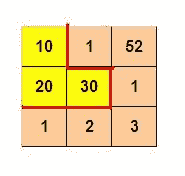
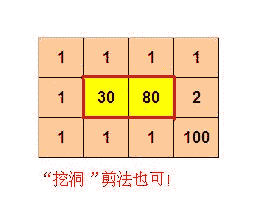

<!--yml
category: 蓝桥杯
date: 2022-04-26 11:23:33
-->

# 2013年第四届C/C++ A组蓝桥杯省赛真题_元气算法的博客-CSDN博客_蓝桥杯历年真题

> 来源：[https://blog.csdn.net/kiwi_berrys/article/details/111462107](https://blog.csdn.net/kiwi_berrys/article/details/111462107)

> 这里是蓝桥杯历年的题目专栏，将会陆续更新将往年真题以及解答发布出来，欢迎各位小伙伴关注我吖，你们的点赞关注就是给我最好的动力！！！
> <font>每天更新一届真题，敬请期待</font>

[蓝桥杯历年真题及详细解答](https://blog.csdn.net/kiwi_berrys/article/details/111186204)

* * *

### 第一题： 高斯日记

**题目描述**
大数学家高斯有个好习惯：无论如何都要记日记。
他的日记有个与众不同的地方，他从不注明年月日，而是用一个整数代替，比如：4210
后来人们知道，那个整数就是日期，它表示那一天是高斯出生后的第几天。这或许也是个好习惯，它时时刻刻提醒着主人：日子又过去一天，还有多少时光可以用于浪费呢？
高斯出生于：1777年4月30日。
在高斯发现的一个重要定理的日记上标注着：5343，因此可算出那天是：1791年12月15日。
高斯获得博士学位的那天日记上标着：8113
请你算出高斯获得博士学位的年月日。
提交答案的格式是：yyyy-mm-dd, 例如：1980-03-21

**题目分析**
**题目代码**

* * *

### 第二题：排它平方数

**题目描述**
小明正看着 203879 这个数字发呆。
原来，203879 * 203879 = 41566646641
这有什么神奇呢？仔细观察，203879 是个6位数，并且它的每个数上的数字都是不同的，并且它平方后的所有数位上都不出现组成它自身的数字。
具有这样特点的6位数还有一个，请你找出它！
再归纳一下筛选要求：
1\. 6位正整数
2\. 每个数位上的数字不同
3\. 其平方数的每个数位不含原数字的任何组成数位
答案是一个6位的正整数。
**题目分析**
**题目代码**

* * *

### 第三题：振兴中华

**题目描述**
小明参加了学校的趣味运动会，其中的一个项目是：跳格子。
地上画着一些格子，每个格子里写一个字，如下所示：（也可参见p1.jpg）
从我做起振
我做起振兴
做起振兴中
起振兴中华
比赛时，先站在左上角的写着“从”字的格子里，可以横向或纵向跳到相邻的格子里，但不能跳到对角的格子或其它位置。一直要跳到“华”字结束。
要求跳过的路线刚好构成“从我做起振兴中华”这句话。
请你帮助小明算一算他一共有多少种可能的跳跃路线呢？
**题目分析**
**题目代码**

* * *

### 第四题：颠倒的价牌

**题目描述**
小李的店里专卖其它店中下架的样品电视机，可称为：样品电视专卖店。
其标价都是4位数字（即千元不等）。
小李为了标价清晰、方便，使用了预制的类似数码管的标价签，只要用颜色笔涂数字就可以了（参见p1.jpg）。
这种价牌有个特点，对一些数字，倒过来看也是合理的数字。如：1 2 5 6 8 9 0 都可以。这样一来，如果牌子挂倒了，有可能完全变成了另一个价格，比如：1958 倒着挂就是：8561，差了几千元啊!!
当然，多数情况不能倒读，比如，1110 就不能倒过来，因为0不能作为开始数字。
有一天，悲剧终于发生了。某个店员不小心把店里的某两个价格牌给挂倒了。并且这两个价格牌的电视机都卖出去了!
庆幸的是价格出入不大，其中一个价牌赔了2百多，另一个价牌却赚了8百多，综合起来，反而多赚了558元。
请根据这些信息计算：赔钱的那个价牌正确的价格应该是多少？


**题目分析**
**题目代码**

* * *

### 第五题：前缀判断

**题目描述**
如下的代码判断 needle_start指向的串是否为haystack_start指向的串的前缀，如不是，则返回NULL。
比如：“abcd1234” 就包含了 “abc” 为前缀

```
char* prefix(char* haystack_start, char* needle_start)
{
	char* haystack = haystack_start;
	char* needle = needle_start;

	while(*haystack && *needle){
		if(______________________________) return NULL;  
	}

	if(*needle) return NULL;

	return haystack_start;
} 
```

**题目分析**
**题目代码**

* * *

### 第六题：逆波兰表达式

**题目描述**
正常的表达式称为中缀表达式，运算符在中间，主要是给人阅读的，机器求解并不方便。
例如：3 + 5 * (2 + 6) - 1
而且，常常需要用括号来改变运算次序。
相反，如果使用逆波兰表达式（前缀表达式）表示，上面的算式则表示为：
- + 3 * 5 + 2 6 1
不再需要括号，机器可以用递归的方法很方便地求解。
为了简便，我们假设：

1.  只有 + - * 三种运算符
2.  每个运算数都是一个小于10的非负整数

下面的程序对一个逆波兰表示串进行求值。
其返回值为一个结构：其中第一元素表示求值结果，第二个元素表示它已解析的字符数。

```
struct EV
{
	int result;  
	int n;       
};

struct EV evaluate(char* x)
{
	struct EV ev = {0,0};
	struct EV v1;
	struct EV v2;

	if(*x==0) return ev;

	if(x[0]>='0' && x[0]<='9'){
		ev.result = x[0]-'0';
		ev.n = 1;
		return ev;
	}

	v1 = evaluate(x+1);
	v2 = _____________________________;  

	if(x[0]=='+') ev.result = v1.result + v2.result;
	if(x[0]=='*') ev.result = v1.result * v2.result;
	if(x[0]=='-') ev.result = v1.result - v2.result;
	ev.n = 1+v1.n+v2.n;

	return ev;
} 
```

**题目分析**
**题目代码**

* * *

### 第七题：错误票据

**题目描述**
某涉密单位下发了某种票据，并要在年终全部收回。
每张票据有唯一的ID号。全年所有票据的ID号是连续的，但ID的开始数码是随机选定的。
因为工作人员疏忽，在录入ID号的时候发生了一处错误，造成了某个ID断号，另外一个ID重号。
你的任务是通过编程，找出断号的ID和重号的ID。
假设断号不可能发生在最大和最小号。
要求程序首先输入一个整数N(N<100)表示后面数据行数。
接着读入N行数据。
每行数据长度不等，是用空格分开的若干个（不大于100个）正整数（不大于100000）
每个整数代表一个ID号。
要求程序输出1行，含两个整数m n，用空格分隔。
其中，m表示断号ID，n表示重号ID

例如：
用户输入：
2
5 6 8 11 9
10 12 9

则程序输出：
7 9

再例如：
用户输入：
6
164 178 108 109 180 155 141 159 104 182 179 118 137 184 115 124 125 129 168 196
172 189 127 107 112 192 103 131 133 169 158
128 102 110 148 139 157 140 195 197
185 152 135 106 123 173 122 136 174 191 145 116 151 143 175 120 161 134 162 190
149 138 142 146 199 126 165 156 153 193 144 166 170 121 171 132 101 194 187 188
113 130 176 154 177 120 117 150 114 183 186 181 100 163 160 167 147 198 111 119

则程序输出：
105 120

资源约定：
峰值内存消耗 < 64M
CPU消耗 < 1000ms

**题目分析**
**题目代码**

* * *

### 第八题：买不到的数目

**题目描述**
小明开了一家糖果店。他别出心裁：把水果糖包成4颗一包和7颗一包的两种。糖果不能拆包卖。
小朋友来买糖的时候，他就用这两种包装来组合。当然有些糖果数目是无法组合出来的，比如要买 10 颗糖。
你可以用计算机测试一下，在这种包装情况下，最大不能买到的数量是17。大于17的任何数字都可以用4和7组合出来。
本题的要求就是在已知两个包装的数量时，求最大不能组合出的数字。

输入：
两个正整数，表示每种包装中糖的颗数(都不多于1000)

要求输出：
一个正整数，表示最大不能买到的糖数

不需要考虑无解的情况

例如：
用户输入：
4 7
程序应该输出：
17

再例如：
用户输入：
3 5
程序应该输出：
7
**题目分析**
**题目代码**

* * *

### 第九题：剪格子

**题目描述**
如图p1.jpg所示，3 x 3 的格子中填写了一些整数。
我们沿着图中的红色线剪开，得到两个部分，每个部分的数字和都是60。
本题的要求就是请你编程判定：对给定的m x n 的格子中的整数，是否可以分割为两个部分，使得这两个区域的数字和相等。
如果存在多种解答，请输出包含左上角格子的那个区域包含的格子的最小数目。
如果无法分割，则输出 0

程序输入输出格式要求：
程序先读入两个整数 m n 用空格分割 (m,n<10)
表示表格的宽度和高度
接下来是n行，每行m个正整数，用空格分开。每个整数不大于10000
程序输出：在所有解中，包含左上角的分割区可能包含的最小的格子数目。

例如：
用户输入：
3 3
10 1 52
20 30 1
1 2 3

则程序输出：
3

再例如：
用户输入：
4 3
1 1 1 1
1 30 80 2
1 1 1 100

则程序输出：
10

(参见p2.jpg)

资源约定：
峰值内存消耗 < 64M
CPU消耗 < 5000ms




**题目分析**
**题目代码**

* * *

### 第十题：大臣的旅费

**题目描述**
很久以前，T王国空前繁荣。为了更好地管理国家，王国修建了大量的快速路，用于连接首都和王国内的各大城市。
为节省经费，T国的大臣们经过思考，制定了一套优秀的修建方案，使得任何一个大城市都能从首都直接或者通过其他大城市间接到达。同时，如果不重复经过大城市，从首都到达每个大城市的方案都是唯一的。
J是T国重要大臣，他巡查于各大城市之间，体察民情。所以，从一个城市马不停蹄地到另一个城市成了J最常做的事情。他有一个钱袋，用于存放往来城市间的路费。
聪明的J发现，如果不在某个城市停下来修整，在连续行进过程中，他所花的路费与他已走过的距离有关，在走第x千米到第x+1千米这一千米中（x是整数），他花费的路费是x+10这么多。也就是说走1千米花费11，走2千米要花费23。
J大臣想知道：他从某一个城市出发，中间不休息，到达另一个城市，所有可能花费的路费中最多是多少呢？
输入格式：
输入的第一行包含一个整数n，表示包括首都在内的T王国的城市数
城市从1开始依次编号，1号城市为首都。
接下来n-1行，描述T国的高速路（T国的高速路一定是n-1条）
每行三个整数Pi, Qi, Di，表示城市Pi和城市Qi之间有一条高速路，长度为Di千米。
输出格式:
输出一个整数，表示大臣J最多花费的路费是多少。

样例输入:
5
1 2 2
1 3 1
2 4 5
2 5 4

样例输出:
135

样例说明:
大臣J从城市4到城市5要花费135的路费。

根据资源限制尽可能考虑支持更大的数据规模。

资源约定：
峰值内存消耗 < 64M
CPU消耗 < 5000ms

**题目分析**
**题目代码**

* * *