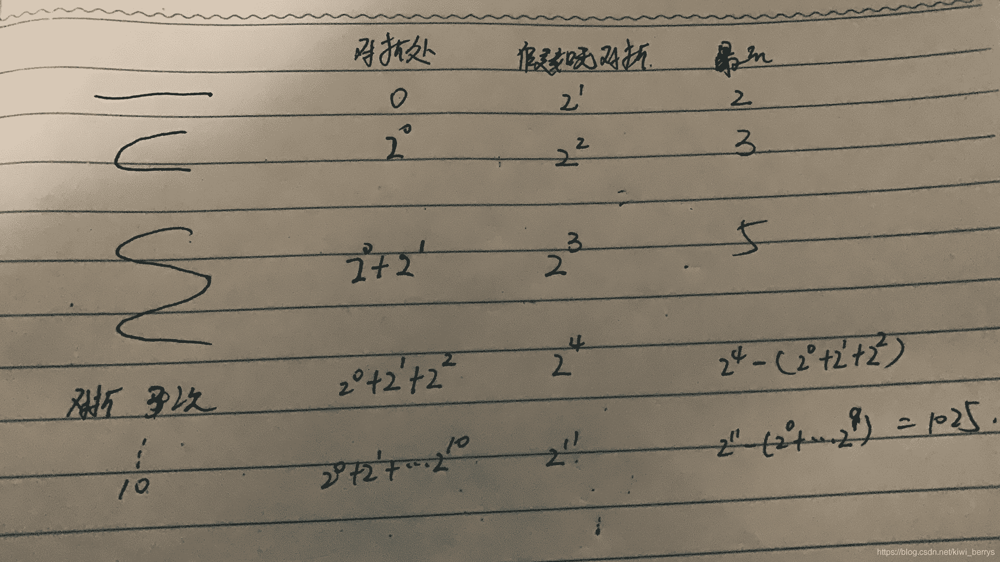
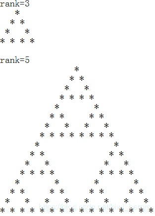
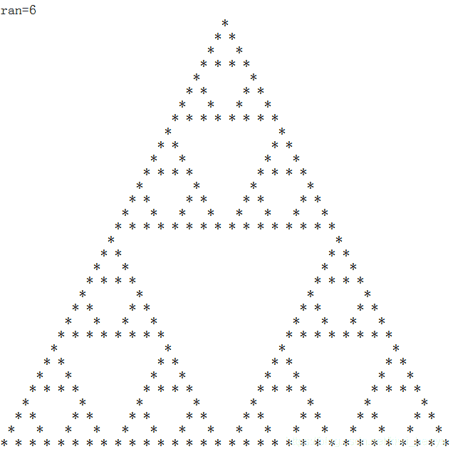
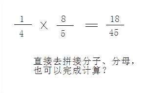
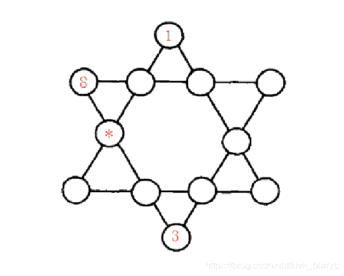
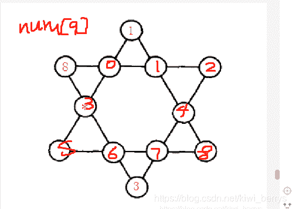

<!--yml
category: 蓝桥杯
date: 2022-04-26 11:23:51
-->

# 2014年第五届C/C++ B组蓝桥杯省赛真题_元气算法的博客-CSDN博客

> 来源：[https://blog.csdn.net/kiwi_berrys/article/details/111242532](https://blog.csdn.net/kiwi_berrys/article/details/111242532)

> 这里是蓝桥杯历年的题目专栏，将会陆续更新将往年真题以及解答发布出来，欢迎各位小伙伴关注我吖，你们的点赞关注就是给我最好的动力！！！

[蓝桥杯历年真题及详细解答](https://blog.csdn.net/kiwi_berrys/article/details/111186204)

### 第一题：啤酒和饮料

**题目描述**
啤酒每罐2.3元，饮料每罐1.9元。小明买了若干啤酒和饮料，一共花了82.3元。我们还知道他买的啤酒比饮料的数量少，请你计算他买了几罐啤酒。
**题目分析**
简单的循环暴力，两层循环就可
**题目代码**

```
#include<iostream>
#include<math.h>
using namespace std;

int main()
{

	for(int i = 0; i < 82.3/2.3; i++)
	{

		for(int j = i+1;j < 82.3/1.9; j++)
		{
			if(fabs(i*2.3+j*1.9 - 82.3) <= 1e-5)
			{
				cout << i <<ends << j <<endl;
			}
		}
	}
	return 0;
} 
```

**题目答案**

```
啤酒 11 
```

### 第二题：切面条

**题目描述**
一根高筋拉面，中间切一刀，可以得到2根面条。
如果先对折1次，中间切一刀，可以得到3根面条。
如果连续对折2次，中间切一刀，可以得到5根面条。
那么，连续对折10次，中间切一刀，会得到多少面条呢？

**题目分析**


这里可以从前3个得到规律，如果每个线的拐弯处没有连接，则会有2的N次条，正因为有对折处，所以就会减少条数。我们可以看出每次对折处增加次数为等比数列，所以最终的条数无对折的情况下减去对折的数。
<font>蓝桥杯历年比较喜欢考这种推理的数学，已经考了三四年，望重视,这方面薄弱的话可以看看**欧拉计划**</font>
**题目代码**

```
#include<iostream>
#include<cmath>
using namespace std;

int main()
{

	int a = pow(2,10)-1;

	int b = pow(2,11);

	cout << b-a;
	return 0;
} 
```

**题目答案**

```
1025 
```

* * *

### 第三题：李白打酒

**题目描述**
话说大诗人李白，一生好饮。幸好他从不开车。
一天，他提着酒壶，从家里出来，酒壶中有酒2斗。他边走边唱：
无事街上走，提壶去打酒。
逢店加一倍，遇花喝一斗。
这一路上，他一共遇到店5次，遇到花10次，已知最后一次遇到的是花，他正好把酒喝光了。

请你计算李白遇到店和花的次序，可以把遇店记为a，遇花记为b。则：babaabbabbabbbb 就是合理的次序。像这样的答案一共有多少呢？请你计算出所有可能方案的个数（包含题目给出的）。

**题目分析**
递归主要找出 临界值
进入下一步的每个变量的变化
**题目代码**

```
#include<stdio.h>
int sum;

int f(int x,int y,int c)
{

    if(x<0||y<0)
    return 0;

    if(x==0&&y==1&&c==1)
    sum+=1;

    if(x>0) 
    f(x-1,y,c*2);

    if(y>0) 
    f(x,y-1,c-1);
    return 0; 
}
int main()
{
    f(5,10,2);
    printf("%d",sum);
    return 0;
} 
```

```
 #include <iostream>
#include <algorithm>
using namespace std;

int main()
{
    int a[15]={-1,-1,-1,-1,-1,-1,-1,-1,-1,-1,2,2,2,2,2};

    int n = 0;
    do{
        int sum = 2; 

        for(int i=0; i<15; i++){
            if(a[i] == -1){
                sum += a[i];
            }else{
                sum *= a[i];
            }
        }

        if(a[14]==-1&&sum==0){ 
            n +=1;  
        }       

    }while(next_permutation(a,a+15));

    cout<< n << endl;
    return 0;
} 
```

**题目答案**

```
14 
```

### 第四题：史丰收速算

**题目描述**
史丰收速算法的革命性贡献是：从高位算起，预测进位。不需要九九表，彻底颠覆了传统手算!
速算的核心基础是：1位数乘以多位数的乘法。
其中，乘以7是最复杂的，就以它为例。
因为，1/7 是个循环小数：0.142857…，如果多位数超过 142857…，就要进1
同理，2/7, 3/7, … 6/7 也都是类似的循环小数，多位数超过 n/7，就要进n
下面的程序模拟了史丰收速算法中乘以7的运算过程。
乘以 7 的个位规律是：偶数乘以2，奇数乘以2再加5，都只取个位。
乘以 7 的进位规律是：
满 142857… 进1,
满 285714… 进2,
满 428571… 进3,
满 571428… 进4,
满 714285… 进5,
满 857142… 进6
请分析程序流程，填写划线部分缺少的代码。

```
 int ge_wei(int a)
{
	if(a % 2 == 0)
		return (a * 2) % 10;
	else
		return (a * 2 + 5) % 10;	
}

int jin_wei(char* p)
{
	char* level[] = {
		"142857",
		"285714",
		"428571",
		"571428",
		"714285",
		"857142"
	};

	char buf[7];
	buf[6] = '\0';
	strncpy(buf,p,6);

	int i;
	for(i=5; i>=0; i--){
		int r = strcmp(level[i], buf);
		if(r<0) return i+1;
		while(r==0){
			p += 6;
			strncpy(buf,p,6);
			r = strcmp(level[i], buf);
			if(r<0) return i+1;
			______________________________;  
		}
	}

	return 0;
}

void f(char* s) 
{
	int head = jin_wei(s);
	if(head > 0) printf("%d", head);

	char* p = s;
	while(*p){
		int a = (*p-'0');
		int x = (ge_wei(a) + jin_wei(p+1)) % 10;
		printf("%d",x);
		p++;
	}

	printf("\n");
}

int main()
{
	f("428571428571");
	f("34553834937543");		
	return 0;
} 
```

**题目分析**
对于这种代码填空题的心得就是要看填空的上下文。
常见的就是如果改填空处上下方有递归，则此处大概率是递归的调用，或者上下是一个if判断预期，则填空处就是判断的另一张情况，此处就是第二种。
具体解析可看此处: [解析](https://blog.csdn.net/aizhiyan2320/article/details/102114354).
**题目代码**

```
#include<stdio.h> 
#include<cstring> 

int ge_wei(int a)
{
	if(a % 2 == 0)
		return (a * 2) % 10;
	else
		return (a * 2 + 5) % 10;	
}

int jin_wei(char* p)
{
	char* level[] = {
		"142857",
		"285714",
		"428571",
		"571428",
		"714285",
		"857142"
	};

	char buf[7];
	buf[6] = '\0';
	strncpy(buf,p,6);

	int i;
	for(i=5; i>=0; i--){
		int r = strcmp(level[i], buf);
		if(r<0) return i+1;
		while(r==0){
			p += 6;
			strncpy(buf,p,6);
			r = strcmp(level[i], buf);
			if(r<0) return i+1;
			if(r>0) return i;  
		}
	}

	return 0;
}

void f(char* s) 
{
	int head = jin_wei(s);
	if(head > 0) printf("%d", head);

	char* p = s;
	while(*p){
		int a = (*p-'0');
		int x = (ge_wei(a) + jin_wei(p+1)) % 10;
		printf("%d",x);
		p++;
	}

	printf("\n");
}

int main()
{
	f("428571428571");
	f("34553834937543");		
	return 0;
} 
```

**题目答案**

```
if(r>0) return i; 
```

* * *

### 第五题：打印图形

**题目描述**
小明在X星球的城堡中发现了如下图形和文字：


小明开动脑筋，编写了如下的程序，实现该图形的打印。

```
#define N 70

void f(char a[][N], int rank, int row, int col)
{
	if(rank==1){
		a[row][col] = '*';
		return;
	}

	int w = 1;
	int i;
	for(i=0; i<rank-1; i++) w *= 2;

	____________________________________________;
	f(a, rank-1, row+w/2, col);
	f(a, rank-1, row+w/2, col+w);
}

int main()
{
	char a[N][N];
	int i,j;
	for(i=0;i<N;i++)
	for(j=0;j<N;j++) a[i][j] = ' ';

	f(a,6,0,0);

	for(i=0; i<N; i++){
		for(j=0; j<N; j++) printf("%c",a[i][j]);
		printf("\n");
	}

	return 0;
} 
```

请仔细分析程序逻辑，填写缺失代码部分。

**题目分析**
按照第四题说的做题套路，这里就是使用递归的猜想，对于这里，我们要修改的就是递归函数里后面两个参数里的三个变量col,row,w，这里我使用的方法是修改参数，然后通过结果发现,col控制列，col控制行，w控制空格数，所以最后调调答案就出来了，这种递归题在蓝桥杯中通过边调试边看结果最快
**题目代码**

```
 #include <stdio.h>
#define N 70
void f(char a[][N], int rank, int row, int col)
{
	if(rank==1){
		a[row][col] = '*';
		return;
	}

	int w = 1;
	int i;
	for(i=0; i<rank-1; i++) w *= 2;

	f(a, rank-1, row, col+w/2);
	f(a, rank-1, row+w/2, col);
	f(a, rank-1, row+w/2, col+w);
}
int main()
{
	char a[N][N];
	int i,j;
	for(i=0;i<N;i++)
	for(j=0;j<N;j++) a[i][j] = ' ';

	f(a,6,0,0);

	for(i=0; i<N; i++){
		for(j=0; j<N; j++) printf("%c",a[i][j]);
		printf("\n");
	}

	return 0;
} 
```

**题目答案**

```
 f(a, rank-1, row, col+w/2); 
```

### 第六题：奇怪的分式

**题目描述**
上小学的时候，小明经常自己发明新算法。一次，老师出的题目是：1/4 乘以 8/5 小明居然把分子拼接在一起，分母拼接在一起，答案是：18/45 （参见图1.png）老师刚想批评他，转念一想，这个答案凑巧也对啊，真是见鬼！ 对于分子、分母都是 1~9 中的一位数的情况，还有哪些算式可以这样计算呢？ 请写出所有不同算式的个数（包括题中举例的）。显然，交换分子分母后，例如：4/1 乘以 5/8 是满足要求的，这算做不同的算式。但对于分子分母相同的情况，2/2 乘以 3/3 这样的类型太多了，不在计数之列!

注意：答案是个整数（考虑对称性，肯定是偶数）。请通过浏览器提交。不要书写多余的内容。


**题目分析**
对于此题用的方法就是我们的暴力，4层循环，需注意的是：
1.分子分母要用不同的数
2.整数相除用浮点数
3.浮点数比价大小用fabs函数
**题目代码**

```
#include<iostream>
#include<cmath>

using namespace std;

int main()
{
	int cnt = 0;
	for(int a = 1; a < 10; a++)
	{
		for(int b = 1; b < 10; b++)
		{

			if(a!=b)
			for(int c = 1; c < 10; c++)
			{
				for(int d = 1; d < 10; d++)
				{
					if(c!=d)
					{

						if(fabs(a*c*1.0/(b*d)-(a*10.0+c)/(b*10+d))<1e-5)
						{
							cnt++;
						}
					}
				}
			}
		}
	}
	cout<< cnt <<endl; 
	return 0;
} 
```

**题目答案**

```
14 
```

* * *

### 第七题：六角填数

**题目描述**
如图【1.png】所示六角形中，填入1~12的数字。
使得每条直线上的数字之和都相同。
图中，已经替你填好了3个数字，请你计算星号位置所代表的数字是多少？


**题目分析**
此题三种做法：
1.常规暴力，写12层循环（我的娘嘞，要累死）
2.next_permutation()一个循环暴力（最推荐的方法）
3.递归（也行，不过我喜欢第二种）
不过三种判定条件都是一样的，就是每条线相加都会相等，这里我们可以看到，总共六条直线，六条直线相加的和==（这12个点相加的和*2），所以求出单条直线相加和为26，这里剩余九个点用数组num表示。采用next_permutition()


**题目代码**

```
 #include<iostream>
#include<algorithm>
using namespace std;
int num[9] = {2,4,5,6,7,9,10,11,12};

bool jude()
{
	bool ans1 = (1+num[1]+num[4]+num[8] == 26);
	bool ans2 = (1+num[0]+num[3]+num[5] == 26);
	bool ans3 = (8+num[0]+num[1]+num[2] == 26);
	bool ans4 = (8+num[3]+num[6]+3 == 26);
	bool ans5 = (3+num[7]+num[4]+num[2] == 26);
	bool ans6 = (num[5]+num[6]+num[7]+num[8] == 26);
	return ans1&&ans2&&ans3&&ans4&&ans5&&ans6;

}
int main()
{

	do
	{
		if(jude())
		{
			break;
		}
	}while(next_permutation(num,num+9));
	cout<<num[3]<<endl; 
	return 0;
} 
```

```
 #include<iostream>
#include<algorithm>
using namespace std;

int num[9] = {0};

int select[9] = {2,4,5,6,7,9,10,11,12};

int vis[13] = {0};

int ans = -1;
bool jude()
{
	bool ans1 = (1+num[1]+num[4]+num[8] == 26);
	bool ans2 = (1+num[0]+num[3]+num[5] == 26);
	bool ans3 = (8+num[0]+num[1]+num[2] == 26);
	bool ans4 = (8+num[3]+num[6]+3 == 26);
	bool ans5 = (3+num[7]+num[4]+num[2] == 26);
	bool ans6 = (num[5]+num[6]+num[7]+num[8] == 26);
	return ans1&&ans2&&ans3&&ans4&&ans5&&ans6;

}
void dfs(int index)
{

	if(index==9)
	{
		if(jude())
		{
			ans = num[3];
		}
		return ;
	}
	for(int i = 0; i < 9; i++)
	{

		if(vis[select[i]])
			continue;

		vis[select[i]] = 1;		
		num[index] = select[i];
		dfs(index+1);
		vis[select[i]] = 0; 

	}
	return ;

}
int main()
{
	dfs(0);
	cout << ans;

	return 0;
} 
```

**题目答案**

```
10 
```

* * *

### 第八题：蚂蚁感冒

**题目描述**
长100厘米的细长直杆子上有n只蚂蚁。它们的头有的朝左，有的朝右。 每只蚂蚁都只能沿着杆子向前爬，速度是1厘米/秒。当两只蚂蚁碰面时，它们会同时掉头往相反的方向爬行。这些蚂蚁中，有1只蚂蚁感冒了。并且在和其它蚂蚁碰面时，会把感冒传染给碰到的蚂蚁。请你计算，当所有蚂蚁都爬离杆子时，有多少只蚂蚁患上了感冒。
【数据格式】
第一行输入一个整数n (1 < n < 50), 表示蚂蚁的总数。
接着的一行是n个用空格分开的整数 Xi (-100 < Xi < 100), Xi的绝对值，表示蚂蚁离开杆子左边端点的距离。正值表示头朝右，负值表示头朝左，数据中不会出现0值，也不会出现两只蚂蚁占用同一位置。其中，第一个数据代表的蚂蚁感冒了。
要求输出1个整数，表示最后感冒蚂蚁的数目。
例如，输入：
3
5 -2 8
程序应输出：
1
再例如，输入：
5
-10 8 -20 12 25
程序应输出：
3
资源约定：
峰值内存消耗 < 256M
CPU消耗 < 1000ms

**题目分析**
此题目可简单化为 将掉头看做为擦肩而过，然后进行模拟计算就可
**题目代码**

```
#include<iostream> 

using namespace std;

int a[55];

int main()
{
    int n,i;
    while(scanf("%d",&n) != EOF)
    {
        for(i=0; i<n; i++)
        {
            scanf("%d",&a[i]);
        }

        for(i=0; i<n-1; i++)
        {
            if(a[i] * a[i+1] < 0)
                break;
        }
        if(i == n-1)
        {
            printf("1\n");
            continue;
        }
        int sum = 1;
        for(i=1; i<n; i++)
        {
            if(abs(a[i]) < abs(a[0]) && a[i] > 0)
            {
                sum++;
            }
            if(abs(a[i]) > abs(a[0]) && a[i] < 0)
            {
                sum++;
            }
        }
        printf("%d\n",sum);
    }
    return 0;
} 
```

### 第九题：地宫取宝

**题目描述**
X 国王有一个地宫宝库。是 n x m 个格子的矩阵。每个格子放一件宝贝。每个宝贝贴着价值标签。地宫的入口在左上角，出口在右下角。小明被带到地宫的入口，国王要求他只能向右或向下行走。走过某个格子时，如果那个格子中的宝贝价值比小明手中任意宝贝价值都大，小明就可以拿起它（当然，也可以不拿）。当小明走到出口时，如果他手中的宝贝恰好是k件，则这些宝贝就可以送给小明。请你帮小明算一算，在给定的局面下，他有多少种不同的行动方案能获得这k件宝贝。
【数据格式】
输入一行3个整数，用空格分开：n m k (1<=n,m<=50, 1<=k<=12)接下来有 n 行数据，每行有 m 个整数 Ci (0<=Ci<=12)代表这个格子上的宝物的价值要求输出一个整数，表示正好取k个宝贝的行动方案数。该数字可能很大，输出它对 1000000007 取模的结果。

例如，输入：
2 2 2
1 2
2 1
程序应该输出：
2

再例如，输入：
2 3 2
1 2 3
2 1 5
程序应该输出：
14

资源约定：
峰值内存消耗（含虚拟机） < 256M
CPU消耗 < 2000ms

**题目分析**
此题目典型的递归算法，有四个递归入口，一向右拿，二像右边不拿宝物，一向下拿，二向下边不拿宝物，如果单纯使用深度递归算法，则时间和空间上通不过，所以得使用一个新的方法，记忆化搜索。算法后面会更新
**题目代码**

### 第十题：小朋友排队

**题目描述**
n 个小朋友站成一排。现在要把他们按身高从低到高的顺序排列，但是每次只能交换位置相邻的两个小朋友。每个小朋友都有一个不高兴的程度。开始的时候，所有小朋友的不高兴程度都是0。如果某个小朋友第一次被要求交换，则他的不高兴程度增加1，如果第二次要求他交换，则他的不高兴程度增加2（即不高兴程度为3），依次类推。当要求某个小朋友第k次交换时，他的不高兴程度增加k。请问，要让所有小朋友按从低到高排队，他们的不高兴程度之和最小是多少。如果有两个小朋友身高一样，则他们谁站在谁前面是没有关系的。

【数据格式】
输入的第一行包含一个整数n，表示小朋友的个数。第二行包含 n 个整数 H1 H2 … Hn，分别表示每个小朋友的身高。输出一行，包含一个整数，表示小朋友的不高兴程度和的最小值。
例如，输入：
3
3 2 1
程序应该输出：
9

【样例说明】
首先交换身高为3和2的小朋友，再交换身高为3和1的小朋友，再交换身高为2和1的小朋友，每个小朋友的不高兴程度都是3，总和为9。

【数据规模与约定】
对于10%的数据， 1<=n<=10；
对于30%的数据， 1<=n<=1000；
对于50%的数据， 1<=n<=10000；
对于100%的数据，1<=n<=100000，0<=Hi<=1000000。

**题目分析**
**题目代码**