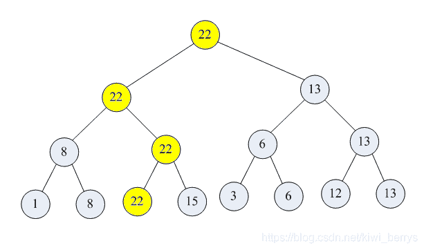

<!--yml
category: 蓝桥杯
date: 2022-04-26 11:23:35
-->

# 2014年第四届C/C++ A组蓝桥杯省赛真题_元气算法的博客-CSDN博客

> 来源：[https://blog.csdn.net/kiwi_berrys/article/details/111462407](https://blog.csdn.net/kiwi_berrys/article/details/111462407)

> 这里是蓝桥杯历年的题目专栏，将会陆续更新将往年真题以及解答发布出来，欢迎各位小伙伴关注我吖，你们的点赞关注就是给我最好的动力！！！
> <font>每天更新一届真题，敬请期待</font>

[蓝桥杯历年真题及详细解答](https://blog.csdn.net/kiwi_berrys/article/details/111186204)

* * *

### 第一题：猜年龄

**题目描述**
小明带两个妹妹参加元宵灯会。别人问她们多大了，她们调皮地说：“我们俩的年龄之积是年龄之和的6倍”。小明又补充说：“她们可不是双胞胎，年龄差肯定也不超过8岁啊。”
请你写出：小明的较小的妹妹的年龄。
**题目分析**
**题目代码**

* * *

### 第二题：切面条

**题目描述**
一根高筋拉面，中间切一刀，可以得到2根面条。
如果先对折1次，中间切一刀，可以得到3根面条。
如果连续对折2次，中间切一刀，可以得到5根面条。
那么，连续对折10次，中间切一刀，会得到多少面条呢？
**题目分析**
**题目代码**

* * *

### 第三题：神奇算式

**题目描述**
由4个不同的数字，组成的一个乘法算式，它们的乘积仍然由这4个数字组成。
比如：
210 x 6 = 1260
8 x 473 = 3784
27 x 81 = 2187
都符合要求。
如果满足乘法交换律的算式算作同一种情况，那么，包含上边已列出的3种情况，一共有多少种满足要求的算式。
**题目分析**
**题目代码**

* * *

### 第四题：史丰收速算

**题目描述**
史丰收速算法的革命性贡献是：从高位算起，预测进位。不需要九九表，彻底颠覆了传统手算!
速算的核心基础是：1位数乘以多位数的乘法。
其中，乘以7是最复杂的，就以它为例。
因为，1/7 是个循环小数：0.142857…，如果多位数超过 142857…，就要进1
同理，2/7, 3/7, … 6/7 也都是类似的循环小数，多位数超过 n/7，就要进n
下面的程序模拟了史丰收速算法中乘以7的运算过程。
乘以 7 的个位规律是：偶数乘以2，奇数乘以2再加5，都只取个位。
乘以 7 的进位规律是：
满 142857… 进1,
满 285714… 进2,
满 428571… 进3,
满 571428… 进4,
满 714285… 进5,
满 857142… 进6
请分析程序流程，填写划线部分缺少的代码。

```
 int ge_wei(int a)
{
	if(a % 2 == 0)
		return (a * 2) % 10;
	else
		return (a * 2 + 5) % 10;	
}

int jin_wei(char* p)
{
	char* level[] = {
		"142857",
		"285714",
		"428571",
		"571428",
		"714285",
		"857142"
	};

	char buf[7];
	buf[6] = '\0';
	strncpy(buf,p,6);

	int i;
	for(i=5; i>=0; i--){
		int r = strcmp(level[i], buf);
		if(r<0) return i+1;
		while(r==0){
			p += 6;
			strncpy(buf,p,6);
			r = strcmp(level[i], buf);
			if(r<0) return i+1;
			______________________________;  
		}
	}

	return 0;
}

void f(char* s) 
{
	int head = jin_wei(s);
	if(head > 0) printf("%d", head);

	char* p = s;
	while(*p){
		int a = (*p-'0');
		int x = (ge_wei(a) + jin_wei(p+1)) % 10;
		printf("%d",x);
		p++;
	}

	printf("\n");
}

int main()
{
	f("428571428571");
	f("34553834937543");		
	return 0;
} 
```

**题目分析**
**题目代码**

* * *

### 第五题：锦标赛

**题目描述**
如果要在n个数据中挑选出第一大和第二大的数据（要求输出数据所在位置和值），使用什么方法比较的次数最少？我们可以从体育锦标赛中受到启发。

如图【1.png】所示，8个选手的锦标赛，先两两捉对比拼，淘汰一半。优胜者再两两比拼…直到决出第一名。

第一名输出后，只要对黄色标示的位置重新比赛即可。

下面的代码实现了这个算法（假设数据中没有相同值）。

代码中需要用一个数组来表示图中的树（注意，这是个满二叉树，不足需要补齐）。它不是存储数据本身，而是存储了数据的下标。

第一个数据输出后，它所在的位置被标识为-1

```
 void pk(int* a, int* b, int n, int k, int v)
{
	int k1 = k*2 + 1;
	int k2 = k1 + 1;

	if(k1>=n || k2>=n){
		b[k] = -1;
		return;
	}

	if(b[k1]==v) 
		pk(a,b,n,k1,v);
	else
		pk(a,b,n,k2,v);

	if(b[k1]<0){
		if(b[k2]>=0)
			b[k] = b[k2]; 
		else
			b[k] = -1;
		return;
	}

	if(b[k2]<0){
		if(b[k1]>=0)
			b[k] = b[k1]; 
		else
			b[k] = -1;
		return;
	}

	if(______________________) 
		b[k] = b[k1];
	else
		b[k] = b[k2];
}

void f(int* a, int len)
{
	int n = 1;
	while(n<len) n *= 2;

	int* b = (int*)malloc(sizeof(int*) * (2*n-1));
	int i;
	for(i=0; i<n; i++){ 
		if(i<len) 
			b[n-1+i] = i;
		else
			b[n-1+i] = -1;
	}

	for(i=2*n-1-1; i>0; i-=2){
		if(b[i]<0){
			if(b[i-1]>=0)
				b[(i-1)/2] = b[i-1]; 
			else
				b[(i-1)/2] = -1;
		}
		else{
			if(a[b[i]]>a[b[i-1]])
				b[(i-1)/2] = b[i];
			else
				b[(i-1)/2] = b[i-1];
		}
	}

	printf("%d : %d\n", b[0], a[b[0]]);

	pk(a,b,2*n-1,0,b[0]);

	printf("%d : %d\n", b[0], a[b[0]]);

	free(b);
}

int main()
{
	int a[] = {54,55,18,16,122,17,30,9,58};
	f(a,9);	
} 
```



**题目分析**
**题目代码**

* * *

### 第六题：扑克序列

**题目描述**
A A 2 2 3 3 4 4， 一共4对扑克牌。请你把它们排成一行。
要求：两个A中间有1张牌，两个2之间有2张牌，两个3之间有3张牌，两个4之间有4张牌。
请填写出所有符合要求的排列中，字典序最小的那个。
例如：22AA3344 比 A2A23344 字典序小。当然，它们都不是满足要求的答案。
请通过浏览器提交答案。“A”一定不要用小写字母a，也不要用“1”代替。字符间一定不要留空格。
**题目分析**

**题目代码**

* * *

### 第七题：蚂蚁感冒

**题目描述**
长100厘米的细长直杆子上有n只蚂蚁。它们的头有的朝左，有的朝右。

```
每只蚂蚁都只能沿着杆子向前爬，速度是1厘米/秒。

当两只蚂蚁碰面时，它们会同时掉头往相反的方向爬行。

这些蚂蚁中，有1只蚂蚁感冒了。并且在和其它蚂蚁碰面时，会把感冒传染给碰到的蚂蚁。

请你计算，当所有蚂蚁都爬离杆子时，有多少只蚂蚁患上了感冒。 
```

【数据格式】

```
第一行输入一个整数n (1 < n < 50), 表示蚂蚁的总数。

接着的一行是n个用空格分开的整数 Xi (-100 < Xi < 100), Xi的绝对值，表示蚂蚁离开杆子左边端点的距离。正值表示头朝右，负值表示头朝左，数据中不会出现0值，也不会出现两只蚂蚁占用同一位置。其中，第一个数据代表的蚂蚁感冒了。

要求输出1个整数，表示最后感冒蚂蚁的数目。 
```

例如，输入：
3
5 -2 8
程序应输出：
1

再例如，输入：
5
-10 8 -20 12 25
程序应输出：
3

资源约定：
峰值内存消耗 < 256M
CPU消耗 < 1000ms

**题目分析**
**题目代码**

* * *

### 第八题：地宫取宝

**题目描述**
X 国王有一个地宫宝库。是 n x m 个格子的矩阵。每个格子放一件宝贝。每个宝贝贴着价值标签。
地宫的入口在左上角，出口在右下角。
小明被带到地宫的入口，国王要求他只能向右或向下行走。
走过某个格子时，如果那个格子中的宝贝价值比小明手中任意宝贝价值都大，小明就可以拿起它（当然，也可以不拿）。
当小明走到出口时，如果他手中的宝贝恰好是k件，则这些宝贝就可以送给小明。
请你帮小明算一算，在给定的局面下，他有多少种不同的行动方案能获得这k件宝贝。
【数据格式】
输入一行3个整数，用空格分开：n m k (1<=n,m<=50, 1<=k<=12)
接下来有 n 行数据，每行有 m 个整数 Ci (0<=Ci<=12)代表这个格子上的宝物的价值
要求输出一个整数，表示正好取k个宝贝的行动方案数。该数字可能很大，输出它对 1000000007 取模的结果。

例如，输入：
2 2 2
1 2
2 1
程序应该输出：
2

再例如，输入：
2 3 2
1 2 3
2 1 5
程序应该输出：
14

资源约定：
峰值内存消耗 < 256M
CPU消耗 < 1000ms
**题目分析**
**题目代码**

* * *

### 第九题：斐波那契

**题目描述**
斐波那契数列大家都非常熟悉。它的定义是：
f(x) = 1 … (x=1,2)
f(x) = f(x-1) + f(x-2) … (x>2)
对于给定的整数 n 和 m，我们希望求出：
f(1) + f(2) + … + f(n) 的值。但这个值可能非常大，所以我们把它对 f(m) 取模。
公式参见【图1.png】
但这个数字依然很大，所以需要再对 p 求模。
【数据格式】
输入为一行用空格分开的整数 n m p (0 < n, m, p < 10^18)
输出为1个整数

例如，如果输入：
2 3 5
程序应该输出：
0

再例如，输入：
15 11 29
程序应该输出：
25

资源约定：
峰值内存消耗 < 256M
CPU消耗 < 1000ms


**题目分析**
**题目代码**

* * *

### 第十题：波动数列

**题目描述**
观察这个数列：
1 3 0 2 -1 1 -2 …
这个数列中后一项总是比前一项增加2或者减少3。
栋栋对这种数列很好奇，他想知道长度为 n 和为 s 而且后一项总是比前一项增加a或者减少b的整数数列可能有多少种呢？
【数据格式】
输入的第一行包含四个整数 n s a b，含义如前面说述。
输出一行，包含一个整数，表示满足条件的方案数。由于这个数很大，请输出方案数除以100000007的余数。
例如，输入：
4 10 2 3
程序应该输出：
2
【样例说明】
这两个数列分别是2 4 1 3和7 4 1 -2。
【数据规模与约定】
对于10%的数据，1<=n<=5，0<=s<=5，1<=a,b<=5；
对于30%的数据，1<=n<=30，0<=s<=30，1<=a,b<=30；
对于50%的数据，1<=n<=50，0<=s<=50，1<=a,b<=50；
对于70%的数据，1<=n<=100，0<=s<=500，1<=a, b<=50；
对于100%的数据，1<=n<=1000，-1,000,000,000<=s<=1,000,000,000，1<=a, b<=1,000,000。
资源约定：
峰值内存消耗 < 256M
CPU消耗 < 1000ms
**题目分析**
**题目代码**

* * *