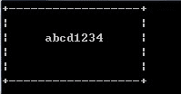
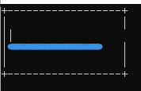

<!--yml
category: 蓝桥杯
date: 2022-04-26 11:23:53
-->

# 2015年第六届C/C++ B组蓝桥杯省赛真题_元气算法的博客-CSDN博客

> 来源：[https://blog.csdn.net/kiwi_berrys/article/details/111254226](https://blog.csdn.net/kiwi_berrys/article/details/111254226)

> 这里是蓝桥杯历年的题目专栏，将会陆续更新将往年真题以及解答发布出来，欢迎各位小伙伴关注我吖，你们的点赞关注就是给我最好的动力！！！
> <font>每天更新一届真题，敬请期待</font>

[蓝桥杯历年真题及详细解答](https://blog.csdn.net/kiwi_berrys/article/details/111186204)

### 第一题：奖券数目

**题目描述**
有些人很迷信数字，比如带“4”的数字，认为和“死”谐音，就觉得不吉利。
虽然这些说法纯属无稽之谈，但有时还要迎合大众的需求。某抽奖活动的奖券号码是5位数（10000-99999），要求其中不要出现带“4”的号码，主办单位请你计算一下，如果任何两张奖券不重号，最多可发出奖券多少张。
请提交该数字（一个整数），不要写任何多余的内容或说明性文字。
**题目分析**
不用多说，暴力手法，5层循环
**题目代码**

```
#include<iostream>

using namespace std;

int main()
{
	int cnt = 0;
	for(int i = 1; i <= 9; i++)
	{
		if(i!=4)
		for(int j = 0; j <= 9; j++)
		{
			if(j!=4)
			for(int k =0; k <= 9; k++)
			{
				if(k!=4)
				for(int m =0; m <= 9; m++)
				{
					if(m!=4)
					for(int n = 0; n <= 9; n++)
					{
						if(n!=4)
						{
							cnt++;
						}
					}
				}
			}
		}
	}
	cout << cnt <<endl;
	return 0;
} 
```

**题目答案**

```
52488 
```

### 第二题：星系炸弹

**题目描述**
在X星系的广袤空间中漂浮着许多X星人造“炸弹”，用来作为宇宙中的路标。
每个炸弹都可以设定多少天之后爆炸。
比如：阿尔法炸弹2015年1月1日放置，定时为15天，则它在2015年1月16日爆炸。
有一个贝塔炸弹，2014年11月9日放置，定时为1000天，请你计算它爆炸的准确日期。
请填写该日期，格式为 yyyy-mm-dd 即4位年份2位月份2位日期。比如：2015-02-19
请严格按照格式书写。不能出现其它文字或符号。

**题目分析**
题目与之前的算日期的题目相似
第一步：确定年份
第二步：确定月份与具体日期
注意输出格式
**题目代码**

```
#include<iostream>
using namespace std;

bool run(int year)
{
	if(year%400==0)
	{
		return true;
	}
	if(year%100==0)
	{
		return false;
	}
	if(year%4==0)
	{
		return true;
	}
	return false;
}
int main()
{
	int year = 2014;

	int days = 1000+31+28+31+30+31+30+31+31+30+31+9;
	int yearday = 0;
	int monthDay[13] = {0,31,28,31,30,31,30,31,31,30,31,30,31};

	while(1)
	{
		if(run(year))
		{
			yearday = 366;
		}
		else
		{
			yearday = 365;
		}
		if(days<yearday)
		{
			break;
		}
		days -= yearday;
		year++;
	}
	if(run(year))
	{
		monthDay[2] = 29;
	} 

	while(1)
	{
		for(int i = 1; i < 13; i++)
		{
			if(days<monthDay[i])
			{
				cout << year;
				if(i<10)
					cout << "-0" << i;
				else
					cout << "-" <<i;
				if(days<10)
					cout << "-0" << days;
				else
					cout << "-" << days;
				return 0;
			}
			days-=monthDay[i];
		}
	}
	return 0;
} 
```

**题目答案**

```
2017-08-05 
```

### 第三题：三羊献瑞

**题目描述**
观察下面的加法算式：

```
    祥 瑞 生 辉
  + 三 羊 献 瑞
-------------------
 三 羊 生 瑞 气
```

(如果有对齐问题，可以参看【图1.jpg】)其中，相同的汉字代表相同的数字，不同的汉字代表不同的数字。请你填写“三羊献瑞”所代表的4位数字（答案唯一），不要填写任何多余内容。

**题目分析**
从文字中可以得出 <font>祥 三</font> 为非零的数,且 <font>三</font> 为1
这里可以用暴力，7层循环，具体不写了。这里使用全排列算法实现
数组中：num[0]~num[6]分别代表 祥 瑞 生 辉 羊 献 气
**题目代码**

```
#include<iostream>
#include<algorithm>

using namespace std;

int main()
{

	int num[9] = {0,2,3,4,5,6,7,8,9};
	do
	{
		if(num[0]!=0)
		{
			int a = num[0]*1000 + num[1]*100 + num[2]*10 +num[3];
			int b = 1*1000 + num[4]*100 + num[5]*10 + num[1];
			int c = 1*10000 + num[4]*1000 + num[2]*100 + num[1]*10 + num[6];
			if(a+b == c)
			{
				cout << "1" << num[4] << num[5] << num[1] <<endl;
				break;
			}
		} 
	}
	while(next_permutation(num,num+9));
	return 0;
} 
```

**题目答案**

```
1085 
```

### 第四题：格子中输出

**题目描述**
StringInGrid函数会在一个指定大小的格子中打印指定的字符串。
要求字符串在水平、垂直两个方向上都居中。
如果字符串太长，就截断。
如果不能恰好居中，可以稍稍偏左或者偏上一点。
下面的程序实现这个逻辑，请填写划线部分缺少的代码。

```
#include <stdio.h>
#include <string.h>

void StringInGrid(int width, int height, const char* s)
{
	int i,k;
	char buf[1000];
	strcpy(buf, s);
	if(strlen(s)>width-2) buf[width-2]=0;

	printf("+");
	for(i=0;i<width-2;i++) printf("-");
	printf("+\n");

	for(k=1; k<(height-1)/2;k++){
		printf("|");
		for(i=0;i<width-2;i++) printf(" ");
		printf("|\n");
	}

	printf("|");

	printf("%*s%s%*s",_____________________________________________);  

	printf("|\n");

	for(k=(height-1)/2+1; k<height-1; k++){
		printf("|");
		for(i=0;i<width-2;i++) printf(" ");
		printf("|\n");
	}	

	printf("+");
	for(i=0;i<width-2;i++) printf("-");
	printf("+\n");	
}

int main()
{
	StringInGrid(20,6,"abcd1234");
	return 0;
} 
```

对于题目中数据，应该输出：

```

+------------------+
|                  |
|     abcd1234     |
|                  |
|                  |
+------------------+

```

（如果出现对齐问题，参看【图1.jpg】）
注意：只填写缺少的内容，不要书写任何题面已有代码或说明性文字。


**题目分析**
首先第一步，将需要填空的代码注释掉，看形成的图片是什么样子，如下，所以我们可以知道printf打印的部分就是空格+输入字符+空格
第二步：明确该printf(%*s，)的用法，它填入两个参数，第一个表示字符重复次数，第二个表示字符
第三步计算每个空格应该为多少，可以算出每边空格为(width-strlen(s))/2，然后填入空格就可
**题目代码**

```
#include <stdio.h>
#include <string.h>

void StringInGrid(int width, int height, const char* s)
{
	int i,k;
	char buf[1000];
	strcpy(buf, s);
	if(strlen(s)>width-2) buf[width-2]=0;

	printf("+");
	for(i=0;i<width-2;i++) printf("-");
	printf("+\n");

	for(k=1; k<(height-1)/2;k++){
		printf("|");
		for(i=0;i<width-2;i++) printf(" ");
		printf("|\n");
	}

	printf("|");

	printf("%*s%s%*s",(width-2-strlen(s))/2," ",s,width-2-strlen(s)-(width-2-strlen(s))/2," ");  

	printf("|\n");

	for(k=(height-1)/2+1; k<height-1; k++){
		printf("|");
		for(i=0;i<width-2;i++) printf(" ");
		printf("|\n");
	}	

	printf("+");
	for(i=0;i<width-2;i++) printf("-");
	printf("+\n");	
}

int main()
{
	StringInGrid(20,6,"abcd1234");
	return 0;
} 
```

**题目答案**

```
(width-2-strlen(s))/2," ",s,width-2-strlen(s)-(width-2-strlen(s))/2," " 
```

* * *

### 第五题：九数组分数

**题目描述**
1,2,3…9 这九个数字组成一个分数，其值恰好为1/3，如何组法？
下面的程序实现了该功能，请填写划线部分缺失的代码。

```
#include <stdio.h>
void test(int x[])
{
	int a = x[0]*1000 + x[1]*100 + x[2]*10 + x[3];
	int b = x[4]*10000 + x[5]*1000 + x[6]*100 + x[7]*10 + x[8];

	if(a*3==b) printf("%d / %d\n", a, b);
}

void f(int x[], int k)
{
	int i,t;
	if(k>=9){
		test(x);
		return;
	}

	for(i=k; i<9; i++){
		{t=x[k]; x[k]=x[i]; x[i]=t;}
		f(x,k+1);
		_____________________________________________ 
	}
}

int main()
{
	int x[] = {1,2,3,4,5,6,7,8,9};
	f(x,0);	
	return 0;
} 
```

注意：只填写缺少的内容，不要书写任何题面已有代码或说明性文字。
**题目分析**
这题按照固定思维，我第一次想到的就是填空处是一个递归，然而，我看到递归外面有一个for循环，对于这种for循环的递归，一般只有一个出入口，那么这个填空处就不是填递归函数入口，
{t=x[k]; x[k]=x[i]; x[i]=t;}表示的在进入递归前需要进行交换值，
那么我们想想，如果递归进去后，再出来，发现不满足值，是不是需要进行一个值的<font>还原</font>，所以接着使用{t=x[k]; x[k]=x[i]; x[i]=t;}进行还原，这题考察对于递归的熟练程度，所以平常练习多用用递归
**题目代码**

```
#include <stdio.h>
void test(int x[])
{
	int a = x[0]*1000 + x[1]*100 + x[2]*10 + x[3];
	int b = x[4]*10000 + x[5]*1000 + x[6]*100 + x[7]*10 + x[8];

	if(a*3==b) printf("%d / %d\n", a, b);
}

void f(int x[], int k)
{
	int i,t;
	if(k>=9){
		test(x);
		return;
	}

	for(i=k; i<9; i++){
		{t=x[k]; x[k]=x[i]; x[i]=t;}
		f(x,k+1);
		{t=x[k]; x[k]=x[i]; x[i]=t;}
	}
}

int main()
{
	int x[] = {1,2,3,4,5,6,7,8,9};
	f(x,0);	
	return 0;
} 
```

**题目答案**

```
{t=x[k]; x[k]=x[i]; x[i]=t;} 
```

### 第六题：加法变乘法

**题目描述**
我们都知道：1+2+3+ … + 49 = 1225
现在要求你把其中两个不相邻的加号变成乘号，使得结果为2015
比如：
1+2+3+…+10*11+12+…+27*28+29+…+49 = 2015
就是符合要求的答案。请你寻找另外一个可能的答案，并把位置靠前的那个乘号左边的数字提交（对于示例，就是提交10）。
注意：需要你提交的是一个整数，不要填写任何多余的内容。

**题目分析**
暴力杯，这里的话将乘号的位置看做是要遍历的变量，一共两个值。知道两个乘号的位置，然后模拟计算就可以了。
**题目代码**

```
#include<iostream>
using namespace std;

int main()
{

	for(int i = 1; i < 49; i++)
	{	
		for(int j = i+2; j < 49; j++)
		{
			int sum = 0;

			for(int k = 1; k < 50; k++)
			{
				if(k==i||k==j)
				{
					sum += k*(k+1);
					k++;
				}
				else 
					sum += k;
			}
			if(sum == 2015)
			{
				cout << i <<endl;
			}
		}
	}
} 
```

**题目答案**

```
16 
```

* * *

### 第七题：牌型种数

**题目描述**
小明被劫持到X赌城，被迫与其他3人玩牌。
一副扑克牌（去掉大小王牌，共52张），均匀发给4个人，每个人13张。
这时，小明脑子里突然冒出一个问题：
如果不考虑花色，只考虑点数，也不考虑自己得到的牌的先后顺序，自己手里能拿到的初始牌型组合一共有多少种呢？
请填写该整数，不要填写任何多余的内容或说明文字。

**题目分析**
第一种方法：暴力杯 12层循环
第二种方法：递归
第三种方法：DP
递推公式（i为选完第i种牌，k为剩余要选的牌数）
num[ i ][ k ] =
//上一种牌中没有选
num[ i - 1 ][ k ]
//上一种牌中选了一张
+ num[ i - 1 ][ k + 1 ]
//上一种牌中选了两张
+ num[ i - 1 ][ k +2 ]
//上一种牌中选了三张
+ num[ i - 1 ][ k +3 ]
//上一种牌中选了四张
+ num[ i - 1 ][ k +4 ];
**题目代码**

```
#include <iostream>
using namespace std;
int num[14][14] = {0};

int main(int argc, char *argv[]) {
	for(int i=9; i<=13; i++){
		num[1][i] = 1;
	}
	for(int i = 2; i <= 13;i++){
		for(int k = 0; k<=13 ;k++){
			for(int preK = k; preK <= k+4 && preK <=13; preK++){
				num[i][k] += num[i-1][preK];				
			}
		}
	}
	cout<<num[13][0];
	return 0;
} 
```

### 第八题：移动距离

**题目描述**
X星球居民小区的楼房全是一样的，并且按矩阵样式排列。其楼房的编号为1,2,3…
当排满一行时，从下一行相邻的楼往反方向排号。
比如：当小区排号宽度为6时，开始情形如下：
1 2 3 4 5 6
12 11 10 9 8 7
13 14 15 …
我们的问题是：已知了两个楼号m和n，需要求出它们之间的最短移动距离（不能斜线方向移动）

输入为3个整数w m n，空格分开，都在1到10000范围内
w为排号宽度，m,n为待计算的楼号。
要求输出一个整数，表示m n 两楼间最短移动距离。

例如：
用户输入：
6 8 2
则，程序应该输出：
4

再例如：
用户输入：
4 7 20
则，程序应该输出：
5

资源约定：
峰值内存消耗 < 256M
CPU消耗 < 1000ms

**题目分析**
**题目代码**

### 第九题：垒骰子

**题目描述**
赌圣atm晚年迷恋上了垒骰子，就是把骰子一个垒在另一个上边，不能歪歪扭扭，要垒成方柱体。
经过长期观察，atm 发现了稳定骰子的奥秘：有些数字的面贴着会互相排斥！
我们先来规范一下骰子：1 的对面是 4，2 的对面是 5，3 的对面是 6。
假设有 m 组互斥现象，每组中的那两个数字的面紧贴在一起，骰子就不能稳定的垒起来。
atm想计算一下有多少种不同的可能的垒骰子方式。
两种垒骰子方式相同，当且仅当这两种方式中对应高度的骰子的对应数字的朝向都相同。
由于方案数可能过多，请输出模 10^9 + 7 的结果。

不要小看了 atm 的骰子数量哦～

「输入格式」
第一行两个整数 n m
n表示骰子数目
接下来 m 行，每行两个整数 a b ，表示 a 和 b 数字不能紧贴在一起。

「输出格式」
一行一个数，表示答案模 10^9 + 7 的结果。

「样例输入」
2 1
1 2

「样例输出」
544

「数据范围」
对于 30% 的数据：n <= 5
对于 60% 的数据：n <= 100
对于 100% 的数据：0 < n <= 10^9, m <= 36

资源约定：
峰值内存消耗 < 256M
CPU消耗 < 2000ms

**题目分析**
**题目代码**

### 第十题：生命之树

**题目描述**
在X森林里，上帝创建了生命之树。
他给每棵树的每个节点（叶子也称为一个节点）上，都标了一个整数，代表这个点的和谐值。
上帝要在这棵树内选出一个非空节点集S，使得对于S中的任意两个点a,b，都存在一个点列 {a, v1, v2, …, vk, b} 使得这个点列中的每个点都是S里面的元素，且序列中相邻两个点间有一条边相连。
在这个前提下，上帝要使得S中的点所对应的整数的和尽量大。
这个最大的和就是上帝给生命之树的评分。
经过atm的努力，他已经知道了上帝给每棵树上每个节点上的整数。但是由于 atm 不擅长计算，他不知道怎样有效的求评分。他需要你为他写一个程序来计算一棵树的分数。

「输入格式」
第一行一个整数 n 表示这棵树有 n 个节点。
第二行 n 个整数，依次表示每个节点的评分。
接下来 n-1 行，每行 2 个整数 u, v，表示存在一条 u 到 v 的边。由于这是一棵树，所以是不存在环的。

「输出格式」
输出一行一个数，表示上帝给这棵树的分数。

「样例输入」
5
1 -2 -3 4 5
4 2
3 1
1 2
2 5

「样例输出」
8

「数据范围」
对于 30% 的数据，n <= 10
对于 100% 的数据，0 < n <= 10^5, 每个节点的评分的绝对值不超过 10^6 。

资源约定：
峰值内存消耗 < 256M
CPU消耗 < 3000ms

**题目分析**
**题目代码**