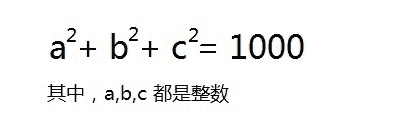

<!--yml
category: 蓝桥杯
date: 2022-04-26 11:23:36
-->

# 2015年第四届C/C++ A组蓝桥杯省赛真题_元气算法的博客-CSDN博客_2015蓝桥杯a组省赛

> 来源：[https://blog.csdn.net/kiwi_berrys/article/details/111462618](https://blog.csdn.net/kiwi_berrys/article/details/111462618)

> 这里是蓝桥杯历年的题目专栏，将会陆续更新将往年真题以及解答发布出来，欢迎各位小伙伴关注我吖，你们的点赞关注就是给我最好的动力！！！
> <font>每天更新一届真题，敬请期待</font>

[蓝桥杯历年真题及详细解答](https://blog.csdn.net/kiwi_berrys/article/details/111186204)

* * *

### 第一题：方程整数解

**题目描述**
方程: a^2 + b^2 + c^2 = 1000
（或参见【图1.jpg】）
这个方程有整数解吗？有：a,b,c=6,8,30 就是一组解。
你能算出另一组合适的解吗？

请填写该解中最小的数字。


**题目分析**
**题目代码**

* * *

### 第二题：星系炸弹

**题目描述**
在X星系的广袤空间中漂浮着许多X星人造“炸弹”，用来作为宇宙中的路标。
每个炸弹都可以设定多少天之后爆炸。
比如：阿尔法炸弹2015年1月1日放置，定时为15天，则它在2015年1月16日爆炸。
有一个贝塔炸弹，2014年11月9日放置，定时为1000天，请你计算它爆炸的准确日期。

请填写该日期，格式为 yyyy-mm-dd 即4位年份2位月份2位日期。比如：2015-02-19
请严格按照格式书写。不能出现其它文字或符号。
**题目分析**
**题目代码**

* * *

### 第三题：奇妙的数字

**题目描述**
小明发现了一个奇妙的数字。它的平方和立方正好把0~9的10个数字每个用且只用了一次。
你能猜出这个数字是多少吗？
**题目分析**
**题目代码**

* * *

### 第四题：格子中输出

**题目描述**
StringInGrid函数会在一个指定大小的格子中打印指定的字符串。
要求字符串在水平、垂直两个方向上都居中。
如果字符串太长，就截断。
如果不能恰好居中，可以稍稍偏左或者偏上一点。
下面的程序实现这个逻辑，请填写划线部分缺少的代码。

```
#include <stdio.h>
#include <string.h>

void StringInGrid(int width, int height, const char* s)
{
	int i,k;
	char buf[1000];
	strcpy(buf, s);
	if(strlen(s)>width-2) buf[width-2]=0;

	printf("+");
	for(i=0;i<width-2;i++) printf("-");
	printf("+\n");

	for(k=1; k<(height-1)/2;k++){
		printf("|");
		for(i=0;i<width-2;i++) printf(" ");
		printf("|\n");
	}

	printf("|");

	printf("%*s%s%*s",_____________________________________________);  

	printf("|\n");

	for(k=(height-1)/2+1; k<height-1; k++){
		printf("|");
		for(i=0;i<width-2;i++) printf(" ");
		printf("|\n");
	}	

	printf("+");
	for(i=0;i<width-2;i++) printf("-");
	printf("+\n");	
}

int main()
{
	StringInGrid(20,6,"abcd1234");
	return 0;
} 
```

对于题目中数据，应该输出：
±-----------------+
| |
| abcd1234 |
| |
| |
±-----------------+


（如果出现对齐问题，参看【图1.jpg】）
**题目分析**
**题目代码**

* * *

### 第五题：九数组分数

**题目描述**
1,2,3…9 这九个数字组成一个分数，其值恰好为1/3，如何组法？
下面的程序实现了该功能，请填写划线部分缺失的代码。

```
#include <stdio.h>

void test(int x[])
{
	int a = x[0]*1000 + x[1]*100 + x[2]*10 + x[3];
	int b = x[4]*10000 + x[5]*1000 + x[6]*100 + x[7]*10 + x[8];

	if(a*3==b) printf("%d / %d\n", a, b);
}

void f(int x[], int k)
{
	int i,t;
	if(k>=9){
		test(x);
		return;
	}

	for(i=k; i<9; i++){
		{t=x[k]; x[k]=x[i]; x[i]=t;}
		f(x,k+1);
		_____________________________________________ 
	}
}

int main()
{
	int x[] = {1,2,3,4,5,6,7,8,9};
	f(x,0);	
	return 0;
} 
```

**题目分析**
**题目代码**

* * *

### 第六题：牌型种数

**题目描述**
小明被劫持到X赌城，被迫与其他3人玩牌。
一副扑克牌（去掉大小王牌，共52张），均匀发给4个人，每个人13张。
这时，小明脑子里突然冒出一个问题：
如果不考虑花色，只考虑点数，也不考虑自己得到的牌的先后顺序，自己手里能拿到的初始牌型组合一共有多少种呢？
**题目分析**
**题目代码**

* * *

### 第七题：手链样式

**题目描述**
小明有3颗红珊瑚，4颗白珊瑚，5颗黄玛瑙。
他想用它们串成一圈作为手链，送给女朋友。
现在小明想知道：如果考虑手链可以随意转动或翻转，一共可以有多少不同的组合样式呢？
**题目分析**
**题目代码**

* * *

### 第八题：饮料换购

**题目描述**
乐羊羊饮料厂正在举办一次促销优惠活动。乐羊羊C型饮料，凭3个瓶盖可以再换一瓶C型饮料，并且可以一直循环下去(但不允许暂借或赊账)。

请你计算一下，如果小明不浪费瓶盖，尽量地参加活动，那么，对于他初始买入的n瓶饮料，最后他一共能喝到多少瓶饮料。

输入：一个整数n，表示开始购买的饮料数量（0<n<10000）
输出：一个整数，表示实际得到的饮料数

例如：
用户输入：
100
程序应该输出：
149

用户输入：
101
程序应该输出：
151

资源约定：
峰值内存消耗 < 256M
CPU消耗 < 1000ms
**题目分析**
**题目代码**

* * *

### 第九题：垒骰子

**题目描述**
赌圣atm晚年迷恋上了垒骰子，就是把骰子一个垒在另一个上边，不能歪歪扭扭，要垒成方柱体。
经过长期观察，atm 发现了稳定骰子的奥秘：有些数字的面贴着会互相排斥！
我们先来规范一下骰子：1 的对面是 4，2 的对面是 5，3 的对面是 6。
假设有 m 组互斥现象，每组中的那两个数字的面紧贴在一起，骰子就不能稳定的垒起来。
atm想计算一下有多少种不同的可能的垒骰子方式。
两种垒骰子方式相同，当且仅当这两种方式中对应高度的骰子的对应数字的朝向都相同。
由于方案数可能过多，请输出模 10^9 + 7 的结果。

不要小看了 atm 的骰子数量哦～

「输入格式」
第一行两个整数 n m
n表示骰子数目
接下来 m 行，每行两个整数 a b ，表示 a 和 b 数字不能紧贴在一起。

「输出格式」
一行一个数，表示答案模 10^9 + 7 的结果。

「样例输入」
2 1
1 2

「样例输出」
544

「数据范围」
对于 30% 的数据：n <= 5
对于 60% 的数据：n <= 100
对于 100% 的数据：0 < n <= 10^9, m <= 36
**题目分析**
**题目代码**

* * *

### 第十题：灾后重建

**题目描述**
Pear市一共有N（<=50000）个居民点，居民点之间有M（<=200000）条双向道路相连。这些居民点两两之间都可以通过双向道路到达。这种情况一直持续到最近，一次严重的地震毁坏了全部M条道路。
震后，Pear打算修复其中一些道路，修理第i条道路需要Pi的时间。不过，Pear并不打算让全部的点连通，而是选择一些标号特殊的点让他们连通。
Pear有Q（<=50000）次询问，每次询问，他会选择所有编号在[l,r]之间，并且 编号 mod K = C 的点，修理一些路使得它们连通。由于所有道路的修理可以同时开工，所以完成修理的时间取决于花费时间最长的一条路，即涉及到的道路中Pi的最大值。

你能帮助Pear计算出每次询问时需要花费的最少时间么？这里询问是独立的，也就是上一个询问里的修理计划并没有付诸行动。

【输入格式】
第一行三个正整数N、M、Q，含义如题面所述。
接下来M行，每行三个正整数Xi、Yi、Pi，表示一条连接Xi和Yi的双向道路，修复需要Pi的时间。可能有自环，可能有重边。1<=Pi<=1000000。

接下来Q行，每行四个正整数Li、Ri、Ki、Ci，表示这次询问的点是[Li,Ri]区间中所有编号Mod Ki=Ci的点。保证参与询问的点至少有两个。

【输出格式】
输出Q行，每行一个正整数表示对应询问的答案。

【样例输入】
7 10 4
1 3 10
2 6 9
4 1 5
3 7 4
3 6 9
1 5 8
2 7 4
3 2 10
1 7 6
7 6 9
1 7 1 0
1 7 3 1
2 5 1 0
3 7 2 1

【样例输出】
9
6
8
8

【数据范围】
对于20%的数据，N,M,Q<=30
对于40%的数据，N,M,Q<=2000
对于100%的数据，N<=50000,M<=2*10^5,Q<=50000\. Pi<=10^6\. Li,Ri,Ki均在[1,N]范围内，Ci在[0,对应询问的Ki)范围内。
**题目分析**
**题目代码**

* * *