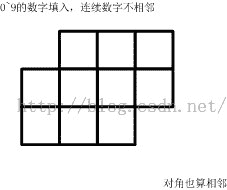
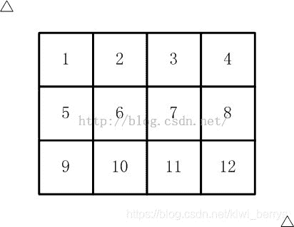
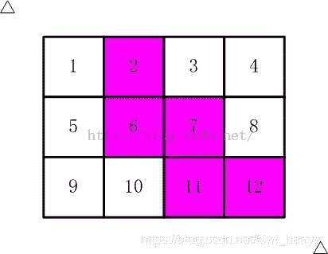
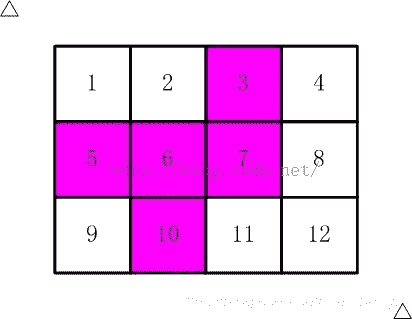

<!--yml
category: 蓝桥杯
date: 2022-04-26 11:23:55
-->

# 2016年第七届C/C++ B组蓝桥杯省赛真题_元气算法的博客-CSDN博客

> 来源：[https://blog.csdn.net/kiwi_berrys/article/details/111255226](https://blog.csdn.net/kiwi_berrys/article/details/111255226)

> 这里是蓝桥杯历年的题目专栏，将会陆续更新将往年真题以及解答发布出来，欢迎各位小伙伴关注我吖，你们的点赞关注就是给我最好的动力！！！
> <font>每天更新一届真题解析，敬请期待。</font>

[蓝桥杯历年真题及详细解答](https://blog.csdn.net/kiwi_berrys/article/details/111186204)

### 第一题：煤球数目（3分）

**题目描述**
有一堆煤球，堆成三角棱锥形。具体：
第一层放1个，
第二层3个（排列成三角形），
第三层6个（排列成三角形），
第四层10个（排列成三角形），…
如果一共有100层，共有多少个煤球？
请填表示煤球总数目的数字。
注意：你提交的应该是一个整数，不要填写任何多余的内容或说明性文字。
**题目分析**
该题目是一个模拟题，首先找出他的规律
第一层 1
第二层 1+2
第三层 1+2+3
第四层 1+2+3+4
可以看出他的规律了，就是依次加
<font>最后的要求是求全部的煤球数</font>
**题目代码**

```
#include<iostream>

using namespace std;

int main()
{
	int sum = 0,temp = 0;

	for(int i = 1; i <=100; i++)
	{
		temp += i;
		sum+= temp;
	}
	cout << sum << endl;
	return 0;
} 
```

**题目答案**

```
171700 
```

### 第二题：生日蜡烛

**题目描述**
某君从某年开始每年都举办一次生日party，并且每次都要吹熄与年龄相同根数的蜡烛。
现在算起来，他一共吹熄了236根蜡烛。
请问，他从多少岁开始过生日party的？
请填写他开始过生日party的年龄数。
注意：你提交的应该是一个整数，不要填写任何多余的内容或说明性文字。

**题目分析**
该题目暴力求出，两层循环，第一层表示从多少岁过生日，第二层表示当前多少岁了。满足条件就跳出循环。
**题目代码**

```
#include<iostream>

using namespace std;

int main()
{
	int sum = 0;

	for(int i = 1; i < 99; i++)
	{
		sum = 0;

		for(int j=i; j < 99; j++)
		{
			sum += j;
			if(sum==236)
			{
				cout << i << endl;
			}
		}
	}
	return 0;
} 
```

**题目答案**

```
26 
```

### 第三题：凑算式

**题目描述**

```
 B       DEF
A +    —    +  ——— = 10
       C       GHI 
```

（如果显示有问题，可以参见【图1.jpg】）
这个算式中A<sub>I代表1</sub>9的数字，不同的字母代表不同的数字。
比如：
6+8/3+952/714 就是一种解法，
5+3/1+972/486 是另一种解法。

这个算式一共有多少种解法？
注意：你提交应该是个整数，不要填写任何多余的内容或说明性文字。

**题目分析**
暴力循环，直接用next_permutation(）
**题目代码**

```
#include<iostream>
#include<algorithm>
#include<cmath>

using namespace std;

int main()
{
	int num[9] = {1,2,3,4,5,6,7,8,9};
	int cnt = 0;
	do
	{
		float a = num[0];
		float b = num[1]*1.0/num[2];
		float c = (num[3]*100.0+num[4]*10+num[5]) / (num[6]*100+num[7]*10+num[8]);

		if(fabs(a+b+c-10)<=1e-5)
		{
			cnt++;
		}
	}while(next_permutation(num,num+9));
	cout << cnt <<endl;
	return 0;
} 
```

**题目答案**

```
29 
```

### 第四题：快速排序

**题目描述**
排序在各种场合经常被用到。
快速排序是十分常用的高效率的算法。
其思想是：先选一个“标尺”，
用它把整个队列过一遍筛子，
以保证：其左边的元素都不大于它，其右边的元素都不小于它。
这样，排序问题就被分割为两个子区间。
再分别对子区间排序就可以了。
下面的代码是一种实现，请分析并填写划线部分缺少的代码。

```
#include <stdio.h>
void swap(int a[], int i, int j)
{
	int t = a[i];
	a[i] = a[j];
	a[j] = t;
}
int partition(int a[], int p, int r)
{
	int i = p;
	int j = r + 1;
	int x = a[p];
	while(1)
	{
		while(i<r && a[++i]<x);
		while(a[--j]>x);
		if(i>=j) break;
		swap(a,i,j);
	}
	______________________;
	return j;
}
void quicksort(int a[], int p, int r)
{
	if(p<r)
	{
		int q = partition(a,p,r);
		quicksort(a,p,q-1);
		quicksort(a,q+1,r);
	}
}

int main()
{
	int i;
	int a[] = {5,13,6,24,2,8,19,27,6,12,1,17};
	int N = 12;
	quicksort(a, 0, N-1);
	for(i=0; i<N; i++) 
		printf("%d ", a[i]);
	printf("\n");
	return 0;
} 
```

注意：只填写缺少的内容，不要书写任何题面已有代码或说明性文字。
**题目分析**
快速排序算法是十大经典算法之一，填空部分的函数是用于切割，表示比当前的数小的放左边，比当前数大的放右边，然后依次对左边和右边进行排序。填空部分就是在分完之后，将当前的数进行交换位置。
**题目代码**

```
#include <stdio.h>
void swap(int a[], int i, int j)
{
	int t = a[i];
	a[i] = a[j];
	a[j] = t;
}
int partition(int a[], int p, int r)
{
	int i = p;
	int j = r + 1;
	int x = a[p];
	while(1)
	{
		while(i<r && a[++i]<x);
		while(a[--j]>x);
		if(i>=j) break;
		swap(a,i,j);
	}
	swap(a,p,j);
	return j;
}
void quicksort(int a[], int p, int r)
{
	if(p<r)
	{
		int q = partition(a,p,r);
		quicksort(a,p,q-1);
		quicksort(a,q+1,r);
	}
}

int main()
{
	int i;
	int a[] = {5,13,6,24,2,8,19,27,6,12,1,17};
	int N = 12;
	quicksort(a, 0, N-1);
	for(i=0; i<N; i++) 
		printf("%d ", a[i]);
	printf("\n");
	return 0;
} 
```

**题目答案**

```
 swap(a,p,j); 
```

### 第五题：抽签

**题目描述**
X星球要派出一个5人组成的观察团前往W星。
其中：
A国最多可以派出4人。
B国最多可以派出2人。
C国最多可以派出2人。
…
那么最终派往W星的观察团会有多少种国别的不同组合呢？
下面的程序解决了这个问题。
数组a[] 中既是每个国家可以派出的最多的名额。
程序执行结果为：
DEFFF
CEFFF
CDFFF
CDEFF
CCFFF
CCEFF
CCDFF
CCDEF
BEFFF
BDFFF
BDEFF
BCFFF
BCEFF
BCDFF
BCDEF
…
(以下省略，总共101行)

```
#include <stdio.h>
#define N 6
#define M 5
#define BUF 1024

void f(int a[], int k, int m, char b[])
{
	int i,j;
	if(k==N)
	{ 
		b[M] = 0;
		if(m==0) printf("%s\n",b);
		return;
	}
	for(i=0; i<=a[k]; i++)
	{
		for(j=0; j<i; j++) 
			b[M-m+j] = k+'A';
		______________________; 
	}
}
int main()
{
	int a[N] = {4,2,2,1,1,3};
	char b[BUF];
	f(a,0,M,b);
	return 0;
} 
```

仔细阅读代码，填写划线部分缺少的内容。
注意：不要填写任何已有内容或说明性文字。

**题目分析**
首先理解f函数的参数表示意义，其中k表示队伍编号，m表示还需要多少人，对于这种题，判断出是递归，每进行操作一个队伍，所以递归的时候k+1，而m减少相应的人数。
**题目代码**

```
#include <stdio.h>
#define N 6
#define M 5
#define BUF 1024

void f(int a[], int k, int m, char b[])
{
	int i,j;
	if(k==N)
	{ 
		b[M] = 0;
		if(m==0) printf("%s\n",b);
		return;
	}
	for(i=0; i<=a[k]; i++)
	{
		for(j=0; j<i; j++) 
			b[M-m+j] = k+'A';
		f(a,k+1,m-j,b);; 
	}
}
int main()
{
	int a[N] = {4,2,2,1,1,3};
	char b[BUF];
	f(a,0,M,b);
	return 0;
} 
```

**题目答案**

```
f(a,k+1,m-j,b); 
```

### 第六题：方格填数

**题目描述**
如下的10个格子
（如果显示有问题，也可以参看【图1.jpg】）
填入0~9的数字。要求：连续的两个数字不能相邻。
（左右、上下、对角都算相邻）
一共有多少种可能的填数方案？
请填写表示方案数目的整数。
注意：你提交的应该是一个整数，不要填写任何多余的内容或说明性文字。


**题目分析**
**题目代码**

### 第七题：剪邮票

**题目描述**
如【图1.jpg】, 有12张连在一起的12生肖的邮票。
现在你要从中剪下5张来，要求必须是连着的。
（仅仅连接一个角不算相连）
比如，【图2.jpg】，【图3.jpg】中，粉红色所示部分就是合格的剪取。
请你计算，一共有多少种不同的剪取方法。
请填写表示方案数目的整数。
注意：你提交的应该是一个整数，不要填写任何多余的内容或说明性文字。





**题目分析**
**题目代码**

### 第八题：四平方和

**题目描述**
四平方和定理，又称为拉格朗日定理：
每个正整数都可以表示为至多4个正整数的平方和。
如果把0包括进去，就正好可以表示为4个数的平方和。比如：
5 = 0^2 + 0^2 + 1^2 + 2^2
7 = 1^2 + 1^2 + 1^2 + 2^2
（^符号表示乘方的意思）
对于一个给定的正整数，可能存在多种平方和的表示法。
要求你对4个数排序：
0 <= a <= b <= c <= d
并对所有的可能表示法按 a,b,c,d 为联合主键升序排列，最后输出第一个表示法
程序输入为一个正整数N (N<5000000)
要求输出4个非负整数，按从小到大排序，中间用空格分开
例如，输入：
5
则程序应该输出：
0 0 1 2
再例如，输入：
12
则程序应该输出：
0 2 2 2
再例如，输入：
773535
则程序应该输出：
1 1 267 838
资源约定：
峰值内存消耗 < 256M
CPU消耗 < 3000ms

**题目分析**
**题目代码**

### 第九题：交换瓶子

**题目描述**
有N个瓶子，编号 1 ~ N，放在架子上。

比如有5个瓶子：
2 1 3 5 4

要求每次拿起2个瓶子，交换它们的位置。
经过若干次后，使得瓶子的序号为：
1 2 3 4 5

对于这么简单的情况，显然，至少需要交换2次就可以复位。

如果瓶子更多呢？你可以通过编程来解决。

输入格式为两行：
第一行: 一个正整数N（N<10000）, 表示瓶子的数目
第二行：N个正整数，用空格分开，表示瓶子目前的排列情况。

输出数据为一行一个正整数，表示至少交换多少次，才能完成排序。

例如，输入：
5
3 1 2 5 4

程序应该输出：
3

再例如，输入：
5
5 4 3 2 1

程序应该输出：
2
资源约定：
峰值内存消耗 < 256M
CPU消耗 < 1000ms

**题目分析**
**题目代码**

### 第十题：最大比例

**题目描述**
X星球的某个大奖赛设了M级奖励。每个级别的奖金是一个正整数。
并且，相邻的两个级别间的比例是个固定值。
也就是说：所有级别的奖金数构成了一个等比数列。比如：
16,24,36,54
其等比值为：3/2

现在，我们随机调查了一些获奖者的奖金数。
请你据此推算可能的最大的等比值。

输入格式：
第一行为数字N，表示接下的一行包含N个正整数
第二行N个正整数Xi(Xi<1 000 000 000 000)，用空格分开。每个整数表示调查到的某人的奖金数额

要求输出：
一个形如A/B的分数，要求A、B互质。表示可能的最大比例系数

测试数据保证了输入格式正确，并且最大比例是存在的。

例如，输入：
3
1250 200 32

程序应该输出：
25/4

再例如，输入：
4
3125 32 32 200

程序应该输出：
5/2

再例如，输入：
3
549755813888 524288 2

程序应该输出：
4/1

资源约定：
峰值内存消耗 < 256M
CPU消耗 < 3000ms

**题目分析**
**题目代码**