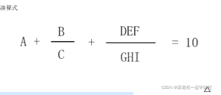
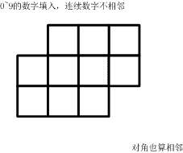
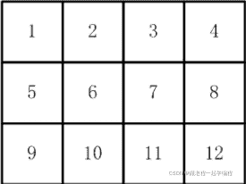
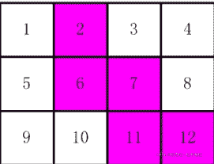
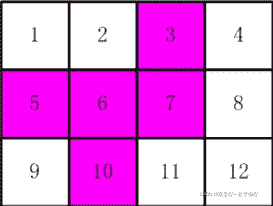

<!--yml
category: 蓝桥杯
date: 2022-04-26 11:07:15
-->

# 2016年第七届蓝桥杯省赛试题及详解（Java本科B组）_跟老程一起学编程的博客-CSDN博客_第七届蓝桥杯javab组

> 来源：[https://blog.csdn.net/future277809183/article/details/105218891](https://blog.csdn.net/future277809183/article/details/105218891)

1.  结果填空 (满分3分)
2.  结果填空 (满分5分)
3.  结果填空 (满分9分)
4.  代码填空 (满分11分)
5.  代码填空 (满分13分)
6.  结果填空 (满分15分)
7.  结果填空 (满分19分)
8.  程序设计（满分21分）
9.  程序设计（满分23分）
10.  程序设计（满分31分）

* * *

**第一题：煤球数目**

有一堆煤球，堆成三角棱锥形。具体：
第一层放1个，
第二层3个（排列成三角形），
第三层6个（排列成三角形），
第四层10个（排列成三角形），
....
如果一共有100层，共有多少个煤球？

请填表示煤球总数目的数字。
注意：你提交的应该是一个整数，不要填写任何多余的内容或说明性文字**。
答案:171700**

```
public class Main {
	public static void main(String[] args) {
		int a=1,b=2,sum=1;
		for (int i = 2; i <= 100; i++) {
			sum += (a+b);
			a+=b;
			b++;
		}
		System.out.println(sum);
	}
}
```

**第二题：生日蜡烛**

某君从某年开始每年都举办一次生日party，并且每次都要吹熄与年龄相同根数的蜡烛。

现在算起来，他一共吹熄了236根蜡烛。

请问，他从多少岁开始过生日party的？

请填写他开始过生日party的年龄数。
注意：你提交的应该是一个整数，不要填写任何多余的内容或说明性文字。

**答案:26**

```
import java.util.Scanner;

public class Main {
	public static void main(String[] args) {
		Scanner in=new Scanner(System.in);
        for(int i=1;i<50;i++) {
        	int sum=0;
        	for(int j=i;j<50;j++) {
        		sum+=j;
        		if(sum==236) {
        			System.out.println(i);
        			j=100;  //退出循环
        			i=100;
        		}else if(sum>236){
        			break;
        		}else {
        			continue;
        		}
        	}
        }
	}
}
```

**第三题：凑算式**

 B      DEF
A + --- + ------- = 10
     C      GHI

（如果显示有问题，可以参见【图1.jpg】）
     

这个算式中A~I代表1~9的数字，不同的字母代表不同的数字。

比如：
6+8/3+952/714 就是一种解法，
5+3/1+972/486 是另一种解法。

这个算式一共有多少种解法？

注意：你提交应该是个整数，不要填写任何多余的内容或说明性文字。

A + B/C + D/E = 10 --> A*C*E + B*E + D*C = 10*C*E，除法可能会有浮点误差，所以先转换

```
public class Main {

	public static void main(String[] args) {
		dfs(0);
		System.out.println(ans);
	}

	static int[] a = new int[] {1,2,3,4,5,6,7,8,9};
	static int ans=0;
	static void dfs(int m) {
		if(m>=9) {
			//a[0]+a[1]/a[2]+a[3]a[4]a[5]/(a[6]a[7]a[8]) = 10 
			//--> A + B/C + D/E = 10 --> A*C*E + B*E + D*C = 10*C*E
			int A = a[0];
			int B = a[1];
			int C = a[2];
			int D = 100*a[3]+10*a[4]+a[5];
			int E = 100*a[6]+10*a[7]+a[8];

			if(A*C*E + B*E +D*C == 10*C*E) {
				ans++;
				for(int i=0;i<9;i++)
					System.out.print(a[i]+" ");
				System.out.println();
			}
			return;
		}

		for(int i=m;i<9;i++) {
			swap(m,i);
			dfs(m+1);
			swap(m,i);
		}

	}

	static void swap(int i, int j) {
		int t = a[i];
		a[i] = a[j];
		a[j] = t;
	}

}
```

第二种方法： 

```
import java.util.Scanner;

public class Main {

	public static void main(String args[]) {
		Scanner in=new Scanner(System.in);
		int sum=0;
		for(int a=1; a<=9; a++)
			for(int b=1; b<=9; b++) {
				if(b==a) continue;
				for(int c=1; c<=9; c++) {
					if(c==a||c==b) continue;
					for(int d=1; d<=9; d++) {
						if(d==a||d==b||d==c) continue;
						for(int e=1; e<=9; e++) {
							if(e==a||e==b||e==c||e==d) continue;
							for(int f=1; f<=9; f++) {
								if(f==a||f==b||f==c||f==d||f==e) continue;
								for(int g=1; g<=9; g++) {
									if(g==a||g==b||g==c||g==d||g==e||g==f) continue;
									for(int h=1; h<=9; h++) {
								        if(h==a||h==b||h==c||h==d||h==e||h==f||h==g)continue;
										for(int i=1; i<=9; i++) {
			                  				if(i==a||i==b||i==c||i==d||i==e||i==f||i==g||i==h)continue;
			                  			    //要把其中一个整数先乘以 1.0 转化成浮点数
											if((a+(b*1.0/c)+(f+e*10+d*100)*1.0/(i+h*10+g*100))==10){
												sum++;	
											}
										}
									}										
								}
							}
						}
					}
				}
			}
		System.out.println(sum);
	}
}
```

**第四题：分小组**

9名运动员参加比赛，需要分3组进行预赛。
有哪些分组的方案呢？

我们标记运动员为 A,B,C,... I
下面的程序列出了所有的分组方法。

该程序的正常输出为：
ABC DEF GHI
ABC DEG FHI
ABC DEH FGI
ABC DEI FGH
ABC DFG EHI
ABC DFH EGI
ABC DFI EGH
ABC DGH EFI
ABC DGI EFH
ABC DHI EFG
ABC EFG DHI
ABC EFH DGI
ABC EFI DGH
ABC EGH DFI
ABC EGI DFH
ABC EHI DFG
ABC FGH DEI
ABC FGI DEH
ABC FHI DEG
ABC GHI DEF
ABD CEF GHI
ABD CEG FHI
ABD CEH FGI
ABD CEI FGH
ABD CFG EHI
ABD CFH EGI
ABD CFI EGH
ABD CGH EFI
ABD CGI EFH
ABD CHI EFG
ABD EFG CHI
..... (以下省略，总共560行)

```
public class Main {
	public static String remain(int[] a) {
		String s = "";
		for (int i = 0; i < a.length; i++) {
			if (a[i] == 0)
				s += (char) (i + 'A');
		}
		return s;
	}

	public static void f(String s, int[] a) {
		for (int i = 0; i < a.length; i++) {
			if (a[i] == 1)
				continue;
			a[i] = 1;
			for (int j = i + 1; j < a.length; j++) {
				if (a[j] == 1)
					continue;
				a[j] = 1;
				for (int k = j + 1; k < a.length; k++) {
					if (a[k] == 1)
						continue;
					a[k] = 1;
					System.out.println(); // 填空位置
					a[k] = 0;
				}
				a[j] = 0;
			}
			a[i] = 0;
		}
	}

	public static void main(String[] args) {
		int[] a = new int[9];
		a[0] = 1;

		for (int b = 1; b < a.length; b++) {
			a[b] = 1;
			for (int c = b + 1; c < a.length; c++) {
				a[c] = 1;
				String s = "A" + (char) (b + 'A') + (char) (c + 'A');
				f(s, a);
				a[c] = 0;
			}
			a[b] = 0;
		}
	}
}
```

```
答案：s + " "+ (char)(i+'A') + (char)(j+'A') + (char)(k+'A') + " " + remain(a) 
```

**第五题：抽签**

X星球要派出一个5人组成的观察团前往W星。
其中：
A国最多可以派出4人。
B国最多可以派出2人。
C国最多可以派出2人。
....

那么最终派往W星的观察团会有多少种国别的不同组合呢？

下面的程序解决了这个问题。
数组a[] 中既是每个国家可以派出的最多的名额。
程序执行结果为：
DEFFF
CEFFF
CDFFF
CDEFF
CCFFF
CCEFF
CCDFF
CCDEF
BEFFF
BDFFF
BDEFF
BCFFF
BCEFF
BCDFF
BCDEF
....
(以下省略，总共101行)

```
public class A
{
    public static void f(int[] a, int k, int n, String s)
    {
        if(k==a.length){ 
            if(n==0) System.out.println(s);
            return;
        }

        String s2 = s;
        for(int i=0; i<=a[k]; i++){
            _____________________________;   //填空位置
            s2 += (char)(k+'A');
        }
    }

    public static void main(String[] args)
    {
        int[] a = {4,2,2,1,1,3};

        f(a,0,5,"");
    }
}
```

```
答案： f(a,k+1,n-i,s2); 
```

**第六题：方格填数**

如下的10个格子
   +--+--+--+
   |  |  |  |
+--+--+--+--+
|  |  |  |  |
+--+--+--+--+
|  |  |  |
+--+--+--+

（如果显示有问题，也可以参看【图1.jpg】）



填入0~9的数字。要求：连续的两个数字不能相邻。
（左右、上下、对角都算相邻）

一共有多少种可能的填数方案？

请填写表示方案数目的整数。
注意：你提交的应该是一个整数，不要填写任何多余的内容或说明性文字。

```
import java.util.Arrays;

public class Main {

	static int cnt = 0;
	static int[] a = { 0, 1, 2, 3, 4, 5, 6, 7, 8, 9 };

	public static void main(String[] args) {
		p(0);
		System.out.println(cnt);
	}

	public static void p(int k) {

		if (k == 10) {
			boolean f = check();
			if (f) {
				cnt++;
			}
			return;
		}

		for (int i = k; i < a.length; i++) {
			int t = a[i];
			a[i] = a[k];
			a[k] = t;
			p(k + 1);
			t = a[i];
			a[i] = a[k];
			a[k] = t;
		}
	}

	private static boolean check() {
		// TODO Auto-generated method stub
		if (Math.abs(a[0] - a[1]) == 1 || 
			Math.abs(a[0] - a[3]) == 1 || 
			Math.abs(a[0] - a[4]) == 1 || 
			Math.abs(a[0] - a[5]) == 1 ||

			Math.abs(a[1] - a[2]) == 1 || 
			Math.abs(a[1] - a[4]) == 1 || 
			Math.abs(a[1] - a[5]) == 1 || 
			Math.abs(a[1] - a[6]) == 1 ||

			Math.abs(a[2] - a[5]) == 1 || 
			Math.abs(a[2] - a[6]) == 1 || 

			Math.abs(a[3] - a[4]) == 1 || 
			Math.abs(a[3] - a[7]) == 1 || 
			Math.abs(a[3] - a[8]) == 1 ||

			Math.abs(a[4] - a[5]) == 1 || 
			Math.abs(a[4] - a[7]) == 1 || 
			Math.abs(a[4] - a[8]) == 1 || 
			Math.abs(a[4] - a[9]) == 1 ||

			Math.abs(a[5] - a[6]) == 1 || 
			Math.abs(a[5] - a[8]) == 1 || 
			Math.abs(a[5] - a[9]) == 1 ||

			Math.abs(a[6] - a[9]) == 1 ||

			Math.abs(a[7] - a[8]) == 1 ||

			Math.abs(a[8] - a[9]) == 1 )
			return false;
		return true;
	}
} 
```

第二种方法：

```
public class Main {

	public static void main(String[] args) {
		dfs(0);
		System.out.println(ans);
	}

	static int[] a = new int[] {0,1,2,3,4,5,6,7,8,9};
	static int ans=0;

	static void dfs(int m) {
		if(m>=10) {
			if(a[0]==a[1]-1 || a[0]==a[1]+1 || a[0]==a[4]-1 || a[0]==a[4]+1 || a[0]==a[3]-1 || a[0]==a[3]+1 || a[0]==a[5]-1 || a[0]==a[5]+1)
				return;
			if(a[1]==a[2]-1 || a[1]==a[2]+1 || a[1]==a[5]-1 || a[1]==a[5]+1 || a[1]==a[4]-1 || a[1]==a[4]+1 || a[1]==a[6]-1 || a[1]==a[6]+1)
				return;
			if(a[2]==a[6]-1 || a[2]==a[6]+1 || a[2]==a[5]-1 || a[2]==a[5]+1)
				return;
			if(a[3]==a[4]-1 || a[3]==a[4]+1 || a[3]==a[7]-1 || a[3]==a[7]+1 || a[3]==a[8]-1 || a[3]==a[8]+1)
				return;			
			if(a[4]==a[5]-1 || a[4]==a[5]+1 || a[4]==a[8]-1 || a[4]==a[8]+1 || a[4]==a[7]-1 || a[4]==a[7]+1 || a[4]==a[9]-1 || a[4]==a[9]+1)
				return;					
			if(a[5]==a[6]-1 || a[5]==a[6]+1 || a[5]==a[8]-1 || a[5]==a[8]+1 || a[5]==a[9]-1 || a[5]==a[9]+1)
				return;
			if(a[6]==a[9]-1 || a[6]==a[9]+1 || a[7]==a[8]-1 || a[7]==a[8]+1 || a[8]==a[9]-1 || a[8]==a[9]+1)
				return;	
			for(int i=0;i<=9;i++)
				System.out.print(a[i]+" ");
			System.out.println();
			ans++;
			return;
		}

		for(int i=m;i<10;i++) {
			swap(m,i);
			dfs(m+1);
			swap(m,i);
		}

	}

	static void swap(int i,int j) {
		int t = a[i];
		a[i] = a[j];
		a[j] = t;
	}

}
```

**第七题：剪邮票**

如【图1.jpg】, 有12张连在一起的12生肖的邮票。 现在你要从中剪下5张来，要求必须是连着的。 （仅仅连接一个角不算相连）


比如，【图2.jpg】，【图3.jpg】中，粉红色所示部分就是合格的剪取。 请你计算，一共有多少种不同的剪取方法。





```
import java.util.Arrays;
import java.util.HashSet;

public class Main{

	public static void main(String[] args) {

		for(int i=1;i<=12;i++) {
			for(int j=i+1;j<=12;j++) {
				for(int k=j+1;k<=12;k++) {
					for(int x=k+1;x<=12;x++) {
						for(int y=x+1;y<=12;y++) {
							vis[i]=vis[j]=vis[k]=vis[x]=vis[y]=true;
							t=0;
							dfs(i);
							if(t==5)
								ans++;
							vis[i]=vis[j]=vis[k]=vis[x]=vis[y]=false;
						}
					}
				}
			}			
		}
		System.out.println(ans);
	}

//	static char[] a = new char[] {'A','B','C','D','E','F','G','H','I','J','K','L'};
//	static HashSet<String> set = new HashSet<>();
	static boolean[] vis = new boolean[13];
	static int ans = 0;
	static int t=0;

	static void dfs(int x) {
		vis[x]=false;
		t++;
		if(x!=1 && x!=5 && x!=9 && vis[x-1])
			dfs(x-1);
		if(x!=4 && x!=8 && x!=12 && vis[x+1])
			dfs(x+1);
		if(x!=1 && x!=2 && x!=3 && x!=4 && vis[x-4])
			dfs(x-4);
		if(x!=9 && x!=10 && x!=11 && x!=12 && vis[x+4])
			dfs(x+4);
	}

}
```

**第八题：四平方和**

四平方和定理，又称为拉格朗日定理：
每个正整数都可以表示为至多4个正整数的平方和。
如果把0包括进去，就正好可以表示为4个数的平方和。

比如：
5 = 0^2 + 0^2 + 1^2 + 2^2
7 = 1^2 + 1^2 + 1^2 + 2^2
（^符号表示乘方的意思）

对于一个给定的正整数，可能存在多种平方和的表示法。
要求你对4个数排序：
0 <= a <= b <= c <= d
并对所有的可能表示法按 a,b,c,d 为联合主键升序排列，最后输出第一个表示法

程序输入为一个正整数N (N<5000000)
要求输出4个非负整数，按从小到大排序，中间用空格分开

例如，输入：
5
则程序应该输出：
0 0 1 2

再例如，输入：
12
则程序应该输出：
0 2 2 2

再例如，输入：
773535
则程序应该输出：
1 1 267 838

资源约定：
峰值内存消耗（含虚拟机） < 256M
CPU消耗  < 3000ms

请严格按要求输出，不要画蛇添足地打印类似：“请您输入...” 的多余内容。

所有代码放在同一个源文件中，调试通过后，拷贝提交该源码。
注意：不要使用package语句。不要使用jdk1.7及以上版本的特性。
注意：主类的名字必须是：Main，否则按无效代码处理

```
import java.util.Scanner;

public class Main {

	public static void main(String[] args) {
		Scanner in = new Scanner(System.in);
		int n = in.nextInt();
		for(int i=0;i*i<=n;i++)
			for(int j=i;j*j<=n-i*i;j++)
				for(int x=j;x*x<=n-i*i-j*j;x++)
					for(int y=x;y*y<=n-i*i-j*j-x*x;y++)
						if(i*i+j*j+x*x+y*y==n) {
							System.out.println(i+" "+j+" "+x+" "+y);
							return;
						}

	}

}
```

**第九题：取球博弈**

两个人玩取球的游戏。
一共有N个球，每人轮流取球，每次可取集合{n1,n2,n3}中的任何一个数目。
如果无法继续取球，则游戏结束。
此时，持有奇数个球的一方获胜。
如果两人都是奇数，则为平局。

假设双方都采用最聪明的取法，
第一个取球的人一定能赢吗？
试编程解决这个问题。

输入格式：
第一行3个正整数n1 n2 n3，空格分开，表示每次可取的数目 (0<n1,n2,n3<100)
第二行5个正整数x1 x2 ... x5，空格分开，表示5局的初始球数(0<xi<1000)

输出格式：
一行5个字符，空格分开。分别表示每局先取球的人能否获胜。
能获胜则输出+，
次之，如有办法逼平对手，输出0，
无论如何都会输，则输出-

例如，输入：
1 2 3
1 2 3 4 5

程序应该输出：
+ 0 + 0 -

再例如，输入：
1 4 5
10 11 12 13 15

程序应该输出：
0 - 0 + +

再例如，输入：
2 3 5
7 8 9 10 11

程序应该输出：
+ 0 0 0 0

资源约定：
峰值内存消耗（含虚拟机） < 256M
CPU消耗  < 3000ms

请严格按要求输出，不要画蛇添足地打印类似：“请您输入...” 的多余内容。

所有代码放在同一个源文件中，调试通过后，拷贝提交该源码。
注意：不要使用package语句。不要使用jdk1.7及以上版本的特性。
注意：主类的名字必须是：Main，否则按无效代码处理。

```
import java.util.Arrays;
import java.util.Scanner;

public class Main {

  private static int[] n;

  public static void main(String[] args) {
    Scanner sc = new Scanner(System.in);
    n = new int[3];
    for (int i = 0; i < 3; i++) {
      n[i] = sc.nextInt();
    }
    Arrays.sort(n);//排序
    for (int i = 0; i < 5; i++) {
      int num = sc.nextInt();
      char res = f(num, 0, 0);
      System.out.print(res + " ");
    }
    System.out.println();
  }
static char[][][]cache = new char[1000][2][2];
  /**
   * 参数代表着当前取球人面临的局面
   * @param num 球的总数
   * @param me 我方持有的数目-->我方数目的奇偶性
   * @param you 对手持有的数目-对方数目的奇偶性
   * @return
   */
  private static char f(int num, int me, int you) {
    if (num<n[0])//不够取
    {
      if ((me&1)==1&&(you&1)==0)return '+';
      else if ((me&1)==0&&(you&1)==1)return '-';
      else return '0';
    }
    if (cache[num][me][you]!='\0')return cache[num][me][you];
    boolean ping = false;
    for (int i = 0; i < 3; i++) {
      if (num >= n[i]) {
        char res = f(num - n[i], you, (n[i]&1)==0?me:(1-me));//注意此处，传递me和you的奇偶性
        if (res == '-')
        {
          cache[num][me][you]='+';
          return '+';
        }
        if (res == '0')
          ping = true;
      }
    }
    //如果能走到第这行，说明不存在对手输的情况，那么是否存在平的情况
    if (ping)
    {
      cache[num][me][you]='0';
      return '0';
    }
    else
    {
      cache[num][me][you]='-';
      return '-';
    }
  }
}
```

**第十题：压缩变换**

小明最近在研究压缩算法。

他知道，压缩的时候如果能够使得数值很小，就能通过熵编码得到较高的压缩比。
然而，要使数值很小是一个挑战。

最近，小明需要压缩一些正整数的序列，这些序列的特点是，后面出现的数字很大可能是刚出现过不久的数字。对于这种特殊的序列，小明准备对序列做一个变换来减小数字的值。

变换的过程如下：
从左到右枚举序列，每枚举到一个数字，如果这个数字没有出现过，刚将数字变换成它的相反数，如果数字出现过，则看它在原序列中最后的一次出现后面（且在当前数前面）出现了几种数字，用这个种类数替换原来的数字。

比如，序列(a1, a2, a3, a4, a5)=(1, 2, 2, 1, 2)在变换过程为：
a1: 1未出现过，所以a1变为-1；
a2: 2未出现过，所以a2变为-2；
a3: 2出现过，最后一次为原序列的a2，在a2后、a3前有0种数字，所以a3变为0；
a4: 1出现过，最后一次为原序列的a1，在a1后、a4前有1种数字，所以a4变为1；
a5: 2出现过，最后一次为原序列的a3，在a3后、a5前有1种数字，所以a5变为1。
现在，给出原序列，请问，按这种变换规则变换后的序列是什么。

输入格式：
输入第一行包含一个整数n，表示序列的长度。
第二行包含n个正整数，表示输入序列。

输出格式：
输出一行，包含n个数，表示变换后的序列。

例如，输入：
5
1 2 2 1 2

程序应该输出：
-1 -2 0 1 1

再例如，输入：
12
1 1 2 3 2 3 1 2 2 2 3 1

程序应该输出：
-1 0 -2 -3 1 1 2 2 0 0 2 2

数据规模与约定
对于30%的数据，n<=1000；
对于50%的数据，n<=30000；
对于100%的数据，1 <=n<=100000，1<=ai<=10^9

资源约定：
峰值内存消耗（含虚拟机） < 256M
CPU消耗  < 3000ms

请严格按要求输出，不要画蛇添足地打印类似：“请您输入...” 的多余内容。

所有代码放在同一个源文件中，调试通过后，拷贝提交该源码。
注意：不要使用package语句。不要使用jdk1.7及以上版本的特性。
注意：主类的名字必须是：Main，否则按无效代码处理。

```
import java.util.HashSet;
import java.util.Scanner;

public class Main {

	static HashSet<Integer> set = new HashSet<>();

	public static void main(String[] args) {
		Scanner in = new Scanner(System.in);
		int n = in.nextInt();
		int[] a = new int[n+1];
		int[] b = new int[n+1];
		int[] pre = new int[n+1];

		for(int i=1;i<=n;i++) {
			a[i] = in.nextInt();
			int j=i-1;
			while(j>0 && a[j]!=a[i])
				j--;
			pre[i] = j;
		}

		for(int i=1;i<=n;i++) {
			if(pre[i]==0) 
				b[i] = -a[i];
			else {
				set.clear();
				for(int j=pre[i]+1;j<i;j++) 
					set.add(a[j]);
				b[i] = set.size();
			}
		}
		for(int i=1;i<=n;i++)
			if(i!=n)
				System.out.print(b[i]+" ");
			else
				System.out.println(b[i]);

	}

}
```