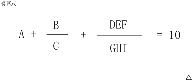

<!--yml
category: 蓝桥杯wiki
date: 2022-04-26 11:10:15
-->

# 2016年第七届蓝桥杯省赛试题及详解（Java高职高专C组）_跟老程一起学编程的博客-CSDN博客

> 来源：[https://blog.csdn.net/future277809183/article/details/123016585](https://blog.csdn.net/future277809183/article/details/123016585)

[【蓝桥杯】历年真题题目及题解汇总](https://blog.csdn.net/future277809183/article/details/122826573 "【蓝桥杯】历年真题题目及题解汇总")

* * *

1.  结果填空 (满分3分)
2.  结果填空 (满分5分)
3.  结果填空 (满分9分)
4.  代码填空 (满分11分)
5.  代码填空 (满分13分)
6.  结果填空 (满分15分)
7.  结果填空 (满分19分)
8.  程序设计（满分21分）
9.  程序设计（满分23分）
10.  程序设计（满分31分）

* * *

## **第一题：有奖竞猜**

题目描述
小明很喜欢猜谜语。
最近，他被邀请参加了X星球的猜谜活动。

每位选手开始的时候都被发给777个电子币。
规则是：猜对了，手里的电子币数目翻倍，
猜错了，扣除555个电子币, 扣完为止。

小明一共猜了15条谜语。
战果为：vxvxvxvxvxvxvvx
其中v表示猜对了，x表示猜错了。

请你计算一下，小明最后手里的电子币数目是多少。

请填写表示最后电子币数目的数字。
注意：你提交的应该是一个整数，不要填写任何多余的内容或说明性文字

**答案：58497**

```
import java.util.Scanner;

public class Main {
	public static void main(String[] args) {
		Scanner scan = new Scanner(System.in);
		String str = scan.next();
		int size = str.length();
		int n = 777;
		for (int i = 0; i < size && i >= 0; i++) {
			if (str.charAt(i) == 'v') {
				n = n * 2;
			}else{
				n = n - 555;
			}
		}
		System.out.println(n);
	}
}
```

## **第二题：煤球数量**

有一堆煤球，堆成三角棱锥形。具体：
第一层放1个，
第二层3个（排列成三角形），
第三层6个（排列成三角形），
第四层10个（排列成三角形），
....
如果一共有100层，共有多少个煤球？

请填表示煤球总数目的数字。
注意：你提交的应该是一个整数，不要填写任何多余的内容或说明性文字
**答案:171700**

```
 public class Main {
	public static void main(String[] args) {
		int a=1,b=2,sum=1;
		for (int i = 2; i <= 100; i++) {
			sum += (a+b);
			a+=b;
			b++;
		}
		System.out.println(sum);
	}
}

​
```

## **第三题：平方圈怪**

题目描述
如果把一个正整数的每一位都平方后再求和，得到一个新的正整数。
对新产生的正整数再做同样的处理。

如此一来，你会发现，不管开始取的是什么数字，
最终如果不是落入1，就是落入同一个循环圈。

请写出这个循环圈中最大的那个数字。

请填写该最大数字。
注意：你提交的应该是一个整数，不要填写任何多余的内容或说明性文字
**答案：145**

```
public class Main {
	public static void main(String[] args) {
		System.out.println(f(1234));
		System.out.println(f(12345));
		System.out.println(f(123));
		System.out.println(f(23456));
		// 计算结果都为145
	}

	public static int f(int num) {
		int max = 0;// 通过num计算出的最大值
		while (true) {
			int temp = 0;// 保存num本次计算的值
			while (num != 0) {
				temp += (num % 10) * (num % 10);
				num = num / 10;
			}
			num = temp;
			if(max == temp ){
				break;
			}else{
				max = (max > temp) ? max : temp;
			}
		}
		return max;
	}
}
```

## **第四题：骰子游戏**

题目描述
我们来玩一个游戏。
同时掷出3个普通骰子（6个面上的数字分别是1~6）。
如果其中一个骰子上的数字等于另外两个的和，你就赢了。

下面的程序计算出你能获胜的精确概率（以既约分数表示）

```
public class Main
{
    public static int gcd(int a, int b)
    {
        if(b==0) return a;
        return gcd(b,a%b);
    }

    public static void main(String[] args)
    {    
        int n = 0;
        for(int i=0; i<6; i++)
        for(int j=0; j<6; j++)
        for(int k=0; k<6; k++){
            if(________________________________) n++;   //填空位置
        }

        int m = gcd(n,6*6*6);
        System.out.println(n/m + "/" + 6*6*6/m);
    }
}
```

```
答案：
i + j+2 == k+1 || i + k+2 == j+1 || k + j+2 == i+1
```

## **第五题：分小组**

9名运动员参加比赛，需要分3组进行预赛。
有哪些分组的方案呢？

我们标记运动员为 A,B,C,... I
下面的程序列出了所有的分组方法。

该程序的正常输出为：
ABC DEF GHI
ABC DEG FHI
ABC DEH FGI
ABC DEI FGH
ABC DFG EHI
ABC DFH EGI
ABC DFI EGH
ABC DGH EFI
ABC DGI EFH
ABC DHI EFG
ABC EFG DHI
ABC EFH DGI
ABC EFI DGH
ABC EGH DFI
ABC EGI DFH
ABC EHI DFG
ABC FGH DEI
ABC FGI DEH
ABC FHI DEG
ABC GHI DEF
ABD CEF GHI
ABD CEG FHI
ABD CEH FGI
ABD CEI FGH
ABD CFG EHI
ABD CFH EGI
ABD CFI EGH
ABD CGH EFI
ABD CGI EFH
ABD CHI EFG
ABD EFG CHI
..... (以下省略，总共560行)

```
public class Main {
	public static String remain(int[] a) {
		String s = "";
		for (int i = 0; i < a.length; i++) {
			if (a[i] == 0)
				s += (char) (i + 'A');
		}
		return s;
	}

	public static void f(String s, int[] a) {
		for (int i = 0; i < a.length; i++) {
			if (a[i] == 1)
				continue;
			a[i] = 1;
			for (int j = i + 1; j < a.length; j++) {
				if (a[j] == 1)
					continue;
				a[j] = 1;
				for (int k = j + 1; k < a.length; k++) {
					if (a[k] == 1)
						continue;
					a[k] = 1;
					System.out.println(); // 填空位置
					a[k] = 0;
				}
				a[j] = 0;
			}
			a[i] = 0;
		}
	}

	public static void main(String[] args) {
		int[] a = new int[9];
		a[0] = 1;

		for (int b = 1; b < a.length; b++) {
			a[b] = 1;
			for (int c = b + 1; c < a.length; c++) {
				a[c] = 1;
				String s = "A" + (char) (b + 'A') + (char) (c + 'A');
				f(s, a);
				a[c] = 0;
			}
			a[b] = 0;
		}
	}
}
```

## **第六题：凑算式**

凑算式

 B      DEF
A + — + ------- = 10
C GHI

（如果显示有问题，可以参见【图1.jpg】）

这个算式中AI代表19的数字，不同的字母代表不同的数字。

比如：
6+8/3+952/714 就是一种解法，
5+3/1+972/486 是另一种解法。

这个算式一共有多少种解法？

注意：你提交应该是个整数，不要填写任何多余的内容或说明性文字。

(碰到除法问题，要特别注意，如题目未事先声明进行整除，均首先消除分母，进行乘法运算，这样可以消除浮点数误差)



 答案：29

```
public class Main {
    public static int count = 0;

    public void swap(int[] A, int a, int b) {
        int temp = A[a];
        A[a] = A[b];
        A[b] = temp;
    }

    public void dfs(int[] A, int step) {
        if(step == A.length) {
            if(check(A))
                count++;
            return;
        } else {
            for(int i = step;i < A.length;i++) {
                swap(A, i, step);
                dfs(A, step + 1);
                swap(A, i, step);
            }
        }
        return;
    }

    public boolean check(int[] A) {
        int a1 = A[0] * A[2] * (A[6]*100 + A[7]*10 + A[8]);
        int a2 = A[1] * (A[6]*100 + A[7]*10 + A[8]);
        int a3 = (A[3]*100 + A[4]*10 + A[5]) * A[2];
        if(a1 + a2 + a3 == 10 * A[2] * (A[6]*100 + A[7]*10 + A[8]))
            return true;
        return false;
    }

    public static void main(String[] args) {
        Main test = new Main();
        int[] A = {1,2,3,4,5,6,7,8,9};
        test.dfs(A, 0);
        System.out.println(count);
    }
}
```

## **第七题：搭积木**

题目描述
小明最近喜欢搭数字积木，
一共有10块积木，每个积木上有一个数字，0~9。

搭积木规则：
每个积木放到其它两个积木的上面，并且一定比下面的两个积木数字小。
最后搭成4层的金字塔形，必须用完所有的积木。

下面是两种合格的搭法：

0
1 2
3 4 5
6 7 8 9

0
3 1
7 5 2
9 8 6 4

请你计算这样的搭法一共有多少种？

请填表示总数目的数字。
注意：你提交的应该是一个整数，不要填写任何多余的内容或说明性文字。

答案：768

```
public class Main {
    static int count=0;
    public static void main(String[] args) {
        int arr[]=new int[]{0,1,2,3,4,5,6,7,8,9};
        dfs(arr,0,10);
        System.out.println(count);
    }
    private static void dfs(int[] arr, int num, int k) {
        if(num==k){
            if(panDuan(arr)){
                count++;
            }
        }
        for(int i=num;i<arr.length;i++){
            swap(arr,num,i);
            dfs(arr,num+1,k);
            swap(arr,num,i);

        }
    }
    private static void swap(int[] arr, int num, int i) {
        // TODO Auto-generated method stub
        int temp=arr[num];
        arr[num]=arr[i];
        arr[i]=temp;
    }
    private static boolean panDuan(int[] arr) {
        if(arr[0]<arr[1]&&arr[0]<arr[2]){
            if(arr[1]<arr[3]&&arr[1]<arr[4]){
                if(arr[2]<arr[4]&&arr[2]<arr[5]){
                    if(arr[3]<arr[6]&&arr[3]<arr[7]){
                        if(arr[4]<arr[7]&&arr[4]<arr[8]){
                            if(arr[5]<arr[8]&&arr[5]<arr[9]){
                                return true;
                            }
                        }
                    }
                }
            }
        }
        return false;
    }
}
```

## **第八题：冰雹数**

题目描述
任意给定一个正整数N，
如果是偶数，执行： N / 2
如果是奇数，执行： N * 3 + 1

生成的新的数字再执行同样的动作，循环往复。

通过观察发现，这个数字会一会儿上升到很高，
一会儿又降落下来。
就这样起起落落的，但最终必会落到“1”
这有点像小冰雹粒子在冰雹云中翻滚增长的样子。

比如N=9
9,28,14,7,22,11,34,17,52,26,13,40,20,10,5,16,8,4,2,1
可以看到，N=9的时候，这个“小冰雹”最高冲到了52这个高度。

输入格式：
一个正整数N（N<1000000）
输出格式：
一个正整数，表示不大于N的数字，经过冰雹数变换过程中，最高冲到了多少。

例如，输入：
10
程序应该输出：
52

再例如，输入：
100
程序应该输出：
9232

资源约定：
峰值内存消耗（含虚拟机） < 256M
CPU消耗 < 1000ms

请严格按要求输出，不要画蛇添足地打印类似：“请您输入…” 的多余内容。

所有代码放在同一个源文件中，调试通过后，拷贝提交该源码。
注意：不要使用package语句。不要使用jdk1.7及以上版本的特性。
注意：主类的名字必须是：Main，否则按无效代码处理

```
import java.util.Scanner;

public class Main {
	public static void main(String args[]){
		int n=new Scanner(System.in).nextInt();
		int t=1;
		for(int i=1;i<n;i++){
			int max=fun(i,i);
			if(max>t) t=max;
		}

		System.out.print(t);

	}
	public static int fun(int n,int max){

		if(n==1){
			return max;
		}else{
			if(n%2==0){
				//偶数
				n=n/2;
				if(n>max) max=n;
				return fun(n,max);
			}else{
				//奇数
				n=n*3+1;
				if(n>max) max=n;
				return fun(n,max);
			}
		}

	}

}
```

## **第九题：四平方和**

四平方和

四平方和定理，又称为拉格朗日定理：
每个正整数都可以表示为至多4个正整数的平方和。
如果把0包括进去，就正好可以表示为4个数的平方和。

比如：
5 = 0^2 + 0^2 + 1^2 + 2^2
7 = 1^2 + 1^2 + 1^2 + 2^2
（^符号表示乘方的意思）

对于一个给定的正整数，可能存在多种平方和的表示法。
要求你对4个数排序：
0 <= a <= b <= c <= d
并对所有的可能表示法按 a,b,c,d 为联合主键升序排列，最后输出第一个表示法

程序输入为一个正整数N (N<5000000)
要求输出4个非负整数，按从小到大排序，中间用空格分开

例如，输入：
5
则程序应该输出：
0 0 1 2

再例如，输入：
12
则程序应该输出：
0 2 2 2

再例如，输入：
773535
则程序应该输出：
1 1 267 838

资源约定：
峰值内存消耗（含虚拟机） < 256M
CPU消耗 < 3000ms

请严格按要求输出，不要画蛇添足地打印类似：“请您输入…” 的多余内容。

所有代码放在同一个源文件中，调试通过后，拷贝提交该源码。
注意：不要使用package语句。不要使用jdk1.7及以上版本的特性。
注意：主类的名字必须是：Main，否则按无效代码处理

```
import java.util.Scanner;

public class Main {

    public static void main(String[] args) {
        Scanner in = new Scanner(System.in);
        int N = in.nextInt();
        int len = (int) Math.sqrt(N);
        for(int a = 0;a <= len;a++) {
            for(int b = a;b <= len;b++) {
                for(int c = b;c <= len;c++) {
                    for(int d = c;d <= len;d++) {
                        int temp = a*a + b*b + c*c + d*d;
                        if(temp == N) {
                            System.out.println(a+" "+b+" "+c+" "+d);
                            return;
                        }
                    }
                }
            }
        }
    }

}
```

## **第十题：密码脱落**

题目描述
X星球的考古学家发现了一批古代留下来的密码。
这些密码是由A、B、C、D 四种植物的种子串成的序列。
仔细分析发现，这些密码串当初应该是前后对称的（也就是我们说的镜像串）。
由于年代久远，其中许多种子脱落了，因而可能会失去镜像的特征。

你的任务是：
给定一个现在看到的密码串，计算一下从当初的状态，它要至少脱落多少个种子，才可能会变成现在的样子。

输入一行，表示现在看到的密码串（长度不大于1000）
要求输出一个正整数，表示至少脱落了多少个种子。

例如，输入：
ABCBA
则程序应该输出：
0

再例如，输入：
ABDCDCBABC
则程序应该输出：
3

资源约定：
峰值内存消耗（含虚拟机） < 256M
CPU消耗 < 3000ms

请严格按要求输出，不要画蛇添足地打印类似：“请您输入…” 的多余内容。

所有代码放在同一个源文件中，调试通过后，拷贝提交该源码。
注意：不要使用package语句。不要使用jdk1.7及以上版本的特性。
注意：主类的名字必须是：Main，否则按无效代码处理

```
 import java.util.Scanner;

public class Main {
    public static void main(String[] args) {

        Scanner scanner = new Scanner(System.in);
        char[] a = scanner.nextLine().toCharArray();
        code(a);
    }
//左右坐标往中间走，直到i==j
    private static void code(char a[]) {
        int num = 0;
        int i = 0;//左面的坐标
        int n = 0;
        int m = 0;
        int j = a.length - 1;//右面的坐标
        while (i <= j) {
            n = 0;
            m = 0;
            //相等
            if (a[i] == a[j]) {
                i++;
                j--;
            } else {
                //不相等
                //循环的终止条件就是左面坐标的值和右面坐标的值相等
                int tj = j;//找个临时变量
                while (a[i] != a[tj]) {
                    tj--;//右面的往左走
                    n++;//记录走的步数
                }
                int ti = i;//找个临时变量
                while (a[ti] != a[j]) {
                    ti++;//左面的往右走
                    m++;//记录走了几步
                }
                if (n < m) {//看看哪个步数少，就用哪个
                    //n<m说明左面走的步数多
                    j -= n;

                } else {
                    //相反
                    i += m;

                }
                //num为总的修改数，经过上面的比较，哪个修改数少就采用哪一个
                num += n < m ? n : m;
            }
        }
        System.out.println(num);
    }
} 
```