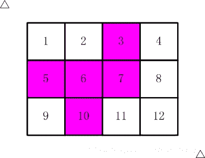

<!--yml
category: 蓝桥杯
date: 2022-04-26 11:23:38
-->

# 2016年第四届C/C++ A组蓝桥杯省赛真题_元气算法的博客-CSDN博客

> 来源：[https://blog.csdn.net/kiwi_berrys/article/details/111462788](https://blog.csdn.net/kiwi_berrys/article/details/111462788)

> 这里是蓝桥杯历年的题目专栏，将会陆续更新将往年真题以及解答发布出来，欢迎各位小伙伴关注我吖，你们的点赞关注就是给我最好的动力！！！
> <font>每天更新一届真题，敬请期待</font>

[蓝桥杯历年真题及详细解答](https://blog.csdn.net/kiwi_berrys/article/details/111186204)

* * *

### 第一题：网友年龄

**题目描述**
某君新认识一网友。
当问及年龄时，他的网友说：
“我的年龄是个2位数，我比儿子大27岁,
如果把我的年龄的两位数字交换位置，刚好就是我儿子的年龄”
请你计算：网友的年龄一共有多少种可能情况？
提示：30岁就是其中一种可能哦.
请填写表示可能情况的种数。
**题目分析**
**题目代码**

* * *

### 第二题：生日蜡烛

**题目描述**
某君从某年开始每年都举办一次生日party，并且每次都要吹熄与年龄相同根数的蜡烛。
现在算起来，他一共吹熄了236根蜡烛。
请问，他从多少岁开始过生日party的？
请填写他开始过生日party的年龄数。
**题目分析**
**题目代码**

* * *

### 第三题：方格填数

**题目描述**
如下的10个格子


（如果显示有问题，也可以参看【图1.jpg】）

填入0~9的数字。要求：连续的两个数字不能相邻。
（左右、上下、对角都算相邻）

一共有多少种可能的填数方案？

请填写表示方案数目的整数。
**题目分析**
**题目代码**

* * *

### 第四题：快速排序

**题目描述**
排序在各种场合经常被用到。
快速排序是十分常用的高效率的算法。
其思想是：先选一个“标尺”，
用它把整个队列过一遍筛子，
以保证：其左边的元素都不大于它，其右边的元素都不小于它。
这样，排序问题就被分割为两个子区间。
再分别对子区间排序就可以了。

下面的代码是一种实现，请分析并填写划线部分缺少的代码。

```
#include <stdio.h>

void swap(int a[], int i, int j)
{
	int t = a[i];
	a[i] = a[j];
	a[j] = t;
}

int partition(int a[], int p, int r)
{
    int i = p;
    int j = r + 1;
    int x = a[p];
    while(1){
        while(i<r && a[++i]<x);
        while(a[--j]>x);
        if(i>=j) break;
        swap(a,i,j);
    }
	______________________;
    return j;
}

void quicksort(int a[], int p, int r)
{
    if(p<r){
        int q = partition(a,p,r);
        quicksort(a,p,q-1);
        quicksort(a,q+1,r);
    }
}

int main()
{
	int i;
	int a[] = {5,13,6,24,2,8,19,27,6,12,1,17};
	int N = 12;

	quicksort(a, 0, N-1);

	for(i=0; i<N; i++) printf("%d ", a[i]);
	printf("\n");

	return 0;
} 
```

**题目分析**
**题目代码**

* * *

### 第五题：消除尾一

**题目描述**
下面的代码把一个整数的二进制表示的最右边的连续的1全部变成0
如果最后一位是0，则原数字保持不变。

如果采用代码中的测试数据，应该输出：
00000000000000000000000001100111 00000000000000000000000001100000
00000000000000000000000000001100 00000000000000000000000000001100

请仔细阅读程序，填写划线部分缺少的代码。

```
#include <stdio.h>

void f(int x)
{
	int i;
	for(i=0; i<32; i++) printf("%d", (x>>(31-i))&1);
	printf("   ");

	x = _______________________;

	for(i=0; i<32; i++) printf("%d", (x>>(31-i))&1);
	printf("\n");	
}

int main()
{
	f(103);
	f(12);
	return 0;
} 
```

**题目分析**
**题目代码**

* * *

### 第六题：寒假作业

**题目描述**
现在小学的数学题目也不是那么好玩的。
看看这个寒假作业：

□ + □ = □
□ - □ = □
□ × □ = □
□ ÷ □ = □

(如果显示不出来，可以参见【图1.jpg】)

每个方块代表1~13中的某一个数字，但不能重复。
比如：
6 + 7 = 13
9 - 8 = 1
3 * 4 = 12
10 / 2 = 5

以及：
7 + 6 = 13
9 - 8 = 1
3 * 4 = 12
10 / 2 = 5

就算两种解法。（加法，乘法交换律后算不同的方案）

你一共找到了多少种方案？

请填写表示方案数目的整数。


**题目分析**
**题目代码**

* * *

### 第七题：剪邮票

**题目描述**
如【图1.jpg】, 有12张连在一起的12生肖的邮票。
现在你要从中剪下5张来，要求必须是连着的。
（仅仅连接一个角不算相连）
比如，【图2.jpg】，【图3.jpg】中，粉红色所示部分就是合格的剪取。

请你计算，一共有多少种不同的剪取方法。

请填写表示方案数目的整数。





**题目分析**
**题目代码**

* * *

### 第八题：四平方和

**题目描述**
四平方和定理，又称为拉格朗日定理：
每个正整数都可以表示为至多4个正整数的平方和。
如果把0包括进去，就正好可以表示为4个数的平方和。

比如：
5 = 0^2 + 0^2 + 1^2 + 2^2
7 = 1^2 + 1^2 + 1^2 + 2^2
（^符号表示乘方的意思）

对于一个给定的正整数，可能存在多种平方和的表示法。
要求你对4个数排序：
0 <= a <= b <= c <= d
并对所有的可能表示法按 a,b,c,d 为联合主键升序排列，最后输出第一个表示法

程序输入为一个正整数N (N<5000000)
要求输出4个非负整数，按从小到大排序，中间用空格分开

例如，输入：
5
则程序应该输出：
0 0 1 2

再例如，输入：
12
则程序应该输出：
0 2 2 2

再例如，输入：
773535
则程序应该输出：
1 1 267 838

资源约定：
峰值内存消耗 < 256M
CPU消耗 < 3000ms
**题目分析**
**题目代码**

* * *

### 第九题：密码脱落

**题目描述**
X星球的考古学家发现了一批古代留下来的密码。
这些密码是由A、B、C、D 四种植物的种子串成的序列。
仔细分析发现，这些密码串当初应该是前后对称的（也就是我们说的镜像串）。
由于年代久远，其中许多种子脱落了，因而可能会失去镜像的特征。

你的任务是：
给定一个现在看到的密码串，计算一下从当初的状态，它要至少脱落多少个种子，才可能会变成现在的样子。

输入一行，表示现在看到的密码串（长度不大于1000）
要求输出一个正整数，表示至少脱落了多少个种子。

例如，输入：
ABCBA
则程序应该输出：
0

再例如，输入：
ABDCDCBABC
则程序应该输出：
3

资源约定：
峰值内存消耗 < 256M
CPU消耗 < 1000ms
**题目分析**
**题目代码**

* * *

### 第十题：最大比例

**题目描述**
X星球的某个大奖赛设了M级奖励。每个级别的奖金是一个正整数。
并且，相邻的两个级别间的比例是个固定值。
也就是说：所有级别的奖金数构成了一个等比数列。比如：
16,24,36,54
其等比值为：3/2

现在，我们随机调查了一些获奖者的奖金数。
请你据此推算可能的最大的等比值。

输入格式：
第一行为数字 N (0<N<100)，表示接下的一行包含N个正整数
第二行N个正整数Xi(Xi<1 000 000 000 000)，用空格分开。每个整数表示调查到的某人的奖金数额

要求输出：
一个形如A/B的分数，要求A、B互质。表示可能的最大比例系数

测试数据保证了输入格式正确，并且最大比例是存在的。

例如，输入：
3
1250 200 32

程序应该输出：
25/4

再例如，输入：
4
3125 32 32 200

程序应该输出：
5/2

再例如，输入：
3
549755813888 524288 2

程序应该输出：
4/1

资源约定：
峰值内存消耗 < 256M
CPU消耗 < 3000ms
**题目分析**
**题目代码**

* * *