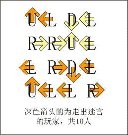
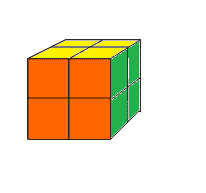
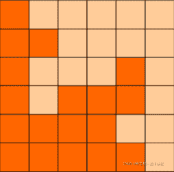
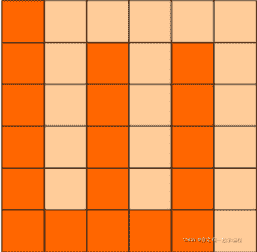
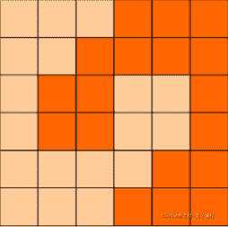

<!--yml
category: 蓝桥杯
date: 2022-04-26 11:07:02
-->

# 2017年第八届蓝桥杯省赛试题及详解（Java本科A组）_跟老程一起学编程的博客-CSDN博客

> 来源：[https://blog.csdn.net/future277809183/article/details/122847896](https://blog.csdn.net/future277809183/article/details/122847896)

**[【蓝桥杯】历年真题题目及题解汇总](https://blog.csdn.net/future277809183/article/details/122826573 "【蓝桥杯】历年真题题目及题解汇总")**

* * *

1.  结果填空 (满分5分)
2.  结果填空 (满分11分)
3.  结果填空 (满分13分)
4.  结果填空 (满分17分)
5.  代码填空 (满分7分)
6.  代码填空 (满分9分)
7.  程序设计（满分19分）
8.  程序设计（满分21分）
9.  程序设计（满分23分）
10.  程序设计（满分25分）

* * *

## **第一题：迷宫**

X星球的一处迷宫游乐场建在某个小山坡上。
它是由10x10相互连通的小房间组成的。

房间的地板上写着一个很大的字母。
我们假设玩家是面朝上坡的方向站立，则：
L表示走到左边的房间，
R表示走到右边的房间，
U表示走到上坡方向的房间，
D表示走到下坡方向的房间。

X星球的居民有点懒，不愿意费力思考。
他们更喜欢玩运气类的游戏。这个游戏也是如此！

开始的时候，直升机把100名玩家放入一个个小房间内。
玩家一定要按照地上的字母移动。

迷宫地图如下：
------------
UDDLUULRUL
UURLLLRRRU
RRUURLDLRD
RUDDDDUUUU
URUDLLRRUU
DURLRLDLRL
ULLURLLRDU
RDLULLRDDD
UUDDUDUDLL
ULRDLUURRR
------------

请你计算一下，最后，有多少玩家会走出迷宫? 
而不是在里边兜圈子。

请提交该整数，表示走出迷宫的玩家数目，不要填写任何多余的内容。

如果你还没明白游戏规则，可以参看一个简化的4x4迷宫的解说图：
p1.png


```
public class Main {

	public static void main(String[] args) {
		int ans=0;
		for(int i=0;i<10;i++)
			for(int j=0;j<10;j++)
				if(ok(i,j))
					ans++;

		System.out.println(ans);
	}

	static char[][] ch = new char[][] {
		"UDDLUULRUL".toCharArray(),
		"UURLLLRRRU".toCharArray(),
		"RRUURLDLRD".toCharArray(),
		"RUDDDDUUUU".toCharArray(),
		"URUDLLRRUU".toCharArray(),
		"DURLRLDLRL".toCharArray(),
		"ULLURLLRDU".toCharArray(),
		"RDLULLRDDD".toCharArray(),
		"UUDDUDUDLL".toCharArray(),
		"ULRDLUURRR".toCharArray()};

	static boolean ok(int x,int y) {
		int t=25;
		while(t-->0) {
			if(x<0 || x>=10 || y<0 || y>=10)
				return true;
			if(ch[x][y]=='U')
				x--;
			else if(ch[x][y]=='D')
				x++;
			else if(ch[x][y]=='L')
				y--;
			else if(ch[x][y]=='R')
				y++;
		}
		return false;
	}

}
```

## **第二题：9数算式**

观察如下的算式：

9213 x 85674 = 789314562

左边的乘数和被乘数正好用到了1~9的所有数字，每个1次。
而乘积恰好也是用到了1~9的所有数字，并且每个1次。

请你借助计算机的强大计算能力，找出满足如上要求的9数算式一共有多少个？

注意：
1\. 总数目包含题目给出的那个示例。
2\. 乘数和被乘数交换后作为同一方案来看待
**答案：1625**

```
import java.util.HashSet;

public class Main {
	public static void main(String[] args) {
		dfs(0);
		System.out.println(ans);
	}

	static int[] a = new int[] {1,2,3,4,5,6,7,8,9};
	static int ans=0;
	static HashSet<String> set = new HashSet<>();

	static void dfs(int m) {
		if(m>=9) {
			for(int i=1;i<8;i++) {
				int x=0,y=0;
				for(int j=0;j<i;j++)
					x = 10*x + a[j];
				for(int j=i;j<9;j++)
					y = 10*y + a[j];
				String s = ""+x*y;
//				System.out.println(s);
				if(ok(s)) {
					String v = x+"x"+y;
					String u = y+"x"+x;
					if(!set.contains(v)&&!set.contains(u)) {
						set.add(u);
						set.add(v);
						ans++;
					}
				}
			}				

			return;
		}

		for(int i=m;i<9;i++) {
			swap(i,m);
			dfs(m+1);
			swap(i,m);
		}

	}

	static void swap(int i,int j) {
		int t = a[i];
		a[i] = a[j];
		a[j] = t;
	}

	static boolean ok(String s) {
		if(s.length()!=9 || s.indexOf("0")>=0)
			return false;
		int[] b = new int[10];
		for(int i=0;i<s.length();i++)
			if(b[s.charAt(i)-'0']==1)
				return false;
			else
				b[s.charAt(i)-'0']=1;
		return true;
	}

}
```

## **第三题：魔方状态**

二阶魔方就是只有2层的魔方，只由8个小块组成。
如图p1.png所示。

小明很淘气，他只喜欢3种颜色，所有把家里的二阶魔方重新涂了颜色，如下：

前面：橙色
右面：绿色
上面：黄色
左面：绿色
下面：橙色
后面：黄色

请你计算一下，这样的魔方被打乱后，一共有多少种不同的状态。

如果两个状态经过魔方的整体旋转后，各个面的颜色都一致，则认为是同一状态。

请提交表示状态数的整数，不要填写任何多余内容或说明文字


```
import java.util.HashSet;
import java.util.Set;

/*
标题：魔方状态
二阶魔方就是只有2层的魔方，只由8个小块组成。
如图p1.png所示。
小明很淘气，他只喜欢3种颜色，所有把家里的二阶魔方重新涂了颜色，如下：
前面：橙色
右面：绿色
上面：黄色
左面：绿色
下面：橙色
后面：黄色
请你计算一下，这样的魔方被打乱后，一共有多少种不同的状态。
如果两个状态经过魔方的整体旋转后，各个面的颜色都一致，则认为是同一状态。
请提交表示状态数的整数，不要填写任何多余内容或说明文字。
*/
public class Main {

  static char[][] start = {"oybbgb".toCharArray(),
      "oygbbb".toCharArray(),
      "bygbby".toCharArray(),
      "bybbgy".toCharArray(),
      "obbogb".toCharArray(),
      "obgobb".toCharArray(),
      "bbgoby".toCharArray(),
      "bbbogy".toCharArray()};
  static char[][][] q = new char[2000000][8][6];
  static Set<String> all_state = new HashSet<String>();
  static int  front, tail;

  static String to_string(char[][] a) {
    String ans = "";
    for (int i = 0; i < 8; ++i) {
      ans += new String(a[i]);
    }
    return ans;
  }

  private static void swap(char[] a, int i, int j) {
    char t = a[i];
    a[i] = a[j];
    a[j] = t;
  }

  private static void swap(char[][] a, int i, int j) {
    char[] t = a[i];
    a[i] = a[j];
    a[j] = t;
  }

  //上层的块的旋转，面的相对位置调换
  static void ucell(char[] a) {
    swap(a, 0, 2);
    swap(a, 2, 5);
    swap(a, 5, 4);
  }

  //上层顺时针旋转
  static void u(char[][] s) {
    ucell(s[0]);
    ucell(s[1]);
    ucell(s[2]);
    ucell(s[3]);
//    块的相对位置调换
    swap(s, 1, 0);
    swap(s, 2, 1);
    swap(s, 3, 2);

  }

  //右层旋转是面的位置变化
  static void rcell(char[] a) {
    swap(a, 1, 0);
    swap(a, 0, 3);
    swap(a, 3, 5);
  }

  static void r(char[][] s)//魔方右层顺时针转
  {
    rcell(s[1]);
    rcell(s[2]);
    rcell(s[6]);
    rcell(s[5]);
//    块的位置变化
    swap(s, 2, 1);
    swap(s, 5, 1);
    swap(s, 6, 5);
  }

  static void fcell(char[] a) {
    swap(a, 2, 1);
    swap(a, 1, 4);
    swap(a, 4, 3);
  }

  static void f(char[][] s)//前面一层 顺时针转
  {
    fcell(s[0]);
    fcell(s[1]);
    fcell(s[4]);
    fcell(s[5]);
    swap(s, 1, 5);
    swap(s, 0, 1);
    swap(s, 4, 0);
  }

  static void uwhole(char[][] s)//整个魔方从顶部看 顺时针转 用于判重
  {
    u(s);//上层旋转
//    下层旋转
    ucell(s[4]);
    ucell(s[5]);
    ucell(s[6]);
    ucell(s[7]);
//    完成自旋后，块的位置变动
    swap(s, 5, 4);
    swap(s, 6, 5);
    swap(s, 7, 6);
  }

  static void fwhole(char[][] s)//整个魔方从前面看 顺时针转 用于判重
  {
    f(s);
    fcell(s[2]);
    fcell(s[6]);
    fcell(s[7]);
    fcell(s[3]);
    swap(s, 2, 6);
    swap(s, 3, 2);
    swap(s, 7, 3);
  }

  static void rwhole(char[][] s)//整个魔方从右边看 顺时针转 用于判重
  {
    r(s);
    rcell(s[0]);
    rcell(s[3]);
    rcell(s[4]);
    rcell(s[7]);
    swap(s, 3, 7);
    swap(s, 0, 3);
    swap(s, 4, 0);
  }

  static boolean try_insert(char[][] s) {
    char[][] k = new char[8][6];
    memcpy(k, s);
    for (int i = 0; i < 4; i++) {
      fwhole(k);
      for (int j = 0; j < 4; j++) {
        uwhole(k);
        for (int q = 0; q < 4; q++) {
          rwhole(k);
          if (all_state.contains(to_string(k))) {
            return false;
          }
        }
      }
    }
    all_state.add(to_string(k));
    return true;

  }

  private static void memcpy(char[][] k, char[][] s) {
    for (int i = 0; i < 8; i++) {
      for (int j = 0; j < 6; j++) {
        k[i][j] = s[i][j];
      }
    }
  }

  static void solve() {
    front = 0;
    tail = 1;
    all_state.add(to_string(start));
    memcpy(q[front], start);//填充q[0]，相当于第一个状态入队列
    while (front < tail) {
        /*将其所有变形，尝试加入set中*/
      memcpy(q[tail], q[front]);//拷贝到tail
      u(q[tail]);//上层顺时针旋转
      if (try_insert(q[tail])) {
        tail++;//扩展队列
      }
      memcpy(q[tail], q[front]);//拷贝到tail
      r(q[tail]);//右层顺时针旋转
      if (try_insert(q[tail])) {
        tail++;//扩展队列
      }
      memcpy(q[tail], q[front]);//拷贝到tail
      f(q[tail]);//前顺时针旋转
      if (try_insert(q[tail])) {
        tail++;//扩展队列
      }
      front++;//弹出队首
//        cout << front << " " << tail << endl;
    }

    System.out.println(front);
  }

  public static void main(String[] args) {
    solve();
  }
}
```

## **第四题：方格分割**

6x6的方格，沿着格子的边线剪开成两部分。
要求这两部分的形状完全相同。

如图：p1.png, p2.png, p3.png 就是可行的分割法。

试计算：
包括这3种分法在内，一共有多少种不同的分割方法。
注意：旋转对称的属于同一种分割法。

请提交该整数，不要填写任何多余的内容或说明文字。





 

```
public class Main {

	public static void main(String[] args) {
		dfs(0);
		System.out.println(ans);
	}

	static int[] a = new int[18];// {0,1,2,3,4,5,6,7,8,9,10,11,12,13,14,15,16,17,18,19,20,21,22,23,24,25,26,27,28,29,30,31,32,33,34,35};
	static boolean[][] vis = new boolean[6][6];
	static int res=0,ans=0;
	static int[] dx = new int[] {1,0,-1,0};
	static int[] dy = new int[] {0,1,0,-1};

	static void dfs(int m) {

		for(a[0]=0;a[0]<36;a[0]++)
			for(a[1]=a[0]+1;a[1]<36;a[1]++)
				for(a[2]=a[1]+1;a[2]<36;a[2]++)
					for(a[3]=a[2]+1;a[3]<36;a[3]++)
						for(a[4]=a[3]+1;a[4]<36;a[4]++)
							for(a[5]=a[4]+1;a[5]<36;a[5]++)
								for(a[6]=a[5]+1;a[6]<36;a[6]++)
									for(a[7]=a[6]+1;a[7]<36;a[7]++)
										for(a[8]=a[7]+1;a[8]<36;a[8]++)
											for(a[9]=a[8]+1;a[9]<36;a[9]++)
												for(a[10]=a[9]+1;a[10]<36;a[10]++)
													for(a[11]=a[10]+1;a[11]<36;a[11]++)
														for(a[12]=a[11]+1;a[12]<36;a[12]++)
															for(a[13]=a[12]+1;a[13]<36;a[13]++)
																for(a[14]=a[13]+1;a[14]<36;a[14]++)
																	for(a[15]=a[14]+1;a[15]<36;a[15]++)
																		for(a[16]=a[15]+1;a[16]<36;a[16]++)
																			for(a[17]=a[16]+1;a[17]<36;a[17]++)
																			{
			for(int i=0;i<6;i++)
				for(int j=0;j<6;j++) 
					vis[i][j] = false;
			for(int i=0;i<18;i++)
				vis[a[i]/6][a[i]%6] = true;
			ok();

																			}

	}

	static void ok() {
		if(vis[0][0]==false)
			return;

		for(int i=0;i<6;i++)
			for(int j=0;j<6;j++) 
				if(vis[i][j]==vis[5-i][5-j])
					return;

		res=0;
		for(int i=0;i<6;i++)
			for(int j=0;j<6;j++) {
				if(vis[i][j]) {
					dfs(i,j);
					if(res==18) {
						ans++;
//						System.out.println(ans);
					}
					return;
				}
			}
	}

	static void dfs(int x,int y) {
		res++;
		vis[x][y] = false;
		for(int i=0;i<4;i++) {
			int u = x + dx[i];
			int v = y + dy[i];
			if(u>=0 && u<6 && v>=0 && v<6 && vis[u][v])
				dfs(u,v);
		}

	}

}
```

## **第五题：字母组串**

由 A,B,C 这3个字母就可以组成许多串。
比如："A","AB","ABC","ABA","AACBB" ....

现在，小明正在思考一个问题：
如果每个字母的个数有限定，能组成多少个已知长度的串呢？

他请好朋友来帮忙，很快得到了代码，
解决方案超级简单，然而最重要的部分却语焉不详。

请仔细分析源码，填写划线部分缺少的内容

```
public class A
{
    // a个A，b个B，c个C 字母，能组成多少个不同的长度为n的串。
    static int f(int a, int b, int c, int n)
    {
        if(a<0 || b<0 || c<0) return 0;
        if(n==0) return 1; 

        return ________________________________;  //填空
    }

    public static void main(String[] args)
    {
        System.out.println(f(1,1,1,2));
        System.out.println(f(1,2,3,3));
    }
}
```

对于上面的测试数据，小明口算的结果应该是：
6
19

注意：只填写划线部分缺少的代码，不要提交任何多余内容或说明性文字。

```
答案:f(a-1,b,c,n-1)+f(a,b-1,c,n-1)+f(a,b,c-1,n-1)
```

## **第六题：最大公共子串**

最大公共子串长度问题就是：
求两个串的所有子串中能够匹配上的最大长度是多少。

比如："abcdkkk" 和 "baabcdadabc"，
可以找到的最长的公共子串是"abcd",所以最大公共子串长度为4。

下面的程序是采用矩阵法进行求解的，这对串的规模不大的情况还是比较有效的解法。

请分析该解法的思路，并补全划线部分缺失的代码

```
public class Main
{
    static int f(String s1, String s2)
    {
        char[] c1 = s1.toCharArray();
        char[] c2 = s2.toCharArray();

        int[][] a = new int[c1.length+1][c2.length+1];

        int max = 0;
        for(int i=1; i<a.length; i++){
            for(int j=1; j<a[i].length; j++){
                if(c1[i-1]==c2[j-1]) {
                    a[i][j] = __________________;  //填空 
                    if(a[i][j] > max) max = a[i][j];
                }
            }
        }

        return max;
    }

    public static void main(String[] args){
        int n = f("abcdkkk", "baabcdadabc");
        System.out.println(n);
    }
}
```

```
答案:1+a[i-1][j-1]
```

## **第七题：正则问题**

考虑一种简单的正则表达式：
只由 x ( ) | 组成的正则表达式。
小明想求出这个正则表达式能接受的最长字符串的长度。  

例如 ((xx|xxx)x|(x|xx))xx 能接受的最长字符串是： xxxxxx，长度是6。

输入
----
一个由x()|组成的正则表达式。输入长度不超过100，保证合法。  

输出
----
这个正则表达式能接受的最长字符串的长度。  

例如，
输入：
((xx|xxx)x|(x|xx))xx  

程序应该输出：
6  

资源约定：
峰值内存消耗（含虚拟机） < 256M
CPU消耗  < 1000ms

请严格按要求输出，不要画蛇添足地打印类似：“请您输入...” 的多余内容。

所有代码放在同一个源文件中，调试通过后，拷贝提交该源码。
不要使用package语句。不要使用jdk1.7及以上版本的特性。
主类的名字必须是：Main，否则按无效代码处理

```
import java.util.Scanner;

public class Main {
	//((xx|xxx)x|(x|xx))xx 6
	public static void main(String[] args) {
		Scanner in = new Scanner(System.in);
		s = in.next();
		n = s.length();
		System.out.println(f());
	}

	static String s;
	static int p=0;//记录指针
	static int n=0;//记录长度

	static int f() {
		int ans=0,temp=0;
		while(p<n) {
			if(s.charAt(p)=='(') {
				p++;
				temp+=f();
			}
			else if(s.charAt(p)=='x') {
				p++;
				temp++;
			}
			else if(s.charAt(p)=='|') {
				p++;
				ans = Math.max(ans, temp);
				temp=0;//结算清零，上面ans已经保存了temp的值了,如果有3|4|5 那么相当于3|4计算在ans里面了
			}
			else if(s.charAt(p)==')') {
				p++;
				return Math.max(ans, temp);
			}
		}
		return Math.max(ans, temp);
	}

}
```

## **第八题：包子凑数**

小明几乎每天早晨都会在一家包子铺吃早餐。他发现这家包子铺有N种蒸笼，其中第i种蒸笼恰好能放Ai个包子。每种蒸笼都有非常多笼，可以认为是无限笼。

每当有顾客想买X个包子，卖包子的大叔就会迅速选出若干笼包子来，使得这若干笼中恰好一共有X个包子。比如一共有3种蒸笼，分别能放3、4和5个包子。当顾客想买11个包子时，大叔就会选2笼3个的再加1笼5个的（也可能选出1笼3个的再加2笼4个的）。

当然有时包子大叔无论如何也凑不出顾客想买的数量。比如一共有3种蒸笼，分别能放4、5和6个包子。而顾客想买7个包子时，大叔就凑不出来了。

小明想知道一共有多少种数目是包子大叔凑不出来的。

输入
----
第一行包含一个整数N。(1 <= N <= 100)
以下N行每行包含一个整数Ai。(1 <= Ai <= 100)  

输出
----
一个整数代表答案。如果凑不出的数目有无限多个，输出INF。

例如，
输入：
2  
4  
5   

程序应该输出：
6  

再例如，
输入：
2  
4  
6    

程序应该输出：
INF

样例解释：
对于样例1，凑不出的数目包括：1, 2, 3, 6, 7, 11。  
对于样例2，所有奇数都凑不出来，所以有无限多个。  

资源约定：
峰值内存消耗（含虚拟机） < 256M
CPU消耗  < 1000ms

请严格按要求输出，不要画蛇添足地打印类似：“请您输入...” 的多余内容。

所有代码放在同一个源文件中，调试通过后，拷贝提交该源码。
不要使用package语句。不要使用jdk1.7及以上版本的特性。
主类的名字必须是：Main，否则按无效代码处理。
提交程序时，注意选择所期望的语言类型和编译器类型

```
import java.util.Scanner;

public class Main {

	public static void main(String[] args) {
		Scanner in = new Scanner(System.in);
		int n = in.nextInt();
		int[] a = new int[n+5];
		int[] dp = new int[10005];//只有2个数时，最大不能组合的数x*y-x-y，有这个公式
		int ans=0;
		dp[0]=1;
		for(int i=1;i<=n;i++) 
			a[i] = in.nextInt();

		int g = a[1];
		for(int i=2;i<=n;i++) 
			g = gcd(g,a[i]);

		if(g!=1) {
			System.out.println("INF");
			return;
		}

		for(int i=1;i<=n;i++) 
			for(int j=a[i];j<=10000;j++)
				dp[j] = Math.max(dp[j], dp[j-a[i]]);

		for(int j=1;j<=10000;j++) 
			if(dp[j]==0)
				ans++;

		System.out.println(ans);
	}

	static int gcd(int a,int b) {
		return b==0?a:gcd(b,a%b);
	}

}
```

## **第九题：分巧克力**

儿童节那天有K位小朋友到小明家做客。小明拿出了珍藏的巧克力招待小朋友们。
    小明一共有N块巧克力，其中第i块是Hi x Wi的方格组成的长方形。

    为了公平起见，小明需要从这 N 块巧克力中切出K块巧克力分给小朋友们。切出的巧克力需要满足：

    1\. 形状是正方形，边长是整数  
    2\. 大小相同  

例如一块6x5的巧克力可以切出6块2x2的巧克力或者2块3x3的巧克力。

当然小朋友们都希望得到的巧克力尽可能大，你能帮小Hi计算出最大的边长是多少么？

输入
第一行包含两个整数N和K。(1 <= N, K <= 100000)  
以下N行每行包含两个整数Hi和Wi。(1 <= Hi, Wi <= 100000) 
输入保证每位小朋友至少能获得一块1x1的巧克力。   

输出
输出切出的正方形巧克力最大可能的边长。

样例输入：
2 10  
6 5  
5 6  

样例输出：
2

资源约定：
峰值内存消耗（含虚拟机） < 256M
CPU消耗  < 1000ms

请严格按要求输出，不要画蛇添足地打印类似：“请您输入...” 的多余内容。

所有代码放在同一个源文件中，调试通过后，拷贝提交该源码。
不要使用package语句。不要使用jdk1.7及以上版本的特性。
主类的名字必须是：Main，否则按无效代码处理

```
import java.util.Scanner;

public class Main {
	public static void main(String[] args) {
		int n, k;
		int[] h = new int[100000];
		int[] w = new int[100000];
		Scanner sc = new Scanner(System.in);
		n = sc.nextInt();
		k = sc.nextInt();
		for (int i = 0; i < n; ++i) {
			h[i] = sc.nextInt();
			w[i] = sc.nextInt();
		}

		int r = 100001;
		int l = 1;
		int ans = 0;
		while (l <= r) {
			int mid = (l + r) / 2;

			int cnt = 0;
			//每个巧克力块，都按照len来切割
			for (int i = 0; i < n; ++i) {
				cnt += (h[i] / mid) * (w[i] / mid);
			}

			if (cnt >= k) {
				l = mid + 1;
				ans = mid;
			} else {
				r = mid - 1;
			}
		}
		System.out.println(ans);
	}
}
```

## **第十题：油漆面积**

X星球的一批考古机器人正在一片废墟上考古。
该区域的地面坚硬如石、平整如镜。
管理人员为方便，建立了标准的直角坐标系。

每个机器人都各有特长、身怀绝技。它们感兴趣的内容也不相同。
经过各种测量，每个机器人都会报告一个或多个矩形区域，作为优先考古的区域。

矩形的表示格式为(x1,y1,x2,y2)，代表矩形的两个对角点坐标。

为了醒目，总部要求对所有机器人选中的矩形区域涂黄色油漆。
小明并不需要当油漆工，只是他需要计算一下，一共要耗费多少油漆。

其实这也不难，只要算出所有矩形覆盖的区域一共有多大面积就可以了。
注意，各个矩形间可能重叠。

本题的输入为若干矩形，要求输出其覆盖的总面积。

输入格式：
第一行，一个整数n，表示有多少个矩形(1<=n<10000)
接下来的n行，每行有4个整数x1 y1 x2 y2，空格分开，表示矩形的两个对角顶点坐标。
(0<= x1,y1,x2,y2 <=10000)

输出格式：
一行一个整数，表示矩形覆盖的总面积。

例如，
输入：
3
1 5 10 10
3 1 20 20
2 7 15 17

程序应该输出：
340

再例如，
输入：
3
5 2 10 6
2 7 12 10
8 1 15 15

程序应该输出：
128

资源约定：
峰值内存消耗（含虚拟机） < 256M
CPU消耗  < 2000ms

请严格按要求输出，不要画蛇添足地打印类似：“请您输入...” 的多余内容。

所有代码放在同一个源文件中，调试通过后，拷贝提交该源码。
不要使用package语句。不要使用jdk1.7及以上版本的特性。
主类的名字必须是：Main，否则按无效代码处理。

```
import java.util.Scanner;

public class Main {

	public static void main(String[] args) {
		Scanner in = new Scanner(System.in);
		int n = in.nextInt();
		vis = new boolean[10005][10005];
//		for(int i=0;i<10005;i++)
//			for(int j=0;j<10005;j++)
//				vis[i][j] = false;
		while(n-->0) {
			int x1 = in.nextInt();
			int y1 = in.nextInt();
			int x2 = in.nextInt();
			int y2 = in.nextInt();
//			if(x1>x2 && y1>y2)
//				paint(x2,y2,x1,y1);
//			else
				paint(x1,y1,x2,y2);
		}
		int ans=0;
		for(int i=0;i<10005;i++)
			for(int j=0;j<10005;j++)
				if(vis[i][j])
					ans++;
		System.out.println(ans);
	}

	static boolean[][] vis;

	static void paint(int x1,int y1,int x2,int y2) {
		for(int i=x1;i<x2;i++)
			for(int j=y1;j<y2;j++)
				vis[i][j] = true;
	}

}
```