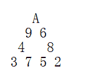
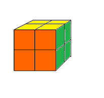

<!--yml
category: 蓝桥杯
date: 2022-04-26 11:07:14
-->

# 2017年第八届蓝桥杯省赛试题及详解（Java本科B组）_跟老程一起学编程的博客-CSDN博客

> 来源：[https://blog.csdn.net/future277809183/article/details/122827190](https://blog.csdn.net/future277809183/article/details/122827190)

1.  结果填空 (满分5分)
2.  结果填空 (满分11分)
3.  结果填空 (满分13分)
4.  结果填空 (满分17分)
5.  代码填空 (满分7分)
6.  代码填空 (满分9分)
7.  程序设计（满分19分）
8.  程序设计（满分21分）
9.  程序设计（满分23分）
10.  程序设计（满分25分）

* * *

**第一题：购物单**

小明刚刚找到工作，老板人很好，只是老板夫人很爱购物。老板忙的时候经常让小明帮忙到商场代为购物。小明很厌烦，但又不好推辞。
    这不，XX大促销又来了！老板夫人开出了长长的购物单，都是有打折优惠的。
    小明也有个怪癖，不到万不得已，从不刷卡，直接现金搞定。
    现在小明很心烦，请你帮他计算一下，需要从取款机上取多少现金，才能搞定这次购物。
    取款机只能提供100元面额的纸币。小明想尽可能少取些现金，够用就行了。
    你的任务是计算出，小明最少需要取多少现金。
以下是让人头疼的购物单，为了保护隐私，物品名称被隐藏了。
-----------------
****     180.90       88折
****      10.25       65折
****      56.14        9折
****     104.65        9折
****     100.30       88折
****     297.15        半价
****      26.75       65折
****     130.62        半价
****     240.28       58折
****     270.62        8折
****     115.87       88折
****     247.34       95折
****      73.21        9折
****     101.00        半价
****      79.54        半价
****     278.44        7折
****     199.26        半价
****      12.97        9折
****     166.30       78折
****     125.50       58折
****      84.98        9折
****     113.35       68折
****     166.57        半价
****      42.56        9折
****      81.90       95折
****     131.78        8折
****     255.89       78折
****     109.17        9折
****     146.69       68折
****     139.33       65折
****     141.16       78折
****     154.74        8折
****      59.42        8折
****      85.44       68折
****     293.70       88折
****     261.79       65折
****      11.30       88折
****     268.27       58折
****     128.29       88折
****     251.03        8折
****     208.39       75折
****     128.88       75折
****      62.06        9折
****     225.87       75折
****      12.89       75折
****      34.28       75折
****      62.16       58折
****     129.12        半价
****     218.37        半价
****     289.69        8折
--------------------
需要说明的是，88折指的是按标价的88%计算，而8折是按80%计算，余者类推。
特别地，半价是按50%计算。
请提交小明要从取款机上提取的金额，单位是元。
答案是一个整数，类似4300的样子，结尾必然是00，不要填写任何多余的内容。

特别提醒：不许携带计算器入场，也不能打开手机。

这个题需要学会使用eclipse中的ctr+f 进行****查找 然后替换为空 然后 将半价替换为50

答案需要注意的是 需要得到的是一个整数

**5200**

```
public class Main {
    public static void main(String[] args) {
		double[] A={180.90 , 88,
				      10.25     ,  65,
				      56.14     ,   90,
				     104.65        ,90,
				     100.30       ,88,
				     297.15        ,50,
				      26.75       ,65,
				     130.62        ,50,
				     240.28       ,58,
				     270.62        ,80,
				     115.87       ,88,
				     247.34       ,95,
				      73.21        ,90,
				     101.00        ,50,
				      79.54        ,50,
				     278.44        ,70,
				     199.26        ,50,
				      12.97        ,90,
				     166.30       ,78,
				     125.50       ,58,
				      84.98       ,90,
				     113.35       ,68,
				     166.57        ,50,
				      42.56        ,90,
				      81.90       ,95,
				     131.78        ,80,
				     255.89       ,78,
				     109.17        ,90,
				     146.69       ,68,
				     139.33       ,65,
				     141.16       ,78,
				     154.74        ,80,
				      59.42        ,80,
				      85.44       ,68,
				     293.70       ,88,
				     261.79       ,65,
				      11.30       ,88,
				     268.27       ,58,
				     128.29       ,88,
				     251.03        ,80,
				     208.39       ,75,
				     128.88       ,75,
				      62.06        ,90,
				     225.87       ,75,
				      12.89       ,75,
				      34.28       ,75,
				      62.16       ,58,
				     129.12       , 50,
				     218.37        ,50,
				     289.69        ,80};
		double sum=0;
		for(int i=0;i<=A.length-2;i=i+2){
			sum=A[i]*A[i+1]+sum;
		}
		System.out.println(sum/100);
	}

}
```

**第二题：纸牌三角形**

A,2,3,4,5,6,7,8,9 共9张纸牌排成一个正三角形（A按1计算）。要求每个边的和相等。
下图就是一种排法（如有对齐问题，参看p1.png）。

      A
     9 6
    4   8
   3 7 5 2

这样的排法可能会有很多。

如果考虑旋转、镜像后相同的算同一种，一共有多少种不同的排法呢？

请你计算并提交该数字。

注意：需要提交的是一个整数，不要提交任何多余内容。



```
public class Main {
    public static void main(String[] args) {
		dfs(0);
		System.out.println(ans/6.0);//除浮点数是想验证是否整除
	}

	static int[] a = new int[] {1,2,3,4,5,6,7,8,9};
	static int ans = 0;

	static void dfs(int m) {
		if(m>=9) {
			if(a[0]+a[1]+a[3]+a[5]==a[0]+a[2]+a[4]+a[8] && a[0]+a[1]+a[3]+a[5]==a[5]+a[6]+a[7]+a[8]) 
				ans++;

			return;
		}

		for(int i=m;i<9;i++) {
			swap(i,m);
			dfs(m+1);
			swap(i,m);
		}

	}

	static void swap(int i,int j) {
		int t = a[i];
		a[i] =a[j];
		a[j] = t;
	}

}
```

**第三题：承压计算**

X星球的高科技实验室中整齐地堆放着某批珍贵金属原料。

每块金属原料的外形、尺寸完全一致，但重量不同。
金属材料被严格地堆放成金字塔形。

                             7 
                            5 8 
                           7 8 8 
                          9 2 7 2 
                         8 1 4 9 1 
                        8 1 8 8 4 1 
                       7 9 6 1 4 5 4 
                      5 6 5 5 6 9 5 6 
                     5 5 4 7 9 3 5 5 1 
                    7 5 7 9 7 4 7 3 3 1 
                   4 6 4 5 5 8 8 3 2 4 3 
                  1 1 3 3 1 6 6 5 5 4 4 2 
                 9 9 9 2 1 9 1 9 2 9 5 7 9 
                4 3 3 7 7 9 3 6 1 3 8 8 3 7 
               3 6 8 1 5 3 9 5 8 3 8 1 8 3 3 
              8 3 2 3 3 5 5 8 5 4 2 8 6 7 6 9 
             8 1 8 1 8 4 6 2 2 1 7 9 4 2 3 3 4 
            2 8 4 2 2 9 9 2 8 3 4 9 6 3 9 4 6 9 
           7 9 7 4 9 7 6 6 2 8 9 4 1 8 1 7 2 1 6 
          9 2 8 6 4 2 7 9 5 4 1 2 5 1 7 3 9 8 3 3 
         5 2 1 6 7 9 3 2 8 9 5 5 6 6 6 2 1 8 7 9 9 
        6 7 1 8 8 7 5 3 6 5 4 7 3 4 6 7 8 1 3 2 7 4 
       2 2 6 3 5 3 4 9 2 4 5 7 6 6 3 2 7 2 4 8 5 5 4 
      7 4 4 5 8 3 3 8 1 8 6 3 2 1 6 2 6 4 6 3 8 2 9 6 
     1 2 4 1 3 3 5 3 4 9 6 3 8 6 5 9 1 5 3 2 6 8 8 5 3 
    2 2 7 9 3 3 2 8 6 9 8 4 4 9 5 8 2 6 3 4 8 4 9 3 8 8 
   7 7 7 9 7 5 2 7 9 2 5 1 9 2 6 5 3 9 3 5 7 3 5 4 2 8 9 
  7 7 6 6 8 7 5 5 8 2 4 7 7 4 7 2 6 9 2 1 8 2 9 8 5 7 3 6 
 5 9 4 5 5 7 5 5 6 3 5 3 9 5 8 9 5 4 1 2 6 1 4 3 5 3 2 4 1 
X X X X X X X X X X X X X X X X X X X X X X X X X X X X X X 

其中的数字代表金属块的重量（计量单位较大）。
最下一层的X代表30台极高精度的电子秤。

假设每块原料的重量都十分精确地平均落在下方的两个金属块上，
最后，所有的金属块的重量都严格精确地平分落在最底层的电子秤上。
电子秤的计量单位很小，所以显示的数字很大。

工作人员发现，其中读数最小的电子秤的示数为：2086458231

请你推算出：读数最大的电子秤的示数为多少？

注意：需要提交的是一个整数，不要填写任何多余的内容。

**答案:72665192664**

解法一：用2^30精确计算

```
import java.util.Arrays;
import java.util.Scanner;

public class Main { // 数组：注意计量单位，要精确计算就先放大2^30来做除法。

	static long[][] arr = new long[30][30];

	public static void main(String[] args) {
		Scanner sc = new Scanner(System.in);
		long factor = 1; // 2的30次方
		for (int i = 0; i < 30; ++i) {
			factor <<= 1;
		}

		// 输入数据放入二维数组
		for (int i = 0; i < 29; ++i) {
			for (int j = 0; j <= i; ++j) {
				long a = sc.nextLong();
				arr[i][j] = a * factor;// 每个数据都乘以factor
			}
		}

		// 自上而下处理a[i][j]*factor（2的30次方）-->除以2，计入a[i+1][j]和a[i+1][j+1]
		// 循环处理第1~N-1行
		for (int i = 0; i < 29; ++i) {
			for (int j = 0; j <= i; ++j) {
				long ha = arr[i][j] / 2;
				arr[i + 1][j] += ha;
				arr[i + 1][j + 1] += ha;
			}
		}
		// 对a[N-1]这一行进行排序，查看最小值与factor之间的倍数关系，决定最大值是多少
		Arrays.sort(arr[29]);
		System.out.println(arr[29][0]);
		System.out.println(arr[29][29]);
		System.out.println(arr[29][29] / (arr[29][0] / 2086458231));
	}

}
```

解法二：double二维数组

```
import java.util.Scanner;

public class Main {
	public static void main(String[] args) {
		Scanner sc = new Scanner(System.in);
		double[][] a = new double[30][30]; // 不能用long型数组，会有误差导致结果错误
		for (int i = 0; i < 29; i++) {
			for (int j = 0; j < i + 1 && j < 29; j++) {
				a[i][j] = sc.nextDouble();
			}
		}
		for (int i = 1; i < 30; i++) {
			for (int j = 0; j < i + 1 && j < 30; j++) {
				if (j == 0) {
					a[i][j] += a[i - 1][j] / 2.0;
				} else if (j == i) {
					a[i][j] += a[i - 1][j - 1] / 2.0;
				} else {
					a[i][j] += a[i - 1][j - 1] / 2.0 + a[i - 1][j] / 2.0;
				}
			}
		}
		double min = 999999, max = 0;
		for (int i = 0; i < a.length; i++) {
			if (a[29][i] > max)
				max = a[29][i];
			if (a[29][i] < min)
				min = a[29][i];
		}

		System.out.println("max=" + max + ", min=" + min);
		System.out.println(2086458231 / min * max);
	}
}
```

**第四题：魔方状态**

二阶魔方就是只有2层的魔方，只由8个小块组成。
如图p1.png所示。

小明很淘气，他只喜欢3种颜色，所有把家里的二阶魔方重新涂了颜色，如下：

前面：橙色
右面：绿色
上面：黄色
左面：绿色
下面：橙色
后面：黄色

请你计算一下，这样的魔方被打乱后，一共有多少种不同的状态。

如果两个状态经过魔方的整体旋转后，各个面的颜色都一致，则认为是同一状态。

请提交表示状态数的整数，不要填写任何多余内容或说明文字



```
import java.util.HashSet;
import java.util.Set;

public class Main { // 229878

	static char[][] start = { "oybbgb".toCharArray(), "oygbbb".toCharArray(), 
			"bygbby".toCharArray(),	"bybbgy".toCharArray(), "obbogb".toCharArray(), 
			"obgobb".toCharArray(), "bbgoby".toCharArray(),	"bbbogy".toCharArray() };
	static char[][][] q = new char[2000000][8][6];
	static Set<String> all_state = new HashSet<String>(); // HashSet去重
	static int front, tail;

	static String to_string(char[][] a) {
		String ans = "";
		for (int i = 0; i < 8; ++i) {
			ans += new String(a[i]);
		}
		return ans;
	}

	private static void swap(char[] a, int i, int j) {
		char t = a[i];
		a[i] = a[j];
		a[j] = t;
	}

	private static void swap(char[][] a, int i, int j) {
		char[] t = a[i];
		a[i] = a[j];
		a[j] = t;
	}

	// 上层的块的旋转，面的相对位置调换
	static void ucell(char[] a) {
		swap(a, 0, 2);
		swap(a, 2, 5);
		swap(a, 5, 4);
	}

	// 上层顺时针旋转
	static void u(char[][] s) {
		ucell(s[0]);
		ucell(s[1]);
		ucell(s[2]);
		ucell(s[3]);
		// 块的相对位置调换
		swap(s, 1, 0);
		swap(s, 2, 1);
		swap(s, 3, 2);
	}

	// 右层旋转是面的位置变化
	static void rcell(char[] a) {
		swap(a, 1, 0);
		swap(a, 0, 3);
		swap(a, 3, 5);
	}

	static void r(char[][] s) { // 魔方右层顺时针转
		rcell(s[1]);
		rcell(s[2]);
		rcell(s[6]);
		rcell(s[5]);
		// 块的位置变化
		swap(s, 2, 1);
		swap(s, 5, 1);
		swap(s, 6, 5);
	}

	static void fcell(char[] a) {
		swap(a, 2, 1);
		swap(a, 1, 4);
		swap(a, 4, 3);
	}

	static void f(char[][] s) { // 前面一层 顺时针转
		fcell(s[0]);
		fcell(s[1]);
		fcell(s[4]);
		fcell(s[5]);
		swap(s, 1, 5);
		swap(s, 0, 1);
		swap(s, 4, 0);
	}

	static void uwhole(char[][] s) { // 整个魔方从顶部看 顺时针转 用于判重
		u(s); // 上层旋转
		// 下层旋转
		ucell(s[4]);
		ucell(s[5]);
		ucell(s[6]);
		ucell(s[7]);
		// 完成自旋后，块的位置变动
		swap(s, 5, 4);
		swap(s, 6, 5);
		swap(s, 7, 6);
	}

	static void fwhole(char[][] s) { // 整个魔方从前面看 顺时针转 用于判重
		f(s);
		fcell(s[2]);
		fcell(s[6]);
		fcell(s[7]);
		fcell(s[3]);
		swap(s, 2, 6);
		swap(s, 3, 2);
		swap(s, 7, 3);
	}

	static void rwhole(char[][] s) { // 整个魔方从右边看 顺时针转 用于判重
		r(s);
		rcell(s[0]);
		rcell(s[3]);
		rcell(s[4]);
		rcell(s[7]);
		swap(s, 3, 7);
		swap(s, 0, 3);
		swap(s, 4, 0);
	}

	static boolean try_insert(char[][] s) {
		char[][] k = new char[8][6];
		memcpy(k, s);
		for (int i = 0; i < 4; i++) {
			fwhole(k);
			for (int j = 0; j < 4; j++) {
				uwhole(k);
				for (int q = 0; q < 4; q++) {
					rwhole(k);
					if (all_state.contains(to_string(k))) {
						return false;
					}
				}
			}
		}
		all_state.add(to_string(k));
		return true;
	}

	private static void memcpy(char[][] k, char[][] s) {
		for (int i = 0; i < 8; i++) {
			for (int j = 0; j < 6; j++) {
				k[i][j] = s[i][j];
			}
		}
	}

	static void solve() {
		front = 0;
		tail = 1;
		all_state.add(to_string(start));
		memcpy(q[front], start); // 填充q[0]，相当于第一个状态入队列
		while (front < tail) {
			// 将其所有变形，尝试加入set中
			memcpy(q[tail], q[front]); // 拷贝到tail
			u(q[tail]); // 上层顺时针旋转
			if (try_insert(q[tail])) {
				tail++; // 扩展队列
			}
			memcpy(q[tail], q[front]); // 拷贝到tail
			r(q[tail]); // 右层顺时针旋转
			if (try_insert(q[tail])) {
				tail++; // 扩展队列
			}
			memcpy(q[tail], q[front]); // 拷贝到tail
			f(q[tail]); // 前顺时针旋转
			if (try_insert(q[tail])) {
				tail++; // 扩展队列
			}
			front++; // 弹出队首
			// cout << front << " " << tail << endl;
		}
		System.out.println(front);
	}

	public static void main(String[] args) {
		solve();
	}

}
```

 **第五题：取数位**

求1个整数的第k位数字有很多种方法。
以下的方法就是一种。

public class Main
{undefined
    static int len(int x){undefined
        if(x<10) return 1;
        return len(x/10)+1;
    }

    // 取x的第k位数字
    static int f(int x, int k){undefined
        if(len(x)-k==0) return x%10;
        return ______________________;  //填空
    }

    public static void main(String[] args)
    {undefined
        int x = 23513;
        //System.out.println(len(x));
        System.out.println(f(x,3));
    }
}

对于题目中的测试数据，应该打印5。

请仔细分析源码，并补充划线部分所缺少的代码。

注意：只提交缺失的代码，不要填写任何已有内容或说明性的文字。

```
public class Main {

	static int len(int x) {
		if (x < 10)
			return 1;
		return len(x / 10) + 1;
	}

	// 取x的第k位数字
	static int f(int x, int k) {
		if (len(x) - k == 0)
			return x % 10; // 求最末一位
		// 填空，消除低位，仍然是求第k位
		return f(x / 10, k);
	}

	public static void main(String[] args) {
		int x = 23513;
		System.out.println(len(x));
		System.out.println(f(x, 4));
	}

}
```

**第六题：最大公共子串**

最大公共子串长度问题就是：
求两个串的所有子串中能够匹配上的最大长度是多少。

比如："abcdkkk" 和 "baabcdadabc"，
可以找到的最长的公共子串是"abcd",所以最大公共子串长度为4。

下面的程序是采用矩阵法进行求解的，这对串的规模不大的情况还是比较有效的解法。

请分析该解法的思路，并补全划线部分缺失的代码。

public class Main
{undefined
    static int f(String s1, String s2)
    {undefined
        char[] c1 = s1.toCharArray();
        char[] c2 = s2.toCharArray();

        int[][] a = new int[c1.length+1][c2.length+1];

        int max = 0;
        for(int i=1; i<a.length; i++){undefined
            for(int j=1; j<a[i].length; j++){undefined
                if(c1[i-1]==c2[j-1]) {undefined
                    a[i][j] = __________________;  //填空 
                    if(a[i][j] > max) max = a[i][j];
                }
            }
        }

        return max;
    }

    public static void main(String[] args){undefined
        int n = f("abcdkkk", "baabcdadabc");
        System.out.println(n);
    }
}

注意：只提交缺少的代码，不要提交已有的代码和符号。也不要提交说明性文字

```
 public class Main {

	static int f(String s1, String s2) { // 计算两个字符串的最大公共子串
		char[] c1 = s1.toCharArray();
		char[] c2 = s2.toCharArray();
		int[][] a = new int[c1.length + 1][c2.length + 1];
		int max = 0;
		for (int i = 1; i < a.length; i++) {
			for (int j = 1; j < a[i].length; j++) {
				if (c1[i - 1] == c2[j - 1]) {
					a[i][j] = a[i - 1][j - 1] + 1; // 填空
					if (a[i][j] > max) {
						max = a[i][j];						
					}
				}
			}
		}
		return max;
	}

	public static void main(String[] args) {
		int n = f("abcdkkk", "baabcdadabc");
		System.out.println(n);
	}

}
```

**第七题：日期问题**

小明正在整理一批历史文献。这些历史文献中出现了很多日期。小明知道这些日期都在1960年1月1日至2059年12月31日。令小明头疼的是，这些日期采用的格式非常不统一，有采用年/月/日的，有采用月/日/年的，还有采用日/月/年的。更加麻烦的是，年份也都省略了前两位，使得文献上的一个日期，存在很多可能的日期与其对应。  

比如02/03/04，可能是2002年03月04日、2004年02月03日或2004年03月02日。  

给出一个文献上的日期，你能帮助小明判断有哪些可能的日期对其对应吗？

输入
----
一个日期，格式是"AA/BB/CC"。  (0 <= A, B, C <= 9)  

输入
----
输出若干个不相同的日期，每个日期一行，格式是"yyyy-MM-dd"。多个日期按从早到晚排列。  

样例输入
----
02/03/04  

样例输出
----
2002-03-04  
2004-02-03  
2004-03-02  

资源约定：
峰值内存消耗（含虚拟机） < 256M
CPU消耗  < 1000ms

请严格按要求输出，不要画蛇添足地打印类似：“请您输入...” 的多余内容。

所有代码放在同一个源文件中，调试通过后，拷贝提交该源码。
不要使用package语句。不要使用jdk1.7及以上版本的特性。
主类的名字必须是：Main，否则按无效代码处理。

```
import java.util.Scanner;
import java.util.Set;
import java.util.TreeSet;

public class Main {

	static boolean isLeap(int year) { // 闰年：2月29天；平年：2月28天
		return (year % 4 == 0 && year % 100 != 0) || year % 400 == 0;
	}

	static String f(int a, int b, int c) {
		if (a >= 0 && a <= 59)
			a += 2000;
		else if (a >= 60 && a <= 99)
			a += 1900;
		else
			return "";

		if (b < 1 || b > 12)
			return "";
		if (c < 1 || c > 31)
			return "";

		boolean _isLeap = isLeap(a);
		switch (b) { // 日期校验
			case 2:
				if (_isLeap && c > 29)
					return "";
				if (!_isLeap && c > 28)
					return "";
				break;
			case 4:
			case 6:
			case 9:
			case 11:
				if (c > 30)
					return "";
				break;
			default:
				break;
		}
		String _a = a + "", _b = b + "", _c = c + "";

		if (_b.length() == 1)
			_b = "0" + _b;
		if (_c.length() == 1)
			_c = "0" + _c;

		return _a + "-" + _b + "-" + _c;
	}

	public static void main(String[] args) {
		Scanner sc = new Scanner(System.in);
		String in = sc.nextLine();
		int a = 0, b = 0, c = 0;
		a = (in.charAt(0) - '0') * 10 + (in.charAt(1) - '0');
		b = (in.charAt(3) - '0') * 10 + (in.charAt(4) - '0');
		c = (in.charAt(6) - '0') * 10 + (in.charAt(7) - '0');
		String case1 = f(a, b, c);
		String case2 = f(c, a, b);
		String case3 = f(c, b, a);

		Set<String> ans = new TreeSet<String>(); // TreeSet带去重和排序功能
		if (case1 != "")
			ans.add(case1);
		if (case2 != "")
			ans.add(case2);
		if (case3 != "")
			ans.add(case3);
		for (String s : ans) {
			System.out.println(s);
		}
	}

}
```

**第八题：包子凑数**

小明几乎每天早晨都会在一家包子铺吃早餐。他发现这家包子铺有N种蒸笼，其中第i种蒸笼恰好能放Ai个包子。每种蒸笼都有非常多笼，可以认为是无限笼。

每当有顾客想买X个包子，卖包子的大叔就会迅速选出若干笼包子来，使得这若干笼中恰好一共有X个包子。比如一共有3种蒸笼，分别能放3、4和5个包子。当顾客想买11个包子时，大叔就会选2笼3个的再加1笼5个的（也可能选出1笼3个的再加2笼4个的）。

当然有时包子大叔无论如何也凑不出顾客想买的数量。比如一共有3种蒸笼，分别能放4、5和6个包子。而顾客想买7个包子时，大叔就凑不出来了。

小明想知道一共有多少种数目是包子大叔凑不出来的。

输入
----
第一行包含一个整数N。(1 <= N <= 100)
以下N行每行包含一个整数Ai。(1 <= Ai <= 100)  

输出
----
一个整数代表答案。如果凑不出的数目有无限多个，输出INF。

例如，
输入：
2  
4  
5   

程序应该输出：
6  

再例如，
输入：
2  
4  
6    

程序应该输出：
INF

样例解释：
对于样例1，凑不出的数目包括：1, 2, 3, 6, 7, 11。  
对于样例2，所有奇数都凑不出来，所以有无限多个。  

资源约定：
峰值内存消耗（含虚拟机） < 256M
CPU消耗  < 1000ms

请严格按要求输出，不要画蛇添足地打印类似：“请您输入...” 的多余内容。

所有代码放在同一个源文件中，调试通过后，拷贝提交该源码。
不要使用package语句。不要使用jdk1.7及以上版本的特性。
主类的名字必须是：Main，否则按无效代码处理。
提交程序时，注意选择所期望的语言类型和编译器类型。

```
import java.util.Scanner;

public class Main {

	static int n, g;
	static int[] a = new int[101];
	static boolean[] f = new boolean[10000];

	static int gcd(int a, int b) {
		if (b == 0)
			return a;
		return gcd(b, a % b);
	}

	public static void main(String[] args) {
		Scanner sc = new Scanner(System.in);
		n = sc.nextInt();
		f[0] = true;
		for (int i = 1; i <= n; ++i) {
			a[i] = sc.nextInt();
			if (i == 1)
				g = a[i];// 初始化最大公约数
			else
				g = gcd(a[i], g);
			// 完全背包的递推
			for (int j = 0; j < 10000 - a[i]; ++j) {
				if (f[j])
					f[j + a[i]] = true;
			}
		}
		if (g != 1) {
			System.out.println("INF");
			return;
		}
		int ans = 0; // 统计个数
		for (int i = 0; i < 10000; ++i) {
			if (!f[i]) {
				ans++;
			}
		}
		System.out.println(ans);
	}

}
```

**第九题： 分巧克力**

儿童节那天有K位小朋友到小明家做客。小明拿出了珍藏的巧克力招待小朋友们。
    小明一共有N块巧克力，其中第i块是Hi x Wi的方格组成的长方形。

    为了公平起见，小明需要从这 N 块巧克力中切出K块巧克力分给小朋友们。切出的巧克力需要满足：

    1\. 形状是正方形，边长是整数  
    2\. 大小相同  

例如一块6x5的巧克力可以切出6块2x2的巧克力或者2块3x3的巧克力。

当然小朋友们都希望得到的巧克力尽可能大，你能帮小Hi计算出最大的边长是多少么？

输入
第一行包含两个整数N和K。(1 <= N, K <= 100000)  
以下N行每行包含两个整数Hi和Wi。(1 <= Hi, Wi <= 100000) 
输入保证每位小朋友至少能获得一块1x1的巧克力。   

输出
输出切出的正方形巧克力最大可能的边长。

样例输入：
2 10  
6 5  
5 6  

样例输出：
2

资源约定：
峰值内存消耗（含虚拟机） < 256M
CPU消耗  < 1000ms

请严格按要求输出，不要画蛇添足地打印类似：“请您输入...” 的多余内容。

所有代码放在同一个源文件中，调试通过后，拷贝提交该源码。
不要使用package语句。不要使用jdk1.7及以上版本的特性。
主类的名字必须是：Main，否则按无效代码处理。

```
import java.util.Scanner;

public class Main {
	public static void main(String[] args) {
		int n, k;
		int[] h = new int[100000];
		int[] w = new int[100000];
		Scanner sc = new Scanner(System.in);
		n = sc.nextInt();
		k = sc.nextInt();
		for (int i = 0; i < n; ++i) {
			h[i] = sc.nextInt();
			w[i] = sc.nextInt();
		}

		int r = 100001;
		int l = 1;
		int ans = 0;
		while (l <= r) {
			int mid = (l + r) / 2;

			int cnt = 0;
			//每个巧克力块，都按照len来切割
			for (int i = 0; i < n; ++i) {
				cnt += (h[i] / mid) * (w[i] / mid);
			}

			if (cnt >= k) {
				l = mid + 1;
				ans = mid;
			} else {
				r = mid - 1;
			}
		}
		System.out.println(ans);
	}
}
```

**第十题： k倍区间**

给定一个长度为N的数列，A1, A2, ... AN，如果其中一段连续的子序列Ai, Ai+1, ... Aj(i <= j)之和是K的倍数，我们就称这个区间[i, j]是K倍区间。  

你能求出数列中总共有多少个K倍区间吗？  

输入
-----
第一行包含两个整数N和K。(1 <= N, K <= 100000)  
以下N行每行包含一个整数Ai。(1 <= Ai <= 100000)  

输出
-----
输出一个整数，代表K倍区间的数目。  

例如，
输入：
5 2
1  
2  
3  
4  
5  

程序应该输出：
6

资源约定：
峰值内存消耗（含虚拟机） < 256M
CPU消耗  < 2000ms

请严格按要求输出，不要画蛇添足地打印类似：“请您输入...” 的多余内容。

所有代码放在同一个源文件中，调试通过后，拷贝提交该源码。
不要使用package语句。不要使用jdk1.7及以上版本的特性。
主类的名字必须是：Main，否则按无效代码处理

```
import java.util.HashMap;
import java.util.Map;
import java.util.Scanner;
public class Main {
	static int n,k;
	static int[] s;
	static int[] a;
	static Map<Integer, Long> cnt=new HashMap<Integer, Long>();

	public static void main(String[] args) {
		Scanner sc=new Scanner(System.in);
		n=sc.nextInt();
		k=sc.nextInt();
		s=new int[n+1];
		a=new int[n+1];
		s[0]=0;
		cnt.put(0,1l);
		for(int i=1;i<=n;i++) {
			a[i]=sc.nextInt();
			s[i]=(s[i-1]+a[i])%k;
			if(cnt.get(s[i])==null) {
				cnt.put(s[i], 1l);
			}else {
				cnt.put(s[i], cnt.get(s[i])+1);
			}
		}
		long ans=0;
		for(int i=0;i<k;i++) {
			Long cnt1=cnt.get(i);
			if(cnt1==null)cnt1=0l;
			ans+=cnt1*(cnt1-1)/2;
		}
		System.out.println(ans);	
	}
} 
```