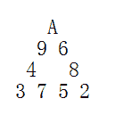
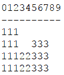
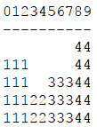
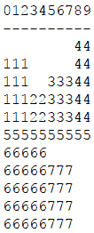

<!--yml
category: 蓝桥杯
date: 2022-04-26 11:07:21
-->

# 2017年第八届蓝桥杯省赛试题及详解（Java高职高专C组）_跟老程一起学编程的博客-CSDN博客

> 来源：[https://blog.csdn.net/future277809183/article/details/123145343](https://blog.csdn.net/future277809183/article/details/123145343)

[【蓝桥杯】历年真题题目及题解汇总](https://blog.csdn.net/future277809183/article/details/122826573 "【蓝桥杯】历年真题题目及题解汇总")

* * *

1.  结果填空 (满分3分)
2.  结果填空 (满分5分)
3.  结果填空 (满分9分)
4.  代码填空 (满分11分)
5.  代码填空 (满分13分)
6.  结果填空 (满分15分)
7.  结果填空 (满分19分)
8.  程序设计（满分21分）
9.  程序设计（满分23分）
10.  程序设计（满分31分）

* * *

## **第一题：外星日历**

某星系深处发现了文明遗迹。

他们的计数也是用十进制。
他们的文明也有日历。日历只有天数，没有年、月的概念。
有趣的是，他们也使用了类似“星期”的概念，
只不过他们的一个星期包含了9天，
为了方便，这里分别记为: A,B,C....H,I

从一些资料上看到，
他们的23日是星期E
他们的190日是星期A
他们的343251日是星期I

令人兴奋的是，他们居然也预见了“世界末日”的那天，
当然是一个很大很大的数字
651764141421415346185

请你计算一下，这遥远的一天是该文明的星期几？

你需要提交的是一个大写字母，表示该文明的星期几，
不要填写任何多余的内容

答案:G

```
import java.math.BigInteger;
import java.util.Scanner;

public class Math {
    public static void main(String[] args) {
        Scanner input=new Scanner(System.in);
        char []arr={'I','A','B','C','D','E','F','G','H'};
        BigInteger num=input.nextBigInteger();
        BigInteger mod=new BigInteger("9");
        String ans=num.mod(mod).toString();
        System.out.println(arr[Integer.parseInt(ans)]);
    }
} 
```

## **第二题：兴趣小组**

为丰富同学们的业余文化生活，某高校学生会创办了3个兴趣小组
（以下称A组，B组，C组）。
每个小组的学生名单分别在【A.txt】,【B.txt】和【C.txt】中。
每个文件中存储的是学生的学号。

由于工作需要，我们现在想知道：
既参加了A组，又参加了B组，但是没有参加C组的同学一共有多少人？

请你统计该数字并通过浏览器提交答案。

注意：答案是一个整数，不要提交任何多余的内容
答案：20

```
public class Main {
    public static void main(String[] args) {
        int[] a = {
                12894792, 92774113, 59529208, 22962224,2991600, 83340521, 87365045,
                40818286, 16400628, 39475245, 55933381, 76940287, 61366748, 95631228,
                17102313, 50682833, 61562613, 87002524, 83062019, 51743442, 61977890,
                32010762, 69680621, 87179571, 81761697, 32364296,7833271, 36198035,
                26588918, 84046668, 43059468, 73191775, 56794101,454780, 11141030,
                10008994, 35072237, 44945158, 53959980, 75758119, 18560273, 35801494,
                42102550, 22496415,3981786, 34593672, 13074905,7733442, 42374678,
                23452507, 98586743, 30771281, 17703080, 52123562,5898131, 56698981,
                90758589, 18238802, 18217979,4511837, 75682969, 31135682, 55379006,
                42224598, 98263070, 40228312, 28924663, 11580163, 25686441, 45944028,
                96731602, 53675990,3854194, 14858183, 16866794, 40677007, 73141512,
                32317341, 56641725, 43123040, 15201174, 62389950, 72887083, 76860787,
                61046319,6923746, 17874548, 46028629, 10577743, 48747364,5328780,
                59855415, 60965266, 20592606, 14471207, 70896866, 46938647, 33575820,
                53426294, 56093931, 51326542, 94050481, 80114017, 33010503, 72971538,
                22407422, 17305672, 78974338, 93209260, 83461794, 41247821, 26118061,
                10657376, 42198057, 15338224, 50284714, 32232841, 26716521, 76048344,
                23676625, 62897700, 69296551, 59653393, 38704390, 48481614, 69782897,
                26850668, 37471053, 88720989, 51010849, 94951571, 60024611, 29808329,
                70377786, 13899299,9683688, 58218284, 46792829, 97221709, 45286643,
                48158629, 57367208, 26903401, 76900414, 87927040,9926730,1508757,
                15101101, 62491840, 43802529};

        int[] b = {
                44894050, 34662733, 44141729, 92774113, 99208727, 91919833, 23727681,
                10003409, 55933381, 54443275, 13584702, 96523685, 50682833, 61562613,
                62380975, 20311684, 93200452, 23101945, 42192880, 28992561, 18460278,
                19186537, 58465301,1111066, 62680429, 23721241, 20277631, 91708977,
                57514737,3981786, 81541612,7346443, 93154608, 19709455, 37446968,
                17703080, 72378958, 66200696, 30610382, 89586343, 33152171, 67040930,
                35696683, 63242065, 99948221, 96233367, 52593493, 98263070,1418023,
                74816705, 89375940, 58405334, 96731602, 84089545, 16866794, 94737626,
                1673442, 70548494, 13638168,8163691, 11106566, 64375392, 40267902,
                897705, 56447313, 54532235, 94738425, 66642634, 83219544, 40546096,
                66924991, 20592606, 96037590, 73434467, 70896866, 91025618, 57892091,
                8487641, 32500082, 84412833, 23311447, 38380409, 79957822, 72971538,
                69645784, 91863314, 73099909, 93209260, 83461794, 81378487, 30423273,
                22233715, 32232841, 26716521,3511221, 29196547, 58263562, 56233305,
                52547525, 55812835, 87253244, 52484232, 80837360, 94098464, 52028151,
                53267501, 66381929, 84381316, 59788467,9683688, 67082008, 71605255,
                80654064, 21434307, 45286643, 76556656, 82465821, 57367208, 79218980,
                48460468, 59170479, 46046391, 43043164, 96544490, 83340521, 70837892,
                18926791, 40818286, 28936302, 11489524, 51031183, 73860337, 13241219,
                9025448, 10718828, 76360986, 26031606, 76558053, 97726139, 46473415,
                48406387, 23625539, 86756012, 35164187, 49161302, 78082834, 35072237,
                8602486, 29815841, 56562216, 77684187, 81751704, 20160464, 50407962,
                27786415, 19893526,934129, 37759498, 52636463, 25666982, 43262852,
                38393436,2581136, 29323250, 56950657,5898131, 95286262, 75574581,
                54057961,6703896, 90758589, 57782642, 34492535, 41919697,6395464,
                10993500, 81212949, 34017532, 69569396, 99009936, 57129610, 67401593,
                71044018, 62076698, 29533873, 71936325, 86874388, 26545032, 35695544,
                30433724, 53127345, 72887083, 25390873, 63711546,6923746, 27783723,
                33199575, 35929698, 16491251, 18276792, 62744775, 92096155,6336570,
                56141974, 73007273, 31416832,0171057, 64176982, 46938647, 58460388,
                69972026, 73724304, 27435484, 51568616, 15531822, 47788699, 11818851,
                41594694, 83561325, 43107163, 56965375, 10557343, 26118061, 74650126,
                90076467, 10657376, 49901436,3425162, 61164599, 15797769,5427896,
                14444084, 36795868, 18079449, 59653393, 72942548,6763077, 33895610,
                94892653, 12085268, 65174140, 79567366, 23020126, 74290047, 13498869,
                21696323, 27724594, 54941003, 38229841,7050068};

        int[] c = {
                13404901, 39952424, 47847739, 94939581, 13809950, 70966043, 11161555,
                17102313, 47079425, 50682833, 74154313, 61562613, 93200452, 37103342,
                18479435, 32502597, 36198035, 54210010, 73191775, 48358178, 85544503,
                5996766, 54651623, 52113220, 27465181, 23871783, 22496415, 54107041,
                65899605, 56528700, 82671109, 61176034, 42374678, 51612628, 63329997,
                56591652,4552733, 12789324, 89586343, 51935014, 38611966, 43916409,
                70996050, 98263070,1418023, 65345049, 21734275, 76846198, 71506230,
                833171, 67128139, 41367555, 64769510, 44010700, 16475199, 93164325,
                9386162, 95324041, 80688223, 67629139, 79552617, 76219736, 50368644,
                45096021, 54972488, 63779011, 28862942, 73145521, 74078605, 66924991,
                12806850,2171001, 70896866, 73434467,8487641, 44415025, 32500082,
                84412833, 83896188, 52243759, 49191410, 38744339, 48079796, 44937032,
                6267501, 81866886, 38575984, 25978688, 78974338, 41247821, 12356966,
                64842303, 79127158,2366944, 68000570, 12426275, 96409230,705972,
                8266503, 83820884,8831807, 43273308, 23216105, 29196547, 95160161,
                5553537, 52182214, 32641346, 91553427, 24436506, 77433749,1979664,
                52028151, 88985343,1761499, 76203088, 63237368, 23405334, 59788467,
                9683688, 67755443, 29946533, 12053603,437479, 15200030, 45286643,
                93537527, 82465821, 57367208, 53899751, 15354933, 97760830, 68933762,
                80220545,1892750, 39868288, 21524323, 69716610, 65083815, 78048499,
                3227391, 83340521, 87365045, 71720254, 51031183, 89168555,8503028,
                37086236, 25103057, 87002524, 22808816, 80928090, 90741678, 15993372,
                99117082, 49938176, 21755083, 86903426, 87830263, 53959980, 75758119,
                59781354, 58679691, 25666982, 56307643, 47180521, 62776522, 78136608,
                44882734, 90758589,8075999, 66303819, 23480347, 11580163, 87080118,
                18329165, 92514163, 89404632, 92377859,3912329, 17499963, 59699979,
                79876366, 63894807, 37857001, 86003935, 90087123, 29433345, 80298948,
                61531153, 61046319, 37839841, 19421134, 48747364, 35196916, 62484573,
                59907079, 36845702, 21631642, 72739317, 26283700, 80114017, 76639390,
                29154110, 35159758, 47788699, 11818851, 56520669, 36396767, 36031167,
                83817428, 10657376, 90076467, 14676452, 11024560, 16327605, 76048344,
                14444084, 95452011, 99612346, 65172562, 84813675, 88618282, 38704390,
                27998014, 63859011, 33787505, 60024611, 16229880, 13899299, 35240335,
                29173227, 45036451, 66177893, 82658333, 43100730, 44520187, 74290047,
                85013538,9926730, 27724594, 95148523, 20503000, 64390907, 26006953,
                98116293, 97457666, 29017396,4634371, 70791589};

        int count=0;
        for(int i=0;i<a.length;i++){
            for(int j=0;j<b.length;j++){
                if(a[i]==b[j]){	//A、B相同
                    int flag=0;
                    for(int k=0;k<c.length;k++){
                        if(b[j]==c[k]){
                            flag=1;
                            break;
                        }
                    }
                    if(flag==0)
                        count++;

                }
            }
        }

        System.out.print(count);

    }
    } 
```

## **第三题：纸牌三角形**

A,2,3,4,5,6,7,8,9 共9张纸牌排成一个正三角形（A按1计算）。要求每个边的和相等。
下图就是一种排法



这样的排法可能会有很多。

如果考虑旋转、镜像后相同的算同一种，一共有多少种不同的排法呢？

请你计算并提交该数字。

注意：需要提交的是一个整数，不要提交任何多余内容

```
 import java.util.Scanner;

public class Main {
    public static int ans=0;
    public static void main(String[] args) {
        Scanner input=new Scanner(System.in);
        int arr[]=new int[10];
        int visted[]=new int[10];
        dfs(1,arr,visted);
        System.out.print(ans/6);

    }
    public static void dfs(int level,int []arr ,int []visted)
    {
        if(level>9){
            //判断是否为等边三角形
            int bound1=arr[1]+arr[2]+arr[3]+arr[4];
            int bound2=arr[4]+arr[5]+arr[6]+arr[7];
            int bound3=arr[7]+arr[8]+arr[9]+arr[1];
            //去重
            if(bound1==bound2&&bound1==bound3){
                ans++;
            }
            return;
        }
        //全排列
        for(int i=1;i<=9;i++){
            if(visted[i]==0){
                visted[i]=1;
                arr[level]=i;
                dfs(level+1,arr,visted);
                visted[i]=0;
            }
        }
    }
} 
```

## **第四题：承压计算**

X星球的高科技实验室中整齐地堆放着某批珍贵金属原料。

每块金属原料的外形、尺寸完全一致，但重量不同。
金属材料被严格地堆放成金字塔形

                             7 
                            5 8 
                           7 8 8 
                          9 2 7 2 
                         8 1 4 9 1 
                        8 1 8 8 4 1 
                       7 9 6 1 4 5 4 
                      5 6 5 5 6 9 5 6 
                     5 5 4 7 9 3 5 5 1 
                    7 5 7 9 7 4 7 3 3 1 
                   4 6 4 5 5 8 8 3 2 4 3 
                  1 1 3 3 1 6 6 5 5 4 4 2 
                 9 9 9 2 1 9 1 9 2 9 5 7 9 
                4 3 3 7 7 9 3 6 1 3 8 8 3 7 
               3 6 8 1 5 3 9 5 8 3 8 1 8 3 3 
              8 3 2 3 3 5 5 8 5 4 2 8 6 7 6 9 
             8 1 8 1 8 4 6 2 2 1 7 9 4 2 3 3 4 
            2 8 4 2 2 9 9 2 8 3 4 9 6 3 9 4 6 9 
           7 9 7 4 9 7 6 6 2 8 9 4 1 8 1 7 2 1 6 
          9 2 8 6 4 2 7 9 5 4 1 2 5 1 7 3 9 8 3 3 
         5 2 1 6 7 9 3 2 8 9 5 5 6 6 6 2 1 8 7 9 9 
        6 7 1 8 8 7 5 3 6 5 4 7 3 4 6 7 8 1 3 2 7 4 
       2 2 6 3 5 3 4 9 2 4 5 7 6 6 3 2 7 2 4 8 5 5 4 
      7 4 4 5 8 3 3 8 1 8 6 3 2 1 6 2 6 4 6 3 8 2 9 6 
     1 2 4 1 3 3 5 3 4 9 6 3 8 6 5 9 1 5 3 2 6 8 8 5 3 
    2 2 7 9 3 3 2 8 6 9 8 4 4 9 5 8 2 6 3 4 8 4 9 3 8 8 
   7 7 7 9 7 5 2 7 9 2 5 1 9 2 6 5 3 9 3 5 7 3 5 4 2 8 9 
  7 7 6 6 8 7 5 5 8 2 4 7 7 4 7 2 6 9 2 1 8 2 9 8 5 7 3 6 
 5 9 4 5 5 7 5 5 6 3 5 3 9 5 8 9 5 4 1 2 6 1 4 3 5 3 2 4 1 
X X X X X X X X X X X X X X X X X X X X X X X X X X X X X X

其中的数字代表金属块的重量（计量单位较大）。
最下一层的X代表30台极高精度的电子秤。

假设每块原料的重量都十分精确地平均落在下方的两个金属块上，
最后，所有的金属块的重量都严格精确地平分落在最底层的电子秤上。
电子秤的计量单位很小，所以显示的数字很大。

工作人员发现，其中读数最小的电子秤的示数为：2086458231

请你推算出：读数最大的电子秤的示数为多少？

注意：需要提交的是一个整数，不要填写任何多余的内容。

```
import java.util.Scanner;

public class Main {

    public static void main(String[] args) {
        Scanner in = new Scanner(System.in);
        double[][] arr = new double[30][30];
        double min=10000000;
        double max=0;
        for(int i=0;i<30;i++) {
            for(int j=0;j<30;j++) {
                arr[i][j] = in.nextInt();
            }
        }

        for(int i=1;i<30;i++) {
            for(int j=0;j<=i;j++) {
                if(j==0) {
                    arr[i][j] += arr[i-1][j]/2;
                }
                else if(j==i){
                    arr[i][j]+=arr[i-1][j-1]/2;
                }
                else {
                    arr[i][j] += arr[i-1][j-1]/2 + arr[i-1][j]/2;
                }
            }
        }

        for(int i=0;i<30;i++) {
            if(max < arr[29][i]) max = arr[29][i];
            if(min > arr[29][i]) min = arr[29][i];
        }
        long ans = (long) (2086458231/min * max);
        System.out.println(ans);

    }
} 
```

## **第五题：杨辉三角**

杨辉三角也叫帕斯卡三角，在很多数量关系中可以看到，十分重要。

第0行： 1
第1行： 1 1
第2行： 1 2 1
第3行： 1 3 3 1
第4行： 1 4 6 4 1
…

两边的元素都是1， 中间的元素是左上角的元素与右上角的元素和。

我们约定，行号，列号都从0计数。
所以： 第6行的第2个元素是15，第3个元素是20

```
public class A
{
	// 杨辉三角形的第row行第col列
	static long f(int row, int col){
		if(row<2) return 1;
		if(col==0) return 1;
		if(col==row) return 1;

		long[] a = new long[row+1];
		a[0]=1;
		a[1]=1;

		int p = 2;

		while(p<=row){
			a[p] = 1;
			for( __________________ ) a[q] = a[q] + a[q-1];
			p++;
		}

		return a[col];
	}

	public static void main(String[] args){
		System.out.println(f(6,2));
		System.out.println(f(6,3));		
	}
} 
```

```
答案：int q=p-1; q>=1; q--
```

## **第六题：最大公共子串**

最大公共子串长度问题就是：
求两个串的所有子串中能够匹配上的最大长度是多少。

比如：“abcdkkk” 和 “baabcdadabc”，
可以找到的最长的公共子串是"abcd",所以最大公共子串长度为4。

下面的程序是采用矩阵法进行求解的，这对串的规模不大的情况还是比较有效的解法。

请分析该解法的思路，并补全划线部分缺失的代码

```
public class Main
{
	static int f(String s1, String s2)
	{
		char[] c1 = s1.toCharArray();
		char[] c2 = s2.toCharArray();

		int[][] a = new int[c1.length+1][c2.length+1];

		int max = 0;
		for(int i=1; i<a.length; i++){
			for(int j=1; j<a[i].length; j++){
				if(c1[i-1]==c2[j-1]) {
					a[i][j] = __________________;  //填空 
					if(a[i][j] > max) max = a[i][j];
				}
			}
		}

		return max;
	}

	public static void main(String[] args){
		int n = f("abcdkkk", "baabcdadabc");
		System.out.println(n);
	}
} 
```

```
答案：a[i][j]=a[i-1][j-1]+1
```

## **第七题： Excel地址**

Excel单元格的地址表示很有趣，它使用字母来表示列号。
比如，
A表示第1列，
B表示第2列，
Z表示第26列，
AA表示第27列，
AB表示第28列，
BA表示第53列，
…

当然Excel的最大列号是有限度的，所以转换起来不难。
如果我们想把这种表示法一般化，可以把很大的数字转换为很长的字母序列呢？

本题目既是要求对输入的数字, 输出其对应的Excel地址表示方式。

例如，
输入：

26
则程序应该输出：

Z

再例如，
输入：

2054

则程序应该输出：

BZZ

我们约定，输入的整数范围[1,2147483647]

```
 import java.util.Scanner;

public class Main {
    public static void main(String[] args) {
        Scanner input=new Scanner(System.in);
        int target=input.nextInt();
        char []ans=new char[1000000];
        int index=0;
        while(target>0){
            int temp=target%26;
            if(temp==0){
                ans[index++]='Z';
                target=(target-26)/26;
            }
            else {
                ans[index++]=(char)('A'+temp-1);
                target=(target-temp)/26;
            }

        }
        for(int i=index-1;i>=0;i--){
            System.out.print(ans[i]);
        }

    }
} 
```

```
import java.util.Scanner;

public class Main{
    public static void main(String[] args) {
        Scanner input=new Scanner(System.in);
        int num=input.nextInt();
        char []arr={'Z','A','B','C','D','E','F','G','H','I','J','K','L','M','N','O','P','Q'
        ,'R','S','T','U','V','W','X','Y'};
        String ans="";
        int flag=0;
        while (num>0){
            ans+=arr[num%26];
            num--;
            num/=26;

        }
        char []ansarr=ans.toCharArray();
        for(int i=ans.length()-1;i>=0;i--){
            System.out.print(ansarr[i]);
        }

    }
} 
```

## **第八题：拉马车**

小的时候，你玩过纸牌游戏吗？
有一种叫做“拉马车”的游戏，规则很简单，却很吸引小朋友。

其规则简述如下：
假设参加游戏的小朋友是A和B，游戏开始的时候，他们得到的随机的纸牌序列如下：
A方：[K, 8, X, K, A, 2, A, 9, 5, A]
B方：[2, 7, K, 5, J, 5, Q, 6, K, 4]

其中的X表示“10”，我们忽略了纸牌的花色。

从A方开始，A、B双方轮流出牌。

当轮到某一方出牌时，他从自己的纸牌队列的头部拿走一张，放到桌上，并且压在最上面一张纸牌上（如果有的话）。

此例中，游戏过程：
A出K，B出2，A出8，B出7，A出X，此时桌上的序列为：

K,2,8,7,X

当轮到B出牌时，他的牌K与桌上的纸牌序列中的K相同，则把包括K在内的以及两个K之间的纸牌都赢回来，放入自己牌的队尾。注意：为了操作方便，放入牌的顺序是与桌上的顺序相反的。
此时，A、B双方的手里牌为：
A方：[K, A, 2, A, 9, 5, A]
B方：[5, J, 5, Q, 6, K, 4, K, X, 7, 8, 2, K]

赢牌的一方继续出牌。也就是B接着出5，A出K，B出J，A出A，B出5，又赢牌了。
5,K,J,A,5
此时双方手里牌：
A方：[2, A, 9, 5, A]
B方：[Q, 6, K, 4, K, X, 7, 8, 2, K, 5, A, J, K, 5]

注意：更多的时候赢牌的一方并不能把桌上的牌都赢走，而是拿走相同牌点及其中间的部分。但无论如何，都是赢牌的一方继续出牌，有的时候刚一出牌又赢了，也是允许的。

当某一方出掉手里最后一张牌，但无法从桌面上赢取牌时，游戏立即结束。

对于本例的初始手牌情况下，最后A会输掉，而B最后的手里牌为：

9K2A62KAX58K57KJ5

本题的任务就是已知双方初始牌序，计算游戏结束时，赢的一方手里的牌序。当游戏无法结束时，输出-1。

输入为2行，2个串，分别表示A、B双方初始手里的牌序列。
输出为1行，1个串，表示A先出牌，最后赢的一方手里的牌序。

例如，
输入：

96J5A898QA
6278A7Q973

则程序应该输出：

2J9A7QA6Q6889977

再比如，
输入：
25663K6X
7448
J88A5KJXX45A

则程序应该输出：

6KAJ458KXAX885XJ645

我们约定，输入的串的长度不超过30

```
import java.util.LinkedList;
import java.util.Queue;
import java.util.Scanner;
import java.util.Stack;

public class Main {
    public static void main(String[] args) {
        Scanner input=new Scanner(System.in);
        String A=input.next();
        String B=input.next();
        Queue<Character> a=new LinkedList<>();
        Queue<Character> b=new LinkedList<>();
        for(int i=0;i<A.length();i++){
            a.offer(A.charAt(i));
        }
        for(int i=0;i<B.length();i++){
            b.offer(B.charAt(i));
        }
        Stack<Character> zhuo=new Stack<>();
        int flag=0;
        int index=1;
        while (index<100000){
            //index奇数就是A出
            if(index%2!=0&&a.size()!=0){
                char paia=a.poll();

                //牌桌上是否有这个数
                if(zhuo.contains(paia)){
                    //有这张牌就打出，然后一起收走
                    zhuo.add(paia);
                while (zhuo.contains(paia)){
                    a.offer(zhuo.pop());
                }
                //赢牌继续出
                    continue;
                }
                //没有这个牌也要打出来
                else {
                    zhuo.add(paia);
                }
                if(a.size()==0){
                    flag=2;//设flag==2时表示a的牌出完了
                    break;
                }

            }
            else if(index%2==0&&b.size()!=0){
                char paib=b.poll();

                if(zhuo.contains(paib)) {
                    zhuo.add(paib);
                    while (zhuo.contains(paib)) {
                        b.offer(zhuo.pop());
                    }
                    //赢牌继续出
                    continue;
                }
                else {
                    zhuo.add(paib);
                }
                //查看是否打完
                if(b.size()==0){
                    flag=1;//设flag==1时表示b的牌出完了
                    break;
                }
            }
            index++;
        }
        if(flag==0){//没有赢家
            System.out.println("-1");
        }
        else if(flag==1){
            while (a.size()!=0){
                System.out.print(a.poll());
            }
        }
        else if(flag==2){
            while (b.size()!=0)
                System.out.print(b.poll());
        }
    }
} 
```

## **第九题：青蛙跳杯子**

X星球的流行宠物是青蛙，一般有两种颜色：白色和黑色。 X星球的居民喜欢把它们放在一排茶杯里，这样可以观察它们跳来跳去。 如下图，有一排杯子，左边的一个是空着的，右边的杯子，每个里边有一只青蛙。

*WWWBBB

其中，W字母表示白色青蛙，B表示黑色青蛙，*表示空杯子。

X星的青蛙很有些癖好，它们只做3个动作之一：
1\. 跳到相邻的空杯子里。
2\. 隔着1只其它的青蛙（随便什么颜色）跳到空杯子里。
3\. 隔着2只其它的青蛙（随便什么颜色）跳到空杯子里。

对于上图的局面，只要1步，就可跳成下图局面

WWW*BBB

本题的任务就是已知初始局面，询问至少需要几步，才能跳成另一个目标局面。

输入为2行，2个串，表示初始局面和目标局面。
输出要求为一个整数，表示至少需要多少步的青蛙跳。

**例如：
输入：**

*WWBB

WWBB*

**则程序应该输出**：

2

**再例如，
输入：**

```
WWW*BBB
BBB*WWW 
```

**则程序应该输出：**

10

我们约定，输入的串的长度不超过15

```
 import java.util.*;

public class Main {
    static Queue<Node> queue=new LinkedList<Node>();
    static Queue<String>map=new LinkedList<String >();
    public static void main(String[] args) {
        Scanner input=new Scanner(System.in);
        String first=input.next();
        String end=input.next();
        Node start=new Node(first,0);
        BFS(start,end);

    }
    public static void BFS(Node first,String end){
        queue.offer(first);//存入第一个点
        while(queue.size()!=0){
            Node temp=queue.poll();
            //BFS找到了就是最小值
            if(temp.now.equals(end)){
                System.out.println(temp.step);
                break;
            }
            //没找到继续遍历
            //找所有青蛙
            char []temparr=temp.now.toCharArray();
            for(int i=0;i<temparr.length;i++){
                if(temparr[i]=='*')continue;
                //找到每个青蛙所能跳到的空杯子
                for(int j=-3;j<=3;j++){

                    if((i+j>=0&&i+j<end.length())&&temparr[i+j]=='*'&&j!=0){
                        swap(temparr,i,i+j);//找到之后交换，注意之后还要调回来
                        String tempstring=new String(temparr);
                        if(!map.contains(tempstring)){
                            queue.offer(new Node(tempstring,temp.step+1));
                            map.offer(tempstring);
                        }
                        swap(temparr,i,i+j);//类似于回溯
                    }
                }
            }

        }
        return;

    }
    public static void swap(char []temparr,int x,int y){
        char temp=temparr[x];
        temparr[x]=temparr[y];
        temparr[y]=temp;
    }
}

class Node{
    String now;
    int step;
    public Node(String now ,int step){
        this.now=now;
        this.step=step;
    }

} 
```

## **第十题：图形排版**

小明需要在一篇文档中加入 N 张图片，其中第 i 张图片的宽度是 Wi，高度是 Hi。
　　假设纸张的宽度是 M，小明使用的文档编辑工具会用以下方式对图片进行自动排版：

1\. 该工具会按照图片顺序，在宽度 M 以内，将尽可能多的图片排在一行。该行的高度是行内最高的图片的高度。例如在 M=10 的纸张上依次打印 3x4, 2x2, 3x3 三张图片，则效果如下图所示，这一行高度为4。(分割线以上为列标尺，分割线以下为排版区域；数字组成的矩形为第x张图片占用的版面)
　
2\. 如果当前行剩余宽度大于0，并且小于下一张图片，则下一张图片会按比例缩放到宽度为当前行剩余宽度(高度向上取整)，然后放入当前行。例如再放入一张4x9的图片，由于剩余宽度是2，这张图片会被压缩到2x5，再被放入第一行的末尾。此时该行高度为5：

 

3\. 如果当前行剩余宽度为0，该工具会从下一行开始继续对剩余的图片进行排版，直到所有图片都处理完毕。此时所有行的总高度和就是这 N 张图片的排版高度。例如再放入11x1, 5x5, 3x4 的图片后，效果如下图所示，总高度为11：


现在由于排版高度过高，图片的先后顺序也不能改变，小明只好从 N 张图片中选择一张删除掉以降低总高度。他希望剩余N-1张图片按原顺序的排版高度最低，你能求出最低高度是多少么？

输入：
第一行包含两个整数 M 和 N，分别表示纸张宽度和图片的数量。
　　接下来 N 行，每行2个整数Wi, Hi，表示第 i 个图大小为 Wi*Hi。

对于30%的数据，满足1<=N<=1000
　　对于100%的数据，满足1<=N<=100000，1<=M, Wi, Hi<=100

输出：
一个整数，表示在删除掉某一张图片之后，排版高度最少能是多少。

样例输入1：
4 3
2 2
2 3
2 2

样例输出1：
2

样例输入2：
2 10
4 4
4 3
1 3
4 5
2 1
2 3
5 4
5 3
1 5
2 4

样例输出2：
17

```
 import java.io.BufferedReader;
	import java.io.InputStreamReader;
	import java.io.PrintWriter;
	import java.util.StringTokenizer;

	public class Main {

			public static void main(String[] arg) {
				 solve();
			}

			static	StringTokenizer ST;
			static	BufferedReader BR;
			static	PrintWriter PW;

			static	String next() {
				while(ST == null || !ST.hasMoreTokens()) {
					try {
						ST = new StringTokenizer(BR.readLine());
					}catch (Exception e) {
						// TODO: handle exception
						throw new RuntimeException(e);
					}
				}
				return ST.nextToken();
			}

			static int nextInt() {
				return Integer.parseInt(next());
			}

		public	static void solve() {
				BR = new BufferedReader(new InputStreamReader(System.in));
				PW = new PrintWriter(System.out);

				int m = nextInt(), n = nextInt();
				Pair a[] = new Pair[n + 10];
				Triple cr[] = new Triple[n + 10];
				cr[0] = new Triple();
				//正向处理出加到第i块的状态，Triple记忆第i块右下坐标(x,y)和第i块缩放后的高度h
				for(int i = 1; i <= n; i++) {
					//创建
					Triple tmp = new Triple(cr[i-1]);
					//如果这一行装不下，就置零换行
					if(tmp.x == m) tmp.x = tmp.h = 0;
					//新建输入的宽高
					a[i] = new Pair(nextInt(), nextInt());
					cr[i] = new Triple();

					Pair b = Change(a[i], m - tmp.x);
					//保存当前的位置
					cr[i].x = tmp.x + b.x;
					cr[i].h = Math.max(tmp.h, b.y);
					cr[i].y = cr[i].h + tmp.y - tmp.h;
				}

				Triple A[] = new Triple[m];
				Triple B[] = new Triple[m];
				for(int i = 0; i < m; i++) {
					A[i] = new Triple();
					B[i] = new Triple();
				}

				int ans = cr[n].y;
				//把每一个都尝试一下
				for(int i = n; i >= 1; i--) {
		            //处理删除第i块的答案ah
					Triple pre = cr[i-1];
					int ah;
					if(pre.x == m) {
						ah = pre.y + B[0].y;
					} else {
						ah = pre.y - pre.h + B[pre.x].y - B[pre.x].h + Math.max(pre.h, B[pre.x].h);
					}
					ans = Math.min(ans, ah);

					//逆向DP，处理出第i至n块从(0,j)位置开始放置
					for(int j = 0; j < m; j++) {
						Pair b = Change(a[i], m - j);
						Triple tmp;
						//放完这个我就要换行
						if(j + b.x == m) tmp = new Triple(0, B[0].y, 0);
						//如果不换行，还是这个
						else tmp = new Triple(B[j + b.x]);

						A[j].h = Math.max(b.y, tmp.h);
						A[j].y = A[j].h + tmp.y - tmp.h;
					}

					for(int j = 0; j < m; j++)
						B[j] = new Triple(A[j]);
				}

				PW.print(ans);

				PW.close();
			}
			//a的x小就返回a，否则返回
		static Pair Change(Pair A, int x) {
				if(A.x <= x) return new Pair(A);
				return new Pair(x, (A.y * x + A.x - 1) / A.x);
			}
		}

		class Pair implements Comparable<Pair> {
			int x, y;

			Pair() { }

			Pair(Pair A) { x = A.x; y = A.y; }

			Pair(int x, int y) {
				this.x = x; this.y = y;
			}

			@Override
			public int compareTo(Pair A) {
				return x == A.x ? y - A.y : x - A.x;
			}
		}

		class Triple {
			int x, y, h;

			Triple() {}

			Triple(int x, int y, int h) {
				this.x = x; this.y = y; this.h = h;
			}

			Triple(Triple A) {
				x = A.x; y = A.y; h = A.h;
			}

			@Override
			public String toString() {
				return String.valueOf(x) + " " + String.valueOf(y) + " " + String.valueOf(h);
			}

	} 
```