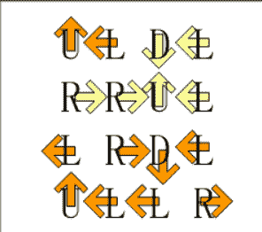
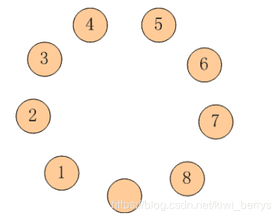
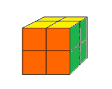
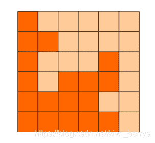

<!--yml
category: 蓝桥杯
date: 2022-04-26 11:23:40
-->

# 2017年第四届C/C++ A组蓝桥杯省赛真题_元气算法的博客-CSDN博客

> 来源：[https://blog.csdn.net/kiwi_berrys/article/details/111462986](https://blog.csdn.net/kiwi_berrys/article/details/111462986)

> 这里是蓝桥杯历年的题目专栏，将会陆续更新将往年真题以及解答发布出来，欢迎各位小伙伴关注我吖，你们的点赞关注就是给我最好的动力！！！
> <font>每天更新一届真题，敬请期待</font>

[蓝桥杯历年真题及详细解答](https://blog.csdn.net/kiwi_berrys/article/details/111186204)

* * *

### 第一题：迷宫

**题目描述**
X星球的一处迷宫游乐场建在某个小山坡上。

它是由10x10相互连通的小房间组成的。

房间的地板上写着一个很大的字母。

我们假设玩家是面朝上坡的方向站立，则：

L表示走到左边的房间，

R表示走到右边的房间，

U表示走到上坡方向的房间，

D表示走到下坡方向的房间。

X星球的居民有点懒，不愿意费力思考。

他们更喜欢玩运气类的游戏。这个游戏也是如此！

开始的时候，直升机把100名玩家放入一个个小房间内。

玩家一定要按照地上的字母移动。

迷宫地图如下：

* * *

UDDLUULRUL

UURLLLRRRU

RRUURLDLRD

RUDDDDUUUU

URUDLLRRUU

DURLRLDLRL

ULLURLLRDU

RDLULLRDDD

UUDDUDUDLL

ULRDLUURRR

* * *

请你计算一下，最后，有多少玩家会走出迷宫?

而不是在里边兜圈子。

请提交该整数，表示走出迷宫的玩家数目，不要填写任何多余的内容。

如果你还没明白游戏规则，可以参看一个简化的4x4迷宫的解说图：


**题目分析**
**题目代码**

* * *

### 第二题：跳蚱蜢

**题目描述**
有9只盘子，排成1个圆圈。

其中8只盘子内装着8只蚱蜢，有一个是空盘。

我们把这些蚱蜢顺时针编号为 1~8

每只蚱蜢都可以跳到相邻的空盘中，

也可以再用点力，越过一个相邻的蚱蜢跳到空盘中。

请你计算一下，如果要使得蚱蜢们的队形改为按照逆时针排列，

并且保持空盘的位置不变（也就是1-8换位，2-7换位,…），至少要经过多少次跳跃？

注意：要求提交的是一个整数，请不要填写任何多余内容或说明文字。


**题目分析**
**题目代码**

* * *

### 第三题：魔方模拟

**题目描述**
二阶魔方就是只有2层的魔方，只由8个小块组成。

小明很淘气，他只喜欢3种颜色，所有把家里的二阶魔方重新涂了颜色，如下：

前面：橙色

右面：绿色

上面：黄色

左面：绿色

下面：橙色

后面：黄色

请你计算一下，这样的魔方被打乱后，一共有多少种不同的状态。

如果两个状态经过魔方的整体旋转后，各个面的颜色都一致，则认为是同一状态。

请提交表示状态数的整数，不要填写任何多余内容或说明文字。


**题目分析**
**题目代码**

* * *

### 第四题： 方块分割

**题目描述**
6x6的方格，沿着格子的边线剪开成两部分。
要求这两部分的形状完全相同。
如图4-1,4-2,4-3：就是可行的分割法。
试计算：
包括这3种分法在内，一共有多少种不同的分割方法。
注意：旋转对称的属于同一种分割法。
请提交该整数，不要填写任何多余的内容或说明文字。


**题目分析**
**题目代码**

* * *

### 第五题：字母组串

**题目描述**
由 A,B,C 这3个字母就可以组成许多串。
比如：“A”,“AB”,“ABC”,“ABA”,“AACBB” …

现在，小明正在思考一个问题：
如果每个字母的个数有限定，能组成多少个已知长度的串呢？

他请好朋友来帮忙，很快得到了代码，
解决方案超级简单，然而最重要的部分却语焉不详。

请仔细分析源码，填写划线部分缺少的内容。

```
#include <stdio.h>

int f(int a, int b, int c, int n)
{
    if(a<0 || b<0 || c<0) return 0;
    if(n==0) return 1; 

    return ______________________________________ ;  
}

int main()
{
    printf("%d\n", f(1,1,1,2));
    printf("%d\n", f(1,2,3,3));
    return 0;
} 
```

对于上面的测试数据，小明口算的结果应该是：
6
19er
**题目分析**
**题目代码**

* * *

### 第六题：最大公共子串

**题目描述**
最大公共子串长度问题就是：
求两个串的所有子串中能够匹配上的最大长度是多少。

比如：“abcdkkk” 和 “baabcdadabc”，
可以找到的最长的公共子串是"abcd",所以最大公共子串长度为4。

下面的程序是采用矩阵法进行求解的，这对串的规模不大的情况还是比较有效的解法。

请分析该解法的思路，并补全划线部分缺失的代码。
**题目分析**
**题目代码**

* * *

### 第七题：正则问题

**题目描述**
考虑一种简单的正则表达式：
只由 x ( ) | 组成的正则表达式。
小明想求出这个正则表达式能接受的最长字符串的长度。

例如 ((xx|xxx)x|(x|xx))xx 能接受的最长字符串是： xxxxxx，长度是6。

## 输入

一个由x()|组成的正则表达式。输入长度不超过100，保证合法。

## 输出

这个正则表达式能接受的最长字符串的长度。

例如，
输入：
((xx|xxx)x|(x|xx))xx

程序应该输出：
6

资源约定：
峰值内存消耗（含虚拟机） < 256M
CPU消耗 < 1000ms

**题目分析**
**题目代码**

* * *

### 第八题：包子凑数

**题目描述**
小明几乎每天早晨都会在一家包子铺吃早餐。他发现这家包子铺有N种蒸笼，其中第i种蒸笼恰好能放Ai个包子。每种蒸笼都有非常多笼，可以认为是无限笼。

每当有顾客想买X个包子，卖包子的大叔就会迅速选出若干笼包子来，使得这若干笼中恰好一共有X个包子。比如一共有3种蒸笼，分别能放3、4和5个包子。

当顾客想买11个包子时，大叔就会选2笼3个的再加1笼5个的（也可能选出1笼3个的再加2笼4个的）。

当然有时包子大叔无论如何也凑不出顾客想买的数量。比如一共有3种蒸笼，分别能放4、5和6个包子。而顾客想买7个包子时，大叔就凑不出来了。

小明想知道一共有多少种数目是包子大叔凑不出来的。

## 输入

第一行包含一个整数N。(1 <= N <= 100)
以下N行每行包含一个整数Ai。(1 <= Ai <= 100)

## 输出

一个整数代表答案。如果凑不出的数目有无限多个，输出INF。

例如，
输入：
2
4
5

程序应该输出：
6

再例如，
输入：
2
4
6

程序应该输出：
INF

样例解释：
对于样例1，凑不出的数目包括：1, 2, 3, 6, 7, 11。
对于样例2，所有奇数都凑不出来，所以有无限多个。

资源约定：
峰值内存消耗（含虚拟机） < 256M
CPU消耗 < 1000ms
**题目分析**
**题目代码**

* * *

### 第九题：分巧克力

**题目描述**
儿童节那天有K位小朋友到小明家做客。小明拿出了珍藏的巧克力招待小朋友们。
小明一共有N块巧克力，其中第i块是Hi x Wi的方格组成的长方形。

为了公平起见，小明需要从这 N 块巧克力中切出K块巧克力分给小朋友们。切出的巧克力需要满足：

1.  形状是正方形，边长是整数
2.  大小相同

例如一块6x5的巧克力可以切出6块2x2的巧克力或者2块3x3的巧克力。

当然小朋友们都希望得到的巧克力尽可能大，你能帮小Hi计算出最大的边长是多少么？

输入
第一行包含两个整数N和K。(1 <= N, K <= 100000)
以下N行每行包含两个整数Hi和Wi。(1 <= Hi, Wi <= 100000)
输入保证每位小朋友至少能获得一块1x1的巧克力。

输出
输出切出的正方形巧克力最大可能的边长。

样例输入：
2 10
6 5
5 6

样例输出：
2

资源约定：
峰值内存消耗（含虚拟机） < 256M
CPU消耗 < 1000ms

**题目分析**
**题目代码**

* * *

### 第十题：油漆面积

**题目描述**
X星球的一批考古机器人正在一片废墟上考古。
该区域的地面坚硬如石、平整如镜。
管理人员为方便，建立了标准的直角坐标系。

每个机器人都各有特长、身怀绝技。它们感兴趣的内容也不相同。
经过各种测量，每个机器人都会报告一个或多个矩形区域，作为优先考古的区域。

矩形的表示格式为(x1,y1,x2,y2)，代表矩形的两个对角点坐标。

为了醒目，总部要求对所有机器人选中的矩形区域涂黄色油漆。
小明并不需要当油漆工，只是他需要计算一下，一共要耗费多少油漆。

其实这也不难，只要算出所有矩形覆盖的区域一共有多大面积就可以了。
注意，各个矩形间可能重叠。

本题的输入为若干矩形，要求输出其覆盖的总面积。

输入格式：
第一行，一个整数n，表示有多少个矩形(1<=n<10000)
接下来的n行，每行有4个整数x1 y1 x2 y2，空格分开，表示矩形的两个对角顶点坐标。
(0<= x1,y1,x2,y2 <=10000)

输出格式：
一行一个整数，表示矩形覆盖的总面积。

例如，
输入：
3
1 5 10 10
3 1 20 20
2 7 15 17

程序应该输出：
340

再例如，
输入：
3
5 2 10 6
2 7 12 10
8 1 15 15

程序应该输出：
128

资源约定：
峰值内存消耗（含虚拟机） < 256M
CPU消耗 < 2000ms
**题目分析**
**题目代码**

* * *