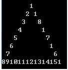
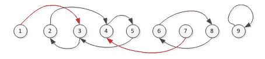

<!--yml
category: 蓝桥杯
date: 2022-04-26 11:23:41
-->

# 2018年第九届C/C++ A组蓝桥杯省赛真题_元气算法的博客-CSDN博客

> 来源：[https://blog.csdn.net/kiwi_berrys/article/details/111463526](https://blog.csdn.net/kiwi_berrys/article/details/111463526)

> 这里是蓝桥杯历年的题目专栏，将会陆续更新将往年真题以及解答发布出来，欢迎各位小伙伴关注我吖，你们的点赞关注就是给我最好的动力！！！
> <font>每天更新一届真题，敬请期待</font>

[蓝桥杯历年真题及详细解答](https://blog.csdn.net/kiwi_berrys/article/details/111186204)

* * *

### 第一题：哪天返回

**题目描述**
小明被不明势力劫持。后莫名其妙被扔到x星站再无问津。小明得知每天都有飞船飞往地球，但需要108元的船票，而他却身无分文。
他决定在x星战打工。好心的老板答应包食宿，第1天给他1元钱。
并且，以后的每一天都比前一天多2元钱，直到他有足够的钱买票。
请计算一下，小明在第几天就能凑够108元，返回地球。

要求提交的是一个整数，表示第几天。请不要提交任何多余的内容。
**题目分析**
**题目代码**

* * *

### 第二题：猴子分香蕉

**题目描述**
5只猴子是好朋友，在海边的椰子树上睡着了。这期间，有商船把一大堆香蕉忘记在沙滩上离去。
第1只猴子醒来，把香蕉均分成5堆，还剩下1个，就吃掉并把自己的一份藏起来继续睡觉。
第2只猴子醒来，重新把香蕉均分成5堆，还剩下2个，就吃掉并把自己的一份藏起来继续睡觉。
第3只猴子醒来，重新把香蕉均分成5堆，还剩下3个，就吃掉并把自己的一份藏起来继续睡觉。
第4只猴子醒来，重新把香蕉均分成5堆，还剩下4个，就吃掉并把自己的一份藏起来继续睡觉。
第5只猴子醒来，重新把香蕉均分成5堆，哈哈，正好不剩！

请计算一开始最少有多少个香蕉。

需要提交的是一个整数，不要填写任何多余的内容。
**题目分析**
**题目代码**

* * *

### 第三题：字母阵列

**题目描述**
仔细寻找，会发现：在下面的8x8的方阵中，隐藏着字母序列：“LANQIAO”。
SLANQIAO
ZOEXCCGB
MOAYWKHI
BCCIPLJQ
SLANQIAO
RSFWFNYA
XIFZVWAL
COAIQNAL

我们约定: 序列可以水平，垂直，或者是斜向；
并且走向不限（实际上就是有一共8种方向）。
上图中一共有4个满足要求的串。

下面有一个更大的（100x100）的字母方阵。
你能算出其中隐藏了多少个“LANQIAO”吗？

```
FOAIQNALWIKEGNICJWAOSXDHTHZPOLGYELORAUHOHCZIERPTOOJUITQJCFNIYYQHSBEABBQZPNGYQTCLSKZFCYWDGOAIADKLSNGJ
GSOZTQKCCSDWGUWAUOZKNILGVNLMCLXQVBJENIHIVLRPVVXXFTHQUXUAVZZOFFJHYLMGTLANQIAOQQILCDCJERJASNCTLYGRMHGF
TSDFYTLVIBHKLJVVJUDMKGJZGNNSTPVLCKTOFMUEUFSVQIAUVHNVFTGBDDARPKYNNCUOYUAZXQJNOEEYKLFRMOEMHUKJTPETHLES
FKVINSLWEVGAGMKVFVIUBMYOIAFHLVNKNTYKTZWVXQWRWIGPENFXYDTKRVPKRTHMGHVYOCLDCKMEKRLGEKBYUCLOLYPAKPFSOREH
KWPUOLOVMOFBIXYACWRDYBINTMPASPCEOKHXQIGBQQMCEOIVULIEOPFSCSIHENAJCVDPJDOIWIIULFDNOZOFVAMCABVGKAKCOZMG
XWMYRTAFGFOCNHLBGNGOXPJSTWLZUNNAGIRETGXFWAQSSJPFTQAXMTQWMZWYVEPQERKSWTSCHSQOOBGXAQTBCHOEGBDVKGWJIFTG
ZWWJEIISPLMXIMGHOOGDRZFTGNDDWDWMNUFWJYJGULPHNUFSAQNNIUVAAFZIAZKFXXNWCEABGJAUMGYEIEFVQXVHHHEDYUITRCQB
XZHDPZQTOBECJVBZLACVXACZEDYOGVAVQRNWEOWGRAQYUEUESTEDQTYJUTEFOOITSHDDZHONJGBRCWNEQLZUTBNQIADKNFIOMWZR
EBFKCVNLURZSNPOLTISRPDTNUMCDGKTYRGIOVEPTUTSBAWQKWWEUWIWHAANUZUADGZEATZOQICWFUJTWNZDBKLQNELWVTBNDLNFH
PESISEATZNCDFRMXBQUKBFTIGYSFCWVHPMSUSDKPSCOMVLDOHYQVFHAJKRDTAVLIMNZBZSMLMRTLRPSLAHXDBASDMWAAYBPYVJZF
SCCWYHLQOUKBMCEYENQNJXFOMOOJMTKDSHJJOHDKEGATFZHGWJJAZJROWHAZUFGEQKPYXLCAAXHHQBDALPYUDWZQHBASBBCFGQCQ
ZKNXUBRYZVSPQHOVLAEUAUITMPWXNXJQVIBJVBCSVXKWFAFRPRWOLYVSDVTGGOFFMNQJZOBUDJLFHJTCYMPNOBHQJHGKLIKLZMLA
POCKVEQXUAVHERIAQLGJHYOOVOMTXQFRTBFSETOZICPCHZHFBWNESVJJLSVSVOOGYYABFESWNWDNYBGBNAKRCFQMTCUMIFTESVIN
JCAULIQRYUMAMAOVVWSEUTMECXSDTONRMMROQUISYEURSAYNZUVOPXLIFBDOHPXMABBLEQZGLJXQJOEYYRRRCFTEZQAOIWKRJQDL
ZNUUDWZXZZURPMHGXQGNQBIQWWNERZWULSAPIBODBFFQQIHEQKCKLJYQNXQUTAAYGRBXSLLQNOQPZJEWHETQHPXJANMJFOHINWOW
KJGAWWFSVIZHFNUWBLWYVPIWAEICCAHOEIWRADSLOZGPSVGPUBUUQAVYCHOIGINKYKJABWAQCZCXOBKTNJZQRHLUFKQLACAAOIWJ
SIKWLXQHKDFJVGBVXWDWJKUSFRQRTDJYQMNFOQQALHRLMHSDMCFLAOVKDMTKMTPVTLAZLYJNJXZCFRHHSDIXYUUSVIMIICLUJHFW
JHWUSMCFYHPIXHAPBBSHYDQCKVGQFTENLVERFVOVDCLSTQFUSEPUMTFODLZLYQXDOXAEPONIQWTDWSAWBNSZYACGSJQSHAUMIKXT
MVBNFXMFNPAYSODPXEAYNRKTEZJWMUACSIUYPIORUFPMXAOZZJPJXPFLNSKNIAMETMOVULZPQIJJIRCSYQXOEVRHCNACSBRHKYNW
KGKBTBHGWKVJYZCOVNSKUREKZEIWVLOHAMUAYKLUGHEUESICBZAHURNTJAECTHRNKSIJQFIPVZANSZYSPJWHPKHCAPEYWNXUYQSD
RRRFYQFIQSWYRQTSNGNUFOBMSLGAFWPJGYEHGASFKTJCCZPXFIQLSXNKNWCYVTETOAPCOZJNHEWOCCAWVDEZUQCLLAVUQJJTQCKJ
NMBKMUENVGXXVMQCLXPJDQIQCFWYADIFDSGINGZDJYHPUPXVRMWDIPJRWPNRYOFGYYPEAVKDEMLYRRRMNCRQXPTDSQIVKKGJWDEF
SBAEKIFZCKDOMIQKBDWVQGBYWPDIBOLQUGAQRXLJDAZMXVZXYSNWEWTNZKYREMBEUHOTFOCKEJSXCMUBCKXNGQXTQJRCRCLWJTOI
YXBFBIBRAAFNPKBLTSMCFERZURZNWHMOEHIHNQTBWXNPJGIDYDPRGEWACCBULJRACOFLANQIAOIHMYCNQHVKXSIGAMWAHUSNBBTD
QDGPTRONXHAZWOUPNBFJFEWAMFZUQZFDKAPNJUBQPWBPYGPZHKUDZZDLCCWHGAUKJCSLLFWGPYJKJQBNLCZESOGXXSQCVVKVRVAW
NXPGQOUEFLUZHHSAODIWEPZLXVQLYGVOOVCCREDJZJOMCSCFFKEIEAVCTPUZOWNOLJHGBJHJFBFFORGXOXXFOCAGBWEFCIDEKDLB
PTXSUINQAJURNFQPMMSPLZTQAHCIOFJUEFFZGIHTSJNIEXQLLHRQUXXLLORJEHGQJOXSLIAVFPEJNGMMVAXDDMPXLOSTRLLFLYRM
JQNCLENGTROIKDWBMXRNJYPGZRQOREPJJPTXKVVKPYYZENEOIQKZOPXAYGFXORXRIDGATHMZFDJIOIOKVDJBHSXQMYCBYFGXWHLH
CITGTILGPGBHZMNWWHXEFPGDPJUVFBJKAQWACZHPRPJYCOLGZTBDCVHNRSUAJUQAWAPMQJDQIFPZQZEONWHIYKMXDZOMVETEFJRB
RDOTIDCFEESOKYPYCGQQKOGPMGJRITSVTKOKDSXLRLJRRHNFRFXCMDNQMCEGZFJWHZOAFBQXXPXNBSWTSUYPAWQRHAUGLNPBRSJT
HOWRIUGMOQTUYIHDWJRFBWWKWYKCICSVBVKTBIIWGFSVIFCTUKIHHUUISCOTEOYRWQXTAEBXQQOLLMOALNIYVCCHNSWIKHMYYNZO
OFRIYYXPPSRTPAYMUJSSDILKIZAYSEIOLANQIAOVKARDPGVFCSYBSNHAPGTIKLAWTTKOEADWRLAACAAFYTBTNSGFTYLYUHJXBMMA
NJFTMLUIBKDPWBXQOMBVQXCZOIREHRSZCSJOIVBXWQIBUTYBQNTZRVROHGOIZYAJWXLEATLOZJIKJMIHSLGSVTCXJWIOOGWSERRQ
DBQJNGBLRIYFIKHBEYOZQBOAGGNIZKFDHWXCFNJLBQXVLHIQNIBZSDLTTRERHNWCMLJCVBBGGAQTPUQHIRABXPQSYGSDVMBNNDFG
KPLFUYXHYGOCZPPXMWCZYNKCYBCRZVKFBHQXPGPBZFTTGEPQTJMOFHAYSQQZDMQECGXOXADYHNNXUKNBXZBYHBOULXNBJZKIZREF
LVHAMSNXJOCVRPVGJUWXFVOCUCLCZDXRPBBDRLRAVVNLOZWOHWMXYSNMXAKJYWYGILNGUJGIPKAUDVANZLFWKUWWUSQYBRCBVDIJ
QCXPLOTPPGXCUZOUSSTXHVMLHVMJTUSSOPLRKEBQSGWNGVHKANVZWYQHSHLIPWSYCPKTUKPMWPLVFLLAHXZQANFXHFNYHIQVIOYN
ZPTJJCBHXPSUPOMNRVCKXSUFCNRCRNCPTPGIDQOEQUDFNUNMJPOEKVIMUJAJZOUKMAFSLDWYMCHTSNJYUDJAHQOIXPYSRHVAFFCR
DCGMEEWXWMNOSSJNIZCINRHENPPPCYVFWYCONOPKXMFZXXIHNXIGAHAMHSBRESOETGVXWDNQLGCEOUDDJXHQIVCHRNKBFFEWILGY
SOAIQNALXRBSGAQIDQVMVDKVZCPMJNXKXRXPFZAUVQPBHHQKTPDSQROLQTUGMFQRWGVEWCYPDYDZGNNNUFKJUEHJKPLIQNRQYXHU
GKGWUCJXUKAEHLRLNDFUQPSJAZTVJRXWXQVBMRJXULEMJJPDCVTOWVFDBVLSBHZRRQUVMUQYKTJCLSGGHGCPHPHMWYAECLJIZUWV
QQNKPQRJMSOCEAYDNKPHVEGKAGCKAPDXTGVXULHUXHJPDXCSKQTCJENVTZTMRUENCSWHBEORALSREBWAJEMQDXMRKGHJGICDHKHY
YNSDSWDRLBBFUFVVICMGUCGBSVDLJNXGKXNFGVLKAVBJRRRUHKRXTPBJAKIEBAVMDIOJLIUDABCGNPNJIYBCXMOOWKRPHPYSWRDC
BORWTNBISSLTVKBRTLWKRNCEDCNEGCIYJIPDICFAVNOISYAHWBLGMNFKXZYTTWJOBEPNMSJEJMHXVPGOJOLQQQVXFGEULANQIAOD
OQETOJHCZXGTUKIWGMEVVMXCURISUOFQSAWZWDMZWVYHZMPEIMWKJDGERODVVUXYRTYLCRGYQQOIOFZSSZRAIESWBQOAIQNALJNR
HEYWHPLLPCUEOCBAOWGAYEJZQJHLVNMVQNSQQGGUBOIMDPFLOVSQGBLYAMBRYJDVOXOQINLJAVYALAKHPKOYNKGXIISSJNGKHYMS
IQVRYKXCUFIRNENEXFJTMOTJWYXSMTDHHPRHWIXETWVVIXZELKLLWRWQYGBCGJNYSUQEFCOUDNIJMLJNLAWSYJGULKBCFPYVSSMW
WQHGWRQFWFOTGPBBSJBDUKOMBXNRPIMCGPGVZFADWTBVIEMVTBXVAFQDDMJALCOMZTXUFFKBQQZDFAMTFWEXTHBKNWRLUVITQXLN
OPPJQKNGHWWPENVQIABJCQNKXNPWOWRFEOKQPQLANQIAORGGOLAYCEGZBHZVLPBERWYIJNJUNXKULUQOJLTNRDZDEYWEMYCHJLLB
LJISOAQLXJEFXVTOZSICOLQIJEXUANJWIFSIMGUQWHBXUDWOEILYFUZTGDZDSPLZPDPXBLFAXLEFQFEPDSJQWEQMXKKHCXHMSATM
UMUJENPBYKZLWAJAXJKDIYCBREBPOETQHMRHLKSEZUIPRGWIZDDQLSJAPKPBWMJMPZWLNFLFCQOCDBMLIHIYCXUJLFLPZVGWBKMY
WHZJLKEWUPETVUREKVKCLBNYFLWCERVIPUDINNWGQTUHWXCTDVTMYATYUZLMVLOHKBOGIZCQDOWFBCWJAVUXYUEVRKPOXCKHAWZC
RPLNLCUHJRADHJNSDPZXIKXGUKEJZCFJQASVUBSNLXCJXVCJZXGMRYRLOBCNGPDUJQVEFKMYHNZGZOAIQNALQDHTBWJXPKJLFXJY
MKCEZEDAFGSOCORWJGMOKWPVVBVDYZDZHPXFWJBDELHPGOQHMBAHUUUJMGXAEKZCTQTBXNVYUIQUVZGXSKQXJWRUPSFIJDYIAORC
GKFKQNXPJWOPPBTUKTHUBIROSYOVFEMJBRREWICJPCIOSTWPAUSKTRQULXPWRSXHSRYBCWYCYOTCTPFSQLDIILIGMEVZKYSOYRPH
SFDSCSMLLNARCCGCBJOGZAEQTGNGSFAQIXLPDBSWZDTYVASYYPVBRFBTIAGGWONGSVKCJDBBLYKAIOXUATGMALZXFOHZFTXALCFU
CUSSTLCRYPDTFSFJFENKJWTEBOBEPLSNXLALQWCKSLVMZQDJITHZKVCCQXTEXOSVAUFYAZXJUOAPPVEEWOIIMOSZZMCOQBRUXWKG
PDOFSCKKJJTRYRWGLEZODQTJSIMXIAOLNMLPHBAYLPTTLPYWILSEIIQVSXNHIJEORVCNJHYXRBIZZJTADGMRTSXVRXYGVQQNUEIC
IHNJOQXUXTXFPALCHOELNVMWDWQTEARUKPIFWXJSMWZLMNLAODUTKNZDYRFRLGBLIBGIBXJBOYMLYLANQIAORORYKSJPOOOAMVRN
IWIUHLYJKTQGVJBDPROSRGZUFITDIBCDPICNEFIGHWGSROWBYKUCLCQYLJXLHLXSCTJWKDLHHMLDBZCVDKPXYYASHUUMUJMVSXAD
GXOYXQFEBFIEJJLHBNGSYALOUXNQBXXZAAZJXENJJVVGFVHOTKSLEGLJVSJCQHSSZFEIOGBOGWSPIRENQAAWRQFBEFEXBKGMSTRC
PYIANSGMNKBCDPHWDUPKICQEUDNZPNGRUJYSZIRLXGXXITAFBCANGDLVAQLDPVTJNSAUZMBBNOBBOERSHQIOLBVTSPPJKVCMXUBS
IKMDIYSNCJZKJKJQMTIKEPRUNAHJUSWJHSLWIVWHYAYLOIOGSZVWKQWXZDBPHWZRAIPMXDJHBIISVJWVEVZAEGAKCYYMNZARBZPC
DLDFVQDFDMVHYVOWEKMFKWUXLTPWIVKPRZZXOLMDAPAIQEKJHCHYAGJDBOFWDGNEGQGOOKWSKLTLREMGGTVJFHAIBCQKNZVRCZYS
FBQASGNCCBBGNKJHCDBTGBIIWKMPHDABKEWDEPYEAVKNMPATUZZUOEHGUGAZNECSGUCIIJPMMRAMTVADMTCRJCBWDLWWFNFOWMVZ
XFJFBGDAVGGAIZHAUIYENDZTRUWHPQUFWCHOXNCWYNAWVPLBLNQKQDTKQQKXNFXCTBGRWUZFHNRBDNLNKQVOLLGBBJQIYOBCEIKO
CURAGWXMLYBSIZLAXFONZZMQMRNNSRQKRHQGFGZUTLONAYRKSSOWAMKZBSGOOYQDPTBHGPBNQEDCZHRTOXREOFJEKJVIZXZBCJPN
KGYBZTZRKOGBETJRUWRNUCIFKIMCZGYTZLCZYGCGKVZRJIFZQIQPTCPPUHYWIXBOFFGSGSAIMNGKKUUROAVNJUQQNSWJRZIZEHAF
DDAOBVCPOVODVJFLSNPJXHWQBHILWZAHQQMTQASNADZLZNXJLJMFCOUWOZJCMVVTYCKTUBABWLCEBNYWAMOLNBQQYBRUJCQCZALE
TVVRPMYFIKINHIUEJBDLTCUMMUWICIUVCZNIQIUEWVAHLANQIAONMEYJWPDAFXVNOSOFDOCESSLGZPTJINBUAFWWWMPTYALZIGVD
DCZGKILMBFXIQQFEKJBIUDEMIFCANVGNYZAYSQFMNNQFEPZFUUVGTBKSMDXITBLANQIAOQUKTPNYPOWSQQYWWMJHSDYVFDJYXBAF
VGYXAMDRRZWVIHNQPZZWRNWBTROOJOLNUGXBILZKQEGIQSYGKZGODPWBJSCMRRWSSQURUFIAFQGEZLGZNOEQMNQEYUKPEQPPVAMO
SYSFUAJFKIPUJVQSZRWQCJYAUMLDDNOKODDXIEQIFLANQIAOZFUNKUBVDBLMJOAUTVCZVLKJRQIORQPGAVCEYVNYUZHXILHERYEC
GJEKWEKIJNIWUXZNVIWIAANHIOSOLATSQFSSCTAKESUTSPPYFHEHLVLIBJZEEBCOWMNHFTZMAPKFUPNFLTFFJQRVJHAKDVMGGUIX
KAKXXNKSOAIQNALLWKWGVACYWBQEVTFSEUCYRORQTHWFUJFLQHONWZEKPLSNPRPBOMOFFCPMKXFZBKIERBKDYFKYUEYVYRPMOAQI
WNICDLQKZXGTKDLIEFBGELGJOAIQNALXZLGGDQIBVEULDPBWUJNTYOKFBPGMAWRRUJPPIGYCNYURNOSQRIRBAZAGWWDUHAAZQWPT
KFXZQXRMKSBUXWOUVVHSJWTLKZELGXMMAIDSJIWGCJPCBWZIEKMNUPUAFHTUMOZKJWVTIAQNOHELEMWGKJHKPNJVSRVHAUFXBUOU
XOWCZJYQLXJRUOOYSKDLDXKWTTJBYBTLKSWRUYPOYTPBGUJXBMRWNELBWADCSZDAEEFGPVRHNNLBFDDXNPDXLKQUSJAZDEUDBMBD
QIKYEKMVUHGGWZDKXFVQQNECZOAWCFUBHQMEPEPKEFSDBAYJQOSGAIHRBRAUKLQRANKMTTIOJDDXAEWTQHIYSGRRMEFTNNWCLZSI
ZFUQAQCSFNVUQMKUQWBWFQIEQVVXPOSVIDTUOBLLTGHQKEMSUWWHWRISLGRDPPQPZBANSGDWXKNYTKMWECPMPDYSCJZXPUKPWGYI
CNGVLBSCBHRLJARWSRENGHYYQDKRATERCPEAOPAJZUMOYIDHVPDMQPKKHCBAMRBGEIEXXJALMCXKPUGXYVINRORFYURXAMOJCBZQ
YJHHAWESCLMDIHVYMLAJZQSYTDEURWYPOLJCAKIKSATGVIALBLWPPKDEGSPMRLDBQNVPPCLQXKUQLQJERMYFGAETUATEBQZUMGUN
NBWUBVXYDFPLPJYLIDFVTVKKGFWMXVINLJUDUPABTSBJAJENZSXIMUJQWPEZTAVDMBBHFYTJKYFXIXQTBTTQIKQXQDPWYNMXRQDJ
OGWLZQUBJJHAQNPVRGHGPNMMJPIDGANYEEDWYPOLKLNEPYSRTQYCJLSWFRJRRGGSNSDHIXYYSNAKKBWQDDGYYMOGPUXQEUSAPSOU
CLLSELRVFZUFYVTJQKCQHNICMERWQFQNPVRPIIYKHZWJYJAFCLNSZXUHSPOZWQUMJHLKKYJENVZOCSWCTPYWIZONUUCLSUROGAYS
AZGNIMXPLPCEPULRRBHHQOBELHJZPUQAMWUASVKDXVEWAOFMAYSJFXHCNEUXUQWUESFBRUFZQLKKWHCHKOPLECCBYSLECAEZIMMI
TUUEOCEBAUKWLTSYJJPLZTIARAOZXKYYWIOXBBTZZCSAULKNEJWVQXIKUWBIWVHGNTHVBAWAVPGLHSDJDLPVHHHUNVSFKXARXLVQ
EMVDFSLANQIAOPTLFLFRKGNUZCTXWCAXHECTZFHWUFENRGQICHTYLSHZWIEGLNVDJZOMTKAAUWOHVOVOCTUKOSINSAYIAEUYORNA
VGPRMLCAQZIPRFQOZMEFTQZYVOTVFNVOIQSJCIPPQXQKJIXICUIGMHAJJMSXENCBQFIJHNZXIQMWACKDKQSEWWKMLOAUPFHAZGRY
SQWQMRSQBGGKYKGWEZYRIHWGNXRPOUMFSFGTYDLUDWPWAVQORTMQUXWKUQVNMDPWQFIZPOIHCJATODRQGZDMQXZVNXXVEJNGWZOM
PVBGZSQPCELDIWDHOQWAUHILGLPYRIICTLFSOYKQZYZOCIZPTECSWOODGGBDTSGIMYGMVPJPRPEVWOOKYFWRGXHWUCRQNYJEMSYL
XWOFXFVDXPTHYTCEGMODCILAHYBREZVVHOUPZKCNHUEVPMKHUBNRPFMWXVQACVZCALZLYMZSBLCEASPMIEFOTGKMPGWYQADSNDPR
QPHAVLZDZLKIEISFLLVWXAVBZLZIJRHGROUVGXRDLUJAXNHBBZYNCVERJGSKLWZEKGJBCWMSMLYIHZFFMIOGVIMZQBSRHQWAADYN
MNXEGTDXCDKIUDOISQXEUJWETPELKBCYFSDNJQWNNBPYMWBUPQBAAINMYZOYCEGNLFNNHZFEMSQVXJJGWBCRAVKZFWFBKMBRVBFD
HKACSZIUWUXLWKFPKOCUQJEPQDZCMUJFLVCLIOQQRVKSWFIAKNHMRLNJTKGVNTGLCVPVMBLJANOBCXUGVWBJYSIXZQVAVFWILWFB
QWNLTPMCYHRSKVHXLONRANWKWXUTHYQLIOFKGDBMSWDRCYRKVSAGGRJMWQYQFLMUIGGCLAUQAACTYLPZEOJBHMWRKHCRXGTGRMUP
CPQKJRBLYDNPUGHCRBVYBAIRVCAWLBWVWCMKNBIRKJOUGYQEBQRHDSTWXDIWGRVMLIJFBWHLHCDAAVUDLZSCGQNOUXVUIVIZZZMD
NMHGYPFUUDWKQGTAKKGCDFJFYJFNRZVXDPGZEAMWQVQZODKTXHIYFVKJSSAWVHYCUCZMLLBPXTILDYJQEMWDRUFKISOUVPUDTYPB
FDAQUBXHUJYTAYNWVIJNUSQDTQDEMUAPWXRYUWONTBDZCHZOUEGPMWEZTQWWSHAYOBWVTDIMZYNVNZKUHOFCQKPHJXWNRCGUJEKO
WSDAUGUTVWCVHEMOIRJJGTANUWTSAIXXEVZTBDHPGSRHHVWCDZVZYRJTLONIJVXEATHQXOUKBIGZONFRSZIOGWNTYAJYLQCGEOWY 
```

请提交一个整数，不要填写任何多余的内容。
**题目分析**
**题目代码**

* * *

### 第四题：第几个幸运数

**题目描述**
到x星球旅行的游客都被发给一个整数，作为游客编号。
x星的国王有个怪癖，他只喜欢数字3,5和7。
国王规定，游客的编号如果只含有因子：3,5,7,就可以获得一份奖品。

我们来看前10个幸运数字是：
3 5 7 9 15 21 25 27 35 45
因而第11个幸运数字是：49

小明领到了一个幸运数字 59084709587505，他去领奖的时候，人家要求他准确地说出这是第几个幸运数字，否则领不到奖品。

请你帮小明计算一下，59084709587505是第几个幸运数字。

需要提交的是一个整数，请不要填写任何多余内容。
**题目分析**
**题目代码**

* * *

### 第五题：书号验证

**题目描述**
2004年起，国际ISBN中心出版了《13位国际标准书号指南》。
原有10位书号前加978作为商品分类标识；校验规则也改变。
校验位的加权算法与10位ISBN的算法不同，具体算法是：
用1分别乘ISBN的前12位中的奇数位（从左边开始数起），用3乘以偶数位，乘积之和以10为模，10与模值的差值再对10取模（即取个位的数字）即可得到校验位的值，其值范围应该为0~9。

下面的程序实现了该算法，请仔细阅读源码，填写缺失的部分。

```
 int f(const char* s)
{
    int k=1;
    int sum = 0;
    int i; 
    for(i=0; s[i]!='\0'; i++){
        char c = s[i];
        if(c=='-' || c==' ') continue;
        sum +=k%2==1?(c-'0')*3:(c-'0') ;  
        k++;
        if(k>12) break; 
    }

    while(s[i]!='\0') i++;

    return (s[i-1]-'0') == (10-sum % 10)%10;
}

int main()
{
    printf("%d\n",f("978-7-301-04815-3"));
    printf("%d\n",f("978-7-115-38821-6"));    
    return 0;
} 
```

**题目分析**
**题目代码**

* * *

### 第六题：稍小分数

**题目描述**
回到小学----
真分数：分子小于分母的分数
既约分数：分子分母互质，也就是说最大公约数是1

x星球数学城的入口验证方式是：
屏幕上显示一个真分数，需要你快速地找到一个比它小的既约分数，要求这个分数越大越好。
同时限定你的这个分数的分母不能超过100。

如下代码很暴力地解决了这个问题，请仔细分析，并填写划线部分缺失的代码。

```
int gcd(int a, int b)
{
    if(b==0) return a;
    return gcd(b,a%b);    
}
int main()
{

    int a = 7;
    int b = 13;

    int m,n;
    int max_a = 0;
    int max_b = 1; 

    for(n=100; n>1; n--){
        for(m=n-1; m>=1; m--){
            if(m*b<a*n && gcd(m,n)==1){
                if( max_a*n<max_b*m){  
                    max_a = m;
                    max_b = n;
                    break;
                }
            }
        }
    }

    printf("%d/%d\n", max_a, max_b);    
    return 0;
} 
```

**题目分析**
**题目代码**

* * *

### 第七题：次数差

**题目描述**
x星球有26只球队，分别用a~z的26个字母代表。他们总是不停地比赛。
在某一赛段，哪个球队获胜了，就记录下代表它的字母，这样就形成一个长长的串。
国王总是询问：获胜次数最多的和获胜次数最少的有多大差距？（当然，他不关心那些一次也没获胜的，认为他们在怠工罢了）

输入，一个串，表示球队获胜情况（保证串的长度<1000）

要求输出一个数字，表示出现次数最多的字母比出现次数最少的字母多了多少次。

比如：
输入：
abaabcaa

则程序应该输出：
4

解释：a出现5次，最多；c出现1次，最少。5-1=4

再比如：
输入：
bbccccddaaaacccc

程序应该输出：
6

资源约定：
峰值内存消耗（含虚拟机） < 256M
CPU消耗 < 1000ms

**题目分析**
**题目代码**

* * *

### 第八题：等腰三角形

**题目描述**
本题目要求你在控制台输出一个由数字组成的等腰三角形。
具体的步骤是：

1.  先用1,2,3，…的自然数拼一个足够长的串
2.  用这个串填充三角形的三条边。从上方顶点开始，逆时针填充。
    比如，当三角形高度是8时：

```
 1
      2 1
     3   8
    4     1
   5       7
  6         1
 7           6
891011121314151 
```

显示不正确时，参看：p1.png

输入，一个正整数n(3<n<300),表示三角形的高度
输出，用数字填充的等腰三角形。

为了便于测评，我们要求空格一律用"."代替。

例如：
输入：
5

程序应该输出：

```
....1
...2 1
..3   2
.4     1
567891011 
```

再例如：
输入：
10

程序应该输出：

```
.........1
........2.2
.......3...2
......4.....2
.....5.......1
....6.........2
...7...........0
..8.............2
.9...............9
1011121314151617181 
```

再例如：
输入：
15

程序应该输出：

```
..............1
.............2.3
............3...2
...........4.....3
..........5.......1
.........6.........3
........7...........0
.......8.............3
......9...............9
.....1.................2
....0...................8
...1.....................2
..1.......................7
.1.........................2
21314151617181920212223242526 
```

资源约定：
峰值内存消耗（含虚拟机） < 256M
CPU消耗 < 1000ms

**题目分析**
**题目代码**

* * *

### 第九题：小朋友崇拜圈

**题目描述**
班里N个小朋友，每个人都有自己最崇拜的一个小朋友（也可以是自己）。
在一个游戏中，需要小朋友坐一个圈，
每个小朋友都有自己最崇拜的小朋友在他的右手边。
求满足条件的圈最大多少人？

小朋友编号为1,2,3,…N
输入第一行，一个整数N（3<N<100000）
接下来一行N个整数，由空格分开。

要求输出一个整数，表示满足条件的最大圈的人数。

例如：
输入：
9
3 4 2 5 3 8 4 6 9

则程序应该输出：
4

解释：
如图p1.png所示，崇拜关系用箭头表示，红色表示不在圈中。
显然，最大圈是[2 4 5 3] 构成的圈

再例如：
输入：
30
22 28 16 6 27 21 30 1 29 10 9 14 24 11 7 2 8 5 26 4 12 3 25 18 20 19 23 17 13 15

程序应该输出：
16
资源约定：
峰值内存消耗（含虚拟机） < 256M
CPU消耗 < 1000ms

**题目分析**
**题目代码**

* * *

### 第十题：耐摔指数

**题目描述**
x星球的居民脾气不太好，但好在他们生气的时候唯一的异常举动是：摔手机。
各大厂商也就纷纷推出各种耐摔型手机。x星球的质监局规定了手机必须经过耐摔测试，并且评定出一个耐摔指数来，之后才允许上市流通。

x星球有很多高耸入云的高塔，刚好可以用来做耐摔测试。塔的每一层高度都是一样的，与地球上稍有不同的是，他们的第一层不是地面，而是相当于我们的2楼。

如果手机从第7层扔下去没摔坏，但第8层摔坏了，则手机耐摔指数=7。
特别地，如果手机从第1层扔下去就坏了，则耐摔指数=0。
如果到了塔的最高层第n层扔没摔坏，则耐摔指数=n

为了减少测试次数，从每个厂家抽样3部手机参加测试。

如果已知了测试塔的高度，并且采用最佳策略，在最坏的运气下最多需要测试多少次才能确定手机的耐摔指数呢？

输入数据，一个整数n（3<n<10000）,表示测试塔的高度。
输出一个整数，表示最多测试多少次。

例如：
输入：
3

程序应该输出：
2

解释：
手机a从2楼扔下去，坏了，就把b手机从1楼扔；否则a手机继续3层扔下

再例如：
输入：
7

程序应该输出：
3

解释：
a手机从4层扔，坏了，则下面有3层，b,c 两部手机2次足可以测出指数；
若是没坏，手机充足，上面5,6,7 三层2次也容易测出。

资源约定：
峰值内存消耗（含虚拟机） < 256M
CPU消耗 < 1000ms
**题目分析**
**题目代码**

* * *