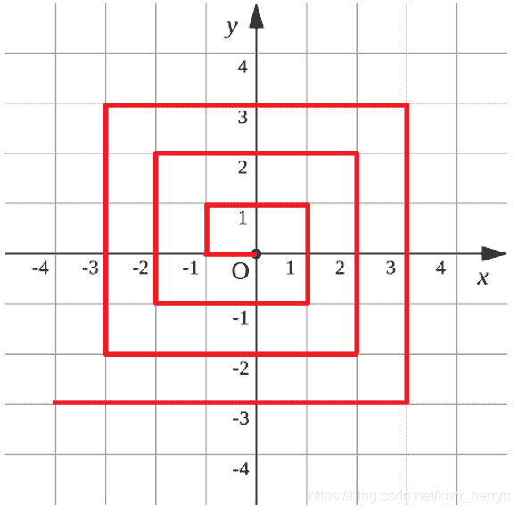

<!--yml
category: 蓝桥杯
date: 2022-04-26 11:23:58
-->

# 2018年第九届C/C++ B组蓝桥杯省赛真题_元气算法的博客-CSDN博客_第九届蓝桥杯c语言b组真题

> 来源：[https://blog.csdn.net/kiwi_berrys/article/details/111258808](https://blog.csdn.net/kiwi_berrys/article/details/111258808)

> 这里是蓝桥杯历年的题目专栏，将会陆续更新将往年真题以及解答发布出来，欢迎各位小伙伴关注我吖，你们的点赞关注就是给我最好的动力！！！
> <font>每天更新一届真题，敬请期待</font>

[蓝桥杯历年真题及详细解答](https://blog.csdn.net/kiwi_berrys/article/details/111186204)

* * *

### 第一题：第几天

**题目描述**
2000年的1月1日，是那一年的第1天。
那么，2000年的5月4日，是那一年的第几天？
注意：需要提交的是一个整数，不要填写任何多余内容。

**题目分析**
直接手算吧，历届蓝桥杯算日期中最简单的一道题
**题目代码**

```
#include<iostream>

using namespace std;
int main()
{

	int ans = 31+29+31+30+4;
	cout << ans <<endl;
	return 0; 
} 
```

**题目答案**

```
125 
```

* * *

### 第二题：明码

**题目描述**
汉字的字形存在于字库中，即便在今天，16点阵的字库也仍然使用广泛。
16点阵的字库把每个汉字看成是16x16个像素信息。并把这些信息记录在字节中。

一个字节可以存储8位信息，用32个字节就可以存一个汉字的字形了。
把每个字节转为2进制表示，1表示墨迹，0表示底色。每行2个字节，
一共16行，布局是：

第1字节，第2字节
第3字节，第4字节
…
第31字节, 第32字节

这道题目是给你一段多个汉字组成的信息，每个汉字用32个字节表示，这里给出了字节作为有符号整数的值。

题目的要求隐藏在这些信息中。你的任务是复原这些汉字的字形，从中看出题目的要求，并根据要求填写答案。

这段信息是（一共10个汉字）：
4 0 4 0 4 0 4 32 -1 -16 4 32 4 32 4 32 4 32 4 32 8 32 8 32 16 34 16 34 32 30 -64 0
16 64 16 64 34 68 127 126 66 -124 67 4 66 4 66 -124 126 100 66 36 66 4 66 4 66 4 126 4 66 40 0 16
4 0 4 0 4 0 4 32 -1 -16 4 32 4 32 4 32 4 32 4 32 8 32 8 32 16 34 16 34 32 30 -64 0
0 -128 64 -128 48 -128 17 8 1 -4 2 8 8 80 16 64 32 64 -32 64 32 -96 32 -96 33 16 34 8 36 14 40 4
4 0 3 0 1 0 0 4 -1 -2 4 0 4 16 7 -8 4 16 4 16 4 16 8 16 8 16 16 16 32 -96 64 64
16 64 20 72 62 -4 73 32 5 16 1 0 63 -8 1 0 -1 -2 0 64 0 80 63 -8 8 64 4 64 1 64 0 -128
0 16 63 -8 1 0 1 0 1 0 1 4 -1 -2 1 0 1 0 1 0 1 0 1 0 1 0 1 0 5 0 2 0
2 0 2 0 7 -16 8 32 24 64 37 -128 2 -128 12 -128 113 -4 2 8 12 16 18 32 33 -64 1 0 14 0 112 0
1 0 1 0 1 0 9 32 9 16 17 12 17 4 33 16 65 16 1 32 1 64 0 -128 1 0 2 0 12 0 112 0
0 0 0 0 7 -16 24 24 48 12 56 12 0 56 0 -32 0 -64 0 -128 0 0 0 0 1 -128 3 -64 1 -128 0 0

注意：需要提交的是一个整数，不要填写任何多余内容。

**题目分析**
这里要用到C++库里的bitset库，将整形转化成字节行，然后输出就可以
**题目代码**

```
#include<iostream>
#include<bitset>
using namespace std;

int main()
{
	int a,b;
	for(int i = 0; i < 10; i++)
	{
		for(int j = 0; j < 16; j++)
		{
			cin >> a >> b;
			bitset<8> x(a),y(b);
			cout << x.to_string()<<y.to_string()<<endl;
		}
		cout << endl<<endl;
	}
	long long int ans;
	ans = pow(9,9);
	cout<<ans<<endl; 
} 
```

**题目答案**

```
 387420489 
```

* * *

### 第三题：乘积尾零

**题目描述**
如下的10行数据，每行有10个整数，请你求出它们的乘积的末尾有多少个零？

5650 4542 3554 473 946 4114 3871 9073 90 4329
2758 7949 6113 5659 5245 7432 3051 4434 6704 3594
9937 1173 6866 3397 4759 7557 3070 2287 1453 9899
1486 5722 3135 1170 4014 5510 5120 729 2880 9019
2049 698 4582 4346 4427 646 9742 7340 1230 7683
5693 7015 6887 7381 4172 4341 2909 2027 7355 5649
6701 6645 1671 5978 2704 9926 295 3125 3878 6785
2066 4247 4800 1578 6652 4616 1113 6205 3264 2915
3966 5291 2904 1285 2193 1428 2265 8730 9436 7074
689 5510 8243 6114 337 4096 8199 7313 3685 211

注意：需要提交的是一个整数，表示末尾零的个数。不要填写任何多余内容。
**题目分析**
这里10由可以由 2 和 5相乘得到，所以只要计算每个数中2和5的个数就行，最后最小个数的构成零的个数
**题目代码**

```
#include<iostream>
#include<algorithm>
using namespace std;

int main()
{
	int num5 = 0,num2 = 0,x;
	for(int i = 0; i < 100; i++)
	{
		cin >> x;
		if(x==0)
		{
			cout << "0" <<endl;
			return 0;
		}
		while(1)
		{
			if(x%5==0)
			{
				num5++;
				x/=5;
			}
			else if(x%2==0)
			{
				num2++;
				x/=2;
			}
			else
			{
				break;
			}

		}
	}
	cout << min(num5,num2) << endl;
	return 0;

} 
```

**题目答案**

```
31 
```

* * *

### 第四题：测试次数

**题目描述**
x星球的居民脾气不太好，但好在他们生气的时候唯一的异常举动是：摔手机。
各大厂商也就纷纷推出各种耐摔型手机。x星球的质监局规定了手机必须经过耐摔测试，并且评定出一个耐摔指数来，之后才允许上市流通。

x星球有很多高耸入云的高塔，刚好可以用来做耐摔测试。塔的每一层高度都是一样的，与地球上稍有不同的是，他们的第一层不是地面，而是相当于我们的2楼。

如果手机从第7层扔下去没摔坏，但第8层摔坏了，则手机耐摔指数=7。
特别地，如果手机从第1层扔下去就坏了，则耐摔指数=0。
如果到了塔的最高层第n层扔没摔坏，则耐摔指数=n

为了减少测试次数，从每个厂家抽样3部手机参加测试。

某次测试的塔高为1000层，如果我们总是采用最佳策略，在最坏的运气下最多需要测试多少次才能确定手机的耐摔指数呢？

请填写这个最多测试次数。

注意：需要填写的是一个整数，不要填写任何多余内容。

**题目分析**
使用DP算法，将层数分区，构建局部最优解，具体看[参考解析](https://www.jianshu.com/p/3f56a77ab96e)
**题目代码**

```
#include<stdio.h> 

#define Max(a,b) (a>b?a:b)

#define Min(a,b) (a<b?a:b)

int dp[1002][5];

int main(){

	for(int i =1; i <=1000; i++){

		dp[i][1] = i;

	}

	for(int cnt =2; cnt <=3; cnt++){

		for(int ind =1; ind <=1000; ind++){

			dp[ind][cnt] =dp[ind-1][cnt] +1;

			for(int k =2; k <= ind; k++){

				dp[ind][cnt] =Min(dp[ind][cnt],1+Max(dp[k-1][cnt-1],dp[ind-k][cnt]));

			}

		}

	}

	printf("%d\n",dp[1000][3]);

	return 0;

} 
```

**题目答案**

```
19 
```

* * *

### 第五题：快速排序

**题目描述**
以下代码可以从数组a[]中找出第k小的元素。
它使用了类似快速排序中的分治算法，期望时间复杂度是O(N)的。
请仔细阅读分析源码，填写划线部分缺失的内容。

```
#include <stdio.h>

int quick_select(int a[], int l, int r, int k) {
	int p = rand() % (r - l + 1) + l;
	int x = a[p];
	{int t = a[p]; a[p] = a[r]; a[r] = t;}
	int i = l, j = r;
	while(i < j) {
		while(i < j && a[i] < x) i++;
		if(i < j) {
			a[j] = a[i];
			j--;
		}
		while(i < j && a[j] > x) j--;
		if(i < j) {
			a[i] = a[j];
			i++;
		}
	}
	a[i] = x;
	p = i;
	if(i - l + 1 == k) return a[i];
	if(i - l + 1 < k) return quick_select( _____________________________ ); 
	else return quick_select(a, l, i - 1, k);
}

int main()
{
	int a[] = {1, 4, 2, 8, 5, 7, 23, 58, 16, 27, 55, 13, 26, 24, 12};
	printf("%d\n", quick_select(a, 0, 14, 5));
	return 0;
} 
```

**题目分析**
快速排序，作为一种经典算法，必学滴，没学的话去问问数据结构老师吧，这里大概讲一下，就是每次选择一个数，然后做比较使得左边的数小于所选择的数，右边的数大于所选择的数。然后将左右两边在进行快速排序
**题目代码**

**题目答案**

```
 a, i+1, r, k-(i-l+1) 
```

* * *

### 第六题：递增三元组

**题目描述**
给定三个整数数组
A = [A1, A2, … AN],
B = [B1, B2, … BN],
C = [C1, C2, … CN]，
请你统计有多少个三元组(i, j, k) 满足：

1.  1 <= i, j, k <= N
2.  Ai < Bj < Ck

【输入格式】
第一行包含一个整数N。
第二行包含N个整数A1, A2, … AN。
第三行包含N个整数B1, B2, … BN。
第四行包含N个整数C1, C2, … CN。

对于30%的数据，1 <= N <= 100
对于60%的数据，1 <= N <= 1000
对于100%的数据，1 <= N <= 100000 0 <= Ai, Bi, Ci <= 100000

【输出格式】
一个整数表示答案

【样例输入】
3
1 1 1
2 2 2
3 3 3

【样例输出】
27

资源约定：
峰值内存消耗（含虚拟机） < 256M
CPU消耗 < 1000ms

**题目分析**
**题目代码**

* * *

### 第七题：螺旋折线

**题目描述**
如图p1.png所示的螺旋折线经过平面上所有整点恰好一次。
对于整点(X, Y)，我们定义它到原点的距离dis(X, Y)是从原点到(X, Y)的螺旋折线段的长度。
例如dis(0, 1)=3, dis(-2, -1)=9
给出整点坐标(X, Y)，你能计算出dis(X, Y)吗？


【输入格式】
X和Y

对于40%的数据，-1000 <= X, Y <= 1000
对于70%的数据，-100000 <= X， Y <= 100000
对于100%的数据, -1000000000 <= X, Y <= 1000000000

【输出格式】
输出dis(X, Y)

【样例输入】
0 1

【样例输出】
3

资源约定：
峰值内存消耗（含虚拟机） < 256M
CPU消耗 < 1000ms

**题目分析**
**题目代码**

* * *

### 第八题：日志统计

**题目描述**
小明维护着一个程序员论坛。现在他收集了一份"点赞"日志，日志共有N行。其中每一行的格式是：

ts id

表示在ts时刻编号id的帖子收到一个"赞"。
现在小明想统计有哪些帖子曾经是"热帖"。如果一个帖子曾在任意一个长度为D的时间段内收到不少于K个赞，小明就认为这个帖子曾是"热帖"。
具体来说，如果存在某个时刻T满足该帖在[T, T+D)这段时间内(注意是左闭右开区间)收到不少于K个赞，该帖就曾是"热帖"。
给定日志，请你帮助小明统计出所有曾是"热帖"的帖子编号。

【输入格式】
第一行包含三个整数N、D和K。
以下N行每行一条日志，包含两个整数ts和id。
对于50%的数据，1 <= K <= N <= 1000
对于100%的数据，1 <= K <= N <= 100000 0 <= ts <= 100000 0 <= id <= 100000
【输出格式】
按从小到大的顺序输出热帖id。每个id一行。
【输入样例】
7 10 2
0 1
0 10
10 10
10 1
9 1
100 3
100 3
【输出样例】
1
3
资源约定：
峰值内存消耗（含虚拟机） < 256M
CPU消耗 < 1000ms

**题目分析**
**题目代码**

* * *

### 第九题：全球变暖

**题目描述**
你有一张某海域NxN像素的照片，".“表示海洋、”#"表示陆地，如下所示：

…
.##…
.##…
…##.
…####.
…###.
…

其中"上下左右"四个方向上连在一起的一片陆地组成一座岛屿。例如上图就有2座岛屿。

由于全球变暖导致了海面上升，科学家预测未来几十年，岛屿边缘一个像素的范围会被海水淹没。具体来说如果一块陆地像素与海洋相邻(上下左右四个相邻像素中有海洋)，它就会被淹没。

例如上图中的海域未来会变成如下样子：

```
.......
.......
.......
.......
....#..
.......
.......

```

请你计算：依照科学家的预测，照片中有多少岛屿会被完全淹没。

【输入格式】
第一行包含一个整数N。 (1 <= N <= 1000)
以下N行N列代表一张海域照片。

照片保证第1行、第1列、第N行、第N列的像素都是海洋。

【输出格式】
一个整数表示答案。

【输入样例】
7

```
.......
.##....
.##....
....##.
..####.
...###.
.......  

```

【输出样例】
1

资源约定：
峰值内存消耗（含虚拟机） < 256M
CPU消耗 < 1000ms

**题目分析**
**题目代码**

* * *

### 第十题：乘积最大

**题目描述**
给定N个整数A1, A2, … AN。请你从中选出K个数，使其乘积最大。
请你求出最大的乘积，由于乘积可能超出整型范围，你只需输出乘积除以1000000009的余数。
注意，如果X<0， 我们定义X除以1000000009的余数是负(-X)除以1000000009的余数。
即：0-((0-x) % 1000000009)

【输入格式】
第一行包含两个整数N和K。
以下N行每行一个整数Ai。

对于40%的数据，1 <= K <= N <= 100
对于60%的数据，1 <= K <= 1000
对于100%的数据，1 <= K <= N <= 100000 -100000 <= Ai <= 100000
【输出格式】
一个整数，表示答案。
【输入样例】
5 3
-100000
-10000
2
100000
10000
【输出样例】
999100009
再例如：
【输入样例】
5 3
-100000
-100000
-2
-100000
-100000
【输出样例】
-999999829
资源约定：
峰值内存消耗（含虚拟机） < 256M
CPU消耗 < 1000ms

**题目分析**
**题目代码**