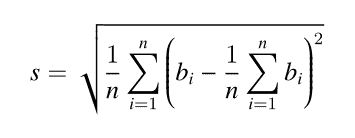

<!--yml
category: 蓝桥杯
date: 2022-04-26 11:07:00
-->

# 2018年第九届蓝桥杯省赛试题及详解（Java本科A组）_跟老程一起学编程的博客-CSDN博客

> 来源：[https://blog.csdn.net/future277809183/article/details/122848184](https://blog.csdn.net/future277809183/article/details/122848184)

**[【蓝桥杯】历年真题题目及题解汇总](https://blog.csdn.net/future277809183/article/details/122826573 "【蓝桥杯】历年真题题目及题解汇总")**

* * *

1.  结果填空 (满分5分)
2.  结果填空 (满分7分)
3.  结果填空 (满分9分)
4.  结果填空 (满分13分)
5.  代码填空 (满分11分)
6.  程序设计（满分17分）
7.  程序设计（满分19分）
8.  程序设计（满分21分）
9.  程序设计（满分23分）
10.  程序设计（满分25分）

* * *

**第一题：分数**

1/1 + 1/2 + 1/4 + 1/8 + 1/16 + …
每项是前一项的一半，如果一共有20项,
求这个和是多少，结果用分数表示出来。
类似：
3/2
当然，这只是加了前2项而已。分子分母要求互质。

注意：
需要提交的是已经约分过的分数，中间任何位置不能含有空格。
请不要填写任何多余的文字或符号

**答案=1048575/524288**

```
public class Main {
    public static void main(String[] args) {
        System.out.println((long)(Math.pow(2, 20)-1)+"/"+(long)Math.pow(2, 19));
    }
} 
```

## **第二题：星期一**

整个20世纪（1901年1月1日至2000年12月31日之间），一共有多少个星期一？
(不要告诉我你不知道今天是星期几)

注意：需要提交的只是一个整数，不要填写任何多余的内容或说明文字

**答案=5217**

```
public class Main {
    static int day(int y){
        return (y%4==0&&y%100!=0||y%400==0)?366:365;
    }
    public static void main(String[] args) {
        int sum=0;
        for(int i=1901;i<2001;i++){
            sum+=day(i);
        }
        System.out.println(sum/7);
    }
} 
```

## **第三题：复数幂**

设i为虚数单位。对于任意正整数n，(2+3i)^n 的实部和虚部都是整数。
求 (2+3i)^123456 等于多少？ 即(2+3i)的123456次幂，这个数字很大，要求精确表示。

答案写成 “实部±虚部i” 的形式，实部和虚部都是整数（不能用科学计数法表示），中间任何地方都不加空格，实部为正时前面不加正号。(2+3i)^2 写成: -5+12i，
(2+3i)^5 的写成: 122-597i

注意：需要提交的是一个很庞大的复数，不要填写任何多余内容

```
import java.io.File;
import java.io.PrintStream;
import java.math.BigInteger;

public class Main {
	public static void main(String[] args) throws Exception {
		BigInteger two = BigInteger.valueOf(2);
		BigInteger three = BigInteger.valueOf(3);
		BigInteger a = BigInteger.valueOf(2);
		BigInteger b = BigInteger.valueOf(3);
		BigInteger aa = null;
		BigInteger bb = null;
		for (int i = 0; i < 123455; i++) {
			aa = a.multiply(two).subtract(b.multiply(three)); // a*2-(b*3)
			bb = a.multiply(three).add(b.multiply(two));
			a = aa;
			b = bb;
		}
		System.setOut(new PrintStream(new File("D:\\out.txt")));
		System.out.println(aa + (bb.compareTo(BigInteger.ZERO) > 0 ? "-" : "+") + bb + "i");
	}
}
```

## **第四题：方格计数**

如图p1.png所示，在二维平面上有无数个1x1的小方格。


p1.png

我们以某个小方格的一个顶点为圆心画一个半径为1000的圆。
你能计算出这个圆里有多少个完整的小方格吗？ 

注意：需要提交的是一个整数，不要填写任何多余内容

```
 public class Main {
	public static void main(String[] args) {
		int count = 0;
		for (int x = 0; x <= 1000; x++) {
			for (int y = 0; y <= 1000; y++) {
				if ((x + 1) * (x + 1) + (y + 1) * (y + 1) <= 1000 * 1000) {
					count++;
				}
			}
		}
		System.out.println(count * 4);
	}
}
```

## **第五题：打印图形**

如下的程序会在控制台绘制分形图（就是整体与局部自相似的图形）。

当n=1,2,3的时候，输出如下：
请仔细分析程序，并填写划线部分缺少的代码。

n=1时：


n=2时：


n=3时：


源程序

```
public class Main
{
	static void show(byte[][] buf){
		for(int i=0; i<buf.length; i++){
			for(int j=0; j<buf[i].length; j++){
				System.out.print(buf[i][j]==0? ' ' : 'o');
			}
			System.out.println();
		}
	}

	static void draw(byte[][] buf, int x, int y, int size){
		if(size==1){
			buf[y][x] = 1;
			return;
		}

		int n = ________________________ ;  // 填空
		draw(buf, x, y, n);
		draw(buf, x-n, y ,n);
		draw(buf, x+n, y ,n);
		draw(buf, x, y-n ,n);
		draw(buf, x, y+n ,n);
	}

	public static void main(String[] args){
		final int N = 3;
		int t = 1;
		for(int i=0; i<N; i++) t *= 3;

		byte[][] buf = new byte[t][t];
		draw(buf, t/2, t/2, t);
		show(buf);
	}
} 
```

## **答案=size/3**

## **第六题：航班时间**

【问题背景】
小h前往美国参加了蓝桥杯国际赛。小h的女朋友发现小h上午十点出发，上午十二点到达美国，于是感叹到“现在飞机飞得真快，两小时就能到美国了”。

小h对超音速飞行感到十分恐惧。仔细观察后发现飞机的起降时间都是当地时间。由于北京和美国东部有12小时时差，故飞机总共需要14小时的飞行时间。

不久后小h的女朋友去中东交换。小h并不知道中东与北京的时差。但是小h得到了女朋友来回航班的起降时间。小h想知道女朋友的航班飞行时间是多少。

【问题描述】
对于一个可能跨时区的航班，给定来回程的起降时间。假设飞机来回飞行时间相同，求飞机的飞行时间。

【输入格式】
从标准输入读入数据。

一个输入包含多组数据。

输入第一行为一个正整数T，表示输入数据组数。

每组数据包含两行，第一行为去程的 起降 时间，第二行为回程的 起降 时间。

起降时间的格式如下

h1:m1:s1 h2:m2:s2
或
h1:m1:s1 h3:m3:s3 (+1)
或
h1:m1:s1 h4:m4:s4 (+2)
表示该航班在当地时间h1时m1分s1秒起飞，

第一种格式表示在当地时间 当日 h2时m2分s2秒降落

第二种格式表示在当地时间 次日 h3时m3分s3秒降落。

第三种格式表示在当地时间 第三天 h4时m4分s4秒降落。

对于此题目中的所有以 h: m:s 形式给出的时间, 保证 ( 0<=h<=23, 0<=m,s<=59 ).

【输出格式】
输出到标准输出。

对于每一组数据输出一行一个时间hh:mm:ss，表示飞行时间为hh小时mm分ss秒。

注意，当时间为一位数时，要补齐前导零。如三小时四分五秒应写为03:04:05。

【样例输入】
3
17:48:19 21:57:24
11:05:18 15:14:23
17:21:07 00:31:46 (+1)
23:02:41 16:13:20 (+1)
10:19:19 20:41:24
22:19:04 16:41:09 (+1)

【样例输出】
04:09:05
12:10:39
14:22:05

【限制与约定】
保证输入时间合法，飞行时间不超过24小时

```
import java.util.*;

public class Main {
    public static void main(String[] args) {
        Scanner sc=new Scanner(System.in);
        int t=sc.nextInt();
        sc.nextLine();
        int val[]={60*60,60,1};
        while(t-->0){
            String to=sc.nextLine();
            String qd_to[]=to.split(" ");
            String to_qf[]=qd_to[0].split(":");
            String to_dd[]=qd_to[1].split(":");
            int t1_qf=Integer.valueOf(to_qf[0])*val[0]+Integer.valueOf(to_qf[1])*val[1]+Integer.valueOf(to_qf[2])*val[2];
            int t1_dd=Integer.valueOf(to_dd[0])*val[0]+Integer.valueOf(to_dd[1])*val[1]+Integer.valueOf(to_dd[2])*val[2];
            int t1=t1_dd-t1_qf;
            if(qd_to.length==3){
                t1+=Integer.valueOf(qd_to[2].substring(2, 3))*24*60*60;
            }
            String come=sc.nextLine();
            String qd_come[]=come.split(" ");
            String come_qf[]=qd_come[0].split(":");
            String come_dd[]=qd_come[1].split(":");
            int t2_qf=Integer.valueOf(come_qf[0])*val[0]+Integer.valueOf(come_qf[1])*val[1]+Integer.valueOf(come_qf[2])*val[2];
            int t2_dd=Integer.valueOf(come_dd[0])*val[0]+Integer.valueOf(come_dd[1])*val[1]+Integer.valueOf(come_dd[2])*val[2];
            int t2=t2_dd-t2_qf;
            if(qd_come.length==3){
                t2+=Integer.valueOf(qd_come[2].substring(2, 3))*24*60*60;
            }
            int time=(t1+t2)/2;

            int dd=time/(24*60*60),hh=(time%(24*60*60))/(60*60),mm=(time%(60*60))/60,ss=time%60;
            System.out.println((hh<10?"0"+hh:hh)+":"+(mm<10?"0"+mm:mm)+":"+(ss<10?"0"+ss:ss)+(dd!=0?" (+"+dd+")":""));

        }
    }

} 
```

## **第七题：三体攻击**

三体人将对地球发起攻击。为了抵御攻击，地球人派出了 A × B × C 艘战舰，在太空中排成一个 A 层 B 行 C 列的立方体。其中，第 i 层第 j 行第 k 列的战舰（记为战舰 (i, j, k)）的生命值为 d(i, j, k)。

三体人将会对地球发起 m 轮“立方体攻击”，每次攻击会对一个小立方体中的所有战舰都造成相同的伤害。具体地，第 t 轮攻击用 7 个参数 lat, rat, lbt, rbt, lct, rct, ht 描述；
所有满足 i ∈ [lat, rat],j ∈ [lbt, rbt],k ∈ [lct, rct] 的战舰 (i, j, k) 会受到 ht 的伤害。如果一个战舰累计受到的总伤害超过其防御力，那么这个战舰会爆炸。

地球指挥官希望你能告诉他，第一艘爆炸的战舰是在哪一轮攻击后爆炸的。

【输入格式】
从标准输入读入数据。
第一行包括 4 个正整数 A, B, C, m；
第二行包含 A × B × C 个整数，其中第 ((i − 1)×B + (j − 1)) × C + (k − 1)+1 个数为 d(i, j, k)；
第 3 到第 m + 2 行中，第 (t − 2) 行包含 7 个正整数 lat, rat, lbt, rbt, lct, rct, ht。

【输出格式】
输出到标准输出。
输出第一个爆炸的战舰是在哪一轮攻击后爆炸的。保证一定存在这样的战舰。

【样例输入】

2 2 2 3
1 1 1 1 1 1 1 1
1 2 1 2 1 1 1
1 1 1 2 1 2 1
1 1 1 1 1 1 2

【样例输出】

2

【样例解释】
在第 2 轮攻击后，战舰 (1,1,1) 总共受到了 2 点伤害，超出其防御力导致爆炸。

【数据约定】
对于 10% 的数据，B = C = 1；
对于 20% 的数据，C = 1；
对于 40% 的数据，A × B × C, m ≤ 10, 000；
对于 70% 的数据，A, B, C ≤ 200；
对于所有数据，A × B × C ≤ 10^6, m ≤ 10^6, 0 ≤ d(i, j, k), ht ≤ 10^9。

```
import java.util.Scanner;

public class Main {

	public static void main(String[] args) {
		Scanner input = new Scanner(System.in);
		int a, b, c, m;
		a = input.nextInt();
		b = input.nextInt();
		c = input.nextInt();
		m = input.nextInt();
		int[][][] martix = new int[a + 1][b + 1][c + 1];

		for (int i = 1; i <= a; ++i)
			for (int j = 1; j <= b; ++j)
				for (int k = 1; k <= c; ++k)
					martix[i][j][k] = input.nextInt();

		int lat, rat, lbt, rbt, lct, rct, ht;
		int flag = 0;
		for (int p = 1; p <= m; ++p) {
			lat = input.nextInt();
			rat = input.nextInt();
			lbt = input.nextInt();
			rbt = input.nextInt();
			lct = input.nextInt();
			rct = input.nextInt();
			ht = input.nextInt();
			for (int i = lat; i <= rat; ++i)
				for (int j = lbt; j <= rbt; ++j)
					for (int k = lct; k <= rct; ++k) {
						martix[i][j][k] -= ht;
						if (martix[i][j][k] < 0) {
							flag = p;
							break;
						}
					}

			if (flag != 0)
				break;
		}
		System.out.println(flag);
	}
} 
```

## **第八题：全球变暖**

你有一张某海域NxN像素的照片，".“表示海洋、”#"表示陆地，如下所示

```
.......
.##....
.##....
....##.
..####.
...###.
.......
```

其中"上下左右"四个方向上连在一起的一片陆地组成一座岛屿。例如上图就有2座岛屿。

由于全球变暖导致了海面上升，科学家预测未来几十年，岛屿边缘一个像素的范围会被海水淹没。具体来说如果一块陆地像素与海洋相邻(上下左右四个相邻像素中有海洋)，它就会被淹没。

例如上图中的海域未来会变成如下样子：

```
.......
.......
.......
.......
....#..
.......
....... 
```

请你计算：依照科学家的预测，照片中有多少岛屿会被完全淹没。

【输入格式】
第一行包含一个整数N。 (1 <= N <= 1000)
以下N行N列代表一张海域照片。

照片保证第1行、第1列、第N行、第N列的像素都是海洋。

【输出格式】
一个整数表示答案。

【输入样例】

```
7
.......
.##....
.##....
....##.
..####.
...###.
.......
```

【输出样例】

1
1
资源约定：
峰值内存消耗（含虚拟机） < 256M
CPU消耗 < 1000ms

```
import java.util.*;

public class Main {
//  public static String[] strArray = new String[1010];
    public static char[][] ca = new char[1010][1010];
    public static int n;
    public static int[] dx = { -1, 1, 0, 0 };
    public static int[] dy = { 0, 0, -1, 1 };
    public static int[][] overWhelm = new int[1010][1010];// 判断该陆地是否会被淹没，1表示会被淹没，大于1的数表示剩下的小岛
    public static int[][] v = new int[1010][1010];// 判断该陆地是否已经搜索过
    public static long num = 0;// 所有小岛数
    public static Queue<Node> que = new LinkedList<>();

    public static void BFS() {
//      for (int i = 0; i < n; i++) {
//          ca[i] = strArray[i].toCharArray();
//      }
        int d_num = 2;// 用来表示不同的小岛
        for (int i = 0; i < n; i++) {
            for (int j = 0; j < n; j++) {
                if (ca[i][j] == '#' && v[i][j] == 0) {
                    Node node = new Node(i, j);
                    que.add(node);
                    v[i][j] = 1;
                    while (!que.isEmpty()) {
                        Node tempNode = que.remove();
                        check(tempNode.coordX, tempNode.coordY, d_num);
                        for (int k = 0; k < 4; k++) {
                            int tempx = tempNode.coordX + dx[k];
                            int tempy = tempNode.coordY + dy[k];
                            if (tempx >= 0 && tempy >= 0 && tempx < n && tempy < n) {
                                if (ca[tempx][tempy] == '.') {// 上下左右存在海洋，会被淹没
                                    continue;
                                }
                                if (ca[tempx][tempy] == '#' && v[tempx][tempy] == 0) {
                                    que.add(new Node(tempx, tempy));
                                    v[tempx][tempy] = 1;
                                }
                            }
                        }

                    }
                    num++;
                    d_num++;
                }
            }
        }
    }

    // 判断上下左右是否有海洋
    public static void check(int tempx, int tempy, int d_num) {
        for (int k = 0; k < 4; k++) {
            int tax = tempx + dx[k];
            int tay = tempy + dy[k];
            // 边界之外全是海洋
            if (tax < 0 || tay < 0 || tax >= n || tay >= n) {
                overWhelm[tempx][tempy] = 1;
                break;
            }
            if (ca[tax][tay] == '.') {
                overWhelm[tempx][tempy] = 1;
                break;
            }
            overWhelm[tempx][tempy] = d_num;
        }
    }

    public static void main(String[] args) {
        Scanner in = new Scanner(System.in);
        n = in.nextInt();
        for (int i = 0; i < n; i++)
//          strArray[i] = in.next();
            ca[i]=in.next().toCharArray();
        BFS();// 广搜
        Set<Integer> set = new HashSet<>();// 存放的是未被淹没的小岛
        for (int i = 0; i < n; i++)
            for (int j = 0; j < n; j++)
                if (overWhelm[i][j] > 1)
                    set.add(overWhelm[i][j]);
        System.out.println(num - (long) set.size());
    }
    static class Node {
        int coordX;
        int coordY;

        Node(int x, int y) {
            coordX = x;
            coordY = y;
        }
    }
} 
```

## **第九题：倍数问题**

众所周知，小葱同学擅长计算，尤其擅长计算一个数是否是另外一个数的倍数。但小葱只擅长两个数的情况，当有很多个数之后就会比较苦恼。现在小葱给了你 n 个数，希望你从这 n 个数中找到三个数，使得这三个数的和是 K 的倍数，且这个和最大。数据保证一定有解。

【输入格式】
从标准输入读入数据。
第一行包括 2 个正整数 n, K。
第二行 n 个正整数，代表给定的 n 个数。

【输出格式】
输出到标准输出。
输出一行一个整数代表所求的和。

【样例输入】
4 3
1 2 3 4

【样例输出】
9

【样例解释】
选择2、3、4。

【数据约定】
对于 30% 的数据，n <= 100。
对于 60% 的数据，n <= 1000。
对于另外 20% 的数据，K <= 10。
对于 100% 的数据，1 <= n <= 10^5, 1 <= K <= 10^3，给定的 n 个数均不超过 10^8。

资源约定：
峰值内存消耗（含虚拟机） < 256M
CPU消耗  < 1000ms

请严格按要求输出，不要画蛇添足地打印类似：“请您输入...” 的多余内容。

所有代码放在同一个源文件中，调试通过后，拷贝提交该源码。
不要使用package语句。不要使用jdk1.7及以上版本的特性。
主类的名字必须是：Main，否则按无效代码处理

```
 import java.util.Arrays;
import java.util.Scanner;

/**
 * 从小到大排序，然后搜索枚举
 */
public class Main {
    static int n, K ;
    static int [] a ;
    static int [] c ;
    static int [] b ;
    static boolean flag = false ;
    public static void main(String[] args) {
        Scanner input = new Scanner(System.in) ;
        n = input.nextInt() ;
        K = input.nextInt() ;
        a = new int [n+1] ;
        c = new int [n+1] ;
        b = new int [4] ;
        c[0] = Integer.MAX_VALUE ;
        for(int i=1; i<=n; i++){
            a[i] = input.nextInt() ;
        }
        Arrays.sort(a) ;
        for(int i=1; i<=n; i++){
            c[i] = a[n-i+1] ;
        }
        dfs(c, n, 1) ;
    }

    private static void dfs(int[] c, int n, int s) {
        if(flag){
            return ;
        }
        if(s==4){
            int sum = b[1] + b[2] + b[3] ;
            if(sum%K==0){
                System.out.println(sum);
                flag = true ;
            }
            return ;
        }
        for(int i=1; i<=n; i++){
            if(c[i]<c[s-1]){
                b[s] = c[i] ;
                dfs(c, n, s+1) ;
            }
        }
    }
} 
```

# 第十题：付账问题

几个人一起出去吃饭是常有的事。但在结帐的时候，常常会出现一些争执。

现在有 n 个人出去吃饭，他们总共消费了 S 元。其中第 i 个人带了 ai 元。幸运的是，所有人带的钱的总数是足够付账的，但现在问题来了：每个人分别要出多少钱呢？

为了公平起见，我们希望在总付钱量恰好为 S 的前提下，最后每个人付的钱的标准差最小。这里我们约定，每个人支付的钱数可以是任意非负实数，即可以不是1分钱的整数倍。你需要输出最小的标准差是多少。

标准差的介绍：标准差是多个数与它们平均数差值的平方平均数，一般用于刻画这些数之间的“偏差有多大”。形式化地说，设第 i 个人付的钱为 bi 元，那么标准差为 : [参见p1.png]

【输入格式】
从标准输入读入数据。
第一行包含两个整数 n、S；
第二行包含 n 个非负整数 a1, ..., an。

【输出格式】
输出到标准输出。
输出最小的标准差，四舍五入保留 4 位小数。
保证正确答案在加上或减去 10^−9 后不会导致四舍五入的结果发生变化。

【样例输入】
5 2333
666 666 666 666 666

【样例输出】
0.0000

【样例解释】
每个人都出 2333/5 元，标准差为 0。

再比如：
【样例输入】
10 30
2 1 4 7 4 8 3 6 4 7

【样例输出】
0.7928

【数据约定】
对于 10% 的数据，所有 ai 相等；
对于 30% 的数据，所有非 0 的 ai 相等；
对于 60% 的数据，n ≤ 1000；
对于 80% 的数据，n ≤ 10^5；
对于所有数据，n ≤ 5 × 10^5, 0 ≤ ai ≤ 10^9。

资源约定：
峰值内存消耗（含虚拟机） < 256M
CPU消耗  < 1000ms

请严格按要求输出，不要画蛇添足地打印类似：“请您输入...” 的多余内容。

所有代码放在同一个源文件中，调试通过后，拷贝提交该源码。
不要使用package语句。不要使用jdk1.7及以上版本的特性。
主类的名字必须是：Main，否则按无效代码处理。



```
import java.util.Arrays;
import java.util.Scanner;

public class Main {
    static double  S, ave, avg = 0, s=0;
    static int n ;
    static double [] a ;
    public static void main(String[] args) {
        Scanner input = new Scanner(System.in) ;
        n = input.nextInt() ;
        S = input.nextDouble() ;
        a = new double[n] ;
        for(int i=0; i<n; i++){
            a[i] = input.nextDouble() ;
        }
        avg = S / n ;
        ave = avg ;
        Arrays.sort(a) ;
        for(int i=0; i<n; i++){
            if(ave > a[i]){
                S -= a[i] ;
                s += (avg-a[i]) * (avg-a[i]) ;
                ave= S / (n-i-1) ;
            }else{
                double avg1 = S / (n-i) ;
                s += (avg-avg1)*(avg-avg1)*(n-i) ;
                break ;
            }
        }
        System.out.printf("%.4f", Math.sqrt(s/n));
    }
} 
```