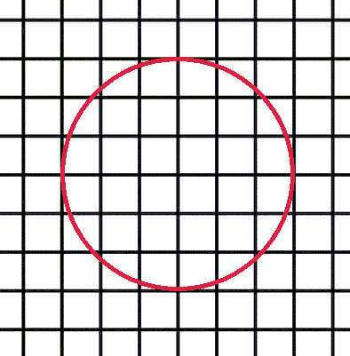

<!--yml
category: 蓝桥杯
date: 2022-04-26 11:07:12
-->

# 2018年第九届蓝桥杯省赛试题及详解（Java本科B组）_跟老程一起学编程的博客-CSDN博客

> 来源：[https://blog.csdn.net/future277809183/article/details/122828821](https://blog.csdn.net/future277809183/article/details/122828821)

1.  结果填空 (满分5分)
2.  结果填空 (满分7分)
3.  结果填空 (满分13分)
4.  结果填空 (满分17分)
5.  代码填空 (满分9分)
6.  程序设计（满分11分）
7.  程序设计（满分19分）
8.  程序设计（满分21分）
9.  程序设计（满分23分）
10.  程序设计（满分25分）

* * *

## 第一题：第几天

2000年的1月1日，是那一年的第1天。
那么，2000年的5月4日，是那一年的第几天？

注意：需要提交的是一个整数，不要填写任何多余内容。

```
【答案】：125

【解析】：31 + 29 + 31 + 30 + 4 == 125
```

## 第二题：方格计数

如图p1.png所示，在二维平面上有无数个1x1的小方格。



p1.png

我们以某个小方格的一个顶点为圆心画一个半径为1000的圆。
你能计算出这个圆里有多少个完整的小方格吗？ 

注意：需要提交的是一个整数，不要填写任何多余内容。

```
 public class Main {
	public static void main(String[] args) {
		int count = 0;
		for (int x = 0; x <= 1000; x++) {
			for (int y = 0; y <= 1000; y++) {
				if ((x + 1) * (x + 1) + (y + 1) * (y + 1) <= 1000 * 1000) {
					count++;
				}
			}
		}
		System.out.println(count * 4);
	}
}
```

## 第三题：复数幂

设i为虚数单位。对于任意正整数n，(2+3i)^n 的实部和虚部都是整数。
求 (2+3i)^123456 等于多少？ 即(2+3i)的123456次幂，这个数字很大，要求精确表示。

答案写成 "实部±虚部i" 的形式，实部和虚部都是整数（不能用科学计数法表示），中间任何地方都不加空格，实部为正时前面不加正号。(2+3i)^2 写成: -5+12i，
(2+3i)^5 的写成: 122-597i

注意：需要提交的是一个很庞大的复数，不要填写任何多余内容。

```
import java.io.File;
import java.io.PrintStream;
import java.math.BigInteger;

public class Main {
	public static void main(String[] args) throws Exception {
		BigInteger two = BigInteger.valueOf(2);
		BigInteger three = BigInteger.valueOf(3);
		BigInteger a = BigInteger.valueOf(2);
		BigInteger b = BigInteger.valueOf(3);
		BigInteger aa = null;
		BigInteger bb = null;
		for (int i = 0; i < 123455; i++) {
			aa = a.multiply(two).subtract(b.multiply(three)); // a*2-(b*3)
			bb = a.multiply(three).add(b.multiply(two));
			a = aa;
			b = bb;
		}
		System.setOut(new PrintStream(new File("D:\\out.txt")));
		System.out.println(aa + (bb.compareTo(BigInteger.ZERO) > 0 ? "-" : "+") + bb + "i");
	}
}
```

## 第四题：测试次数

x星球的居民脾气不太好，但好在他们生气的时候唯一的异常举动是：摔手机。
各大厂商也就纷纷推出各种耐摔型手机。x星球的质监局规定了手机必须经过耐摔测试，并且评定出一个耐摔指数来，之后才允许上市流通。

x星球有很多高耸入云的高塔，刚好可以用来做耐摔测试。塔的每一层高度都是一样的，与地球上稍有不同的是，他们的第一层不是地面，而是相当于我们的2楼。

如果手机从第7层扔下去没摔坏，但第8层摔坏了，则手机耐摔指数=7。
特别地，如果手机从第1层扔下去就坏了，则耐摔指数=0。
如果到了塔的最高层第n层扔没摔坏，则耐摔指数=n

为了减少测试次数，从每个厂家抽样3部手机参加测试。

某次测试的塔高为1000层，如果我们总是采用最佳策略，在最坏的运气下最多需要测试多少次才能确定手机的耐摔指数呢？

请填写这个最多测试次数。

注意：需要填写的是一个整数，不要填写任何多余内容。
**答案:19**

```
public class Main { 
	public static void main(String[] args) {
		int[][] d = new int[1001][4]; // 有j个鸡蛋测试i层楼需要扔几次
		for (int i = 1; i <= 1000; i++) {
			d[i][1] = i; // 1个鸡蛋扔i次可以测试i层楼
		}
		for (int i = 1; i <= 1000; i++) {
			int min = Integer.MAX_VALUE;
			for (int j = 1; j <= i; j++) {
				min = Math.min(min, Math.max(j, d[i - j][2] + 1));
			}
			d[i][2] = min;
		}
		for (int i = 1; i <= 1000; i++) {
			int min = Integer.MAX_VALUE;
			for (int j = 1; j <= i; j++) {
				min = Math.min(min, Math.max(d[j - 1][2] + 1, d[i - j][3] + 1));
			}
			d[i][3] = min;
		}
		System.out.println(d[1000][3]);
	}
}
```

## 第五题：快速排序

以下代码可以从数组a[]中找出第k小的元素。  

它使用了类似快速排序中的分治算法，期望时间复杂度是O(N)的。

请仔细阅读分析源码，填写划线部分缺失的内容。

import java.util.Random;
public class Main{undefined
    public static int quickSelect(int a[], int l, int r, int k) {undefined
        Random rand = new Random();
        int p = rand.nextInt(r - l + 1) + l;
        int x = a[p];
        int tmp = a[p]; a[p] = a[r]; a[r] = tmp;
        int i = l, j = r;
        while(i < j) {undefined
                    while(i < j && a[i] < x) i++;
                    if(i < j) {undefined
                            a[j] = a[i];
                            j--;
                    }
                    while(i < j && a[j] > x) j--;
                    if(i < j) {undefined
                            a[i] = a[j];
                            i++;
                    }
            }
            a[i] = x;
            p = i;
            if(i - l + 1 == k) return a[i];
            if(i - l + 1 < k) return quickSelect( _________________________________ ); //填空
            else return quickSelect(a, l, i - 1, k);    
    }
    public static void main(String args[]) {undefined
        int [] a = {1, 4, 2, 8, 5, 7};
        System.out.println(quickSelect(a, 0, 5, 4));
    }
}

注意：只提交划线部分缺少的代码，不要抄写任何已经存在的代码或符号

```
【答案】：a, i + 1, r, k - (i - l + 1)
```

## 第六题：递增三元组

给定三个整数数组
A = [A1, A2, ... AN], 
B = [B1, B2, ... BN], 
C = [C1, C2, ... CN]，
请你统计有多少个三元组(i, j, k) 满足：

1\. 1 <= i, j, k <= N  
2\. Ai < Bj < Ck  

【输入格式】
第一行包含一个整数N。
第二行包含N个整数A1, A2, ... AN。
第三行包含N个整数B1, B2, ... BN。
第四行包含N个整数C1, C2, ... CN。

对于30%的数据，1 <= N <= 100  
对于60%的数据，1 <= N <= 1000 
对于100%的数据，1 <= N <= 100000 0 <= Ai, Bi, Ci <= 100000 

【输出格式】
一个整数表示答案

【输入样例】
3
1 1 1
2 2 2
3 3 3

【输出样例】
27 

资源约定：
峰值内存消耗（含虚拟机） < 256M
CPU消耗  < 1000ms

请严格按要求输出，不要画蛇添足地打印类似：“请您输入...” 的多余内容。
所有代码放在同一个源文件中，调试通过后，拷贝提交该源码。
不要使用package语句。不要使用jdk1.7及以上版本的特性。
主类的名字必须是：Main，否则按无效代码处理

```
import java.util.Arrays;
import java.util.Scanner;

public class Main {
	public static void main(String[] args) {
		Scanner sc = new Scanner(System.in);
		int n = sc.nextInt();

		int a[] = new int[n];
		for (int i = 0; i < n; i++) {
			a[i] = sc.nextInt();
		}
		Arrays.parallelSort(a);

		int b[] = new int[n];
		for (int i = 0; i < n; i++) {
			b[i] = sc.nextInt();
		}
		Arrays.parallelSort(b);

		int c[] = new int[n];
		for (int i = 0; i < n; i++) {
			c[i] = sc.nextInt();
		}
		Arrays.parallelSort(c);

		int ans = 0;
		for (int i = 0; i < n; i++) {
			for (int j = 0; j < n; j++) {
				for (int k = 0; k < n; k++) {
					if (a[i] < b[j] && b[j] < c[k])
						ans++;
				}
			}
		}
		System.out.println(ans);
	}
}
```

## 第七题：螺旋折线

如图p1.pgn所示的螺旋折线经过平面上所有整点恰好一次。  
对于整点(X, Y)，我们定义它到原点的距离dis(X, Y)是从原点到(X, Y)的螺旋折线段的长度。

  

例如dis(0, 1)=3, dis(-2, -1)=9  

给出整点坐标(X, Y)，你能计算出dis(X, Y)吗？

【输入格式】
X和Y 

对于40%的数据，-1000 <= X, Y <= 1000  
对于70%的数据，-100000 <= X， Y <= 100000  
对于100%的数据, -1000000000 <= X, Y <= 1000000000  

【输出格式】
输出dis(X, Y)  

【输入样例】
0 1

【输出样例】

3

资源约定：
峰值内存消耗（含虚拟机） < 256M
CPU消耗  < 1000ms

请严格按要求输出，不要画蛇添足地打印类似：“请您输入...” 的多余内容。

所有代码放在同一个源文件中，调试通过后，拷贝提交该源码。
不要使用package语句。不要使用jdk1.7及以上版本的特性。

主类的名字必须是：Main，否则按无效代码处理

```
import java.io.FileNotFoundException;
import java.util.Scanner;

public class Main {
	// 以 右下角 对角线上的点 为 参照点，测算给定的点到参照点要走的距离
	public static void main(String[] args) throws FileNotFoundException {
		Scanner sc = new Scanner(System.in);
		long X = sc.nextLong(), Y = sc.nextLong();
		long d = 0; // 距离
		long n = 0; // 第几圈
		if (Y > 0 && Math.abs(X) <= Y) { // 点在上面的横线上
			n = Y; // 等差数列有多少项? Y项
			d = (Y - X) + (2 * Y); // X的最大值是Y,第一、四象限的距离---2Y
		} else if (X > 0 && Math.abs(Y) <= X) { // 点在最右边的横线上
			n = X;
			d = Y + X;
		} else if (Y <= 0 && X >= Y - 1 && X <= -Y) { // 点在最下边的横线上
			n = -Y;
			d = -(-Y - X);
		} else if (X < 0 && Y >= X + 1 && Y <= -X) { // 点在最左边的横线上
			n = -X - 1;
			d = -(Y - X - 1 - 2 * X - 1);
		}
		System.out.println(sum(1L, 2 * n, 1) * 2 - d);
	}

	/**
	 * 等差数列求和
	 * 
	 * @param a0 首项
	 * @param n  项数
	 * @param d  公差
	 * @return
	 */
	private static long sum(long a0, long n, int d) {
		return (2 * a0 + (n - 1) * d) * n / 2;
	}
}
```

## 第八题：日志统计

小明维护着一个程序员论坛。现在他收集了一份"点赞"日志，日志共有N行。其中每一行的格式是：

ts id  

表示在ts时刻编号id的帖子收到一个"赞"。  

现在小明想统计有哪些帖子曾经是"热帖"。如果一个帖子曾在任意一个长度为D的时间段内收到不少于K个赞，小明就认为这个帖子曾是"热帖"。  

具体来说，如果存在某个时刻T满足该帖在[T, T+D)这段时间内(注意是左闭右开区间)收到不少于K个赞，该帖就曾是"热帖"。  

给定日志，请你帮助小明统计出所有曾是"热帖"的帖子编号。  

【输入格式】
第一行包含三个整数N、D和K。  
以下N行每行一条日志，包含两个整数ts和id。  

对于50%的数据，1 <= K <= N <= 1000  
对于100%的数据，1 <= K <= N <= 100000 0 <= ts <= 100000 0 <= id <= 100000  

【输出格式】
按从小到大的顺序输出热帖id。每个id一行。  

【输入样例】
7 10 2  
0 1  
0 10    
10 10  
10 1  
9 1
100 3  
100 3  

【输出样例】
1  
3  

资源约定：
峰值内存消耗（含虚拟机） < 256M
CPU消耗  < 1000ms

请严格按要求输出，不要画蛇添足地打印类似：“请您输入...” 的多余内容。

所有代码放在同一个源文件中，调试通过后，拷贝提交该源码。
不要使用package语句。不要使用jdk1.7及以上版本的特性。

主类的名字必须是：Main，否则按无效代码处理。

```
import java.io.FileInputStream;
import java.io.FileNotFoundException;
import java.io.PrintStream;
import java.util.Arrays;
import java.util.Comparator;
import java.util.HashMap;
import java.util.Map;
import java.util.Scanner;
import java.util.SortedSet;
import java.util.TreeSet;

public class Main {
	// 存日志数据, ts-td分别是时刻及id,组合成对象, 存储在R中
	static class R { // 定义内部类
		int ts, td;// 时刻及id
	}

	public static void main(String[] args) throws FileNotFoundException {

		Scanner sc = new Scanner(System.in);
		int N = sc.nextInt(), D = sc.nextInt(), K = sc.nextInt();
		R[] rs = new R[N];
		for (int i = 0; i < N; i++) {// 读取日志数据
			R r = new R();
			r.ts = sc.nextInt();
			r.td = sc.nextInt();
			rs[i] = r;
		}
		// 匿名内部类 定义 排序器   自定义 比较器
		Arrays.sort(rs, new Comparator<R>() {
			// 按照时刻ts对一个记录R做升序排序
			@Override
			public int compare(R r1, R r2) {
				return r1.ts - r2.ts;
			}
		});

		// cnt: 用于给id计数 记录id及其出现的次数
		Map<Integer, Integer> cnt = new HashMap<Integer, Integer>();

		// answers: 用于存储答案(各个id), 因为要求答案输出有序, 这里直接用TreeSet
		SortedSet<Integer> answers = new TreeSet<Integer>();

		// 尺取法【通常是：双指针】
		int j = 0;// 移动哨兵---用于探测的指针
		for (int i = 0; i < N; ++i) {// i: 尺取法的起点---头部
			// 循环条件: i指向的时刻-i指向的时刻 < D
			while (j < N && rs[j].ts - rs[i].ts < D) {
				int td = rs[j].td;
				Integer exist = cnt.get(td);
				// 每一次循环,都要统计id,计数
				if (exist != null) {
					cnt.put(td, exist + 1);
				} else {
					cnt.put(td, 1);// id第一次出现
				}
				// 判断id数是否 >= K【判断是否满足条件】id放入answers中
				if (cnt.get(td) >= K) {
					answers.add(td);
				}
				j++;
			}
			// (马上i就要更新了)将上一个i对应的id的计数-1
			// 上一个区间, td的计数要扣除, 不干扰下一个区间的统计
			Integer cntOfI = cnt.get(rs[i].td);
			if (cntOfI != null) {
				cnt.put(rs[i].td, cntOfI - 1);
			}
		}
		// 输出答案---输出各个id
		for (Integer i : answers) {
			System.out.println(i);
		}
	}
}
```

## 第九题：全球变暖

你有一张某海域NxN像素的照片，"."表示海洋、"#"表示陆地，如下所示：

.......
.##....
.##....
....##.
..####.
...###.
.......

其中"上下左右"四个方向上连在一起的一片陆地组成一座岛屿。例如上图就有2座岛屿。  

由于全球变暖导致了海面上升，科学家预测未来几十年，岛屿边缘一个像素的范围会被海水淹没。具体来说如果一块陆地像素与海洋相邻(上下左右四个相邻像素中有海洋)，它就会被淹没。  

例如上图中的海域未来会变成如下样子：

.......
.......
.......
.......
....#..
.......
.......

请你计算：依照科学家的预测，照片中有多少岛屿会被完全淹没。  

【输入格式】
第一行包含一个整数N。  (1 <= N <= 1000)  
以下N行N列代表一张海域照片。  

照片保证第1行、第1列、第N行、第N列的像素都是海洋。  

【输出格式】
一个整数表示答案。

【输入样例】
7 
.......
.##....
.##....
....##.
..####.
...###.
.......  

【输出样例】
1  

资源约定：
峰值内存消耗（含虚拟机） < 256M
CPU消耗  < 1000ms

请严格按要求输出，不要画蛇添足地打印类似：“请您输入...” 的多余内容。

所有代码放在同一个源文件中，调试通过后，拷贝提交该源码。
不要使用package语句。不要使用jdk1.7及以上版本的特性。
主类的名字必须是：Main，否则按无效代码处理。

```
import java.io.File;
import java.io.FileInputStream;
import java.io.FileNotFoundException;
import java.io.PrintStream;
import java.util.LinkedList;
import java.util.Queue;
import java.util.Scanner;

public class Main {
	static int[] dx = { -1, 1, 0, 0 }; // 四个方向 预定义数组
	static int[] dy = { 0, 0, -1, 1 }; // 四个方向

	private static int N;        // 数据规模
	private static char[][] g;   // 地图数据
	private static int[][] mark; // 标记数组 标记每个格子是否被访问

	private static int ans; // 结果：被完全淹没的岛屿数量

	// 自定义Point类型，存储一个格子的横纵坐标
	private static class Point {
		int x, y;
		public Point(int x, int y) {
			this.x = x;
			this.y = y;
		}
	}

	public static void main(String[] args) throws FileNotFoundException {
        // System.setIn(new FileInputStream(new File(("E:\\in9.txt"))));
		Scanner sc = new Scanner(System.in);
		N = sc.nextInt();
		sc.nextLine(); // 读取换行符

		// 初始化地图数据与标记数组
		g = new char[N][N];
		mark = new int[N][N];

		// 读取地图数据
		for (int i = 0; i < N; i++) {
			g[i] = sc.nextLine().toCharArray();
		}
		// 双循环检验#，从#开始宽度优先搜索
		// 双重循环检验地图上的各个格子,以未被访问的#为起点,做宽搜
		for (int i = 0; i < N; i++) {
			for (int j = 0; j < N; j++) {
				if (g[i][j] == '#' && mark[i][j] == 0) {
					bfs(i, j); // 做标记 访问过的格子不再被访问
				}
			}
		}
		System.out.println(ans);
	}

	private static void bfs(int x, int y) {
		mark[x][y] = 1;     // 标记 格子 为 已访问
		int cntOfBlock = 0; // 记录#陆地的数量
		int cntOfSwed = 0;  // 记录和.相邻的#的数量 将被淹没的陆地的数量
		Queue<Point> queue = new LinkedList<Point>();// 新建队列
		queue.add(new Point(x, y)); // 将当前格子封装到point，插入队列
		while (!queue.isEmpty()) {
			Point first = queue.poll(); // 弹出头部
			cntOfBlock++;
			boolean swed = false; // 标记弹出的#四周是否有.
			// 探测四周
			for (int d = 0; d < 4; d++) {
				int nx = first.x + dx[d];
				int ny = first.y + dy[d];
				if (0 <= nx && nx < N && 0 <= ny && ny < N) {
					if (g[nx][ny] == '.') {
						swed = true; // 周边有一个.这块陆地就会被淹没，避免重复计数
					}
					if (g[nx][ny] == '#' && mark[nx][ny] == 0) { // 且‘#’没有被访问
						queue.add(new Point(nx, ny));
						mark[nx][ny] = 1;
					}
				}
			}
			// 陆地数量 与 被淹没陆地数量 相同,ans++
			if (swed) {
				cntOfSwed++;
			}
		}
		// 一个连通块就被访问完了, 块中#的数量记录在cnt1, 周边有.的#的数量记录在cnt2
		if (cntOfBlock == cntOfSwed) {
			ans++;
		}
	}
}
```

## 第十题：堆的计数

我们知道包含N个元素的堆可以看成是一棵包含N个节点的完全二叉树。  
每个节点有一个权值。对于小根堆来说，父节点的权值一定小于其子节点的权值。  

假设N个节点的权值分别是1~N，你能求出一共有多少种不同的小根堆吗？  

例如对于N=4有如下3种：

    1
   / \
  2   3
 /
4

    1
   / \
  3   2
 /
4

    1
   / \
  2   4
 /
3

由于数量可能超过整型范围，你只需要输出结果除以1000000009的余数。  

【输入格式】
一个整数N。  
对于40%的数据，1 <= N <= 1000  
对于70%的数据，1 <= N <= 10000  
对于100%的数据，1 <= N <= 100000

【输出格式】
一个整数表示答案。  

【输入样例】
4  

【输出样例】
3

资源约定：
峰值内存消耗（含虚拟机） < 256M
CPU消耗  < 1000ms

请严格按要求输出，不要画蛇添足地打印类似：“请您输入...” 的多余内容。

所有代码放在同一个源文件中，调试通过后，拷贝提交该源码。
不要使用package语句。不要使用jdk1.7及以上版本的特性。
主类的名字必须是：Main，否则按无效代码处理。

```
import java.util.Scanner;

public class Main {
	static final int MOD = 1000000009;
	public static int N;
	static int[] size; // 记录每个节点的size
	static long[] jie; // 记录1~N的阶乘
	static long[] ni;  // 记录1~N的阶乘的逆元（关于MOD）

	public static void main(String[] args) {
		Scanner sc = new Scanner(System.in);
		N = sc.nextInt();
		size = new int[N + 1];
		jie = new long[N + 1];
		ni = new long[N + 1];
		initSize();
		initJie();
		System.out.println(dp());
	}

	private static long dp() {
		long[] d = new long[N + 1]; // d[i]表示的是i号节点作为根，小根堆的种数
		for (int x = N; x >= 1; x--) {
			if (2 * x + 1 <= N)
				d[x] = c(size[x] - 1, size[2 * x]) * d[2 * x] % MOD * d[2 * x + 1] % MOD;
			else if (2 * x <= N)
				d[x] = c(size[x] - 1, size[2 * x]) * d[2 * x] % MOD;
			else
				d[x] = 1;
		}
		return d[1];
	}

	private static void initJie() {
		jie[0] = 1;
		ni[0] = 1;
		for (int i = 1; i <= N; i++) {
			jie[i] = jie[i - 1] * i % MOD;
			ni[i] = pow(jie[i], MOD - 2);
		}
	}

	/**
	 * 快速求a的n次方
	 * 
	 * @param a
	 * @param n
	 * @return
	 */
	private static long pow(long a, int n) {
		if (a == 0)
			return 0;
		long ans = 1;
		long x = a;
		while (n > 0) {
			if ((n & 1) == 1)
				ans = ans * x % MOD;
			n >>= 1;
			x = x * x % MOD;
		}
		return ans;
	}

	static long c(int n, int r) {
		return jie[n] * ni[r] % MOD * ni[n - r] % MOD;
	}

	private static void initSize() {
		for (int i = N; i >= 1; i--) {
			size[i] = (2 * i <= N ? size[2 * i] : 0) + (2 * i + 1 <= N ? size[2 * i + 1] : 0) + 1;
		}
	}
}
```