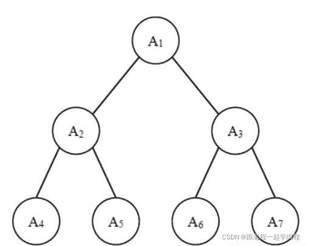
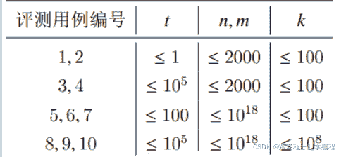

<!--yml
category: 蓝桥杯
date: 2022-04-26 11:06:59
-->

# 2019年第十届蓝桥杯省赛试题及详解（Java本科A组）_跟老程一起学编程的博客-CSDN博客_蓝桥杯java省赛真题

> 来源：[https://blog.csdn.net/future277809183/article/details/122848738](https://blog.csdn.net/future277809183/article/details/122848738)

[【蓝桥杯】历年真题题目及题解汇总](https://blog.csdn.net/future277809183/article/details/122826573 "【蓝桥杯】历年真题题目及题解汇总")

* * *

1.  结果填空 (满分5分)
2.  结果填空 (满分5分)
3.  结果填空 (满分10分)
4.  结果填空 (满分10分)
5.  结果填空 (满分15分)
6.  程序设计（满分15分）
7.  程序设计（满分20分）
8.  程序设计（满分20分）
9.  程序设计（满分25分）
10.  程序设计（满分25分）

* * *

## **第一题：平方和**

【问题描述】

小明对数位中含有 2、0、1、9 的数字很感兴趣，在 1 到 40 中这样的数包 括 1、2、9、10 至 32、39 和 40，共 28 个，他们的和是 574，平方和是 14362。 注意，平方和是指将每个数分别平方后求和。

请问，在 1 到 2019 中，所有这样的数的平方和是多少?
**答案：2658417853**

```
public class Main{
   public  static  boolean hasChar(String s){
        char[] chars=s.toCharArray();
        for (int i = 0; i <chars.length ; i++) {
            if(chars[i]=='2'||chars[i]=='0'||chars[i]=='1'||chars[i]=='9'){
                return true;
            }
        }
        return false;
    }
    public static void main(String[] args) {
        BigInteger res=new BigInteger("0");
        for (int i = 1; i <= 2019; i++) {
            String s=String.valueOf(i);
            if(hasChar(s)){
                BigInteger temp=new BigInteger(s);
                res=res.add(temp.multiply(temp));
            }

        }
        System.out.println(res);
    }
}
```

## **第二题：数列求值**

【问题描述】

给定数列 1, 1, 1, 3, 5, 9, 17, …，从第 4 项开始，每项都是前 3 项的和。求 第 20190324 项的最后 4 位数字

**答案：4659**

```
public class Main{
  public static void main(String[] args) {
       // System.out.println(fib(201903,1,1,1));
        int one=1;
        int two=1;
        int three=1;
        int res=0;
        for (int i = 3; i <20190324 ; i++) {
            res=(one+two+three)%10000;
            one=two%10000;
            two=three%10000;
            three=res;
        }
        System.out.println(res);
    }
}
```

## **第三题：迷宫**

【问题描述】

下图给出了一个迷宫的平面图，其中标记为 1 的为障碍，标记为 0 的为可 以通行的地方

```
010000
000100
001001
110000 
```

迷宫的入口为左上角，出口为右下角，在迷宫中，只能从一个位置走到这 个它的上、下、左、右四个方向之一。

对于上面的迷宫，从入口开始，可以按DRRURRDDDR 的顺序通过迷宫， 一共 10 步。其中 D、U、L、R 分别表示向下、向上、向左、向右走。

对于下面这个更复杂的迷宫(30 行 50 列)，请找出一种通过迷宫的方式， 其使用的步数最少，在步数最少的前提下，请找出字典序最小的一个作为答案。 请注意在字典序中D<L<R<U。(如果你把以下文字复制到文本文件中，请务 必检查复制的内容是否与文档中的一致。在试题目录下有一个文件 maze.txt， 内容与下面的文本相同)

```
 class Node {
        int step;
        String path;
        int x, y;

        public Node(int step, String path, int x, int y) {
            super();
            //步数
            this.step = step;
            //路径
            this.path = path;
            this.x = x;
            this.y = y;
        }
    }

    public class Main {
        static Scanner in = new Scanner(System.in);
        static int n, m;
        static char[][] maze = new char[60][60];
        static boolean[][] vis = new boolean[60][60];
        //增量数组，方向向量，直接按字典序排列
        static int[] X = { 1, 0, 0, -1 };
        static int[] Y = { 0, -1, 1, 0 };
        static String[] d = { "D", "L", "R", "U" };

        public static void main(String[] args) throws FileNotFoundException {
            Scanner in = new Scanner(new File("/Users/pengzijun/Desktop/lanqiaoTraining/src/lq2019/maze.txt"));
            n = 30;
            m =50;
            //存入矩阵
            for (int i = 1; i <= n; ++i) {
                String temp = in.next();
                for (int j = 1; j <= m; ++j) {
                    maze[i][j] = temp.charAt(j - 1);
                }
            }
            bfs();
        }

        static boolean check(int x, int y) {
            if (x < 1 || x > n || y < 1 || y > m)
                //不在范围内
                return false;
            if (vis[x][y] || maze[x][y] == '1')
                //已经访问过或者是墙
                return false;
            return true;
        }

        static void bfs() {
            Queue<Node> q = new LinkedList<Node>();
            //offer 与add在有限制的队列添加元素不抛出异常，而是返回false
            q.offer(new Node(0, "", 1, 1));
            while (!q.isEmpty()) {
                //头节点
                Node top = q.poll();
                //设置为已经访问
                vis[top.x][top.y] = true;
                if (top.x == n && top.y == m) {
                    //走到边界节点
                    System.out.println(top.step + " " + top.path);
                    return;
                }
                for (int i = 0; i < 4; ++i) {
                    int newX = top.x + X[i];
                    int newY = top.y + Y[i];
                    if (check(newX, newY)) {
                        //把可以走的邻近节点都加进去
                        Node temp = new Node(top.step + 1, top.path + d[i], newX, newY);
                        q.offer(temp);
                    }
                }
            }
        }

} 
```

## **第四题：最大降雨量**

【问题描述】

由于沙之国长年干旱，法师小明准备施展自己的一个神秘法术来求雨。

这个法术需要用到他手中的 49 张法术符，上面分别写着 1 至 49 这 49 个 数字。法术一共持续 7 周，每天小明都要使用一张法术符，法术符不能重复使 用。

每周，小明施展法术产生的能量为这周 7 张法术符上数字的中位数。法术 施展完 7 周后，求雨将获得成功，降雨量为 7 周能量的中位数。 由于干旱太久，小明希望这次求雨的降雨量尽可能大，请大最大值是多少?
**答案：34**

## **第五题：RSA 解密**

【问题描述】

RSA 是一种经典的加密算法。它的基本加密过程如下。首先生成两个质数 p, q，令 n = p · q，设 d 与 (p − 1) · (q − 1) 互质，则可 找到 e 使得 d · e 除 (p − 1) · (q − 1) 的余数为 1。

n, d, e 组成了私钥，n, d 组成了公钥。

当使用公钥加密一个整数 X 时(小于 n)，计算 C = X**d 密后的密文。

当收到密文 C 时，可使用私钥解开，计算公式为 X = C**e 例如，当 p = 5, q = 11, d = 3 时，n = 55, e = 27。 若加密数字 24，得 243 mod 55 = 19。解密数字 19，得 1927 mod 55 = 24。

mod n，则 C 是加 mod n。

现在你知道公钥中 n = 1001733993063167141, d = 212353，同时你截获了 别人发送的密文 C = 20190324，请问，原文是多少?

```
public class Main{
/*
java 大数转为long,记得后面最后面那个是l/L
 */

    static long n = 1001733993063167141L;
    static long d = 212353;
    static long c = 20190324;
    static long p = 2;
    static long q = 0;
    static long phi;
    static long e = 1;
    static long x1 = 0, y1 = 0;
    static long ans = 1;

    /**
    求解p和q的
     */
    public static void qiue() {
        while (n % p != 0) {
            p++;
        }
        q = n / p;
    }

    public static long quickmod(long a, long b) {
        long x = 0;
        while (b != 0) {
            if (b % 2 == 1) {
                x = (x + a) % n;
            }
            a = (a + a) % n;
            b /= 2;
        }
        return x;
    }
    //  用快速幂求模，每次求模后余数相乘，得到最后的答案
    //  每当要用到乘法时，用快速乘，再模，求余数

    public static void quickmul(long c, long e) {
        while (e != 0) {
            if (e % 2 == 1) {
                ans = quickmod(ans, c);
            }
            e /= 2;
            c = quickmod(c, c);
        }
    }

    public static void gcd(long i, long j, long a, long b) {   
        //欧几里得扩展求乘法逆元
        if (j == 0) {
            x1 = 1;
            y1 = 0;
            return;
        }

        gcd(j, i % j, x1, y1);
        long temp = x1;
        x1 = y1;
        y1 = temp - i / j * y1;
        e = x1;
        return;

    }

    public static void main(String[] args) {
        //求解p、q
        qiue();
        phi = (p - 1) * (q - 1);
        gcd(d, phi, x1, y1);
        e = (e + phi) % phi;
        quickmul(c, e);
        System.out.print(ans);

    }
}
```

## **第六题：完全二叉树的权值**

【问题描述】

给定一棵包含 N 个节点的完全二叉树，树上每个节点都有一个权值，按从 上到下、从左到右的顺序依次是 *A*1, *A*2, · · · *A**N*，如下图所示:



现在小明要把相同深度的节点的权值加在一起，他想知道哪个深度的节点 权值之和最大?如果有多个深度的权值和同为最大，请你输出其中最小的深度。

注:根的深度是 1。

```
public class Main{
 public static void main(String[] args) {
        Scanner s = new Scanner(System.in);
        int n = s.nextInt();
        int[] nums = new int[n];
        for (int i = 0; i < n; i++) {
            nums[i] = s.nextInt();
        }
        //最大权值和
        BigInteger max = new BigInteger("0");
        //当前权值和
        BigInteger cur = new BigInteger("0");
        //深度
        int depth= 1;
        int index = 0;
        for (int i = 1; i <= n; i++) {
            cur = cur.add(new BigInteger(String.valueOf(nums[i - 1])));
            if (i == Math.pow(2, depth) - 1) {
                //当前节点为本层最后一个
                if (cur.compareTo(max) == 1) {
                    //当前层权值和大于最大值
                    max = cur;
                    index = depth;

                }
                //当前层权值归零，计算下层
                cur = new BigInteger("0");
                //层数加一
                depth++;

            }
        }
        System.out.println(index);
    }
}
```

## **第七题：外卖店优先级**

【问题描述】

“饱了么”外卖系统中维护着 N 家外卖店，编号 1 ∼ N。每家外卖店都有 一个优先级，初始时 (0 时刻) 优先级都为 0。

每经过 1 个时间单位，如果外卖店没有订单，则优先级会减少 1，最低减 到 0;而如果外卖店有订单，则优先级不减反加，每有一单优先级加 2。

如果某家外卖店某时刻优先级大于 5，则会被系统加入优先缓存中;如果 优先级小于等于 3，则会被清除出优先缓存。

给定 T 时刻以内的 M 条订单信息，请你计算 T 时刻时有多少外卖店在优 先缓存中。

【输入格式】

第一行包含 3 个整数 N、M 和 T。以下 M 行每行包含两个整数 ts 和 id，表示 ts 时刻编号 id 的外卖店收到

一个订单。

【输出格式】

输出一个整数代表答案。

【样例输入】

266 11 52 31 62 21 62

【样例输出】

1

【样例解释】

6 时刻时，1 号店优先级降到 3，被移除出优先缓存;2 号店优先级升到 6， 加入优先缓存。所以是有 1 家店 (2 号) 在优先缓存中。

【评测用例规模与约定】

对于 80% 的评测用例，1 ≤ N, M, T ≤ 10000。 对于所有评测用例，1 ≤ N,M,T ≤ 100000，1 ≤ ts ≤ T，1 ≤ id ≤ N。

```
public class Main{
 public static void main(String[] args) {
        Scanner s = new Scanner(System.in);
        int N = s.nextInt();
        int M = s.nextInt();
        int T = s.nextInt();
        Map<Integer, Integer> data = new TreeMap<Integer, Integer>();
        //res[i][j] 表示i时刻 j店铺的优先值
        int[][] res = new int[T + 1][N + 1];
        int[] ids = new int[M];
        int[] ts = new int[M];
        for (int i = 0; i < M; i++) {
            int key = s.nextInt();
            int value = s.nextInt();
            res[key][value] += 2;

        }
        int count = 0;
        ArrayList<Integer> arrayList=new ArrayList<>();
        for (int i = 1; i < T + 1; i++) {
            for (int j = 1; j < N + 1; j++) {
                if (res[i][j] == 0) {
                    //当前时刻没有订单，优先值-1，最少为0
                    res[i][j] = (res[i - 1][j] - 1) > 0 ? (res[i - 1][j] - 1) : 0;
                    if (res[i][j] <= 3) {
                        //踢出队列
                        if(arrayList.contains(j)){
                          //店铺在队列中则踢出
                            arrayList.remove((Object)j);
                        }
                    }

                }
                else {
                    //当前时刻有订单，累加
                    res[i][j] += res[i - 1][j];
                    if (res[i][j] > 5) {
                        //加入队列
                        if(!arrayList.contains(j)){
                            arrayList.add(j);
                        }

                    }
                }

            }

        }
        System.out.println(arrayList.size());

    }
}
```

## **第八题：修改数组**

【问题描述】

给定一个长度为 N 的数组 A = [A1, A2, · · · A**N ]，数组中有可能有重复出现 的整数。

现在小明要按以下方法将其修改为没有重复整数的数组。小明会依次修改 A2,A3,··· ,A**N。

当修改 A**i 时，小明会检查 A**i 是否在 A1 ∼ A**i−1 中出现过。如果出现过，则 小明会给 A**i 加上 1 ;如果新的 A**i 仍在之前出现过，小明会持续给 A**i 加 1 ，直 到 A**i 没有在 A1 ∼ A**i−1 中出现过。

当 A**N 也经过上述修改之后，显然 A 数组中就没有重复的整数了。 现在给定初始的 A 数组，请你计算出最终的 A 数组。

【输入格式】

第一行包含一个整数 N。 第二行包含N个整数A1,A2,··· ,A**N 。

【输出格式】

输出N个整数，依次是最终的A1,A2,··· ,A**N。

【样例输入】

5 21134

【样例输出】

21345 【评测用例规模与约定】

对于 80% 的评测用例，1 ≤ N ≤ 10000。 对于所有评测用例，1 ≤ N ≤ 100000，1 ≤ A**i ≤ 1000000。

```
public class Main{ 
  public static void main(String[] args) {
        Scanner s= new Scanner(System.in);

        int n=s.nextInt();
        int[] nums=new int[n+1];
        for (int i = 0; i <n ; i++) {
            int temp=s.nextInt();
            while(nums[temp]!=0){
                temp++;
            }
            nums[temp]++;
            System.out.print(temp+" ");
}
}
} 
```

## **第九题：糖果**

问题描述】

糖果店的老板一共有 M 种口味的糖果出售。为了方便描述，我们将 M 种 口味编号 1 ∼ M。

小明希望能品尝到所有口味的糖果。遗憾的是老板并不单独出售糖果，而 是 K 颗一包整包出售。

幸好糖果包装上注明了其中 K 颗糖果的口味，所以小明可以在买之前就知 道每包内的糖果口味。

给定 N 包糖果，请你计算小明最少买几包，就可以品尝到所有口味的糖 果。

【输入格式】

第一行包含三个整数 N、M 和 K。接下来 N 行每行 K 这整数 T1, T2, · · · , T**K，代表一包糖果的口味。

【输出格式】

一个整数表示答案。如果小明无法品尝所有口味，输出 −1。

【样例输入】

6 5 3

1 1 2

1 2 3

1 1 3

2 3 5

5 4 2

5 1 2

【样例输出】

2

【评测用例规模与约定】

对于30%的评测用例，1 ≤ N ≤ 20。 对于所有评测样例，1≤N≤100，1≤M≤20，1≤K≤20，1≤T**i ≤M。

```
public class Main{  
static Scanner sc = new Scanner(System.in);
    static int[][] a = new int[105][25];
    static int[] sta = new int[105];
    static int[] dp = new int[(1<<20)+5];

    public static void main(String[] args) {

        int n=sc.nextInt();
        int m=sc.nextInt();
        int k=sc.nextInt();
        Arrays.fill(dp, -1);
        dp[0]=0;
        for(int i=1;i<=n;i++){
            for(int j=1;j<=k;j++){
                a[i][j]=sc.nextInt();
                sta[i]|=1<<(a[i][j]-1);
            }
            dp[sta[i]]=1;
        }
        for(int i=1;i<=n;i++){
            for(int j=0;j<(1<<m);j++){
                if(dp[j]==-1) continue;
                if(dp[j|sta[i]]==-1||dp[j]+1<dp[j|sta[i]]){
                    dp[j|sta[i]]=dp[j]+1;
                }
            }
        }
        System.out.println(dp[(1<<m)-1]);
    }

}
```

## **第十题：组合数问题**

【问题描述】

给n,m,k，求有多少对(i,j)满足1 ≤ i ≤ n,0 ≤ j ≤ min(i,m)且Cij ≡ 0(mod k)，k 是质数。其中 Cij 是组合数，表示从 i 个不同的数中选出 j 个组成 一个集合的方案数。

【输入格式】

第一行两个数 t, k，其中 t 代表该测试点包含 t 组询问，k 的意思与上文中 相同。

接下来 t 行每行两个整数 n, m，表示一组询问。 【输出格式】

输出 t 行，每行一个整数表示对应的答案。由于答案可能很大，请输出答 案除以 109 + 7 的余数。

【样例输入】

12 33

【样例输出】

1

【样例说明】

在所有可能的情况中，只有 C21 = 2 是 2 的倍数。

【样例输入】

25

67

【样例输出】

0 7

【样例输入】

3 23
23333333 23333333 233333333 233333333 2333333333 2333333333

【样例输出】

851883128

959557926

680723120

【数据规模和约定】

对于所有评测用例，1 ≤ k ≤ 108, 1 ≤ t ≤ 105, 1 ≤ n, m ≤ 1018，且 k 是质数。 评测时将使用 10 个评测用例测试你的程序，每个评测用例的限制如下:

