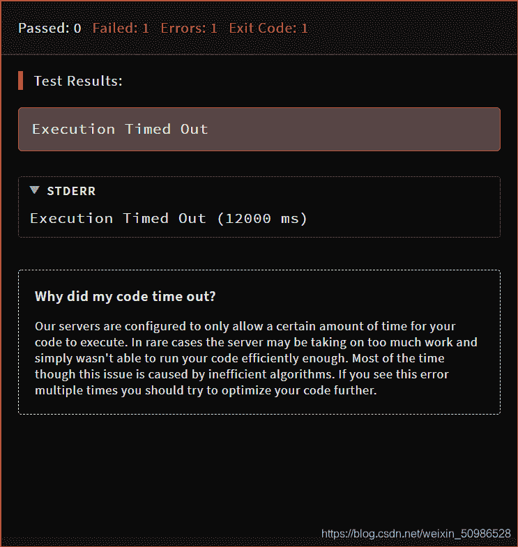

<!--yml
category: codewars
date: 2022-08-13 11:39:10
-->

# 2020-12-16 codewars Integers: Recreation 程序超时 python3.6_李树雨的博客-CSDN博客

> 来源：[https://blog.csdn.net/weixin_50986528/article/details/111304653?ops_request_misc=%257B%2522request%255Fid%2522%253A%2522166036058916781685355945%2522%252C%2522scm%2522%253A%252220140713.130102334.pc%255Fall.%2522%257D&request_id=166036058916781685355945&biz_id=0&utm_medium=distribute.pc_search_result.none-task-blog-2~all~first_rank_ecpm_v1~rank_v31_ecpm-18-111304653-null-null.142^v40^control,185^v2^control&utm_term=codewars](https://blog.csdn.net/weixin_50986528/article/details/111304653?ops_request_misc=%257B%2522request%255Fid%2522%253A%2522166036058916781685355945%2522%252C%2522scm%2522%253A%252220140713.130102334.pc%255Fall.%2522%257D&request_id=166036058916781685355945&biz_id=0&utm_medium=distribute.pc_search_result.none-task-blog-2~all~first_rank_ecpm_v1~rank_v31_ecpm-18-111304653-null-null.142^v40^control,185^v2^control&utm_term=codewars)

2020-12-16 codewars Integers: Recreation 程序超时 python3.6

> 问题：
> Divisors of 42 are : 1, 2, 3, 6, 7, 14, 21, 42\. These divisors squared are: 1, 4, 9, 36, 49, 196, 441, 1764\. The sum of the squared divisors is 2500 which is 50 * 50, a square!

> Given two integers m, n (1 <= m <= n) we want to find all integers between m and n whose sum of squared divisors is itself a square. 42 is such a number.

> The result will be an array of arrays or of tuples (in C an array of Pair) or a string, each subarray having two elements, first the number whose squared divisors is a square and then the sum of the squared divisors.

> #Examples:

> list_squared(1, 250) --> [[1, 1], [42, 2500], [246, 84100]]
> list_squared(42, 250) --> [[42, 2500], [246, 84100]]
> The form of the examples may change according to the language, see Example Tests: for more details.

> Note

> In Fortran - as in any other language - the returned string is not permitted to contain any redundant trailing whitespace: you can use dynamically allocated character strings.

> FUNDAMENTALSALGORITHMSOPTIMIZATION

翻译：
问题：
42的因数是:1、2、3、6、7、14、21、42。
这些因子的平方是1 49 36 49 196 441 1764。
平方因子的和是2500，也就是50 * 50，一个平方!

给定两个整数m n (1 <= m <= n)我们要找出m到n之间所有的整数，它们的平方因子之和本身是一个平方。
42就是这样一个数字。

结果将是数组的数组或元组(在C中是一对数组)的数组或字符串，每个子数组有两个元素，首先是其平方因子为平方的数，然后是平方因子的和。

#例子:

```
list_squared(250)——>[[1,1]， [42,2500]， [246, 84100]]
list_squared(250)——>[[42,2500]， [246, 84100]] 
```

示例的形式可能会根据语言的不同而改变，有关更多细节，请参阅示例测试:。

请注意

在Fortran语言中——就像在任何其他语言中一样——返回的字符串不允许包含任何冗余的尾随空格:您可以使用动态分配的字符串。

FUNDAMENTALSALGORITHMSOPTIMIZATION

```
def list_squared(m, n):
    result=[]
    for num in range(m, n):
        number_list = []
        for i in range(1,num+1):
            if num%i == 0:
                number_list.append(i)
        sum = 0
        for i in range(len(number_list)):
            sum += number_list[i]**2
        sum_result = sum**0.5
        if sum_result%1 == 0:
            result.append([num,sum])
    return result 
```

```
 >>>list_squared(1, 250)
[[1, 1], [42, 2500], [246, 84100]]
>>>list_squared(42, 250)
[[42, 2500], [246, 84100]]
>>>list_squared(250, 500)
[[287, 84100]] 
```

Test(测试)能过。

> Time: 614msPassed: 3Failed: 0
> Test Results:
> Test Passed
> Test Passed
> Test Passed
> You have passed all of the tests! 😃

但是我每次attempt（提交) 都显示timeout
不知道是我的问题，还是代码的问题。求解答。