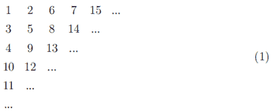
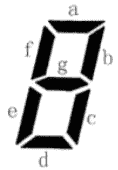
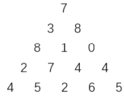
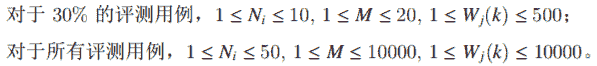

<!--yml
category: 蓝桥杯
date: 2022-04-26 11:07:09
-->

# 2020年10月17日第十一届蓝桥杯第二场省赛试题及详解（Java本科B组）_跟老程一起学编程的博客-CSDN博客

> 来源：[https://blog.csdn.net/future277809183/article/details/122839150](https://blog.csdn.net/future277809183/article/details/122839150)

1.  结果填空 (满分5分)
2.  结果填空 (满分5分)
3.  结果填空 (满分10分)
4.  结果填空 (满分10分)
5.  结果填空 (满分15分)
6.  程序设计（满分15分）
7.  程序设计（满分20分）
8.  程序设计（满分20分）
9.  程序设计（满分25分）
10.  程序设计（满分25分）

* * *

## **第一题: 门牌制作**

【问题描述】

小蓝要为一条街的住户制作门牌号。

这条街一共有 2020 位住户，门牌号从 1 到 2020 编号。

小蓝制作门牌的方法是先制作 0 到 9 这几个数字字符，最后根据需要将字符粘贴到门牌上，例如门牌 1017 需要依次粘贴字符 1、0、1、7，即需要 1 个 字符 0，2 个字符 1，1 个字符 7。

请问要制作所有的 1 到 2020 号门牌，总共需要多少个字符 2？

【答案提交】

这是一道结果填空的题，你只需要算出结果后提交即可。本题的结果为一个整数，在提交答案时只填写这个整数，填写多余的内容将无法得分。

```
public class Main {

	public static void main(String[] args) {
		int ans = 0;
		for (int i = 1; i <= 2020; i++) {
			int x = i;
			while (x > 0) {
				if (x % 10 == 2)
					ans++;
				x /= 10;
			}
		}
		System.out.println(ans);
	}

}
```

## **第二题: 寻找 2020**

【问题描述】

小蓝有一个数字矩阵，里面只包含数字 0 和 2。小蓝很喜欢 2020，他想找到这个数字矩阵中有多少个 2020 。

小蓝只关注三种构成 2020 的方式：

• 同一行里面连续四个字符从左到右构成 2020。

• 同一列里面连续四个字符从上到下构成 2020。

• 在一条从左上到右下的斜线上连续四个字符，从左上到右下构成 2020。

例如，对于下面的矩阵：

220000

000000

002202

000000

000022

002020

一共有 5 个 2020。其中 1 个是在同一行里的，1 个是在同一列里的，3 个是斜线上的。

小蓝的矩阵比上面的矩阵要大，由于太大了，他只好将这个矩阵放在了一个文件里面，在试题目录下有一个文件 2020.txt，里面给出了小蓝的矩阵。

请帮助小蓝确定在他的矩阵中有多少个 2020。

【答案提交】

这是一道结果填空的题，你只需要算出结果后提交即可。本题的结果为一 个整数，在提交答案时只填写这个整数，填写多余的内容将无法得分

```
import java.util.Scanner;

public class Main {

	public static void main(String[] args) {
		Scanner sc = new Scanner(System.in);
		int[][] num = new int[301][301];
		for (int i = 1; i <= 300; i++) {
			String str = sc.next();
			for (int j = 1; j <= str.length(); j++) {
				num[i][j] = str.charAt(j - 1) - '0';
			}
		}
		int ans = 0;
		for (int i = 1; i <= 300; i++) {
			for (int j = 1; j <= 300; j++) {
				if (i + 3 <= 300 && num[i][j] == 2 && num[i + 1][j] == 0 && num[i + 2][j] == 2 && num[i + 3][j] == 0)
					ans++;
			}
		}
		for (int i = 1; i <= 300; i++) {
			for (int j = 1; j <= 300; j++) {
				if (j + 3 <= 300 && num[i][j] == 2 && num[i][j + 1] == 0 && num[i][j + 2] == 2 && num[i][j + 3] == 0)
					ans++;
			}
		}
		for (int i = 1; i <= 300; i++) {
			for (int j = 1; j <= 300; j++) {
				if (i + 3 <= 300 && j + 3 <= 300 && num[i][j] == 2 && num[i + 1][j + 1] == 0 && num[i + 2][j + 2] == 2
						&& num[i + 3][j + 3] == 0)
					ans++;
			}
		}
		System.out.println(ans);
	}

}
```

## **第三题: 蛇形填数**

【问题描述】

如下图所示，小明用从 1 开始的正整数“蛇形”填充无限大的矩阵。

                                            1 2 6 7 15 ...

                                            3 5 8 14 ...

                                            4 9 13 ...

                                            10 12 ...                        (1)

                                            11 ...

                                            ...

容易看出矩阵第二行第二列中的数是 5。请你计算矩阵中第 20 行第 20 列的数是多少？

【答案提交】

这是一道结果填空的题，你只需要算出结果后提交即可。本题的结果为一个整数，在提交答案时只填写这个整数，填写多余的内容将无法得分


```
public class Main {
	public static void main(String[] args) {
		int n = 20;
		System.out.println((n - 1) * (2 * n - 1) + n);
		System.out.println("---------");
		for (int i = 1; i <= 20; i++) {
			System.out.println((i - 1) * (2 * i - 1) + i);
		}
		System.out.println("---------");
		int a = 1;
		for (int i = 0; i < 20; i++) {
			a = a + (i * 4);
			System.out.println(a);
		}
	}
}
```

## **第四题: 七段码**

【问题描述】

小蓝要用七段码数码管来表示一种特殊的文字。

 

上图给出了七段码数码管的一个图示，数码管中一共有 7 段可以发光的二 极管，分别标记为 a, b, c, d, e, f, g。

小蓝要选择一部分二极管（至少要有一个）发光来表达字符。在设计字符 的表达时，要求所有发光的二极管是连成一片的。

例如：b 发光，其他二极管不发光可以用来表达一种字符。

例如：c 发光，其他二极管不发光可以用来表达一种字符。这种方案与上一行的方案可以用来表示不同的字符，尽管看上去比较相似。

例如：a, b, c, d, e 发光，f, g 不发光可以用来表达一种字符。

例如：b, f 发光，其他二极管不发光则不能用来表达一种字符，因为发光 的二极管没有连成一片。

请问，小蓝可以用七段码数码管表达多少种不同的字符？

【答案提交】

这是一道结果填空的题，你只需要算出结果后提交即可。本题的结果为一个整数，在提交答案时只填写这个整数，填写多余的内容将无法得分

```
public class Main {

	static boolean[][] M;// M是邻接矩阵
	static int[] a;// a代表排列组合的数字
	static int sum = 0;// 最后结果

	public static void main(String[] args) {
		/*
		 * M是邻接矩阵，根据数码管图像可以得到 例如：a和b,a和f都可以连通，那么代表0和1,0和5连通
		 */
		M = new boolean[7][7];
		M[0][1] = M[1][0] = M[0][5] = M[5][0] = true;
		M[1][2] = M[2][1] = M[1][6] = M[6][1] = true;
		M[2][3] = M[3][2] = M[2][6] = M[6][2] = true;
		M[4][3] = M[3][4] = true;
		M[4][5] = M[5][4] = M[4][6] = M[6][4] = true;
		M[5][6] = M[6][5] = true;
		a = new int[7];
		for (int i = 0; i < a.length; i++) {
			a[i] = i;
		}
		// 所有排列的可能，深搜
		for (int n = 1; n <= 7; n++) {
			dfs(0, n);
		}
		System.out.println(sum);
	}

	public static void dfs(int k, int n) {
		if (k == n) {
			// 如果只有一个数,那么这种情况下必然成立
			if (n == 1) {
				sum++;
				return;
			}
			// 判断，这种情况下的图是否连通。用的是并查集方法
			// 初始化
			int[] pre = new int[n];
			for (int i = 0; i < pre.length; i++) {
				pre[i] = i;
			}
			for (int i = 0; i < n; i++) {
				for (int j = i + 1; j < n; j++) {
					// 两层for穷举所有边的情况
					// 若i和j连通,j加入i
					// i和j代表的是结点，所以并的时候就是jion(pre,
					// i,j)。但是i代表的结点好j代表的结点是否连通，则需要看a[i]]和[a[j]在邻接矩阵M中是否为真
					if (M[a[i]][a[j]]) {
						jion(pre, i, j);
					}
				}
			}
			// 到最后，若所有结点都连通，则所有结点的跟结点应该都一样。否则说明此情况下的图不连通
			boolean flag = true;
			for (int i = 1; i < pre.length; i++) {
				if (find(pre, 0) != find(pre, i)) {
					flag = false;
					break;
				}
			}
			if (flag) {
				sum++;
			}
			return;
		}
		// dfs，深搜
		for (int i = k; i < a.length; i++) {
			if (k == 0 || a[i] > a[k - 1]) {
				int t = a[i];
				a[i] = a[k];
				a[k] = t;
				dfs(k + 1, n);
				t = a[i];
				a[i] = a[k];
				a[k] = t;
			}
		}
	}

	// 查找根节点
	public static int find(int[] pre, int node) {
		int son = node, temp = 0;
		// 查找根节点
		while (node != pre[node]) {
			node = pre[node];
		}
		// 路径优化
		while (son != node) {
			temp = pre[son];
			// 直接通跟
			pre[son] = node;
			// son向上走一格
			son = pre[son];
		}
		return node;
	}

	// 两个结点相并
	public static void jion(int[] pre, int x, int y) {
		int fx = find(pre, x);
		int fy = find(pre, y);
		// 两个结点属于不同图，相并
		if (fx != fy) {
			pre[fy] = fx;
		}
	}

}
```

## **第五题: 排序——jonmlkihgfedcba**

【问题描述】

小蓝最近学习了一些排序算法，其中冒泡排序让他印象深刻。

在冒泡排序中，每次只能交换相邻的两个元素。

小蓝发现，如果对一个字符串中的字符排序，只允许交换相邻的两个字符，则在所有可能的排序方案中，冒泡排序的总交换次数是最少的。

例如，对于字符串 lan 排序，只需要 1 次交换。对于字符串 qiao 排序，总共需要 4 次交换。

小蓝找到了很多字符串试图排序，他恰巧碰到一个字符串，需要 100 次交换，可是他忘了吧这个字符串记下来，现在找不到了。

请帮助小蓝找一个只包含小写英文字母且没有字母重复出现的字符串，对该串的字符排序，正好需要 100 次交换。如果可能找到多个，请告诉小蓝最短的那个。如果最短的仍然有多个，请告诉小蓝字典序最小的那个。请注意字符串中可以包含相同的字符。

【答案提交】

这是一道结果填空的题，你只需要算出结果后提交即可。本题的结果为一个只包含小写英文字母的字符串，在提交答案时只填写这个字符串，填写多余的内容将无法得分。

```
public class Main{

	public static void main(String[] args) {

		for(int i=1; i<20; ++i) {
			System.out.println(i+":"+((i-1)*i/2));		//由此可以发现15个字符的逆序通过冒泡交换成顺序所需要的交换次数最接近100，因此仅需要将onmlkjihgfedcba的第六位移动至第一位即可：jonmlkihgfedcba
		}
	}

} 
```

## **第六题: 成绩分析**

【问题描述】

小蓝给学生们组织了一场考试，卷面总分为 100 分，每个学生的得分都是一个 0 到 100 的整数。

请计算这次考试的最高分、最低分和平均分。

【输入格式】

输入的第一行包含一个整数 n，表示考试人数。

接下来 n 行，每行包含一个 0 至 100 的整数，表示一个学生的得分。

【输出格式】

输出三行。

第一行包含一个整数，表示最高分。

第二行包含一个整数，表示最低分。

第三行包含一个实数，四舍五入保留正好两位小数，表示平均分。

【样例输入】

7

80

92

56

74

88

99

10

【样例输出】

99

10

71.29

【评测用例规模与约定】

对于 50% 的评测用例，1 ≤ n ≤ 100。

对于所有评测用例，1 ≤ n ≤ 10000

```
import java.util.Scanner;

public class Main { // String.format("%.2f", xxx)：自动四舍五入

	public static void main(String[] args) {
		Scanner sc = new Scanner(System.in);
		int n = sc.nextInt();
		int max = Integer.MIN_VALUE, min = Integer.MAX_VALUE;
		double sum = 0;
		for (int i = 0; i < n; i++) {
			int t = sc.nextInt();
			min = Math.min(min, t);
			max = Math.max(max, t);
			sum += t;
		}
		System.out.println(max + "\n" + min + "\n" + String.format("%.2f", sum / n));
	}

}
```

## **第七题: 单词分析**

【问题描述】

小蓝正在学习一门神奇的语言，这门语言中的单词都是由小写英文字母组成，有些单词很长，远远超过正常英文单词的长度。小蓝学了很长时间也记不住一些单词，他准备不再完全记忆这些单词，而是根据单词中哪个字母出现得最多来分辨单词。

现在，请你帮助小蓝，给了一个单词后，帮助他找到出现最多的字母和这个字母出现的次数。

【输入格式】

输入一行包含一个单词，单词只由小写英文字母组成。

【输出格式】

输出两行，第一行包含一个英文字母，表示单词中出现得最多的字母是哪个。如果有多个字母出现的次数相等，输出字典序最小的那个。

第二行包含一个整数，表示出现得最多的那个字母在单词中出现的次数。

【样例输入】

lanqiao

【样例输出】

a

2

【样例输入】

longlonglongistoolong

【样例输出】

o

6

【评测用例规模与约定】

对于所有的评测用例，输入的单词长度不超过 1000

```
import java.util.Scanner;

public class Main {

	public static void main(String[] args) {
		Scanner sc = new Scanner(System.in);
		char charArray[] = sc.next().toCharArray(); // 字符数组
		int nums[] = new int[26]; // int型数组 记录 每个字母的出现次数
		for (int i = 0; i < charArray.length; i++) {
			nums[charArray[i] - 'a']++;
		}
		int ans = nums[0], index = 0;
		for (int i = 0; i < 26; i++) {
			if (nums[i] > ans) {
				ans = nums[i];
				index = i;
			}
		}
		System.out.println((char) ('a' + index) + "\n" + ans);
	}

}
```

## **第八题: 数字三角形**



上图给出了一个数字三角形。从三角形的顶部到底部有很多条不同的路径。对于每条路径，把路径上面的数加起来可以得到一个和，你的任务就是找到最大的和。

路径上的每一步只能从一个数走到下一层和它最近的左边的那个数或者右边的那个数。此外，向左下走的次数与向右下走的次数相差不能超过 1。

【输入格式】

输入的第一行包含一个整数 N (1 < N ≤ 100)，表示三角形的行数。下面的 N 行给出数字三角形。数字三角形上的数都是 0 至 100 之间的整数。

【输出格式】

输出一个整数，表示答案。

【样例输入】

5

7

3 8

8 1 0

2 7 4 4

4 5 2 6 5

【样例输出】

27

```
import java.util.Scanner;

public class Main {
	public static void main(String[] args) {
		Scanner sc = new Scanner(System.in);
		int n = sc.nextInt();
		int arr[][] = new int[n + 1][n + 1];
		for (int i = 1; i <= n; i++) {
			for (int j = 1; j <= i; j++) {
				arr[i][j] = sc.nextInt();
				arr[i][j] += Math.max(arr[i - 1][j - 1], arr[i - 1][j]);
			}
		}
		System.out.println(n % 2 == 1 ? arr[n][n / 2 + 1] : Math.max(arr[n][n / 2], arr[n][n / 2 + 1]));
	}
}
```

## **第九题: 子串分值和**

【问题描述】

对于一个字符串 S，我们定义 S 的分值 f(S ) 为 S 中出现的不同的字符个数。例如 f(”aba”) = 2，f(”abc”) = 3, f(”aaa”) = 1。

现在给定一个字符串 S [0..n − 1]（长度为 n），请你计算对于所有 S 的非空子串 S [i.. j](0 ≤ i ≤ j < n)，f(S [i.. j]) 的和是多少。

【输入格式】

输入一行包含一个由小写字母组成的字符串 S。

【输出格式】

输出一个整数表示答案。

【样例输入】

ababc

【样例输出】

28

【样例说明】

子串 f值

a         1

ab       2

aba     2

abab   2

ababc 3

b       1

ba     2

bab   2

babc 3

a       1

ab     2

abc   3

b       1

bc     2

c       1

【评测用例规模与约定】

对于 20% 的评测用例，1 ≤ n ≤ 10；

对于 40% 的评测用例，1 ≤ n ≤ 100；

对于 50% 的评测用例，1 ≤ n ≤ 1000；

对于 60% 的评测用例，1 ≤ n ≤ 10000；

对于所有评测用例，1 ≤ n ≤ 100000。

```
import java.util.HashSet;
import java.util.Scanner;

public class Main {

	public static void main(String[] args) {
		Scanner sc = new Scanner(System.in);
		String string = sc.next();
		char c[] = string.toCharArray();
		long ans = 0;
		for (int i = 0; i < c.length; i++) {
			HashSet<Character> set = new HashSet<Character>(); // HashSet去重
			for (int j = i; j < c.length; j++) {
				set.add(c[j]);
				ans += set.size();
			}
		}
		System.out.println(ans);
	}

}
```

## **第十题: 装饰珠**

【问题描述】

在怪物猎人这一款游戏中，玩家可以通过给装备镶嵌不同的装饰珠来获取相应的技能，以提升自己的战斗能力。

已知猎人身上一共有 6 件装备，每件装备可能有若干个装饰孔，每个装饰孔有各自的等级，可以镶嵌一颗小于等于自身等级的装饰珠 (也可以选择不镶嵌)。

装饰珠有 M 种，编号 1 至 M，分别对应 M 种技能，第 i 种装饰珠的等级为 Li，只能镶嵌在等级大于等于 Li 的装饰孔中。

对第 i 种技能来说，当装备相应技能的装饰珠数量达到 Ki 个时，会产生 Wi(Ki) 的价值。镶嵌同类技能的数量越多，产生的价值越大，即 Wi(Ki − 1) < Wi(Ki)。但每个技能都有上限 Pi(1 ≤ Pi ≤ 7)，当装备的珠子数量超过 Pi 时，只会产生 Wi(Pi) 的价值。

对于给定的装备和装饰珠数据，求解如何镶嵌装饰珠，使得 6 件装备能得到的总价值达到最大。

【输入格式】

输入的第 1 至 6 行，包含 6 件装备的描述。其中第 i 的第一个整数 Ni 表示第 i 件装备的装饰孔数量。后面紧接着 Ni 个整数，分别表示该装备上每个装饰 孔的等级 L(1 ≤ L ≤ 4)。

第 7 行包含一个正整数 M，表示装饰珠 (技能) 种类数量。

第 8 至 M + 7 行，每行描述一种装饰珠 (技能) 的情况。每行的前两个整数 Lj(1 ≤ Lj ≤ 4) 和 Pj(1 ≤ Pi ≤ 7) 分别表示第 j 种装饰珠的等级和上限。接下来 Pj 个整数，其中第 k 个数表示装备该中装饰珠数量为 k 时的价值 Wj(k)。

【输出格式】

输出一行包含一个整数，表示能够得到的最大价值。

【样例输入】

1 1

2 1 2

1 1

2 2 2

1 1

1 3

3

1 5 1 2 3 5 8

2 4 2 4 8 15

3 2 5 10

【样例输出】

20

【样例说明】

按照如下方式镶嵌珠子得到最大价值 18，括号内表示镶嵌的装饰珠的种类编号：

1: (1)

2: (1)(2)

3: (1)

4: (2) (2)

5: (1)

6: (2)

4 颗技能 1 装饰珠，4 颗技能 2 装饰珠 W1(4) + W2(4) = 5 + 15 = 20。

【评测用例规模与约定】


```
import java.util.ArrayList;
import java.util.Collections;
import java.util.Comparator;
import java.util.Scanner;

public class Main {
    static int M;
    static int[][] Wrecord;
    public static void main(String[] args) {
        int[][] equipment = new int[6][];
        int[][] record = new int[6][];
        Scanner scanner = new Scanner(System.in);

        for (int i = 0; i < 6; i++) {
            int n = scanner.nextInt();//当前装备装备孔的数量
            int[] temp = new int[n];
            //记录每个装备孔的等级
            for (int j = 0; j < temp.length; j++) {
                temp[j] = scanner.nextInt();
            }
            equipment[i] = temp;
            record[i] = new int[n];
        }
        M = scanner.nextInt();//装饰珠的种类数量
        ArrayList<int[]> W = new ArrayList<>();//记录装饰珠数量对应价值
        Wrecord = new int[M][];
        for (int i = 0; i < M; i++) {
            int Level = scanner.nextInt();
            int P = scanner.nextInt();//装饰珠数量上限
            int[] temp = new int[P + 1];
            temp[0] = Level;//数组首位是装饰珠等级
            for (int j = 1; j < temp.length; j++) {
                temp[j] = scanner.nextInt();
            }
            Wrecord[i] = temp.clone();

            int[] temp1 = new int[P + 2];
            for (int j = 0; j < temp.length; j++) {
                temp1[j] = temp[j];
            }
            temp1[temp1.length - 1] = i;//temp1最后一位装的是装饰珠编号-1
            W.add(temp1);
        }
        //对装饰珠进行排序
        Comparator<int[]> comparator = new Comparator<int[]>() {
            @Override
            public int compare(int[] o1, int[] o2) {
                return o1[0] - o2[0];//升序排序
            }
        };
        Collections.sort(W, comparator);

        //开始推导
        for (int i = 0; i < 6; i++) {
            for (int j = 0; j < equipment[i].length; j++) {
                int Level = equipment[i][j];//当前孔位等级
                //开始尝试安插装饰珠
                //安插一个等级最小的
                record[i][j] = W.get(0)[W.get(0).length - 1] + 1;
                int value = Value(record);
                for (int k = 1; k < W.size(); k++) {
                    int[] recordOfW = W.get(k);
                    if (recordOfW[0] > Level){//装饰孔的等级小于装饰珠的等级
                        break;//等级升序排序，后续的装饰珠等级必定大于装饰孔
                    }

                    int buffer = record[i][j];
                    int nextRecordIJ = recordOfW[recordOfW.length - 1] + 1;
                    record[i][j] = nextRecordIJ;
                    int nextValue = Value(record);
                    if (nextValue >= value){
                        //数值保留
                        value = nextValue;
                    }else {
                        //数值还原
                        record[i][j] = buffer;
                    }

                }
                //record[i][j]中保留的是最优解
            }
        }
        System.out.println(Value(record));

    }
    public static int Value(int[][] record){
        int value = 0;
        int[] CountOfZhuang = new int[M + 1];
        for (int i = 0; i < record.length; i++) {
            for (int j = 0; j < record[i].length; j++) {
                if (record[i][j] == 0){
                    //doNothing
                }else {
                    CountOfZhuang[record[i][j]]++;
                }
            }
        }
        for (int i = 1; i < CountOfZhuang.length; i++) {
            if (CountOfZhuang[i] == 0){
                continue;
            }
            if (CountOfZhuang[i] > Wrecord[i - 1].length - 1){
                //装饰珠的数量超出上限
                value += Wrecord[i - 1][Wrecord[i - 1].length - 1];
            }else {
                value += Wrecord[i - 1][CountOfZhuang[i]];
            }
        }
        return value;
    }
} 
```