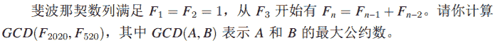

<!--yml
category: 蓝桥杯
date: 2022-04-26 11:07:10
-->

# 2020年7月5日第十一届蓝桥杯第一场省赛试题及详解（Java本科B组）_跟老程一起学编程的博客-CSDN博客

> 来源：[https://blog.csdn.net/future277809183/article/details/122837168?spm=1001.2014.3001.5502](https://blog.csdn.net/future277809183/article/details/122837168?spm=1001.2014.3001.5502)

1.  结果填空 (满分5分)
2.  结果填空 (满分5分)
3.  结果填空 (满分10分)
4.  结果填空 (满分10分)
5.  结果填空 (满分15分)
6.  程序设计（满分15分）
7.  程序设计（满分20分）
8.  程序设计（满分20分）
9.  程序设计（满分25分）
10.  程序设计（满分25分）

* * *

## **第一题：解密**

小明设计了一种文章加密的方法：对于每个字母 c，将它变成某个另外的字符 Tc。下表给出了字符变换的规则：

例如，将字符串 YeRi 加密可得字符串 EaFn。

小明有一个随机的字符串，加密后为

EaFnjISplhFviDhwFbEjRjfIBBkRyY

（由 30 个大小写英文字母组成，不包含换行符），请问原字符串是多少？

（如果你把以上字符串和表格复制到文本文件中，请务必检查复制的内容是否与文档中的一致。在试题目录下有一个文件 str.txt，第一行为上面的字符串，后面 52 行依次为表格中的内容。）

【答案提交】

这是一道结果填空题，你只需要算出结果后提交即可。本题的结果为一个只包含 30 个大小写英文字母的字符串，在提交答案时只填写这个字符串，填写多余的内容将无法得分

```
public class Main {
	public static void main(String[] args) { // 30个字符
//		String res = "YeRik GSunl RzgDl vRwYk XkrGW WhXaA"; // 未加密【答案】
//		String str = "EaFnj ISplh FviDh wFbEj RjfIB BkRyY"; // 加密后
		String str = "EaFnjISplhFviDhwFbEjRjfIBBkRyY"; // 加密后的字符
		char[] arr = str.toCharArray();
		String s1 = "abcdefghijklmnopqrstuvwxyzABCDEFGHIJKLMNOPQRSTUVWXYZ"; // 原字符
		String s2 = "yxmdacikntjhqlgoufszpwbrevYXMDACIKNTJHQLGOUFSZPWBREV"; // 加密后的字符
		String s3 = ""; // 解密后的字符
		for (int i = 0; i < arr.length; i++) {
			int j = s2.indexOf(arr[i]);   // 输出当前字符在加密后字符中的位置
			s3 += s1.substring(j, j + 1); // 找出原字符在此位置对应的字符
		}
		System.out.println(s3);
	}
}
```

## **第二题: 纪念日**

2020 年 7 月 1 日是中国共产党成立 99 周年纪念日。

中国共产党成立于 1921 年 7 月 23 日。

请问从 1921 年 7 月 23 日中午 12 时到 2020 年 7 月 1 日中午 12 时一共包含多少分钟？

【答案提交】

这是一道结果填空题，你只需要算出结果后提交即可。本题的结果为一个 整数，在提交答案时只填写这个整数，填写多余的内容将无法得分。

```
import java.text.ParseException;
import java.text.SimpleDateFormat;
import java.util.Date;

public class Main {
	// 不需要非要找12点，因为都是从0点算也是一样的
	public static void main(String[] args) throws ParseException {
		SimpleDateFormat format = new SimpleDateFormat("yyyy-MM-dd");
		Date date1 = format.parse("1921-7-23");
		Date date2 = format.parse("2020-7-1");
		int a = (int) ((date2.getTime() - date1.getTime()) / (1000 * 60));
		System.out.println(a);
	}
}
```

## **第三题: 合并检测**

新冠疫情由新冠病毒引起，最近在 A 国蔓延，为了尽快控制疫情，A 国准备给大量民众进病毒核酸检测。

然而，用于检测的试剂盒紧缺。

为了解决这一困难，科学家想了一个办法：合并检测。即将从多个人（k 个）采集的标本放到同一个试剂盒中进行检测。如果结果为阴性，则说明这 k 个人都是阴性，用一个试剂盒完成了 k 个人的检测。如果结果为阳性，则说明至少有一个人为阳性，需要将这 k 个人的样本全部重新独立检测（从理论上看，如果检测前 k − 1 个人都是阴性可以推断出第 k 个人是阳性，但是在实际操作中不会利用此推断，而是将 k 个人独立检测），加上最开始的合并检测，一共使用了 k + 1 个试剂盒完成了 k 个人的检测。

A 国估计被测的民众的感染率大概是 1%，呈均匀分布。请问 k 取多少能最节省试剂盒？

【答案提交】

这是一道结果填空题，你只需要算出结果后提交即可。本题的结果为一个 整数，在提交答案时只填写这个整数，填写多余的内容将无法得分。

```
public class Main {
	public static void main(String[] args) {
		int min = 999990;
		int ans = -1;
		for (int i = 1; i <= 100; i++) { // i个人一块测
			int temp;
			if (100 % i != 0) {
				temp = 100 / i + i + 1;
			} else {
				temp = 100 / i + i;
			}
			if (min > temp) {
				min = temp;
				ans = i;
			}
		}
		System.out.println(ans);
	}
}
```

## **第四题: 分配口罩**

某市市长获得了若干批口罩，每一批口罩的数目如下：（如果你把以下文字复制到文本文件中，请务必检查复制的内容是否与文档中的一致。在试题目录下有一个文件 mask.txt，内容与下面的文本相同）

9090400

8499400

5926800

8547000

4958200

4422600

5751200

4175600

6309600

5865200

6604400

4635000

10663400

8087200

4554000

现在市长要把口罩分配给市内的 2 所医院。由于物流限制，每一批口罩只能全部分配给其中一家医院。市长希望 2 所医院获得的口罩总数之差越小越好。请你计算这个差最小是多少？

【答案提交】

这是一道结果填空题，你只需要算出结果后提交即可。本题的结果为一个整数，在提交答案时只填写这个整数，填写多余的内容将无法得分。

```
import java.util.Scanner;

public class Main { // 2400
	static int sum = 0;
	static int[] dp = new int[98090000];
	static int[] nums = { 0, 9090400, 8499400, 5926800, 8547000, 4958200, 4422600,
			5751200, 4175600, 6309600, 5865200, 6604400, 4635000, 10663400, 8087200, 4554000 };

	public static void main(String[] args) {
		Scanner in = new Scanner(System.in);
		for (int i = 1; i < nums.length; i++)
			sum += nums[i];
		int v = sum / 2;
		for (int i = 1; i < nums.length; i++) {
			for (int j = v; j >= nums[i]; j--) {
				dp[j] = Math.max(dp[j], dp[j - nums[i]] + nums[i]);
			}
		}
		System.out.println(dp[v]);
		System.out.println(sum - 2 * dp[v]);
	}
}
```

## **第五题: 斐波那契数列最大公约数**

斐波那契数列满足 F1 = F2 = 1，从 F3 开始有 Fn = Fn−1 + Fn−2。请你计算 GCD(F2020, F520)，其中 GCD(A, B) 表示 A 和 B 的最大公约数。



【答案提交】

这是一道结果填空题，你只需要算出结果后提交即可。本题的结果为一个整数，在提交答案时只填写这个整数，填写多余的内容将无法得分。

```
import java.math.BigInteger;

public class Main { // 6765
	public static void main(String[] args) {
		BigInteger arr[] = new BigInteger[2025]; // int long型数据均会爆数组
		arr[0] = BigInteger.ZERO;
		arr[1] = arr[2] = BigInteger.ONE;
		for (int i = 3; i <= 2020; i++) {
			arr[i] = arr[i - 1].add(arr[i - 2]);
		}
		for (int i = 1; i <= 7; i++) { // 输出斐波那契数组的元素值 验证
			System.out.println(i + ": " + arr[i]);
		}
		System.out.println(arr[520]);
		System.out.println(arr[2020]);
		System.out.println(arr[2020].mod(arr[520]));
//		System.out.println(gcd(arr[2020], arr[520]));
		System.out.println(arr[2020].gcd(arr[520]));
	}

	public static BigInteger gcd(BigInteger a, BigInteger b) {
		return b.equals(BigInteger.ZERO) ? a : gcd(b, a.mod(b));
//		if (b.compareTo(BigInteger.ZERO) == 0) {
//			return a;
//		}
//		return gcd(b, a.mod(b));
	}
}
```

## **第六题: 分类计数**

【问题描述】

输入一个字符串，请输出这个字符串包含多少个大写字母，多少个小写字母，多少个数字。

【输入格式】

输入一行包含一个字符串。

【输出格式】

输出三行，每行一个整数，分别表示大写字母、小写字母和数字的个数。

【样例输入】

1+a=Aab

【样例输出】

1 3 1

【评测用例规模与约定】

对于所有评测用例，字符串由可见字符组成，长度不超过 100。

```
import java.util.Scanner;

public class Main {
	public static void main(String[] args) {
		Scanner in = new Scanner(System.in);
		String s = in.nextLine();
		char[] a = s.toCharArray();
		int upper = 0, lower = 0, num = 0;
		for (int i = 0; i < a.length; i++) {
			if (Character.isUpperCase(a[i]))
				upper++;
			else if (Character.isLowerCase(a[i]))
				lower++;
			else if (Character.isDigit(a[i]))
				num++;
		}
		System.out.print(upper + " " + lower + " " + num);
	}
}
```

## **第七题: 八次求和**

【问题描述】

给定正整数 n, 求  +  + · · · +  mod 123456789 。其中 mod 表示取余。

【输入格式】

输入的第一行包含一个整数 n。

【输出格式】

输出一行，包含一个整数，表示答案。

【样例输入】

2

【样例输出】

257

【样例输入】

987654

【样例输出】

43636805

【评测用例规模与约定】

对于 20% 的评测用例，1 ≤ n ≤ 20。

对于 60% 的评测用例，1 ≤ n ≤ 1000。

对于所有评测用例，1 ≤ n ≤ 1000000。

```
import java.math.BigInteger;
import java.util.Scanner;

public class Main {
	public static final BigInteger mod = BigInteger.valueOf(123456789);

	public static void main(String[] args) {
		Scanner sc = new Scanner(System.in);
		int n = sc.nextInt(); // 对于所有评测用例，1 ≤ n ≤ 1000000。
		BigInteger sum = BigInteger.ZERO; // sum会爆int\long
		for (int i = 1; i <= n; i++) {
			BigInteger temp = BigInteger.valueOf(i);
			sum = sum.add(temp.multiply(temp).multiply(temp).multiply(temp).
					multiply(temp).multiply(temp).multiply(temp).multiply(temp));
            // sum = sum.mod(mod);
		}
		System.out.println(sum.mod(mod));
	}
}
/**
int temp = (int) Math.pow(i, 8);
String str = temp + "";
long sum = 0;
for (int i = 1; i <= n; i++) {
	sum += (long)Math.pow(i, 8);
	sum %= mod;
	System.out.println(i + ": " + sum);
}
*/
```

## **第八题: 字符串编码**

【问题描述】

小明发明了一种给由全大写字母组成的字符串编码的方法。对于每一个大写字母，小明将它转换成它在 26 个英文字母中序号，即 A → 1, B → 2, ... Z → 26。

这样一个字符串就能被转化成一个数字序列：

比如 ABCXYZ → 123242526。

现在给定一个转换后的数字序列，小明想还原出原本的字符串。当然这样的还原有可能存在多个符合条件的字符串。小明希望找出其中字典序最大的字符串。

【输入格式】

一个数字序列。

【输出格式】

一个只包含大写字母的字符串，代表答案。

【样例输入】

123242526

【样例输出】

LCXYZ

【评测用例规模与约定】

对于 20% 的评测用例，输入的长度不超过 20。

对于所有评测用例，输入的长度不超过 200000。

```
import java.util.Scanner;

public class Main {
	public static void main(String[] args) {
		Scanner input = new Scanner(System.in);
		String s = input.next();
		int len = s.length();
		char[] c = s.toCharArray();
		int i;
		for (i = 0; i < len - 1; i++) {
			int a = c[i] - '0';
			int b = c[i + 1] - '0';
			int ans = a * 10 + b;
			if (ans < 27) {
				char ch = (char) (ans + 64);
				System.out.print(ch);
				i++;
			} else {
				char ch = (char) (a + 64);
				System.out.print(ch);
			}
		}
		if (i < len) {
			char ch = (char) (c[i] - '0' + 64);
			System.out.print(ch);
		}
	}
}
```

## **第九题: BST 插入节点问题**

【问题描述】

给定一棵包含 N 个节点的二叉树，节点编号是 1 ∼ N。其中 i 号节点具有权值 ，并且这些节点的权值恰好形成了一棵排序二叉树 (BST)。

现在给定一个节点编号 K，小明想知道，在这 N 个权值以外，有多少个整数 X (即 X 不等于任何  ) 满足：给编号为 K 的节点增加一个权值为 X 的子节点，仍可以得到一棵 BST。

例如在下图中，括号外的数字表示编号、括号内的数字表示权值。即编号 1 ∼ 4 的节点权值依次是 0、10、20、30。

如果 K = 1，那么答案为 0。因为 1 号节点已经有左右子节点，不能再增加子节点了。

如果 K = 2，那么答案为无穷多。因为任何一个负数都可以作为 2 的左子节点。

如果 K = 3，那么答案为 9。因为 X = 11, 12, · · · , 19 都可以作为 3 的左子节点。

【输入格式】

第一行包含 2 个整数 N 和 K。

以下 N 行每行包含 2 个整数，其中第 i 行是编号为 i 的节点的父节点编号 Pi 和权值  。注意 Pi = 0 表示 i 是根节点。

输入保证是一棵 BST。

【输出格式】

一个整数代表答案。如果答案是无穷多，输出 −1。

【样例输入】

4 3

0 10

1 0

1 20

3 30

【样例输出】

9

【评测用例规模与约定】

对于 60% 的评测用例，1 ≤ K ≤ N ≤ 100，0 ≤  ≤ 200，且  各不相同。

对于所有评测用例，1 ≤ K ≤ N ≤ 10000，0 ≤  ≤ 100000000，且  各不相同

```
import java.util.Scanner;

public class Main {
	public static void main(String[] args) {
		Scanner input = new Scanner(System.in);
		int n = input.nextInt();
		int k = input.nextInt();
		int a[] = new int[100100];
		int b[] = new int[100100];
		int vis[] = new int[100010];
		for (int i = 1; i <= n; i++) {
			a[i] = input.nextInt();
			b[i] = input.nextInt();
			vis[i] = a[i];
		}
		int cnt = 0;
		int ans = 0;
		for (int i = 1; i <= n; i++) {
			if (vis[i] == k) {
				cnt++;
				ans = b[i];
			}
		}
		if (cnt == 2)
			System.out.print(0);
		else if (cnt == 1) {
			ans = Math.abs(ans - b[k]);
			System.out.print(ans - 1);
		} else
			System.out.print(-1);
	}
}
```

## **第十题: 网络分析**

【问题描述】

小明正在做一个网络实验。

他设置了 n 台电脑，称为节点，用于收发和存储数据。

初始时，所有节点都是独立的，不存在任何连接。

小明可以通过网线将两个节点连接起来，连接后两个节点就可以互相通信了。两个节点如果存在网线连接，称为相邻。

小明有时会测试当时的网络，他会在某个节点发送一条信息，信息会发送到每个相邻的节点，之后这些节点又会转发到自己相邻的节点，直到所有直接或间接相邻的节点都收到了信息。所有发送和接收的节点都会将信息存储下来。一条信息只存储一次。

给出小明连接和测试的过程，请计算出每个节点存储信息的大小。

【输入格式】

输入的第一行包含两个整数 n, m，分别表示节点数量和操作数量。节点从 1 至 n 编号。

接下来 m 行，每行三个整数，表示一个操作。

如果操作为 1 a b，表示将节点 a 和节点 b 通过网线连接起来。当 a = b 时，表示连接了一个自环，对网络没有实质影响。

如果操作为 2 p t，表示在节点 p 上发送一条大小为 t 的信息。

【输出格式】

输出一行，包含 n 个整数，相邻整数之间用一个空格分割，依次表示进行完上述操作后节点 1 至节点 n 上存储信息的大小。

【样例输入】

4 8

1 1 2

2 1 10

2 3 5

1 4 1

2 2 2

1 1 2

1 2 4

2 2 1

【样例输出】

13 13 5 3

【评测用例规模与约定】

对于 30% 的评测用例，1 ≤ n ≤ 20，1 ≤ m ≤ 100。

对于 50% 的评测用例，1 ≤ n ≤ 100，1 ≤ m ≤ 1000。

对于 70% 的评测用例，1 ≤ n ≤ 1000，1 ≤ m ≤ 10000。

对于所有评测用例，1 ≤ n ≤ 10000，1 ≤ m ≤ 100000，1 ≤ t ≤ 100

```
import java.util.LinkedList;
import java.util.Scanner;

public class Main {
	static int[] data;
	static boolean[] bool;
	static LinkedList<LinkedList<Integer>> list = new LinkedList<LinkedList<Integer>>();

	public static void main(String[] args) {
		Scanner sc = new Scanner(System.in);
		int n = sc.nextInt();
		int m = sc.nextInt();
		data = new int[n + 1];
		bool = new boolean[n + 1];
		int a = 0, b = 0, c = 0;
		for (int i = 0; i <= n; i++) {
			list.add(new LinkedList<>());
		}
		for (int i = 0; i < m; i++) {
			a = sc.nextInt();
			b = sc.nextInt();
			c = sc.nextInt();
			// 网络题把他们互相联系起来
			if (a == 1) {
				list.get(b).add(c);
				list.get(c).add(b);
			} else {
				bool = new boolean[n + 1];
				dfs(b, c);
			}
		}
		for (int i = 1; i <= n; i++) {
			System.out.print(data[i] + " ");
		}
	}

	// dfs遍历每一个结点
	public static void dfs(int node, int num) {
		bool[node] = true;
		data[node] += num;
		LinkedList<Integer> templist = list.get(node);
		for (int i : templist) {
			if (!bool[i]) {
				dfs(i, num);
			}
		}
	}
}
```