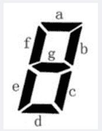

<!--yml
category: 蓝桥杯
date: 2022-04-26 11:23:45
-->

# 2020年第十一届C/C++ A组第二场蓝桥杯省赛真题_元气算法的博客-CSDN博客_蓝桥杯2020c++a

> 来源：[https://blog.csdn.net/kiwi_berrys/article/details/111466509](https://blog.csdn.net/kiwi_berrys/article/details/111466509)

> 这里是蓝桥杯历年的题目专栏，将会陆续更新将往年真题以及解答发布出来，欢迎各位小伙伴关注我吖，你们的点赞关注就是给我最好的动力！！！
> <font>每天更新一届真题，敬请期待</font>

[蓝桥杯历年真题及详细解答](https://blog.csdn.net/kiwi_berrys/article/details/111186204)

* * *

### 第一题：门牌制作

**题目描述**
小蓝要为一条街的住户制作门牌号。
这条街一共有 2020 位住户，门牌号从 1 到 2020 编号。
小蓝制作门牌的方法是先制作 0 到 9 这几个数字字符，最后根据需要将字符粘贴到门牌上，例如门牌 1017 需要依次粘贴字符 1、0、1、7，即需要 1 个字符 0，2 个字符 1，1 个字符 7。请问要制作所有的 1 到 2020 号门牌，总共需要多少个字符 2？
**题目分析**
暴力搜索，判断每个位置的字符是否满足条件
**题目代码**

```
#include<iostream>
using namespace std;
int calu(int num)
{
	int ans = 0;
	while(num)
	{
		if(num%10==2)
			ans++;
		num/=10;
	}
	return ans;
}
int main()
{
	int cnt = 0;
	for(int i = 1; i <=2020; i++)
	{
		cnt+=calu(i);
	}
	cout << cnt <<endl;
	return 0;
} 
```

**题目答案**

```
624 
```

* * *

### 第二题：既约分数

**题目描述**
如果一个分数的分子和分母的最大公约数是 1，这个分数称为既约分数。
例如，3/4 , 5/2 , 1/8 , 7/1 都是既约分数。
请问，有多少个既约分数，分子和分母都是 1 到 2020 之间的整数（包括 1 和 2020）？
**题目分析**
暴力搜索，通过最大公约数判断
**题目代码**

```
#include<iostream>
using namespace std;

int gcd(int a,int b)
{
	if(a%b==0)
		return b;
	else
		return gcd(b,a%b);
}
int main()
{
	int ans = 0;
	for(int i = 1; i <= 2020; i++)
	{
		for(int j = 1; j <= 2020; j++)
		{
			if(gcd(i,j)==1)
			{
				ans++;
			}
		}
	}
	cout << ans <<endl;
	return 0;
} 
```

**题目答案**

```
2481215 
```

* * *

### 第三题：蛇形填数

**题目描述**
如下图所示，小明用从 1 开始的正整数“蛇形”填充无限大的矩阵。
1 2 6 7 15 …
3 5 8 14 …
4 9 13 …
10 12 …
11 …
…
容易看出矩阵第二行第二列中的数是 5。请你计算矩阵中第 20 行第 20 列
的数是多少？
**题目分析**
可以将图形顺时针旋转45度，我们可以发现20行20列应该位于第49层的中间一个，然后模拟就可以算出来了

```
1行1列	       1
	  	      3 2
2行2列	     4 5 6
	        10 9 8 7
3行3列	 11 12 13 14 15
................. 
```

**题目代码**

```
#include<iostream>

using namespace std;

int main()
{

	int n = 20;
	n = n*2-1;
	int ans = 0,sum =  0;
	for(int i = 1; i <=n ;i++)
	{
		sum+=i; 
	} 
	ans = (sum+sum-n+1)/2;
	cout << ans <<endl;
	return 0;

} 
```

**题目答案**

```
761 
```

* * *

### 第四题：7段码

**题目描述**
小蓝要用七段码数码管来表示一种特殊的文字。
七段码上图给出了七段码数码管的一个图示，数码管中一共有 7 段可以发光的二极管，分别标记为 a, b, c, d, e, f, g。小蓝要选择一部分二极管（至少要有一个）发光来表达字符。在设计字符的表达时，要求所有发光的二极管是连成一片的。
例如：b 发光，其他二极管不发光可以用来表达一种字符。
例如：c 发光，其他二极管不发光可以用来表达一种字符。这种方案与上一行的方案可以用来表示不同的字符，尽管看上去比较相似。
例如：a, b, c, d, e 发光，f, g 不发光可以用来表达一种字符。
例如：b, f 发光，其他二极管不发光则不能用来表达一种字符，因为发光的二极管没有连成一片。
请问，小蓝可以用七段码数码管表达多少种不同的字符？


**题目分析**
**题目代码**

* * *

### 第五题：平面分割

**题目描述**
20 个圆和20 条直线最多能把平面分成多少个部分？
**题目分析**
**题目代码**

* * *

### 第六题：成绩统计

**题目描述**
小蓝给学生们组织了一场考试，卷面总分为100 分，每个学生的得分都是一个0 到100 的整数。请计算这次考试的最高分、最低分和平均分。
【输入格式】
输入的第一行包含一个整数n，表示考试人数。
接下来n 行，每行包含一个0 至100 的整数，表示一个学生的得分。

【输出格式】
输出三行。
第一行包含一个整数，表示最高分。
第二行包含一个整数，表示最低分。
第三行包含一个实数，四舍五入保留正好两位小数，表示平均分。

【样例输入】
7
80
92
56
74
88
99
10
【样例输出】
99
10
71.29
【评测用例规模与约定】
对于50% 的评测用例， 1 ≤ n ≤ 100。
对于所有评测用例，1 ≤ n ≤10000。
**题目分析**
**题目代码**

* * *

### 第七题：回文日期

**题目描述**
2020 年春节期间，有一个特殊的日期引起了大家的注意：2020年2月2日。因为如果将这个日期按“yyyymmdd” 的格式写成一个8 位数是20200202，
恰好是一个回文数。我们称这样的日期是回文日期。
有人表示20200202 是“千年一遇” 的特殊日子。对此小明很不认同，因为不到2年之后就是下一个回文日期：20211202 即2021年12月2日。
也有人表示20200202 并不仅仅是一个回文日期，还是一个ABABBABA型的回文日期。对此小明也不认同，因为大约100 年后就能遇到下一个ABABBABA 型的回文日期：21211212 即2121 年12 月12 日。算不上“千年一遇”，顶多算“千年两遇”。
给定一个8 位数的日期，请你计算该日期之后下一个回文日期和下一个ABABBABA型的回文日期各是哪一天。

【输入格式】
输入包含一个八位整数N，表示日期。

【输出格式】
输出两行，每行1 个八位数。第一行表示下一个回文日期，第二行表示下
一个ABABBABA 型的回文日期。

【样例输入】
20200202
【样例输出】
20211202
21211212
【评测用例规模与约定】
对于所有评测用例，10000101 ≤ N ≤ 89991231，保证N 是一个合法日期的8位数表示。
**题目分析**
**题目代码**

* * *

### 第八题：子串分值

**题目描述**
对于一个字符串S，我们定义S 的分值 f(S) 为S中恰好出现一次的字符个数。例如f (”aba”) = 1，f (”abc”) = 3, f (”aaa”) = 0。
现在给定一个字符串S[0…n-1]（长度为n），请你计算对于所有S的非空子串S[i…j](0 ≤ i ≤ j < n)， f (S[i… j]) 的和是多少。

【输入格式】
输入一行包含一个由小写字母组成的字符串S。

【输出格式】
输出一个整数表示答案。

【样例输入】
ababc
【样例输出】
21
【样例说明】
子串f值：

a 1
ab 2
aba 1
abab 0
ababc 1
b 1
ba 2
bab 1
babc 2
a 1
ab 2
abc 3
b 1
bc 2
c 1
【评测用例规模与约定】
对于20% 的评测用例，1 ≤ n ≤ 10；
对于40% 的评测用例，1 ≤ n ≤ 100；
对于50% 的评测用例，1 ≤ n ≤ 1000；
对于60% 的评测用例，1 ≤ n ≤ 10000；
对于所有评测用例，1 ≤ n ≤ 100000。
**题目分析**
**题目代码**

* * *

### 第九题：荒岛探测

**题目描述**
科学家小蓝来到了一个荒岛，准备对这个荒岛进行探测考察。小蓝使用了一个超声定位设备来对自己进行定位。为了使用这个设备，小蓝需要在不同的点分别安装一个固定的发射器和一个固定的接收器。小蓝手中还有一个移动设备。定位设备需要从发射器发射一个信号到移动设备，移动设备收到后马上转发，最后由接收器接收，根据这些设备之间传递的时间差就能计算出移动设备距离发射器和接收器的两个距离，从而实现定位。
小蓝在两个位置已经安装了发射器和接收器，其中发射器安装在坐标 ( x A , y A ) (x_A, y_A) (xA?,yA?)，接收器安装在坐标 ( x B , y B ) (x_B, y_B) (xB?,yB?)。小蓝的发射器和接收器可能在岛上，也可能不在岛上。小蓝的定位设备设计有些缺陷，当发射器到移动设备的距离加上移动设备到接收器的距离之和大于L 时，定位设备工作不正常。当和小于等于L 时，定位设备工作正常。为了安全，小蓝只在定位设备工作正常的区域探测考察。
已知荒岛是一个三角形，三个顶点的坐标分别为 ( x 1 , y 1 ) (x_1, y_1) (x1?,y1?), ( x 2 , y 2 ) (x_2, y_2) (x2?,y2?), ( x 3 , y 3 ) (x_3, y_3) (x3?,y3?)。
请计算，小蓝在荒岛上可以探测到的面积有多大？

【输入格式】
输入的第一行包含五个整数，分别为 x A , y A , x B , y B , L x_A, y_A, x_B, y_B, L xA?,yA?,xB?,yB?,L。
第二行包含六个整数，分别为 x 1 , y 1 , x 2 , y 2 , x 3 , y 3 x_1, y_1, x_2, y_2, x_3, y_3 x1?,y1?,x2?,y2?,x3?,y3?。

【输出格式】
输出一行，包含一个实数，四舍五入保留2位小数，表示答案。
考虑到计算中的误差，只要你的输出与参考输出相差不超过0.01即可得分。

【样例输入】
10 6 4 12 12
0 2 13 2 13 15
【样例输出】
39.99
【样例说明】
当输出为39.98、39.99或40.00时可以得分。
**题目分析**
**题目代码**

* * *

### 第十题：字串排序

**题目描述**
小蓝最近学习了一些排序算法，其中冒泡排序让他印象深刻。在冒泡排序中，每次只能交换相邻的两个元素。小蓝发现，如果对一个字符串中的字符排序，只允许交换相邻的两个字符，则在所有可能的排序方案中，冒泡排序的总交换次数是最少的。
例如，对于字符串 lan 排序，只需要 1 次交换。对于字符串 qiao 排序，
总共需要 4 次交换。小蓝找到了很多字符串试图排序，他恰巧碰到一个字符串，需要 V 次交换，可是他忘了把这个字符串记下来，现在找不到了。
请帮助小蓝找一个只包含小写英文字母且没有字母重复出现的字符串，对该串的字符排序，正好需要 V 次交换。如果可能找到多个，请告诉小蓝最短的那个。如果最短的仍然有多个，请告诉小蓝字典序最小的那个。请注意字符串中可以包含相同的字符。

【输入格式】
输入的第一行包含一个整数V，小蓝的幸运数字。

【输出格式】
题面要求的一行字符串。

【样例输入】
4
【样例输出】
bbaa
【评测用例规模与约定】
漏掉了没保存上
大概是：
对于20% 的评测用例，1 ≤ n ≤ 20；
对于50% 的评测用例，1 ≤ n ≤ 100；
对于100% 的评测用例，1 ≤ n ≤ 10000；
**题目分析**
**题目代码**

* * *