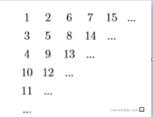
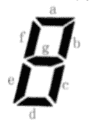

<!--yml
category: 蓝桥杯
date: 2022-04-26 11:06:57
-->

# 2020年第十一届蓝桥杯省赛试题及详解（Java本科A组）_跟老程一起学编程的博客-CSDN博客_蓝桥杯2020a组

> 来源：[https://blog.csdn.net/future277809183/article/details/122875916](https://blog.csdn.net/future277809183/article/details/122875916)

[【蓝桥杯】历年真题题目及题解汇总](https://blog.csdn.net/future277809183/article/details/122826573 "【蓝桥杯】历年真题题目及题解汇总")

* * *

1.  结果填空 (满分5分)
2.  结果填空 (满分5分)
3.  结果填空 (满分10分)
4.  结果填空 (满分10分)
5.  结果填空 (满分15分)
6.  程序设计（满分15分）
7.  程序设计（满分20分）
8.  程序设计（满分20分）

* * *

## 第一题: 门牌制作

【问题描述】
小蓝要为一条街的住户制作门牌号。
这条街一共有 2020 位住户，门牌号从 1 到 2020 编号。
小蓝制作门牌的方法是先制作 0 到 9 这几个数字字符，最后根据需要将字
符粘贴到门牌上，例如门牌 1017 需要依次粘贴字符 1、 0、 1、 7，即需要 1 个
字符 0， 2 个字符 1， 1 个字符 7。
请问要制作所有的 1 到 2020 号门牌，总共需要多少个字符 2？
**答案：624**

```
 public class Main {

	public static void main(String[] args) {
		int res = 0;
		for(int i=1; i<=2020; ++i) {
			int t = i;
			while(t>0) {
				if(t%10 == 2) {
					++ res;
				}
				t /= 10;
			}
		}
		System.out.println(res);		//624

	}

} 
```

# 第二题: 既约分数

如果一个分数的分子和分母的最大公约数是 1，这个分数称为既约分数。
例如，3/4，5/2，1/8，7/1都是既约分数。
请问，有多少个既约分数，分子和分母都是1到2020之间的整数（包括 1和 2020）？

**答案：2481215**

```
 public class Main {

	public static void main(String[] args) {
		int ans = 0;
		for(int i=1; i<=2020; ++i) 
			for(int j=1; j<=2020; ++j) 
				if(gcd(i, j) == 1) 
					++ ans;
		System.out.println(ans);
	}

	public static int gcd(int a, int b) {
		if (a == 0 || b == 0)
			return 0;
		return a % b == 0 ? b : gcd(b, a % b);
	}

} 
```

# 第三题: 蛇形填数

如下图所示，小明用从 1 开始的正整数“蛇形”填充无限大的矩阵。



容易看出矩阵第二行第二列中的数是 5。请你计算矩阵中第 20 行第 20 列 的数是多少？

**答案：761**

```
 public class Main {

	public static void main(String[] args) {
		int res = 1, t = 4;

		for(int i=2; i<=20; ++i) {
			res += t;
			t += 4;
		}

		System.out.println(res);		//761
	}

} 
```

## **第四题：七段码 **

【问题描述】
小蓝要用七段码数码管来表示一种特殊的文字。



上图给出了七段码数码管的一个图示，数码管中一共有 7 段可以发光的二极管，分别标记为 a, b, c, d, e, f, g。
小蓝要选择一部分二极管（至少要有一个）发光来表达字符。在设计字符的表达时，要求所有发光的二极管是连成一片的。

例如： b 发光，其他二极管不发光可以用来表达一种字符。
例如： c 发光，其他二极管不发光可以用来表达一种字符。这种 方案与上 一行的方案可以用来表示不同的字符，尽管看上去比较相似。
例如： a, b, c, d, e 发光， f, g 不发光可以用来表达一种字符。
例如： b, f 发光，其他二极管不发光则不能用来表达一种字符，因为发光 的二极管没有连成一片。
请问，小蓝可以用七段码数码管表达多少种不同的字符？

【答案提交】
这是一道结果填空的题，你只需要算出结果后提交即可。本题的结果为一个整数，在提交答案时只填写这个整数，填写多余的内容将无法得分
**答案：80**

**第五题: 平面分割**

【问题描述】

20个圆和20条直线最多能把平面分成多少部分？

这是一道结果填空的题，你只需要算出结果后提交即可。本题的结果为一个整数，在提交答案时只填写这个整数，填写多余的内容将无法得分。

**【待续】**

# 第六题: 成绩分析

【问题描述】
小蓝给学生们组织了一场考试，卷面总分为 100 分，每个学生的得分都是 一个 0 到 100 的整数。

请计算这次考试的最高分、最低分和平均分。

【输入格式】
输入的第一行包含一个整数 n，表示考试人数。 接下来 n 行，每行包含一个 0 至 100 的整数，表示一个学生的得分。

【输出格式】
输出三行。
第一行包含一个整数，表示最高分。
第二行包含一个整数，表示最低分。
第三行包含一个实数，四舍五入保留正好两位小数，表示平均分。

【样例输入】
7
80
92
56
74
88
99
10

【样例输出】
99
10
71.29

【评测用例规模与约定】
对于 50% 的评测用例，1≤n≤100。
对于所有评测用例，1≤n≤10000。

```
 import java.util.Scanner;

public class Main {

	public static void main(String[] args) {
		Scanner sc = new Scanner(System.in);

		int n = sc.nextInt();
		int max = Integer.MIN_VALUE, min = Integer.MAX_VALUE;
		double sum = 0;
		for(int i=0; i<n; ++i) {
			int t = sc.nextInt();
			sum += t;
			max = t>max?t:max;
			min = t<min?t:min;
		}
		System.out.println(max);
		System.out.println(min);
		System.out.println(String.format("%.2f", sum/n));
	}

} 
```

# 第七题: 回文日期

【问题描述】
2020年春节期间，有一个特殊的日期引起了大家的注意：2020年2月2日。因为如果将这个日期按 yyyymmdd 的格式写成一个8位数是 20200202 ，恰好是一个回文数。我们称这样的日期是回文日期。

有人表示 20200202 是“千年一遇”的特殊日子。对此小明很不认同，因为不到2年之后就是下一个回文日期：20211202 即2021年12月2日。

也有人表示 20200202 并不仅仅是一个回文日期，还是一个 ABABBABA 型的回文日期。对此小明也不认同，因为大约 100 年后就能遇到下一个 ABABBABA 型的回文日期：21211212 即2121年12月12日。算不上“千年一遇”，顶多算“千年两遇”。

给定一个8位数的日期，请你计算该日期之后下一个回文日期和下一个 ABABBABA 型的回文日期各是哪一天。

【输入格式】
输入包含一个八位整数 ，表示日期。

【输出格式】
输出两行，每行1个八位数。
第一行表示下一个回文日期，第二行表示下一个 型的回文日期。

【样例输入】
20200202

【样例输出】
20211202
21211212

【评测用例规模与约定】
对于所有评测用例，10000101<=N<=89991231， 保证 N 是一个合法日期的 8 位数表示

```
 import java.util.Scanner;

public class Main{

	static int n;
	static String sn;
	static int curyear, curmm, curdd;
	static String ans1, ans2;
	static boolean v1, v2;

	public static void main(String[] args) {
		Scanner sc = new Scanner(System.in);
		n = sc.nextInt();
		sn = String.valueOf(n);
		curyear = Integer.parseInt(sn.substring(0, 4));
		curmm = Integer.parseInt(sn.substring(4, 6));
		curdd = Integer.parseInt(sn.substring(6, 8));
		int end = curyear + 200;
		for (int i = curyear; i <= end; ++i) {
			if (checkPing(i)) {
				if (!v1) {
					ans1 = i + "" + new StringBuilder(String.valueOf(i)).reverse().toString();
					v1 = true;
				}
				String si = String.valueOf(i);
				if ((si.substring(0, 2).equals(si.substring(2, 4))) && !v2) {
					ans2 = i + "" + new StringBuilder(String.valueOf(i)).reverse().toString();
					v2 = true;
				}
				if (v1 && v2)
					break;
			}
		}
		System.out.println(ans1);
		System.out.println(ans2);
	}

	static int[] days = new int[] { 0, 31, 28, 31, 30, 31, 30, 31, 31, 30, 31, 30, 31 };

	public static boolean checkPing(int x) {
		String sy = new StringBuilder(String.valueOf(x)).reverse().toString();
		int mm = Integer.parseInt(sy.substring(0, 2)), dd = Integer.parseInt(sy.substring(2, 4));
		if (mm < 1 || mm > 12)
			return false;
		if ((mm == 2 && (x % 4 == 0 && x % 100 != 0 || x % 400 == 0)) && (dd < 1 || dd > 29))
			return false;
		else if (dd < 1 || dd > days[mm])
			return false;
		if (x == curyear && (mm < curmm || mm == curmm && dd <= curdd))
			return false;
		return true;
	}

} 
```

# 第八题: 子串分值

【问题描述】
对于一个字符串 S，我们定义 S 的分值 f(S) 为 S 中恰好出现一次的字符个数。例如 f(“aba”)=1，f(“abc”)=3, f(“aaa”)=0。

现在给定一个字符串 S[0…n-1]（长度为 n），请你计算对于所有 S 的非空子串 S[i…j] (0<=i<=j<n)，f(S[i…j])的和是多少。

【输入格式】
输入一行包含一个由小写字母组成的字符串 S。

【输出格式】
输出一个整数表示答案。

【样例输入】
ababc

【样例输出】
21

【样例说明】
子串 f值
a 1
ab 2
aba 1
abab 0
ababc 1
b 1
ba 2
bab 1
babc 2
a 1
ab 2
abc 3
b 1
bc 2
c 1

【评测用例规模与约定】
对于 20% 的评测用例，1<=n<=10；
对于 40% 的评测用例，1<=n<=100；
对于 50% 的评测用例，1<=n<=1000；
对于 60% 的评测用例，1<=n<=10000；
对于所有评测用例，1<=n<=100000

```
 import java.util.Arrays;
import java.util.Scanner;

public class Main{

	public static void main(String[] args) {
		Scanner sc = new Scanner(System.in);
		char[] rv = sc.next().toCharArray();
		int[][] dr = new int[26][2];
		for (int i = 0; i < 26; ++i)
			Arrays.fill(dr[i], -1);
		int ans = 0, total = 0;
		for (int i = 0; i < rv.length; ++i) {
			int ind = rv[i] - 'a';
			total += i - 2 * dr[ind][1] + dr[ind][0];
			dr[ind][0] = dr[ind][1];
			dr[ind][1] = i;
			ans += total;
		}
		System.out.println(ans);
	}

} 
```