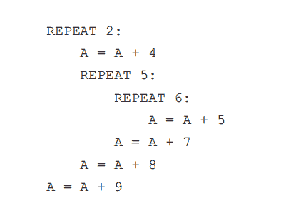

<!--yml
category: 蓝桥杯
date: 2022-04-26 11:07:17
-->

# 2020年第十一届蓝桥杯省赛试题及详解（Java高职高专C组）_跟老程一起学编程的博客-CSDN博客_第十一届蓝桥杯题目

> 来源：[https://blog.csdn.net/future277809183/article/details/123290515](https://blog.csdn.net/future277809183/article/details/123290515)

[【蓝桥杯】历年真题题目及题解汇总](https://blog.csdn.net/future277809183/article/details/122826573 "【蓝桥杯】历年真题题目及题解汇总")

* * *

1.  结果填空 (满分5分)
2.  结果填空 (满分5分)
3.  结果填空 (满分10分)
4.  结果填空 (满分10分)
5.  结果填空 (满分15分)
6.  程序设计（满分15分）
7.  程序设计（满分20分）
8.  程序设计（满分20分）
9.  程序设计（满分20分）
10.  程序设计（满分25分）

* * *

## **第一题：指数计算**

问题描述】

7 月 1 日是建党日，从 1921 年到 2020 年， 已经带领中国人民

走过了 99 年。

请计算：7 ^ 2020 mod 1921，其中 A mod B 表示 A 除以 B 的余数

```
import java.math.BigInteger;

public class Main {
    public static void main(String[] args) {
        BigInteger num1 = new BigInteger("7");
        BigInteger num2 = new BigInteger("1921");
        BigInteger num3=num1.pow(2020).remainder(num2);
        System.out.println(num3);
    }
}
```

## **第二题： 解密**

【问题描述】

小明设计了一种文章加密的方法：对于每个字母 c，将它变成某个另外的

字符 Tc。下表给出了字符变换的规则：

| **字母c** | **Tc** | **字母c** | **Tc** | **字母c** | **Tc** | **字母c** | **Tc** |
| a | y | n | l | A | Y | N | L |
| b | x | o | g | B | X | O | G |
| c | m | p | o | C | M | P | O |
| d | d | q | u | D | D | Q | U |
| e | a | r | f | E | A | R | F |
| f | c | s | s | F | C | S | S |
| g | i | t | z | G | I | T | Z |
| h | k | u | p | H | K | U | P |
| i | n | v | w | I | N | V | W |
| j | t | w | b | J | T | W | B |
| k | j | x | r | K | J | X | R |
| l | h | y | e | L | H | Y | E |
| m | q | z | v | M | Q | Z | V |

例如，将字符串 YeRi 加密可得字符串 EaFn。

小明有一个随机的字符串，加密后为

EaFnjISplhFviDhwFbEjRjfIBBkRyY

（由 30 个大小写英文字母组成，不包含换行符），请问原字符串是多少？

（如果你把以上字符串和表格复制到文本文件中，请务必检查复制的内容

是否与文档中的一致。在试题目录下有一个文件 str.txt，第一行为上面的字符

串，后面 52 行依次为表格中的内容。）

【答案提交】

这是一道结果填空题，你只需要算出结果后提交即可。本题的结果为一个

只包含 30 个大小写英文字母的字符串，在提交答案时只填写这个字符串，填写

```
import java.util.HashMap;
import java.util.Scanner;

public class Main {
    public static void main(String[] args) {
        HashMap<Character,Character> map = new HashMap<>();
        Scanner sc = new Scanner(System.in);

        for (int i = 0;i<52;i++){
            char a = sc.next().trim().charAt(0);
            char b = sc.next().trim().charAt(0);
            map.put(b,a);
        }
        String s = sc.next();
        sc.close();

        char[] num = s.toCharArray();
        for (char c:num){
            System.out.print(map.get(c));
        }
    }
}
```

## **第三题：跑步训练**

【问题描述】

小明要做一个跑步训练。

初始时，小明充满体力，体力值计为 10000。如果小明跑步，每分钟损耗

600 的体力。如果小明休息，每分钟增加 300 的体力。体力的损耗和增加都是

均匀变化的。

小明打算跑一分钟、休息一分钟、再跑一分钟、再休息一分钟……如此循

环。如果某个时刻小明的体力到达 0，他就停止锻炼。

请问小明在多久后停止锻炼。为了使答案为整数，请以秒为单位输出答案。

答案中只填写数，不填写单位。

【答案提交】

这是一道结果填空题，你只需要算出结果后提交即可。本题的结果为一个

整数，在提交答案时只填写这个整数，填写多余的内容将无法得分。

```
public class Main {
    public static void main(String[] args) {
        int target = 10000;
        int count = 0;
        boolean flag = true;
        while (true) {
            //如果小于600体力并且需要跑步，证明这一分钟跑不完
            if (target < 600 && flag){
                break;
            }
            if (flag) {
                target -= 600;
                flag = false;
            } else {
                target += 300;
                flag = true;
            }
            count++;
        }
//        System.out.println(count);
        //最后要求秒数，一分钟花费600体力，一秒花费10体力，体力除10就是剩下的跑步时间
        int time = count * 60+target/10;
        System.out.println(time);
    }
}
```

## **第四题：合并检测**

【问题描述】

最近存在A病，最近在 A 国蔓延，为了尽快控制病*，A 国准

备给大量民众进病*检测。

然而，用于检测的试剂盒紧缺。

为了解决这一困难，科学家想了一个办法：合并检测。即将从多个人（k

个）采集的标本放到同一个试剂盒中进行检测。如果结果为阴性，则说明这 k

个人都是阴性，用一个试剂盒完成了 k 个人的检测。如果结果为阳性，则说明

至少有一个人为阳性，需要将这 k 个人的样本全部重新独立检测（从理论上看，

如果检测前 k 1 个人都是阴性可以推断出第 k 个人是阳性，但是在实际操作中

不会利用此推断，而是将 k 个人独立检测），加上最开始的合并检测，一共使用

了 k + 1 个试剂盒完成了 k 个人的检测。

A 国估计被测的民众的感染率大概是 1%，呈均匀分布。请问 k 取多少能

最节省试剂盒？

【答案提交】

这是一道结果填空题，你只需要算出结果后提交即可。本题的结果为一个

整数，在提交答案时只填写这个整数，填写多余的内容将无法得分。

```
public class Main {
	public static void main(String[] args) {
		int min = 999990;
		int ans = -1;
		for (int i = 1; i <= 100; i++) { // i个人一块测
			int temp;
			if (100 % i != 0) {
				temp = 100 / i + i + 1;
			} else {
				temp = 100 / i + i;
			}
			if (min > temp) {
				min = temp;
				ans = i;
			}
		}
		System.out.println(ans);
	}
} 
```

## **第五题：REPEAT 程序**

【问题描述】

附件 prog.txt 中是一个用某种语言写的程序。

其中 REPEAT k 表示一个次数为 k 的循环。循环控制的范围由缩进表达，

从次行开始连续的缩进比该行多的（前面的空白更长的）为循环包含的内容。

例如如下片段：

REPEAT 2:

A = A + 4

REPEAT 5:

REPEAT 6:

A = A + 5

A = A + 7

A = A + 8

A = A + 9



A = A + 4 所在的行到 A = A + 8 所在的行都在第一行的

循环两次中。

REPEAT 6: 所在的行到 A = A + 7 所在的行都在 REPEAT 5: 循环中。

A = A + 5 实际总共的循环次数是 2 × 5 × 6 = 60 次。

请问该程序执行完毕之后，A 的值是多少？

【答案提交】

这是一道结果填空题，你只需要算出结果后提交即可。本题的结果为一个

整数，在提交答案时只填写这个整数，填写多余的内容将无法得分。

```
import java.util.Scanner;
public class Main {
    public static void main(String[] args) {
        int[] layer = new int[10000];
        int[] count = new int[10000];
        Scanner sc = new Scanner(System.in);
        int pointer = 0, result = 0, curCount = 1;
       sc.nextLine();
        layer[pointer] = -1; count[pointer] = 1;
        while (sc.hasNext()) {
            String ss = sc.nextLine();
            if (ss.equals("0")){
                break;
            }
            char[] s = ss.toCharArray();
            int n = s.length, p = 0;
            while (s[p] == ' ') p++; // 统计缩进
            // 判断是不是在一层，如果当前层数小于上一次的层数，循环的次数就要除上一次的循环数
            while (layer[pointer] >= p) curCount /= count[pointer--];
            if (s[n - 1] == ':') { // 当前行是循环
                //k为循环的次数
                int k = s[n - 2] - '0';
                //循环又往里走了一层
                pointer = pointer + 1;
                //w为循环次数
                curCount *= k;
                //a放的是当前层数是多少个空格
                //b放地是当前循环的次数
                layer[pointer] = p;count[pointer] = k;
            } else {
                //证明这个是A加值，k为A加的值
                int k = s[n - 1] - '0';
                //w是循环的次数
                result += k * curCount;
            }
        }
        System.out.println(result);
    }
}
```

## **第六题：分类计数**

【问题描述】

输入一个字符串，请输出这个字符串包含多少个大写字母，多少个小写字

母，多少个数字。

【输入格式】

输入一行包含一个字符串。

【输出格式】

输出三行，每行一个整数，分别表示大写字母、小写字母和数字的个数。

【样例输入】

1+a=Aab

【样例输出】

1

3

1

【评测用例规模与约定】

对于所有评测用例，字符串由可见字符组成，长度不超过 100

```
import java.util.Scanner;

public class Main {
    public static void main(String[] args) {
        Scanner sc = new Scanner(System.in);
        String s = sc.next();
        sc.close();
        char[] num = s.toCharArray();
        int upp=0,low=0,nums=0;
        for (char c:num){
            if(Character.isUpperCase(c)){
                ++upp;
            } else if(Character.isLowerCase(c)){
                ++low;
            } else if(Character.isDigit(c)){
                ++nums;
            }
        }
        System.out.println(upp);
        System.out.println(low);
        System.out.println(nums);
    }
}
```

## **第七题：整除序列**

【问题描述】

有一个序列，序列的第一个数是 n，后面的每个数是前一个数整除 2，请输

出这个序列中值为正数的项。

【输入格式】

输入一行包含一个整数 n。

【输出格式】

输出一行，包含多个整数，相邻的整数之间用一个空格分隔，表示答案。

【样例输入】

20

【样例输出】

20 10 5 2 1

【评测用例规模与约定】

对于 80% 的评测用例，1 ≤ n ≤ 109。

对于所有评测用例，1 ≤ n ≤ 1018

```
import java.util.Scanner;

public class Main {
    public static void main(String[] args) {
        Scanner sc = new Scanner(System.in);
        int n = sc.nextInt();
        sc.close();
        while (n != 0) {
            System.out.print(n + " ");
            n = n >> 1;//等价于/2，位运算相对快一些
        }
    }
}
```

## **第八题：走方格**

【问题描述】

在平面上有一些二维的点阵。

这些点的编号就像二维数组的编号一样，从上到下依次为第 1 至第 n 行，

从左到右依次为第 1 至第 m 列，每一个点可以用行号和列号来表示。

现在有个人站在第 1 行第 1 列，要走到第 n 行第 m 列。只能向右或者向下

走。

注意，如果行号和列数都是偶数，不能走入这一格中。

问有多少种方案。

【输入格式】

输入一行包含两个整数 n, m。

【输出格式】

输出一个整数，表示答案。

【样例输入】

3 4

【样例输出】

2

【样例输入】

6 6

【样例输出】

0

【评测用例规模与约定】

对于所有评测用例，1 ≤ n ≤ 30, 1 ≤ m ≤ 30

```
import java.util.Scanner;

public class Main {
    public static void main(String[] args) {
        //输入矩阵的宽高
        Scanner sc = new Scanner(System.in);
        int n = sc.nextInt();
        int m = sc.nextInt();
        sc.close();
        int[][] dp = new int[n][m];
        dp[0][0]=1;
        //这个规律是只能往右下走，也就是只能取左上的值
        for (int i=0;i<n;i++){
            for(int j=0;j<m;j++){
                //第一行一列无需处理
                 if(i==0 && j==0){
                     continue;
                 }
                 //只要不是第一行就可以取上面的
                 if(i>0){
                     dp[i][j]+=dp[i-1][j];
                 }
                 //只要不是第一列就可以取左面的
                 if(j>0){

                     dp[i][j]+=dp[i][j-1];
                 }
                 //如果是偶数行列不能取值，这里是奇数，因为我的是从0开始，所以偶数的就变成了奇数
                 if((i&1)==1 && (j&1)==1){
                     dp[i][j]=0;
                 }
            }
        }
        System.out.println(dp[n-1][m-1]);
    }
}
```

## **第九题：字符串编码**

【问题描述】

小明发明了一种给由全大写字母组成的字符串编码的方法。对于每一个大

写字母，小明将它转换成它在 26 个英文字母中序号，即 A → 1, B → 2, … Z →

26。

这样一个字符串就能被转化成一个数字序列：

比如 ABCXYZ → 123242526。

现在给定一个转换后的数字序列，小明想还原出原本的字符串。当然这样

的还原有可能存在多个符合条件的字符串。小明希望找出其中字典序最大的字

符串。

【输入格式】

一个数字序列。

【输出格式】

一个只包含大写字母的字符串，代表答案

【样例输入】

123242526

【样例输出】

LCXYZ

【评测用例规模与约定】

对于 20% 的评测用例，输入的长度不超过 20。

对于所有评测用例，输入的长度不超过 200000

```
import java.util.Scanner;

public class Main {
    public static void main(String[] args) {
        Scanner sc = new Scanner(System.in);
        String s = sc.next();
        sc.close();
        StringBuilder sb = new StringBuilder();

        int len = s.length();
        char[] num = s.toCharArray();
        for (int i = 0; i < len; i++) {
            //1开头
            if (num[i] == '1') {
                //第i+2位是否为0，如果为0，当前位就不能和i+1位合并成一个字母
                if (i < len - 2) {
                    //不为0
                    if (num[i + 2] != '0') {
//                        System.out.println((num[i]-'0') * 10 + num[i + 1] + 'A' -1 -'0' );
                        sb.append((char) ((num[i] - '0') * 10 + num[i + 1] + 'A' - 1 - '0'));
                        ++i;
                        // 为0，当前位就不能和i+1位合并成一个字母，（如果合成字母，剩下一个0没办法转换）
                    } else {
                        sb.append((char) (num[i] - '0' + 'A' - 1));
                    }
                    //i+2已超过尽头
                } else {
                    //看i+1位是否存在
                    if (i < len - 1) {

                        sb.append((char) ((num[i] - '0') * 10 + num[i + 1] + 'A' - 1 - '0'));
                        //不存在，第i位为最后一位
                    } else {
                        sb.append((char) (num[i] - '0' + 'A' - 1));
                    }
                    break;
                }
                //2开头
            } else if (num[i] == '2') {
                //看存不存在下一位
                if (i < len - 1) {
                    //看下一位是不是小于6，因为字母的大小不能超过26
                    if (num[i + 1] <= '6') {
                        //看第i+2位是否存在
                        if (i < len - 2) {
                            //看第i+2位是否=0
                            if (num[i + 2] != '0') {
                                sb.append((char) ((num[i] - '0') * 10 + num[i + 1] + 'A' - 1 - '0'));
                                ++i;
                                // 为0，当前位就不能和i+1位合并成一个字母，（如果合成字母，剩下一个0没办法转换）
                            } else {
                                sb.append((char) (num[i] - '0' + 'A' - 1));
                            }
                            //不存在的话，就直接添加就行
                        } else {
                            sb.append((char) ((num[i] - '0') * 10 + num[i + 1] + 'A' - 1 - '0'));
                            break;
                        }
                        //如果大于6，证明不能和后一位合并
                    } else {
                        sb.append((char) (num[i] - '0' + 'A' - 1));
                    }
                    //不存在下一位，这一位就直接放进去
                } else {
                    sb.append((char) (num[i] - '0' + 'A' - 1));
                }
                //如果大于2的话，就直接添加就行，字母没有2以上开头的
            } else {
                sb.append((char) (num[i] - '0' + 'A' - 1));
            }
        }
        System.out.println(sb.toString());
    }

    public static char getUppLetter(int num) {
        System.out.println((char) (num));
        return (char) (num);
    }
}
```

## **第十题：整数小拼接**

【问题描述】

给定义个长度为 n 的数组 A1, A2, · · · , An。你可以从中选出两个数 Ai 和 Aj (i 不等于 j)，然后将 Ai 和 Aj 一前一后拼成一个新的整数。例如 12 和 345 可

以拼成 12345 或 34512 。注意交换 Ai 和 Aj 的顺序总是被视为 2 种拼法，即便

是 Ai = Aj 时。

请你计算有多少种拼法满足拼出的整数小于等于 K。

【输入格式】

第一行包含 2 个整数 n 和 K。

第二行包含 n 个整数 A1, A2, · · · , An。

【输出格式】

一个整数代表答案。

【样例输入】

4 33

1 2 3 4

【样例输出】

8

【评测用例规模与约定】

对于 30% 的评测用例，1 ≤ N ≤ 1000, 1 ≤ K ≤ 108, 1 ≤ Ai ≤ 104。

对于所有评测用例，1 ≤ N ≤ 100000，1 ≤ K ≤ 1010，1 ≤ Ai ≤ 109

```
import java.util.Scanner;

public class Main {

    public static int[] num;
    static int n;

    public static void main(String[] args) {
        Scanner sc = new Scanner(System.in);
         n = sc.nextInt();
        int k = sc.nextInt();
        int[] temp = new int[n];
        num= new int[n];
        int max = -1;
        for (int i = 0; i < n; i++) {
            temp[i] = sc.nextInt();
            max = Math.max(temp[i],max);

        }
        sc.close();
        //上面是输入
        //下排个序，防止乱序数组

        int[] tempsort = new int[max+1];
        for (int i = 0; i < n; i++) {
           ++tempsort[temp[i]];
        }
        int index = 0;
        for (int i = 0; i <= max; i++) {
            while (tempsort[i]--!=0){
                num[index++]=i;
            }
        }
        //用于记录总数量
        int count = 0;
//        num = temp;
        //记录k有几位数
        int temp_k=1;
        while (k>=temp_k*10){
            temp_k*=10;
        }
        for (int i = temp_k; i >1; i/=10) {
            //看看小于等于k开头几位的数种最大的数（具体几位是从1位开始长的，找小于k/i的数）
            int tempa=num[binarySearch(0,n,k/i)-1];
            int tempb=1;
            while (k>=tempa*10){
                tempa*=10;
                tempb*=10;
            }
            //因为是拼接，tempb就是剩下的数
            tempb=k%i;
            int temptarget=0;
            //numa，numb就是找出来的小于k前半部分和后半部分的数量
            int numa=binarySearch(0,n,k/i);
            int numb=binarySearch(0,n,k%i);
            //如果找出来的这个数等于k开头的这个数，就说明，先以k开头取一份，后面的要小于等于k后面的数
            if(num[numa-1]==k/i){
                count+=numb-1;
                numa--;
                //然后在取小于k开头的，（等于k开头的上面求了），前面小于k开头，后面就是随便写，只要位数不超就行
                  temptarget=0;
                  //看看有几位
                while (tempb!=0){
                    temptarget=temptarget*10+9;
                    tempb/=10;
                }
                //找出来
                numb=binarySearch(0,n,temptarget);
            }
            //然后在取小于k开头的，前面小于k开头，后面就是随便写，只要位数不超就行
           else if(num[numa-1]<k/i){
                  temptarget=0;
                while (tempb!=0){
                    temptarget=temptarget*10+9;
                    tempb/=10;
                }
                numb=binarySearch(0,n,temptarget);
            }
            //k的拼接为两部分，前部分的数量*后部分的数量，还要-前部分的数量，防止前部分自身拼接
            count+=numa*numb-numa;
        }
        System.out.println(count);
    }
    //二分查找数组里面小于等于目标值的数
    public static int binarySearch(int left, int right, int target) {
        int mid = (left+right)/2;
        if((mid==right-1)||(num[mid]<=target && num[mid+1]>target) ){
            return mid+1;
        } else if(num[mid]<=target){
           return binarySearch(mid+1,right,target);
        } else{

           return binarySearch(left,mid,target);
        }
    }

}
```