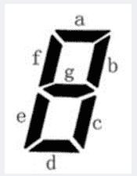

<!--yml
category: 蓝桥杯
date: 2022-04-26 11:24:03
-->

# 2020年第十届C/C++ B组第二场蓝桥杯省赛真题_元气算法的博客-CSDN博客_蓝桥杯真题

> 来源：[https://blog.csdn.net/kiwi_berrys/article/details/111461536](https://blog.csdn.net/kiwi_berrys/article/details/111461536)

> 这里是蓝桥杯历年的题目专栏，将会陆续更新将往年真题以及解答发布出来，欢迎各位小伙伴关注我吖，你们的点赞关注就是给我最好的动力！！！
> <font>每天更新一届真题，敬请期待</font>

[蓝桥杯历年真题及详细解答](https://blog.csdn.net/kiwi_berrys/article/details/111186204)

* * *

### 第一题：门牌制作

**题目描述**
小蓝要为一条街的住户制作门牌号。这条街一共有2020位住户，门牌号从1到2020编号。小蓝制作门牌的方法是先制作0到9这几个数字字符，最后根据需要将字符粘贴到门牌上，例如门牌1017需要依次粘贴字符1、0、1、7，即需要1个字符0，2个字符1，1个字符7。请问要制作所有的1到2020号门牌，总共需要多少个字符2？
**题目分析**
暴力搜索，判断每个位置的字符是否满足条件
**题目代码**

```
#include<iostream>
using namespace std;
int calu(int num)
{
	int ans = 0;
	while(num)
	{
		if(num%10==2)
			ans++;
		num/=10;
	}
	return ans;
}
int main()
{
	int cnt = 0;
	for(int i = 1; i <=2020; i++)
	{
		cnt+=calu(i);
	}
	cout << cnt <<endl;
	return 0;
} 
```

**题目答案**

```
624 
```

* * *

### 第二题：既约分数

**题目描述**
如果一个分数的分子和分母的最大公约数是1，这个分数称为既约分数。例如，3/4,5/2,1/8,7/1都是既约分数。请问，有多少个既约分数，分子和分母都是1到2020之间的整数（包括1和2020）
**题目分析**
暴力搜索，通过最大公约数判断
**题目代码**

```
#include<iostream>
using namespace std;

int gcd(int a,int b)
{
	if(a%b==0)
		return b;
	else
		return gcd(b,a%b);
}
int main()
{
	int ans = 0;
	for(int i = 1; i <= 2020; i++)
	{
		for(int j = 1; j <= 2020; j++)
		{
			if(gcd(i,j)==1)
			{
				ans++;
			}
		}
	}
	cout << ans <<endl;
	return 0;
} 
```

**题目答案**
2481215

```
在这里插入代码片 
```

* * *

### 第三题：蛇形填数

**题目描述**
如下图所示，小明用从1开始的正整数“蛇形”填充无限大的矩阵。容易看出矩阵第二行第二列中的数是5。请你计算矩阵中第20行第20列的数是多少？

```
1 2 6 7 15 …
3 5 8 14 …
4 9 13 …
10 12 …
11 … 
```

**题目分析**
可以将图形顺时针旋转45度，我们可以发现20行20列应该位于第49层的中间一个，然后模拟就可以算出来了

```
1行1列	       1
	  	      3 2
2行2列	     4 5 6
	        10 9 8 7
3行3列	 11 12 13 14 15
................. 
```

**题目代码**

```
#include<iostream>

using namespace std;

int main()
{

	int n = 20;
	n = n*2-1;
	int ans = 0,sum =  0;
	for(int i = 1; i <=n ;i++)
	{
		sum+=i; 
	} 
	ans = (sum+sum-n+1)/2;
	cout << ans <<endl;
	return 0;

} 
```

**题目答案**

```
761 
```

* * *

### 第四题：跑步锻炼

**题目描述**
小蓝每天都锻炼身体。正常情况下，小蓝每天跑1千米。如果某天是周一或者月初（1日），为了激励自己，小蓝要跑2千米。如果同时是周一或月初，小蓝也是跑2千米。小蓝跑步已经坚持了很长时间，从2000年1月1日周六（含）到2020年10月1日周四（含）。请问这段时间小蓝总共跑步多少千米？
**题目分析**
首先算出总的天数，和月份数，然后求出一共有多少个周一，和周一中为月份的天数
最后总天数+周一天数+月初天数 - 周一和月初重合天数
**题目代码**

```
#include<iostream>

using namespace std;
int run(int year)
{
	return (year%400==0)||(year%4==0&&year%100!=0);
}
int main()
{
	int monNum = 0,weekNum = 0,monWeek = 0,days = 0,ans = 0;
	int monDay[13] = {0,31,30,31,30,31,30,31,31,30,31,30,31};
	for(int i = 2000; i <= 2020; i++)
	{

		if(run(i)) 
			monDay[2] = 29;
		else 
			monDay[2] = 28;

		for(int j = 1; j <= 12; j++)
		{
			if(i==2020&&j==10) break;
			monNum += 1;
			days+=monDay[j];
			if((days+1)%7==3)
			{
				monWeek++;
			}

		}
	} 
	weekNum += days/7;
	if(days%7>=3) 
		weekNum++;

	ans = days+1 + weekNum +monNum+1 - monWeek;
	cout << ans <<endl;

	return 0;
} 
```

**题目答案**

```
8879 
```

* * *

### 第五题：七段码

**题目描述**
小蓝要用七段码数码管来表示一种特殊的文字。
七段码上图给出了七段码数码管的一个图示，数码管中一共有 7 段可以发光的二极管，分别标记为 a, b, c, d, e, f, g。小蓝要选择一部分二极管（至少要有一个）发光来表达字符。在设计字符的表达时，要求所有发光的二极管是连成一片的。
例如：b 发光，其他二极管不发光可以用来表达一种字符。
例如：c 发光，其他二极管不发光可以用来表达一种字符。这种方案与上一行的方案可以用来表示不同的字符，尽管看上去比较相似。
例如：a, b, c, d, e 发光，f, g 不发光可以用来表达一种字符。
例如：b, f 发光，其他二极管不发光则不能用来表达一种字符，因为发光的二极管没有连成一片。
请问，小蓝可以用七段码数码管表达多少种不同的字符？


**题目分析**
**题目代码**

* * *

### 第六题：成绩统计

**题目描述**
小蓝给学生们组织了一场考试，卷面总分为100分，每个学生的得分都是一个0到100的整数。如果得分至少是60分，则称为及格。如果得分至少为85分，则称为优秀。请计算及格率和优秀率，用百分数表示，百分号前的部分四舍五入保留整数。
【输入格式】 输入的第一行包含一个整数n，表示考试人数。接下来n行，每行包含一个0至100的整数，表示一个学生的得分。
【输出格式】 输出两行，每行一个百分数，分别表示及格率和优秀率。百分号前的部分四舍五入保留整数。
【样例输入】
7
80
92
56
74
88
100
0
【样例输出】
71%
43%

**题目分析**
**题目代码**

* * *

### 第七题：回文日期

**题目描述**
2020年春节期间，有一个特殊的日期引起了大家的注意：2020年2月2日。因为如果将这个日期按“yyyymmdd”的格式写成一个8位数是20200202，恰好是一个回文数。我们称这样的日期是回文日期。有人表示20200202是“千年一遇”的特殊日子。对此小明很不认同，因为不到2年之后就是下一个回文日期：20211202即2021年12月2日。也有人表示20200202并不仅仅是一个回文日期，还是一个ABABBABA型的回文日期。对此小明也不认同，因为大约100年后就能遇到下一个ABABBABA型的回文日期：21211212即2121年12月12日。算不上“千年一遇”，顶多算“千年两遇”。给定一个8位数的日期，请你计算该日期之后下一个回文日期和下一个ABABBABA型的回文日期各是哪一天。
【输入格式】
输入包含一个八位整数N，表示日期。
【输出格式】
输出两行，每行1个八位数。第一行表示下一个回文日期，第二行表示下一个ABABBABA型的回文日期。
【样例输入】
20200202
【样例输出】
20211202
21211212
【评测用例规模与约定】
对于所有评测用例，10000101 <= N <= 89991231，保证N是一个合法日期的8位数表示。
**题目分析**
**题目代码**

* * *

### 第八题：子串分值和

**题目描述**
对于一个字符串 S，我们定义 S 的分值 f (S ) 为 S 中出现的不同的字符个
数。例如 f (”aba”) = 2， f (”abc”) = 3, f (”aaa”) = 1。
现在给定一个字符串 S [0::n − 1]（长度为 n），请你计算对于所有 S 的非空
子串 S [i:: j](0 ≤ i ≤ j < n)， f (S [i:: j]) 的和是多少。
【输入格式】
输入一行包含一个由小写字母组成的字符串S。
【输出格式】
输出一个整数表示答案。
【样例输入】
ababc
【样例输出】
28
【样例说明】
子串 f值
a 1
ab 2
aba 2
abab 2
ababc 3
b 1
ba 2
bab 2
babc 3
a 1
ab 2
abc 3
b 1
bc 2
c 1

**题目分析**
**题目代码**

* * *

### 第九题：平面切分

**题目描述**
平面上有N 条直线，其中第i条直线是y = Ai x+Bi
请计算这些直线将平面分成了几个部分。
【输入格式】
输入的第一行包含一个整数N, 以下N行，包含两个证书 Ai，Bi
【输出格式】 一个整数代表答案
【样例输入】
31
1
2 2
3 3
【样例输出】
6

**题目分析**
**题目代码**

* * *

### 第十题：字串排序

**题目描述**
小蓝最近学习了一些排序算法，其中冒泡排序让他印象深刻。
在冒泡排序中，每次只能交换相邻的两个元素。小蓝发现，如果对一个字符串中的字符排序，只允许交换相邻的两个字符，则在所有可能的排序方案中，冒泡排序的总交换次数是最少的。
例如，对于字符串 lan 排序，只需要 1 次交换。对于字符串 qiao 排序，总共需要 4 次交换。
小蓝找到了很多字符串试图排序，他恰巧碰到一个字符串，需要 V 次交换，可是他忘了把这个字符串记下来，现在找不到了。
请帮助小蓝找一个只包含小写英文字母且没有字母重复出现的字符串，对该串的字符排序，正好需要 V 次交换。如果可能找到多个，请告诉小蓝最短的那个。如果最短的仍然有多个，请告诉小蓝字典序最小的那个。请注意字符串中可以包含相同的字符。
【输入格式】
输入的第一行包含一个整数V，小蓝的幸运数字。
【输出格式】
题面要求的一行字符串。
【样例输入】
4
【样例输出】
bbaa
【样例输入】
100
【样例输出】
jihgfeeddccbbaa

**题目分析**

**题目代码**

* * *