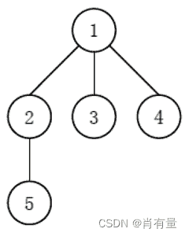
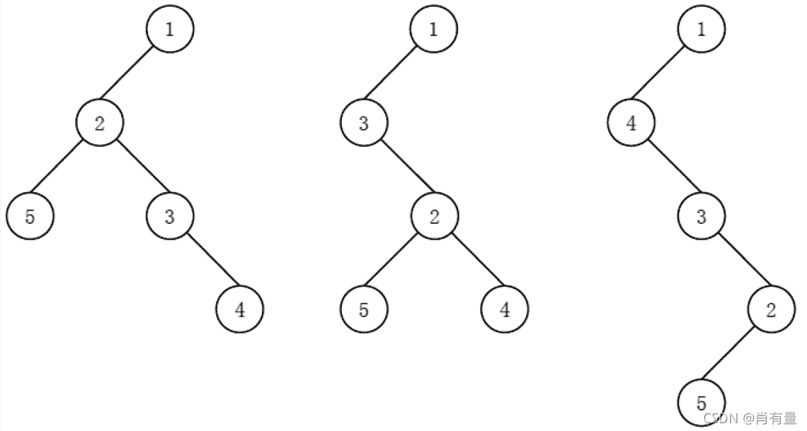

<!--yml
category: 蓝桥杯
date: 2022-04-26 11:06:56
-->

# 2021年04月18日第十二届蓝桥杯第一场省赛试题及详解（Java本科A组）_跟老程一起学编程的博客-CSDN博客_蓝桥杯2021省赛a组答案

> 来源：[https://blog.csdn.net/future277809183/article/details/123611815](https://blog.csdn.net/future277809183/article/details/123611815)

[【蓝桥杯】历年真题题目及题解汇总](https://blog.csdn.net/future277809183/article/details/122826573 "【蓝桥杯】历年真题题目及题解汇总")

* * *

1.  结果填空 (满分5分)
2.  结果填空 (满分5分)
3.  结果填空 (满分10分)
4.  结果填空 (满分10分)
5.  结果填空 (满分15分)
6.  程序设计（满分15分）
7.  程序设计（满分20分）
8.  程序设计（满分20分）
9.  程序设计（满分20分）
10.  程序设计（满分25分）

* * *

## **第一题：相乘**

**问题描述**

  小蓝发现，他将 1 1 1 至 1000000007 1000000007 1000000007 之间的不同的数与 2021 2021 2021 相乘后再求除以 1000000007 1000000007 1000000007 的余数，会得到不同的数。
  小蓝想知道，能不能在 1 1 1 至 1000000007 1000000007 1000000007 之间找到一个数，与 2021 2021 2021 相乘后再除以 1000000007 1000000007 1000000007 后的余数为 999999999 999999999 999999999。如果存在，请在答案中提交这个数；
  如果不存在，请在答案中提交 0 0 0

```
public class Main{

    public static void main(String[] args) { new Main().run(); }

    int a = 2021, b = 999999999, p = 1000000007;

    void run() {
        System.out.println(pow(a, p - 2) * b % p);
    }

    long pow(int a, int n) {
        if (n == 1) return a;
        long res = pow(a, n >> 1);
        res = res * res % p;
        return (n & 1) == 1 ? res * a % p : res;
    }
}
```

## **第二题： 直线**

**问题描述**

  在平面直角坐标系中，两点可以确定一条直线。如果有多点在一条直线上，那么这些点中任意两点确定的直线是同一条。
  给定平面上 2 × 3 2 × 3 2×3 个整点 { ( x , y ) ∣ 0 ≤ x < 2 , 0 ≤ y < 3 , x ∈ Z , y ∈ Z } \{(x, y)|0 ≤ x < 2, 0 ≤ y < 3, x ∈ Z, y ∈ Z\} {(x,y)∣0≤x<2,0≤y<3,x∈Z,y∈Z}，即横坐标是 0 0 0 到 1 1 1 (包含 0 0 0 和 1 1 1) 之间的整数、纵坐标是 0 0 0 到 2 2 2 (包含 0 0 0 和 2 2 2) 之间的整数的点。这些点一共确定了 11 11 11 条不同的直线。
  给定平面上 20 × 21 20 × 21 20×21 个整点 { ( x , y ) ∣ 0 ≤ x < 20 , 0 ≤ y < 21 , x ∈ Z , y ∈ Z } \{(x, y)|0 ≤ x < 20, 0 ≤ y < 21, x ∈ Z, y ∈ Z\} {(x,y)∣0≤x<20,0≤y<21,x∈Z,y∈Z}，即横坐标是 0 0 0 到 19 19 19 (包含 0 0 0 和 19 19 19) 之间的整数、纵坐标是 0 0 0 到 20 20 20 (包含 0 0 0 和 20 20 20) 之间的整数的点。请问这些点一共确定了多少条不同的直线

```
public class Main{

    public static void main(String[] args) { new Main().run(); }

    int X = 20, Y = 21;

    void run() {
        int count = 0;
        boolean[][][][] marked = new boolean[X][Y][X][Y];
        for (int x1 = 0; x1 < X; x1++)
            for (int y1 = 0; y1 < Y; y1++) {
                marked[x1][y1][x1][y1] = true;
                for (int x2 = 0; x2 < X; x2++)
                    for (int y2 = 0; y2 < Y; y2++) {
                        if (marked[x1][y1][x2][y2]) continue;
                        int x = x1, y = y1, xOffset = x - x2, yOffset = y - y2;
                        while (x >= 0 && x < X && y >= 0 && y < Y) {
                            x += xOffset;
                            y += yOffset;
                        }
                        x -= xOffset;
                        y -= yOffset;
                        while (x >= 0 && x < X && y >= 0 && y < Y) {
                            for (int i = x - xOffset, j = y - yOffset; i >= 0 && i < X && j >= 0 && j < Y; i -= xOffset, j -= yOffset) {
                                marked[x][y][i][j] = marked[i][j][x][y] = true;
                            }
                            x -= xOffset;
                            y -= yOffset;
                        }
                        count++;
                    }
            }
        System.out.println(count);
    }
}
```

## **第三题：货物摆放**

**问题描述**

  小蓝有一个超大的仓库，可以摆放很多货物。
  现在，小蓝有 n n n 箱货物要摆放在仓库，每箱货物都是规则的正方体。小蓝规定了长、宽、高三个互相垂直的方向，每箱货物的边都必须严格平行于长、宽、高。
  小蓝希望所有的货物最终摆成一个大的立方体。即在长、宽、高的方向上分别堆 L 、 W 、 H L、W、H L、W、H 的货物，满足 n = L × W × H n = L × W × H n=L×W×H。
  给定 n n n，请问有多少种堆放货物的方案满足要求。
  例如，当 n = 4 n = 4 n=4 时，有以下 6 6 6 种方案： 1 × 1 × 4 1×1×4 1×1×4、 1 × 2 × 2 1×2×2 1×2×2、 1 × 4 × 1 1×4×1 1×4×1、 2 × 1 × 2 2×1×2 2×1×2、 2 × 2 × 1 2 × 2 × 1 2×2×1、 4 × 1 × 1 4 × 1 × 1 4×1×1。
  请问，当 n = 2021041820210418 n = 2021041820210418 n=2021041820210418 （注意有 16 16 16 位数字）时，总共有多少种方案？
  提示：建议使用计算机编程解决问题

```
import java.util.ArrayList;
import java.util.List;

public class Main{

    public static void main(String[] args) { new Main().run(); }

    long N = 2021041820210418L;

    void run() {
        List<Integer> exps = new ArrayList();
        for (int k = 2; k <= N; k++)
            if (N % k == 0) {
                int e = 0;
                while (N % k == 0) {
                    N /= k;
                    e++;
                }
                exps.add(e);
            }
        exps.sort((a, b) -> (b - a));
        int n = 1, p = 2, ans = 0;
        for (int exp : exps) {
            for (int i = 2; i * i <= p; i++)
                if (p % i == 0) {
                    i = 1;
                    p++;
                }
            while (exp-- > 0) n *= p;
            p++;
        }
        for (int a = 1; a <= n; a++)
            if (n % a == 0)
                for (int b = 1; b <= n; b++)
                    if (n / a % b == 0) ans++;
        System.out.println(ans);
    }
}
```

## **第四题：路径**

**问题描述**

  小蓝学习了最短路径之后特别高兴，他定义了一个特别的图，希望找到图中的最短路径。
  小蓝的图由 2021 2021 2021 个结点组成，依次编号 1 1 1 至 2021 2021 2021。对于两个不同的结点 a , b a, b a,b，如果 a a a 和 b b b 的差的绝对值大于 21 21 21，则两个结点之间没有边相连；如果 a a a 和 b b b 的差的绝对值小于等于 21 21 21，则两个点之间有一条长度为 a a a 和 b b b 的最小公倍数的无向边相连。
  例如：结点 1 1 1 和结点 23 23 23 之间没有边相连；结点 3 3 3 和结点 24 24 24 之间有一条无向边，长度为 24 24 24；结点 15 15 15 和结点 25 25 25 之间有一条无向边，长度为 75 75 75。
  请计算，结点 1 1 1 和结点 2021 2021 2021 之间的最短路径长度是多少。
  提示：建议使用计算机编程解决问题

```
import java.util.PriorityQueue;
import java.util.ArrayList;
import java.util.Queue;
import java.util.List;

public class Main {

    public static void main(String[] args) { new Main().run(); }

    int N = 2021;

    void run() {
        boolean[] marked = new boolean[N + 1];
        List<Edge>[] graph = new List[N + 1];
        long[] distTo = new long[N + 1];
        for (int i = 1; i <= N; i++) {
            graph[i] = new ArrayList();
            distTo[i] = Long.MAX_VALUE;
        }
        for (int v = 1; v <  N; v++)
            for (int w = v + 1; w <= min(v + 21, N);  w++) {
                graph[v].add(new Edge(w, lcm(v, w)));
                graph[w].add(new Edge(v, lcm(v, w)));
            }
        Queue<Vertex> queue = new PriorityQueue();
        queue.offer(new Vertex(1, distTo[1] = 0));
        while (queue.size() > 0) {
            Vertex V = queue.poll();
            if (marked[V.v])
                    continue;
            marked[V.v] = true;
            for (Edge edge : graph[V.v])
                if (distTo[edge.w] > distTo[V.v] + edge.weight)
                    queue.offer(new Vertex(edge.w, distTo[edge.w] = distTo[V.v] + edge.weight));
        }
        System.out.println(distTo[N]);
    }

    int min(int a, int b) { return a < b ? a : b; }

    int lcm(int a, int b) { return a * b / gcd(a, b); }

    int gcd(int a, int b) { return b == 0 ? a : gcd(b, a % b); }

    class Edge {

        int w, weight;

        Edge(int w, int weight) {
            this.weight = weight;
            this.w = w;
        }
    }

    class Vertex implements Comparable<Vertex> {

        int v;
        long dist;

        Vertex(int v, long dist) {
            this.dist = dist;
            this.v = v;
        }

        @Override
        public int compareTo(Vertex V) { return Long.compare(this.dist, V.dist); }
    }
}
```

## **第五题：回路计数**

**问题描述**

  蓝桥学院由 21 21 21 栋教学楼组成，教学楼编号 1 1 1 到 21 21 21。对于两栋教学楼 a a a 和 b b b，当 a a a 和 b b b 互质时， a a a 和 b b b 之间有一条走廊直接相连，两个方向皆可通行，否则没有直接连接的走廊。
  小蓝现在在第一栋教学楼，他想要访问每栋教学楼正好一次，最终回到第一栋教学楼（即走一条哈密尔顿回路），请问他有多少种不同的访问方案？两个访问方案不同是指存在某个 i i i，小蓝在两个访问方法中访问完教学楼 i i i 后访问了不同的教学楼。
  提示：建议使用计算机编程解决问题

```
import java.util.ArrayList;
import java.util.List;

public class Main{

    public static void main(String[] args) { new Main().run(); }

    int N = 21;

    long[][] cnt = new long[N - 1][1 << N - 1];

    List<Integer>[] graph = new List[N];

    void run() {
        for (int i = 0; i < N; i++)
            graph[i] = new ArrayList();
        for (int i = 2; i <= N; i++)
            for (int j = 2; j < i; j++)
                if (gcd(i, j) == 1){
                    graph[i - 2].add(j - 2);
                    graph[j - 2].add(i - 2);
                }
        for (int i = 0; i < cnt.length; i++)
            for (int j = 0; j < cnt[i].length; j++) cnt[i][j] = -1;
        long sum = 0;
        for (int i = 0; i < N - 1; i++)
            sum += dfs(i, (1 << N - 1) - 1 - (1 << i));
        System.out.println(sum);
    }

    long dfs(int start, int status) {
        if (status == 0) return 1;
        if (cnt[start][status] != -1) return cnt[start][status];
        long sum = 0;
        for (int v : graph[start])
            if ((status & (1 << v)) > 0)
                sum += dfs(v, status - (1 << v));
        return cnt[start][status] = sum;
    }

    int gcd(int a, int b) { return b == 0 ? a : gcd(b, a % b); }
}
```

## **第六题：最少砝码**

**问题描述**

  你有一架天平。现在你要设计一套砝码，使得利用这些砝码可以称出任意小于等于 N N N 的正整数重量。
  那么这套砝码最少需要包含多少个砝码？
  注意砝码可以放在天平两边。

* * *

**输入格式**

  输入包含一个正整数 N N N。

* * *

**输出格式**

  输出一个整数代表答案。

* * *

**测试样例1**

```
Input：
7

Output：
3

Explanation：
3 个砝码重量是 1、4、6，可以称出 1 至 7 的所有重量。
1 = 1；
2 = 6 − 4 (天平一边放 6，另一边放 4)；
3 = 4 − 1；
4 = 4；
5 = 6 − 1；
6 = 6；
7 = 1 + 6；
少于 3 个砝码不可能称出 1 至 7 的所有重量。 
```

* * *

**评测用例规模与约定**

  对于所有评测用例， 1 ≤ N ≤ 1000000000 1 ≤ N ≤ 1000000000 1≤N≤1000000000

```
mport java.util.Scanner;

public class Main {

    public static void main(String[] args) { new Main().run(); }

    void run() {
        long N = new Scanner(System.in).nextLong(), ans = 1;
        for (long pow3 = 1; pow3 < N; pow3 = pow3 * 3 + 1, ans++);
        System.out.println(ans);
    }
}
```

## **第七题：左孩子右兄弟**

**问题描述**

  对于一棵多叉树，我们可以通过 “左孩子右兄弟” 表示法，将其转化成一棵二叉树。
  如果我们认为每个结点的子结点是无序的，那么得到的二叉树可能不唯一。换句话说，每个结点可以选任意子结点作为左孩子，并按任意顺序连接右兄弟。
  给定一棵包含 N N N 个结点的多叉树，结点从 1 1 1 至 N N N 编号，其中 1 1 1 号结点是根，每个结点的父结点的编号比自己的编号小。请你计算其通过 “左孩子右兄弟” 表示法转化成的二叉树，高度最高是多少。注：只有根结点这一个结点的树高度为 0 0 0 。
  例如如下的多叉树：

  可能有以下 3 3 3 种 (这里只列出 3 3 3 种，并不是全部) 不同的 “左孩子右兄弟”表示：

  其中最后一种高度最高，为 4 4 4。

* * *

**输入格式**

  输入的第一行包含一个整数 N N N。
  以下 N − 1 N −1 N−1 行，每行包含一个整数，依次表示 2 2 2 至 N N N 号结点的父结点编号。

* * *

**输出格式**

  输出一个整数表示答案。

* * *

**测试样例1**

```
Input：
5
1
1
1
2

Output：
4 
```

* * *

**评测用例规模与约定**

  对于 30 30 30% 的评测用例， 1 ≤ N ≤ 20 1 ≤ N ≤ 20 1≤N≤20；
  对于所有评测用例， 1 ≤ N ≤ 100000 1 ≤ N ≤ 100000 1≤N≤100000。

```
import java.io.*;
import java.util.*;

public class Main {

    public static void main(String[] args) { new Main().run(); }

    List<Integer>[] tree;

    void run() {
        InputReader in = new InputReader(System.in);
        int n = in.readInt(), v;
        tree = new List[n + 1];
        for (int w = 2; w <= n; w++) {
            v = in.readInt();
            if (tree[v] == null)
                tree[v] = new ArrayList();
            tree[v].add(w);
        }
        System.out.println(dp(1));
    }

    int dp(int v) {
        if (tree[v] == null) return 0;
        int max = 0;
        for (int w : tree[v])
            max = Math.max(max, dp(w));
        return tree[v].size() +  max;
    }

    class InputReader {

        BufferedReader reader;
        StringTokenizer token;

        InputReader(InputStream in) {
            this.reader = new BufferedReader(new InputStreamReader(in));
        }

        String read() {
            while (token == null || !token.hasMoreTokens()) {
                try {
                    token = new StringTokenizer(reader.readLine());
                } catch (IOException e) {
                    e.printStackTrace();
                }
            }
            return token.nextToken();
        }

        int readInt() { return Integer.parseInt(read()); }
    }
}
```

## 第八题：异或数列

A l i c e \mathrm{Alice} Alice 和 B o b \mathrm{Bob} Bob 正在玩一个异或数列的游戏。初始时， A l i c e \mathrm{Alice} Alice 和 B o b \mathrm{Bob} Bob 分别有一个整数 a a a 和 b b b，有一个给定的长度为 n n n 的公共数列 X 1 , X 2 , ⋯   , X n X_1, X_2, \cdots , X_n X1​,X2​,⋯,Xn​。
   A l i c e \mathrm{Alice} Alice 和 B o b \mathrm{Bob} Bob 轮流操作， A l i c e \mathrm{Alice} Alice 先手，每步可以在以下两种选项中选一种：
  选项 1 1 1：从数列中选一个 X i X_i Xi​ 给 A l i c e \mathrm{Alice} Alice 的数异或上，或者说令 a a a 变为 a ⊕ X i a ⊕ X_i a⊕Xi​。（其中 ⊕ ⊕ ⊕ 表示按位异或）
  选项 2 2 2：从数列中选一个 X i X_i Xi​ 给 B o b \mathrm{Bob} Bob 的数异或上，或者说令 b b b 变为 b ⊕ X i b ⊕ X_i b⊕Xi​。
  每个数 X i X_i Xi​ 都只能用一次，当所有 X i X_i Xi​ 均被使用后（ n n n 轮后）游戏结束。游戏结束时，拥有的数比较大的一方获胜，如果双方数值相同，即为平手。
  现在双方都足够聪明，都采用最优策略，请问谁能获胜？

* * *

**输入格式**

  每个评测用例包含多组询问。询问之间彼此独立。
  输入的第一行包含一个整数 T T T，表示询问数。
  接下来 T T T 行每行包含一组询问。其中第 i i i 行的第一个整数 n i n_i ni​ 表示数列长度，随后 n i n_i ni​ 个整数 X 1 , X 2 , ⋯   , X n i X_1, X_2, \cdots , X_{ni} X1​,X2​,⋯,Xni​ 表示数列中的每个数。

* * *

**输出格式**

  输出 T T T 行，依次对应每组询问的答案。
  每行包含一个整数 1 1 1、 0 0 0 或 − 1 −1 −1 分别表示 A l i c e \mathrm{Alice} Alice 胜、平局或败。

* * *

**测试样例1**

```
Input：
4
1 1
1 0
2 2 1
7 992438 1006399 781139 985280 4729 872779 563580

Output：
1
0
1
1 
```

* * *

**评测用例规模与约定**

  对于所有评测用例， 1 ≤ T ≤ 200000 1 \leq T \leq 200000 1≤T≤200000， 1 ≤ ∑ i = 1 T n i ≤ 200000 1 \leq \sum_{i=1}^T n_i \leq 200000 1≤∑i=1T​ni​≤200000， 0 ≤ X i < 2 20 0 \leq X_i < 2^{20} 0≤Xi​<220

```
import java.io.*;
import java.util.Arrays;
import java.util.StringTokenizer;

public class Main {

    public static void main(String[] args) { new Main().run(); }

    void run() {
        InputReader in = new InputReader(System.in);
        PrintWriter out = new PrintWriter(System.out);
        int T = in.readInt(), S, n, a;
        int[] A = new int[21];
        while (T-- > 0) {
            S = 0;
            n = in.readInt();
            Arrays.fill(A, 0);
            boolean flag = (n & 1) == 1;
            while (n-- > 0) {
                S ^= a = in.readInt();
                for (int i = 0; i <= 20; i++)
                    if ((a >> i & 1) == 1) A[i]++;
            }
            if (S == 0) out.println("0");
            else if (A[floorLog2(S)] == 1 || flag) out.println("1");
            else out.println("-1");
        }
        out.flush();
    }

    int highBit(int a) {
        a |= a >> 1;
        a |= a >> 2;
        a |= a >> 4;
        a |= a >> 8;
        a |= a >> 16;
        return a - (a >>> 1);
    }

    int[] FLOOR_LOG2_TABLE = { 0, 0, 1, 26, 2, 23, 27, 32, 3, 16, 24, 30, 28, 11, 33, 13, 4, 7, 17, 35, 25, 22, 31, 15, 29, 10, 12, 6, 34, 21, 14, 9, 5, 20, 8, 19, 18 };

    int floorLog2(int a) { return FLOOR_LOG2_TABLE[highBit(a) % 37]; }

    class InputReader {

        BufferedReader reader;
        StringTokenizer token;

        InputReader(InputStream in) {
            this.reader = new BufferedReader(new InputStreamReader(in));
        }

        String read() {
            while (token == null || !token.hasMoreTokens()) {
                try {
                    token = new StringTokenizer(reader.readLine());
                } catch (IOException e) {
                    e.printStackTrace();
                }
            }
            return token.nextToken();
        }

        int readInt() { return Integer.parseInt(read()); }
    }
}
```

## **第九题：双向排序**

**问题描述**

  给定序列 ( a 1 , a 2 , ⋅ ⋅ ⋅ , a n ) = ( 1 , 2 , ⋅ ⋅ ⋅ , n ) (a_{1}, a_{2}, · · · , a_{n}) = (1, 2, · · · , n) (a1​,a2​,⋅⋅⋅,an​)=(1,2,⋅⋅⋅,n)，即 a i = i a_{i} = i ai​=i。
  小蓝将对这个序列进行 m m m 次操作，每次可能是将 a 1 , a 2 , ⋅ ⋅ ⋅ , a q i a_{1}, a_{2}, · · · , a_{q_{i}} a1​,a2​,⋅⋅⋅,aqi​​ 降序排列，或者将 a q i , a q i + 1 , ⋅ ⋅ ⋅ , a n a_{q_{i}}, a_{q_{i+1}}, · · · , a_{n} aqi​​,aqi+1​​,⋅⋅⋅,an​ 升序排列。
  请求出操作完成后的序列。

* * *

**输入格式**

  输入的第一行包含两个整数 n , m n, m n,m，分别表示序列的长度和操作次数。
  接下来 m m m 行描述对序列的操作，其中第 i i i 行包含两个整数 p i , q i p_{i}, q_{i} pi​,qi​ 表示操作类型和参数。当 p i = 0 p_{i} = 0 pi​=0 时，表示将 a 1 , a 2 , ⋅ ⋅ ⋅ , a q i a_{1}, a_{2}, · · · , a_{q_{i}} a1​,a2​,⋅⋅⋅,aqi​​ 降序排列；当 p i = 1 p_{i} = 1 pi​=1 时，表示将 a q i , a q i + 1 , ⋅ ⋅ ⋅ , a n a_{q_{i}}, a_{q_{i+1}}, · · · , a_{n} aqi​​,aqi+1​​,⋅⋅⋅,an​ 升序排列。

* * *

**输出格式**

  输出一行，包含 n n n 个整数，相邻的整数之间使用一个空格分隔，表示操作完成后的序列。

* * *

**测试样例1**

```
Input：
3 3
0 3
1 2
0 2

Output：
3 1 2

Explanation：
原数列为 (1, 2, 3)。
第 1 步后为 (3, 2, 1)。
第 2 步后为 (3, 1, 2)。
第 3 步后为 (3, 1, 2)。与第 2 步操作后相同，因为前两个数已经是降序了。 
```

* * *

**评测用例规模与约定**

  对于 30 30 30% 的评测用例， n , m ≤ 1000 n, m ≤ 1000 n,m≤1000；
  对于 60 60 60% 的评测用例， n , m ≤ 5000 n, m ≤ 5000 n,m≤5000；
  对于所有评测用例， 1 ≤ n , m ≤ 100000 1 ≤ n, m ≤ 100000 1≤n,m≤100000， 0 ≤ p i ≤ 1 0 ≤ p_{i} ≤ 1 0≤pi​≤1， 1 ≤ q i ≤ n 1 ≤ q_{i} ≤ n 1≤qi​≤n

```
import java.io.*;
import java.util.*;

public class Main {

    public static void main(String[] args) { new Main().run(); }

    void run() {
        InputReader in = new InputReader(System.in);
        PrintWriter out = new PrintWriter(System.out);
        int n = in.readInt(), m = in.readInt();
        Deque<Step> deque = new ArrayDeque();
        deque.push(new Step(1, 1));
        while (m-- > 0) {
            int p = in.readInt();
            int q = in.readInt();
            while (deque.size() > 0 && deque.peek().p == p)
                if (p == 0)
                    q = max(q, deque.pop().q);
                else
                    q = min(q, deque.pop().q);
            deque.push(new Step(p, q));
        }
        Integer[] ans = new Integer[n];
        for (int i = 0; i < n; i++)
            ans[i] = i + 1;
        deque.pollLast();
        while (deque.size() > 0) {
            Step step = deque.pollLast();
            if (step.p == 0)
                Arrays.sort(ans, 0, step.q, (a, b)->(b - a));
            else
                Arrays.sort(ans, step.q - 1, n);
        }
        for (int i = 0; i < n; i++) {
            out.print(ans[i]);
            out.print(' ');
        }
        out.flush();
    }

    int max(int a, int b) { return a > b ? a : b; }

    int min(int a, int b) { return a < b ? a : b; }

    class Step {

        int p, q;

        Step(int p, int q) {
            this.p = p;
            this.q = q;
        }
    }

    class InputReader {

        BufferedReader reader;
        StringTokenizer token;

        InputReader(InputStream in) {
            this.reader = new BufferedReader(new InputStreamReader(in));
        }

        String read() {
            while (token == null || !token.hasMoreTokens()) {
                try {
                    token = new StringTokenizer(reader.readLine());
                } catch (IOException e) {
                    e.printStackTrace();
                }
            }
            return token.nextToken();
        }

        int readInt() { return Integer.parseInt(read()); }
    }
}
```

## **第十题：分果果**

**问题描述**

  小蓝要在自己的生日宴会上将 n n n 包糖果分给 m m m 个小朋友。每包糖果都要分出去，每个小朋友至少要分一包，也可以分多包。
  小蓝已经提前将糖果准备好了，为了在宴会当天能把糖果分得更平均一些，小蓝要先计算好分配方案。
  小蓝将糖果从 1 1 1 到 n n n 编号，第 i i i 包糖果重 w i w_i wi​。小朋友从 1 1 1 到 m m m 编号。每个小朋友只能分到编号连续的糖果。小蓝想了很久没想出合适的分配方案使得每个小朋友分到的糖果差不多重。因此需要你帮他一起想办法。为了更好的分配糖果，他可以再买一些糖果，让某一些编号的糖果有两份。当某个编号的糖果有两份时，一个小朋友最多只能分其中的一份。
  请找一个方案，使得小朋友分到的糖果的最大重量和最小重量的差最小，请输出这个差。
  例如，小蓝现在有 5 5 5 包糖果，重量分别为 6 , 1 , 2 , 7 , 9 6, 1, 2, 7, 9 6,1,2,7,9，如果小蓝要分给两个小朋友，则他可以将所有糖果再买一份，两个小朋友都分到 1 1 1 至 5 5 5 包糖果，重量都是 25 25 25，差为 0 0 0。
  再如，小蓝现在有 5 5 5 包糖果，重量分别为 6 , 1 , 2 , 7 , 9 6, 1, 2, 7, 9 6,1,2,7,9，如果小蓝要分给三个小朋友，则他可以将第 3 3 3 包糖果再买一份，第一个小朋友分 1 1 1 至 3 3 3 包，第二个小朋友分 3 3 3 至 4 4 4 包，第三个小朋友分第 5 5 5 包，每个小朋友分到的重量都是 9 9 9，差为 0 0 0。
  再如，小蓝现在有 5 5 5 包糖果，重量分别为 6 , 1 , 2 , 7 , 9 6, 1, 2, 7, 9 6,1,2,7,9，如果小蓝要分给四个小朋友，则他可以将第 3 3 3 包和第 5 5 5 包糖果再买一份，仍然可以每个小朋友分到的重量都是 9 9 9，差为 0 0 0。
  再如，小蓝现在有 5 5 5 包糖果，重量分别为 6 , 1 , 2 , 7 , 9 6, 1, 2, 7, 9 6,1,2,7,9，如果小蓝要分给五个小朋友，则他可以将第 4 4 4 包和第 5 5 5 包糖果再买一份，第一个小朋友分第 1 1 1 至 2 2 2 包重量为 7 7 7，第二个小朋友分第 3 3 3 至 4 4 4 包重量为 9 9 9，第三个小朋友分第 4 4 4 包重量为 7 7 7，第四个和第五个小朋友都分第 5 5 5 包重量为 9 9 9。差为 2 2 2。

* * *

**输入格式**

  输入第一行包含两个整数 n n n 和 m m m，分别表示糖果包数和小朋友数量。
  第二行包含 n n n 个整数 w 1 , w 2 , ⋅ ⋅ ⋅ , w n w_1, w_2, · · · , w_n w1​,w2​,⋅⋅⋅,wn​，表示每包糖果的重量。

* * *

**输出格式**

  输出一个整数，表示在最优情况下小朋友分到的糖果的最大重量和最小重量的差。

* * *

**测试样例1**

```
Input：
5 2
6 1 2 7 9

Output：
0 
```

**测试样例2**

```
Input：
5 5
6 1 2 7 9

Output：
2 
```

* * *

**评测用例规模与约定**

  对于 30 30 30% 的评测用例， 1 ≤ n ≤ 10 1 \leq n \leq 10 1≤n≤10， 1 ≤ m ≤ 10 1 \leq m \leq 10 1≤m≤10， 1 ≤ w i ≤ 10 1 \leq w_i \leq 10 1≤wi​≤10；
  对于 60 60 60% 的评测用例， 1 ≤ n ≤ 30 1 \leq n \leq 30 1≤n≤30， 1 ≤ m ≤ 20 1 \leq m \leq 20 1≤m≤20， 1 ≤ w i ≤ 30 1 \leq w_i \leq 30 1≤wi​≤30；
  对于所有评测用例， 1 ≤ n ≤ 100 1 \leq n \leq 100 1≤n≤100， 1 ≤ m ≤ 50 1 \leq m \leq 50 1≤m≤50， 1 ≤ w i ≤ 100 1 \leq w_i \leq 100 1≤wi​≤100。在评测数据中， w i w_i wi​ 随机生成，在某个区间均匀分布。

```
import java.io.*;
import java.util.*;

public class Main {

    public static void main(String[] args) { new Main().run(); }

    int INF = 0x3F3F3F3F;

    void run() {
        InputReader in = new InputReader(System.in);
        int n = in.readInt(), m = in.readInt(), ans = INF;
        int[][][] dp = new int[m + 1][n + 1][n + 1];
        int[] S = new int[n + 1];
        for (int i = 1; i <= n; i++)
            S[i] = S[i - 1] + in.readInt();
        for (int i = 0; i <= m; i++)
            for (int j = 0; j <= n; j++)
                for (int k = 0; k <= j; k++) dp[i][j][k] = INF;
        dp[0][0][0] = 0;
        for (int min = S[n] * 2 / m; min > 0; min--) {
            for (int i = 1; i <= m; i++)
                for (int j = 1; j <= n; j++) {
                    int trans2 = 0, trans3 = 0;
                    for (int k = 1; k <= j; k++) {
                        dp[i][j][k] = dp[i][j][k - 1];
                        while (trans2 < k && S[j] - S[trans2 + 1] >= min &&
                            max(dp[i - 1][trans2 + 1][trans2 + 1], S[j] - S[trans2 + 1]) <= max(dp[i - 1][trans2][trans2], S[j] - S[trans2])) trans2++;
                        if (S[j] - S[trans2] >= min)
                            dp[i][j][k] = min(dp[i][j][k], max(dp[i - 1][trans2][trans2], S[j] - S[trans2]));
                        while (trans3 < k && S[j] - S[trans3 + 1] >= min &&
                            max(dp[i - 1][k][trans3 + 1], S[j] - S[trans3 + 1]) <= max(dp[i - 1][k][trans3 + 1], S[j] - S[trans3])) trans3++;
                        if (S[j] - S[trans3] >= min)
                            dp[i][j][k] = min(dp[i][j][k], max(dp[i - 1][k][trans3], S[j] - S[trans3]));
                    }
                }
            ans = min(ans, dp[m][n][n] - min);
        }
        System.out.println(ans);
    }

    int max(int arg1, int arg2) { return arg1 > arg2 ? arg1 : arg2; }

    int min(int arg1, int arg2) { return arg1 < arg2 ? arg1 : arg2; }

    class InputReader {

        BufferedReader reader;
        StringTokenizer token;

        InputReader(InputStream in) {
            this.reader = new BufferedReader(new InputStreamReader(in));
        }

        String read() {
            while (token == null || !token.hasMoreTokens()) {
                try {
                    token = new StringTokenizer(reader.readLine());
                } catch (IOException e) {
                    e.printStackTrace();
                }
            }
            return token.nextToken();
        }

        int readInt() { return Integer.parseInt(read()); }
    }
}
```