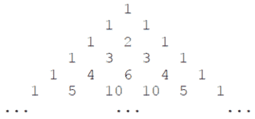

<!--yml
category: 蓝桥杯
date: 2022-04-26 11:07:07
-->

# 2021年04月18日第十二届蓝桥杯第一场省赛试题及详解（Java本科B组）_跟老程一起学编程的博客-CSDN博客_蓝桥杯2021省赛题目

> 来源：[https://blog.csdn.net/future277809183/article/details/122839912](https://blog.csdn.net/future277809183/article/details/122839912)

1.  结果填空 (满分5分)
2.  结果填空 (满分5分)
3.  结果填空 (满分10分)
4.  结果填空 (满分10分)
5.  结果填空 (满分15分)
6.  程序设计（满分15分）
7.  程序设计（满分20分）
8.  程序设计（满分20分）
9.  程序设计（满分25分）
10.  程序设计（满分25分）

* * *

## **第一题：ASC**

【问题描述】

        已知大写字母 A 的 ASCII 码为 65，请问大写字母 L 的 ASCII 码是多少？

【答案提交】

        这是一道结果填空的题，你只需要算出结果后提交即可。本题的结果为一个整数，在提交答案时只填写这个整数，填写多余的内容将无法得分。

```
public class Main { // 76
	public static void main(String[] args) {
		System.out.println('A' - 0); // 65
		System.out.println('B' - 0); // 66
		System.out.println('L' - 0); // 76
		System.out.println('Z' - 0); // 90
		System.out.println(65 + 'L' - 'A'); // 76
		System.out.println((int) 'L'); // 76
	}
}
```

## **第二题：卡片**

【问题描述】

        小蓝有很多数字卡片，每张卡片上都是数字 0 到 9。

        小蓝准备用这些卡片来拼一些数，他想从 1 开始拼出正整数，每拼一个，就保存起来，卡片就不能用来拼其它数了。

        小蓝想知道自己能从 1 拼到多少。

        例如，当小蓝有 30 张卡片，其中 0 到 9 各 3 张，则小蓝可以拼出 1 到 10，

        但是拼 11 时卡片 1 已经只有一张了，不够拼出 11。

        现在小蓝手里有 0 到 9 的卡片各 2021 张，共 20210 张，请问小蓝可以从 1 拼到多少？

        提示：建议使用计算机编程解决问题。

【答案提交】

        这是一道结果填空的题，你只需要算出结果后提交即可。本题的结果为一个整数，在提交答案时只填写这个整数，填写多余的内容将无法得分。

```
public class Main { // 3181
	public static int arr[] = new int[10];

	public static boolean del(int x) {
		while (x != 0) {
			arr[x % 10]--;
			if (arr[x % 10] < 0)
				return false;
			x /= 10;
		}
		return true;
	}

	public static void main(String[] args) {
		for (int i = 0; i < 10; i++)
			arr[i] = 2021;
		for (int i = 1; i < 5000; i++) {
			if (!del(i)) {
				System.out.println(i - 1); // 3181
				break;
			}
		}
	}
}
```

## 第三题：直线

【问题描述】

        在平面直角坐标系中，两点可以确定一条直线。如果有多点在一条直线上，那么这些点中任意两点确定的直线是同一条。

        给定平面上 2 × 3 个整点 {(x, y)|0 ≤ x < 2, 0 ≤ y < 3, x ∈ Z, y ∈ Z}，即横坐标是 0 到 1 (包含 0 和 1) 之间的整数、纵坐标是 0 到 2 (包含 0 和 2) 之间的整数的点。这些点一共确定了 11 条不同的直线。

        给定平面上 20 × 21 个整点 {(x, y)|0 ≤ x < 20, 0 ≤ y < 21, x ∈ Z, y ∈ Z}，即横坐标是 0 到 19 (包含 0 和 19) 之间的整数、纵坐标是 0 到 20 (包含 0 和 20) 之间的整数的点。请问这些点一共确定了多少条不同的直线。

【答案提交】

        这是一道结果填空的题，你只需要算出结果后提交即可。本题的结果为一个整数，在提交答案时只填写这个整数，填写多余的内容将无法得分

```
import java.util.HashSet;
import java.util.Set;

public class Main { // 40257
	public static void main(String[] args) {
		new Main().run();
	}

	int X = 20, Y = 21;

	void run() {
		Set<Line> set = new HashSet();
		for (int x1 = 0; x1 < X; x1++)
			for (int y1 = 0; y1 < Y; y1++)
				for (int x2 = x1; x2 < X; x2++)
					for (int y2 = 0; y2 < Y; y2++)
						if (x1 != x2) {
							Fraction k = new Fraction(y2 - y1, x2 - x1);
							Fraction b = new Fraction(y1 * (x2 - x1) - x1 * (y2 - y1), x2 - x1);
							set.add(new Line(k, b));
						}
		System.out.println(set.size() + X); // 40257
	}

	class Fraction {
		int numerator, denominator;

		Fraction(int numerator, int denominator) {
			int gcd = gcd(numerator, denominator);
			this.denominator = denominator / gcd;
			this.numerator = numerator / gcd;
		}

		int gcd(int a, int b) {
			return b == 0 ? a : gcd(b, a % b);
		}

		@Override
		public boolean equals(Object obj) {
			return this.numerator == ((Fraction) obj).numerator && this.denominator == ((Fraction) obj).denominator;
		}
	}

	class Line {
		Fraction k, b;

		Line(Fraction b, Fraction k) {
			this.k = k;
			this.b = b;
		}

		@Override
		public boolean equals(Object obj) {
			return this.k.equals(((Line) obj).k) && this.b.equals(((Line) obj).b);
		}

		@Override
		public int hashCode() {
			return k.denominator;
		}
	}
}
```

## 第四题：货物摆放

【问题描述】

        小蓝有一个超大的仓库，可以摆放很多货物。

        现在，小蓝有 n 箱货物要摆放在仓库，每箱货物都是规则的正方体。小蓝规定了长、宽、高三个互相垂直的方向，每箱货物的边都必须严格平行于长、 宽、高。

        小蓝希望所有的货物最终摆成一个大的立方体。即在长、宽、高的方向上分别堆 L、W、H 的货物，满足 n = L × W × H。

        给定 n，请问有多少种堆放货物的方案满足要求。

        例如，当 n = 4 时，有以下 6 种方案：1×1×4、1×2×2、1×4×1、2×1×2、2 × 2 × 1、4 × 1 × 1。

        请问，当 n = 2021041820210418 （注意有 16 位数字）时，总共有多少种方案？

        提示：建议使用计算机编程解决问题。

【答案提交】

        这是一道结果填空的题，你只需要算出结果后提交即可。本题的结果为一个整数，在提交答案时只填写这个整数，填写多余的内容将无法得分。

```
import java.util.ArrayDeque;
import java.util.ArrayList;
import java.util.List;

public class Main { // 2430
	public static void main(String[] args) {
		new Main().run();
	}

	long n = 2021041820210418L;

	void run() {
		List<Integer> exps0 = new ArrayList();
		ArrayDeque<Integer> exps1 = new ArrayDeque();
		for (int k = 2; k <= n; k++)
			if (n % k == 0) {
				int e = 0;
				while (n % k == 0) {
					n /= k;
					e++;
				}
				exps0.add(e);
			}
		System.out.println(dfs(exps0, exps1, 0)); // 2430
	}

	int dfs(List<Integer> exps0, ArrayDeque<Integer> exps1, int cur) {
		if (cur == exps0.size()) {
			int comb = 1;
			for (int exp : exps1)
				comb *= exp + 1;
			return comb;
		}
		int ans = 0;
		for (int i = exps0.get(cur); i >= 0; i--) {
			exps1.push(i);
			ans += dfs(exps0, exps1, cur + 1);
			exps1.pop();
		}
		return ans;
	}
}
```

## 第五题：路径

【问题描述】

        小蓝学习了最短路径之后特别高兴，他定义了一个特别的图，希望找到图中的最短路径。

        小蓝的图由 2021 个结点组成，依次编号 1 至 2021。

        对于两个不同的结点 a, b，如果 a 和 b 的差的绝对值大于 21，则两个结点之间没有边相连；如果 a 和 b 的差的绝对值小于等于 21，则两个点之间有一条 长度为 a 和 b 的最小公倍数的无向边相连。

        例如：结点 1 和结点 23 之间没有边相连；结点 3 和结点 24 之间有一条无向边，长度为 24；结点 15 和结点 25 之间有一条无向边，长度为 75。

        请计算，结点 1 和结点 2021 之间的最短路径长度是多少。

        提示：建议使用计算机编程解决问题。

【答案提交】

        这是一道结果填空的题，你只需要算出结果后提交即可。本题的结果为一个整数，在提交答案时只填写这个整数，填写多余的内容将无法得分

```
 import java.util.PriorityQueue;
import java.util.ArrayList;
import java.util.Arrays;
import java.util.Queue;
import java.util.List;

public class Main { // 10266837
	public static void main(String[] args) {
		new Main().run();
	}

	int N = 2021;

	void run() {
		List<Edge>[] graph = new List[N + 1];
		long[] visited = new long[N + 1];
		for (int i = 1; i <= N; i++)
			graph[i] = new ArrayList();
		for (int v = 1; v < N; v++)
			for (int w = v + 1; w <= min(v + 21, N); w++) {
				graph[v].add(new Edge(w, lcm(v, w)));
				graph[w].add(new Edge(v, lcm(v, w)));
			}
		Queue<Vertex> queue = new PriorityQueue();
		Arrays.fill(visited, Long.MAX_VALUE);
		queue.offer(new Vertex(1, 0));
		Vertex V = null;
		while (queue.size() > 0) {
			V = queue.poll();
			if (V.v == N)
				break;
			if (V.weight >= visited[V.v])
				continue;
			visited[V.v] = V.weight;
			for (Edge edge : graph[V.v])
				queue.offer(new Vertex(edge.w, edge.weight + V.weight));
		}
		System.out.println(V.weight); // 10266837
	}

	int min(int a, int b) {
		return a < b ? a : b;
	}

	int lcm(int a, int b) {
		return a * b / gcd(a, b);
	}

	int gcd(int a, int b) {
		return b == 0 ? a : gcd(b, a % b);
	}

	class Edge {
		int w, weight;

		Edge(int w, int weight) {
			this.weight = weight;
			this.w = w;
		}
	}

	class Vertex implements Comparable<Vertex> {
		int v;
		long weight;

		Vertex(int v, long weight) {
			this.weight = weight;
			this.v = v;
		}

		@Override
		public int compareTo(Vertex V) {
			return Long.compare(this.weight, V.weight);
		}
	}
}
```

## 第六题：时间显示

【问题描述】

        小蓝要和朋友合作开发一个时间显示的网站。在服务器上，朋友已经获取了当前的时间，用一个整数表示，值为从 1970 年 1 月 1 日 00:00:00 到当前时刻经过的毫秒数。

        现在，小蓝要在客户端显示出这个时间。小蓝不用显示出年月日，只需要显示出时分秒即可，毫秒也不用显示，直接舍去即可。

        给定一个用整数表示的时间，请将这个时间对应的时分秒输出。

【输入格式】

        输入一行包含一个整数，表示时间。

【输出格式】

        输出时分秒表示的当前时间，格式形如 HH:MM:SS，其中 HH 表示时，值为 0 到 23，MM 表示分，值为 0 到 59，SS 表示秒，值为 0 到 59。时、分、秒不足两位时补前导 0。

【样例输入 1】46800999

【样例输出 1】13:00:00

【样例输入 2】1618708103123

【样例输出 2】01:08:23

【评测用例规模与约定】对于所有评测用例，给定的时间为不超过 1018 的正整数

```
import java.util.Scanner;
import java.time.LocalTime;
import java.time.format.DateTimeFormatter;

public class Main {
	public static void main(String[] args) {
		new Main().run();
	}

	void run() {
		System.out.println(LocalTime.MIDNIGHT.plusSeconds(new Scanner(System.in).nextLong() / 1000)
				.format(DateTimeFormatter.ISO_LOCAL_TIME));
		Scanner sc = new Scanner(System.in);
		long n = sc.nextLong();
		System.out.println(LocalTime.MIDNIGHT.plusSeconds(n / 1000).format(DateTimeFormatter.ISO_LOCAL_TIME));
	}
}
```

## 第七题：最少砝码

【问题描述】

        你有一架天平。现在你要设计一套砝码，使得利用这些砝码可以称出任意小于等于 N 的正整数重量。

        那么这套砝码最少需要包含多少个砝码？

        注意砝码可以放在天平两边。

【输入格式】输入包含一个正整数 N。

【输出格式】输出一个整数代表答案。

【样例输入】7

【样例输出】3

【样例说明】

        3 个砝码重量是 1、4、6，可以称出 1 至 7 的所有重量。

        1 = 1；

        2 = 6 − 4 (天平一边放 6，另一边放 4)；

        3 = 4 − 1；

        4 = 4；

        5 = 6 − 1；

        6 = 6；

        7 = 1 + 6；

        少于 3 个砝码不可能称出 1 至 7 的所有重量。

【评测用例规模与约定】对于所有评测用例，1 ≤ N ≤ 1000000000。

```
import java.util.Scanner;

public class Main {
	public static void main(String[] args) {
		Scanner sc = new Scanner(System.in);
		long x = sc.nextLong();
		long sum = 1, cur = 1;
		while (sum < x) {
			sum += Math.pow(3, cur);
			cur++;
		}
		System.out.println(cur);
	}
}
```

## 第八题：杨辉三角形

【问题描述】

        下面的图形是著名的杨辉三角形：

        如果我们按从上到下、从左到右的顺序把所有数排成一列，可以得到如下数列：

                                                        

         1, 1, 1, 1, 2, 1, 1, 3, 3, 1, 1, 4, 6, 4, 1, ...

        给定一个正整数 N，请你输出数列中第一次出现 N 是在第几个数？

【输入格式】输入一个整数 N。

【输出格式】输出一个整数代表答案。

【样例输入】6

【样例输出】13

【评测用例规模与约定】对于 20% 的评测用例，1 ≤ N ≤ 10；对于所有评测用例，1 ≤ N ≤ 1000000000

```
 import java.util.Scanner;

public class Main {
	public static void main(String[] args) {
		new Main().run();
	}

	int N;

	void run() {
		N = new Scanner(System.in).nextInt();
		if (N == 1)
			System.out.println(1);
		else {
			long ans = (N + 1L) * N / 2 + 2;
			for (int m = 2; m < 16; m++) {
				int start = m * 2, end = N;
				while (start <= end) {
					int mid = start + end >> 1;
					if (C(mid, m) == N) {
						ans = min(ans, (mid + 1L) * mid / 2 + m + 1);
						break;
					}
					if (C(mid, m) > N)
						end = mid - 1;
					else
						start = mid + 1;
				}
			}
			System.out.println(ans);
		}
	}

	long min(long a, long b) {
		return a < b ? a : b;
	}

	long C(int n, int m) {
		long num = 1;
		for (int nm = 1; nm <= m; n--, nm++)
			if ((num = num * n / nm) > N)
				return num;
		return num;
	}
}
```

## 第九题：双向排序

【问题描述】

        给定序列 (a1, a2, · · · , an) = (1, 2, · · · , n)，即 ai = i。

        小蓝将对这个序列进行 m 次操作，每次可能是将 a1, a2, · · · , aqi 降序排列，或者将 aqi , aqi+1, · · · , an 升序排列。

        请求出操作完成后的序列。

【输入格式】

        输入的第一行包含两个整数 n, m，分别表示序列的长度和操作次数。

        接下来 m 行描述对序列的操作，其中第 i 行包含两个整数 pi , qi 表示操作类型和参数。当 pi = 0 时，表示将 a1, a2, · · · , aqi 降序排列；当 pi = 1 时，表示将 aqi , aqi+1, · · · , an 升序排列。

【输出格式】输出一行，包含 n 个整数，相邻的整数之间使用一个空格分隔，表示操作完成后的序列。

【样例输入】

        3 3

        0 3

        1 2

        0 2

【样例输出】 3 1 2

【样例说明】

        原数列为 (1, 2, 3)。

        第 1 步后为 (3, 2, 1)。

        第 2 步后为 (3, 1, 2)。

        第 3 步后为 (3, 1, 2)。与第 2 步操作后相同，因为前两个数已经是降序了。

【评测用例规模与约定】

        对于 30% 的评测用例，n, m ≤ 1000；

        对于 60% 的评测用例，n, m ≤ 5000；

        对于所有评测用例，1 ≤ n, m ≤ 100000，0 ≤ ai ≤ 1，1 ≤ bi ≤ n

```
import java.io.*;
import java.util.*;

public class Main {
	public static void main(String[] args) {
		new Main().run();
	}

	void run() {
		InputReader in = new InputReader(System.in);
		PrintWriter out = new PrintWriter(System.out);
		int n = in.readInt(), m = in.readInt();
		Deque<Step> deque = new ArrayDeque();
		deque.push(new Step(1, 1));
		while (m-- > 0) {
			int p = in.readInt();
			int q = in.readInt();
			while (deque.size() > 0 && deque.peek().p == p)
				if (p == 0)
					q = max(q, deque.pop().q);
				else
					q = min(q, deque.pop().q);
			deque.push(new Step(p, q));
		}
		Integer[] ans = new Integer[n];
		for (int i = 0; i < n; i++)
			ans[i] = i + 1;
		deque.pollLast();
		while (deque.size() > 0) {
			Step step = deque.pollLast();
			if (step.p == 0)
				Arrays.sort(ans, 0, step.q, (a, b) -> (b - a));
			else
				Arrays.sort(ans, step.q - 1, n);
		}
		for (int i = 0; i < n; i++) {
			out.print(ans[i]);
			out.print(' ');
		}
		out.flush();
	}

	int max(int a, int b) {
		return a > b ? a : b;
	}

	int min(int a, int b) {
		return a < b ? a : b;
	}

	class Step {
		int p, q;

		Step(int p, int q) {
			this.p = p;
			this.q = q;
		}
	}

	class InputReader {
		BufferedReader reader;
		StringTokenizer token;

		InputReader(InputStream in) {
			this.reader = new BufferedReader(new InputStreamReader(in));
		}

		String read() {
			while (token == null || !token.hasMoreTokens()) {
				try {
					token = new StringTokenizer(reader.readLine());
				} catch (IOException e) {
					e.printStackTrace();
				}
			}
			return token.nextToken();
		}

		int readInt() {
			return Integer.parseInt(read());
		}
	}
}
```

## 第十题：括号序列

【问题描述】

        给定一个括号序列，要求尽可能少地添加若干括号使得括号序列变得合法，当添加完成后，会产生不同的添加结果，请问有多少种本质不同的添加结果。两个结果是本质不同的是指存在某个位置一个结果是左括号，而另一个是右括号。

        例如，对于括号序列 ((()，只需要添加两个括号就能让其合法，有以下几 种不同的添加结果：()()()、()(())、(())()、(()()) 和 ((()))。

【输入格式】输入一行包含一个字符串 s，表示给定的括号序列，序列中只有左括号和 右括号。

【输出格式】输出一个整数表示答案，答案可能很大，请输出答案除以 1000000007 (即10^9 + 7) 的余数。

【样例输入】 ((()

【样例输出】 5

【评测用例规模与约定】

        对于 40% 的评测用例，|s| ≤ 200。

        对于所有评测用例，1 ≤ |s| ≤ 5000

```
import java.util.Scanner;

public class Main {
	public static void main(String[] args) {
		new Main().run();
	}

	int mod = 1000000007;

	void run() {
		byte[] line = new byte[5555];
		try {
			int n = System.in.read(line, 1, 5050) - 1;
			System.out.println(calc(line, n, false) * calc(line, n, true) % mod);
		} catch (java.io.IOException e) {
			e.fillInStackTrace();
		}
	}

	long calc(byte[] str, int n, boolean turn) {
		if (turn)
			reverse(str, n);
		int[][] dp = new int[n + 1][n + 2];
		int opening = 0;
		dp[0][0] = 1;
		for (int i = 1; i <= n; i++) {
			if (str[i] == '(') {
				for (int j = 1; j <= n; j++)
					dp[i][j] = dp[i - 1][j - 1];
				opening++;
			} else {
				dp[i][0] = (dp[i - 1][0] + dp[i - 1][1]) % mod;
				for (int j = 1; j <= n; j++)
					dp[i][j] = (dp[i][j - 1] + dp[i - 1][j + 1]) % mod;
				if (opening > 0)
					opening--;
			}
		}
		return dp[n][opening];
	}

	void reverse(byte[] arr, int n) {
		for (int i = 1, j = n; i <= j; i++, j--) {
			byte temp = (byte) (arr[i] ^ 1);
			arr[i] = (byte) (arr[j] ^ 1);
			arr[j] = temp;
		}
	}
}
```