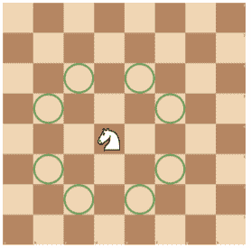

<!--yml
category: 蓝桥杯
date: 2022-04-26 11:07:05
-->

# 2021年05月09日第十二届蓝桥杯第二场省赛试题及详解（Java本科B组）_跟老程一起学编程的博客-CSDN博客_蓝桥杯第十二届省赛第二场

> 来源：[https://blog.csdn.net/future277809183/article/details/122843140](https://blog.csdn.net/future277809183/article/details/122843140)

1.  结果填空 (满分5分)
2.  结果填空 (满分5分)
3.  结果填空 (满分10分)
4.  结果填空 (满分10分)
5.  结果填空 (满分15分)
6.  程序设计（满分15分）
7.  程序设计（满分20分）
8.  程序设计（满分20分）
9.  程序设计（满分25分）
10.  程序设计（满分25分）

* * *

## **第一题：求余**

【问题描述】

        在 C/C++/Java/Python 等语言中，使用 % 表示求余，请问 2021%20 的值是多少？

【答案提交】

        这是一道结果填空的题，你只需要算出结果后提交即可。本题的结果为一个整数，在提交答案时只填写这个整数，填写多余的内容将无法得分。

```
 public class Main { // 1
	public static void main(String[] args) {
		System.out.println(2021%20); // 1
	}
}
```

## **第二题：双阶乘**

【问题描述】

        一个正整数的双阶乘，表示不超过这个正整数且与它有相同奇偶性的所有正整数乘积。n 的双阶乘用 n!! 表示。

        例如：

        3!! = 3 × 1 = 3。

        8!! = 8 × 6 × 4 × 2 = 384。

        11!! = 11 × 9 × 7 × 5 × 3 × 1 = 10395。

        请问，2021!! 的最后 5 位（这里指十进制位）是多少？

        注意：2021!! = 2021 × 2019 × · · · × 5 × 3 × 1。

        提示：建议使用计算机编程解决问题。

【答案提交】

        这是一道结果填空的题，你只需要算出结果后提交即可。本题的结果为一个整数，在提交答案时只填写这个整数，填写多余的内容将无法得分。

```
import java.util.Scanner;

public class Main { // 59375
	public static void main(String[] args) {
		Scanner in = new Scanner(System.in);
		long ans = 1;
		for (int i = 3; i <= 2021; i += 2) {
			ans *= i;
			ans %= 100000;
		}
		System.out.println(ans); // 59375
		in.close();
	}
}
```

## **第三题：格点**

【问题描述】

        如果一个点 (x, y) 的两维坐标都是整数，即 x ∈ Z 且 y ∈ Z，则称这个点为一个格点。

        如果一个点 (x, y) 的两维坐标都是正数，即 x > 0 且 y > 0，则称这个点在第一象限。

        请问在第一象限的格点中，有多少个点 (x, y) 的两维坐标乘积不超过 2021，即 x · y ≤ 2021。

        提示：建议使用计算机编程解决问题。

【答案提交】

        这是一道结果填空的题，你只需要算出结果后提交即可。本题的结果为一个整数，在提交答案时只填写这个整数，填写多余的内容将无法得分。

```
import java.util.Scanner;

public class Main { // 15698
	public static void main(String[] args) {
		Scanner in = new Scanner(System.in);
		int ans = 0;
		for (int x = 1; x <= 2021; x++) {
			for (int y = 1; y <= 2021; y++) {
				if (x * y <= 2021) {
					ans++;
				}
			}
		}
		System.out.println(ans); // 15698
		in.close();
	}
}
```

## **第四题：整数分解**

【问题描述】

        将 3 分解成两个正整数的和，有两种分解方法，分别是 3 = 1 + 2 和 3 = 2 + 1。注意顺序不同算不同的方法。

        将 5 分解成三个正整数的和，有 6 种分解方法，它们是 1+1+3 = 1+2+2 = 1 + 3 + 1 = 2 + 1 + 2 = 2 + 2 + 1 = 3 + 1 + 1。

        请问，将 2021 分解成五个正整数的和，有多少种分解方法？

【答案提交】

        这是一道结果填空的题，你只需要算出结果后提交即可。本题的结果为一个整数，在提交答案时只填写这个整数，填写多余的内容将无法得分。

```
import java.util.Arrays;

public class Main { // 691677274345
	public static void main(String[] args) {
		new Main().run();
	}

	int n = 2021, k = 5;

	void run() {
		long[][] dp = new long[k + 1][n + 1];
		Arrays.fill(dp[1], 1);
		for (int i = 2; i <= k; i++)
			for (int j = i; j <= n; j++)
				dp[i][j] = dp[i - 1][j - 1] + dp[i][j - 1];
		System.out.println(dp[k][n]); // 691677274345
	}
}
```

## **第五题：城邦**

【问题描述】

        小蓝国是一个水上王国，有 2021 个城邦，依次编号 1 到 2021。在任意两个城邦之间，都有一座桥直接连接。

        为了庆祝小蓝国的传统节日，小蓝国政府准备将一部分桥装饰起来。

        对于编号为 a 和 b 的两个城邦，它们之间的桥如果要装饰起来，需要的费用如下计算：找到 a 和 b 在十进制下所有不同的数位，将数位上的数字求和。

        例如，编号为 2021 和 922 两个城邦之间，千位、百位和个位都不同，将这些数位上的数字加起来是 (2 + 0 + 1) + (0 + 9 + 2) = 14。注意 922 没有千位，千位看成 0。

        为了节约开支，小蓝国政府准备只装饰 2020 座桥，并且要保证从任意一个城邦到任意另一个城邦之间可以完全只通过装饰的桥到达。

        请问，小蓝国政府至少要花多少费用才能完成装饰。

        提示：建议使用计算机编程解决问题。

【答案提交】

        这是一道结果填空的题，你只需要算出结果后提交即可。本题的结果为一个整数，在提交答案时只填写这个整数，填写多余的内容将无法得分。

```
import java.util.Arrays;

public class Main {
	public static void main(String[] args) {
		new Main().run();
	}

	int n = 2021;

	void run() {
		boolean[] marked = new boolean[n + 1];
		int[] dist = new int[n + 1];
		Arrays.fill(dist, 0x7FFFFFFF);
		int ans = 0;
		dist[1] = 0;
		for (int k = 0; k < n; k++) {
			int V = 0;
			for (int i = 1; i <= n; i++)
				if (!marked[i] && dist[i] < dist[V])
					V = i;
			marked[V] = true;
			ans += dist[V];
			for (int i = 1; i <= n; i++)
				if (!marked[i])
					dist[i] = min(dist[i], calc(i, V));
		}
		System.out.println(ans);
	}

	int min(int a, int b) {
		return a < b ? a : b;
	}

	int calc(int v, int w) {
		int res = 0;
		for (int i = 0; i < 4; i++) {
			if (v % 10 != w % 10)
				res += v % 10 + w % 10;
			v /= 10;
			w /= 10;
		}
		return res;
	}
}
```

## **第六题：特殊年份**

【问题描述】

        今年是 2021 年，2021 这个数字非常特殊，它的千位和十位相等，个位比百位大 1，我们称满足这样条件的年份为特殊年份。

        输入 5 个年份，请计算这里面有多少个特殊年份。

【输入格式】输入 5 行，每行一个 4 位十进制数（数值范围为 1000 至 9999），表示一个年份。

【输出格式】输出一个整数，表示输入的 5 个年份中有多少个特殊年份。

【样例输入】2019 2021 1920 2120 9899

【样例输出】2

【样例说明】2021 和 9899 是特殊年份，其它不是特殊年份

```
import java.util.Scanner;

public class Main {
	public static void main(String[] args) {
		new Main().run();
	}

	void run() {
		Scanner in = new Scanner(System.in);
		int ans = 0, k = 5;
		while (k-- > 0)
			if (check(in.nextInt()))
				ans++;
		System.out.println(ans);
	}

	boolean check(int year) {
		return (year / 1000 == (year % 100) / 10) && ((year % 10) - 1 == (year % 1000) / 100);
	}
}
```

## **第七题：小平方**

【问题描述】

        小蓝发现，对于一个正整数 n 和一个小于 n 的正整数 v，将 v 平方后对 n 取余可能小于 n 的一半，也可能大于等于 n 的一半。

        请问，在 1 到 n − 1 中，有多少个数平方后除以 n 的余数小于 n 的一半。

        例如，当 n = 4 时，1, 2, 3 的平方除以 4 的余数都小于 4 的一半。

        又如，当 n = 5 时，1, 4 的平方除以 5 的余数都是 1，小于 5 的一半。而 2, 3 的平方除以 5 的余数都是 4，大于等于 5 的一半。

【输入格式】输入一行包含一个整数 n。

【输出格式】输出一个整数，表示满足条件的数的数量。

【样例输入】5

【样例输出】2

【评测用例规模与约定】 对于所有评测用例，1 ≤ n ≤ 10000

```
import java.util.Scanner;

public class Main {
	public static void main(String[] args) {
		new Main().run();
	}

	void run() {
		int n = new Scanner(System.in).nextInt(), ans = 0;
		for (int i = 1; i < n; i++)
			if (i * i % n < n + 1 >> 1)
				ans++;
		System.out.println(ans);
	}
}
```

## **第八题：完全平方数**

【问题描述】

        一个整数 a 是一个完全平方数，是指它是某一个整数的平方，即存在一个整数 b，使得 a = b^2。

        给定一个正整数 n，请找到最小的正整数 x，使得它们的乘积是一个完全平方数。

【输入格式】输入一行包含一个正整数 n。

【输出格式】输出找到的最小的正整数 x。

【样例输入 1】12

【样例输出 1】3

【样例输入 2】15

【样例输出 2】15

【评测用例规模与约定】

        对于 30% 的评测用例，1 ≤ n ≤ 1000，答案不超过 1000。

        对于 60% 的评测用例，1 ≤ n ≤ 108，答案不超过 10^8。

        对于所有评测用例，1 ≤ n ≤ 1012，答案不超过 10^12

```
import java.util.Scanner;

public class Main {
	public static void main(String[] args) {
		Scanner in = new Scanner(System.in);
		long n = in.nextLong();
		for (long i = 1; i <= n; i++) {
			if ((long) Math.sqrt(i * n) * (long) Math.sqrt(i * n) == i * n) {
				System.out.println(i);
				System.exit(0);
			}
		}
		in.close();
	}
}
```

## **第九题：负载均衡**

【问题描述】

        有 n 台计算机，第 i 台计算机的运算能力为 vi。

        有一系列的任务被指派到各个计算机上，第 i 个任务在 ai 时刻分配，指定计算机编号为 bi ，耗时为 ci 且算力消耗为 di 。如果此任务成功分配，将立刻开始运行，期间持续占用 bi 号计算机 di 的算力，持续 ci 秒。

        对于每次任务分配，如果计算机剩余的运算能力不足则输出 −1，并取消这次分配，否则输出分配完这个任务后这台计算机的剩余运算能力。

【输入格式】

        输入的第一行包含两个整数 n, m，分别表示计算机数目和要分配的任务数。

        第二行包含 n 个整数 v1, v2, · · · vn，分别表示每个计算机的运算能力。

        接下来 m 行每行 4 个整数 ai , bi , ci , di，意义如上所述。数据保证 ai 严格递 增，即 ai < ai+1。

【输出格式】输出 m 行，每行包含一个数，对应每次任务分配的结果。

【样例输入】

2 6
5 5
1 1 5 3
2 2 2 6
3 1 2 3
4 1 6 1
5 1 3 3
6 1 3 4

【样例输出】

2
-1
-1
1
-1
0

【样例说明】

        时刻 1，第 1 个任务被分配到第 1 台计算机，耗时为 5 ，这个任务时刻 6 会结束，占用计算机 1 的算力 3。
        时刻 2，第 2 个任务需要的算力不足，所以分配失败了。
        时刻 3，第 1 个计算机仍然正在计算第 1 个任务，剩余算力不足 3，所以失败。
        时刻 4，第 1 个计算机仍然正在计算第 1 个任务，但剩余算力足够，分配后剩余算力 1。
        时刻 5，第 1 个计算机仍然正在计算第 1, 4 个任务，剩余算力不足 4，失败。
        时刻 6，第 1 个计算机仍然正在计算第 4 个任务，剩余算力足够，且恰好用完。

【评测用例规模与约定】

        对于 20% 的评测用例，n, m ≤ 200。

        对于 40% 的评测用例，n, m ≤ 2000。

        对于所有评测用例，1 ≤ n, m ≤ 200000，1 ≤ ai , ci , di , vi ≤ 10^9，1 ≤ bi ≤ n

```
import java.io.*;
import java.util.*;

public class Main {
	public static void main(String[] args) {
		new Main().run();
	}

	void run() {
		InputReader in = new InputReader(System.in);
		PrintWriter out = new PrintWriter(System.out);
		int n = in.readInt(), m = in.readInt();
		Queue<Item>[] cpt = new Queue[n + 1];
		int[] cptd = new int[n + 1];
		for (int i = 1; i <= n; i++) {
			cpt[i] = new PriorityQueue();
			cptd[i] = in.readInt();
		}
		while (m-- > 0) {
			int a = in.readInt();
			int b = in.readInt();
			int c = in.readInt();
			int d = in.readInt();
			while (cpt[b].size() > 0 && cpt[b].peek().c <= a)
				cptd[b] += cpt[b].poll().d;
			if (cptd[b] >= d) {
				cpt[b].offer(new Item(a + c, d));
				out.println(cptd[b] -= d);
			} else
				out.println("-1");
		}
		out.flush();
	}

	class Item implements Comparable<Item> {
		int c, d;

		Item(int c, int d) {
			this.c = c;
			this.d = d;
		}

		public int compareTo(Item item) {
			return this.c - item.c;
		}
	}

	class InputReader {
		BufferedReader reader;
		StringTokenizer token;

		InputReader(InputStream in) {
			this.reader = new BufferedReader(new InputStreamReader(in));
		}

		String read() {
			while (token == null || !token.hasMoreTokens()) {
				try {
					token = new StringTokenizer(reader.readLine());
				} catch (IOException e) {
					e.printStackTrace();
				}
			}
			return token.nextToken();
		}

		int readInt() {
			return Integer.parseInt(read());
		}
	}
}
```

## **第十题：国际象棋**

【问题描述】

        众所周知，“八皇后” 问题是求解在国际象棋棋盘上摆放 8 个皇后，使得两两之间互不攻击的方案数。已经学习了很多算法的小蓝觉得 “八皇后” 问题太简单了，意犹未尽。作为一个国际象棋迷，他想研究在 N × M 的棋盘上，摆放 K 个马，使得两两之间互不攻击有多少种摆放方案。由于方案数可能很大，只需计算答案除以 1000000007 (即 109 + 7) 的余数。

        如下图所示，国际象棋中的马摆放在棋盘的方格内，走 “日” 字，位于 (x, y) 格的马（第 x 行第 y 列）可以攻击 (x + 1, y + 2)、(x + 1, y − 2)、(x − 1, y + 2)、(x − 1, y − 2)、(x + 2, y + 1)、(x + 2, y − 1)、(x − 2, y + 1) 和 (x − 2, y − 1) 共 8 个格子。



【输入格式】输入一行包含三个正整数 N, M, K，分别表示棋盘的行数、列数和马的个数。

【输出格式】输出一个整数，表示摆放的方案数除以 1000000007 (即 109 + 7) 的余数。

【样例输入】1 2 1

【样例输出】2

【样例输入】4 4 3

【样例输出】276

【样例输入】3 20 12

【样例输出】914051446

【评测用例规模与约定】

        对于 5% 的评测用例，K = 1；

        对于另外 10% 的评测用例，K = 2；

        对于另外 10% 的评测用例，N = 1；

        对于另外 20% 的评测用例，N, M ≤ 6，K ≤ 5；

        对于另外 25% 的评测用例，N ≤ 3，M ≤ 20，K ≤ 12；

        对于所有评测用例，1 ≤ N ≤ 6，1 ≤ M ≤ 100，1 ≤ K ≤ 20

```
import java.util.Scanner;

public class Main {
	public static void main(String[] args) {
		new Main().run();
	}

	final int mod = 1000000007;

	void run() {
		Scanner in = new Scanner(System.in);
		int N = 1 << in.nextInt(), M = in.nextInt(), K = in.nextInt();
		int[][][][] dp = new int[M + 1][N][N][K + 1];
		dp[0][0][0][0] = 1;
		for (int m = 1; m <= M; m++)
			for (int now = 0; now < N; now++)
				for (int pr1 = 0; pr1 < N; pr1++)
					if ((now << 2 & pr1) == 0 && (pr1 << 2 & now) == 0)
						for (int pr2 = 0; pr2 < N; pr2++)
							if ((now << 1 & pr2) == 0 && (pr2 << 1 & now) == 0)
								for (int k = bitCount(now), g = k; k <= K; k++)
									dp[m][now][pr1][k] = (dp[m][now][pr1][k] + dp[m - 1][pr1][pr2][k - g]) % mod;
		int ans = 0;
		for (int now = 0; now < N; now++)
			for (int pr1 = 0; pr1 < N; pr1++)
				if ((now << 2 & pr1) == 0 && (pr1 << 2 & now) == 0)
					ans = (ans + dp[M][now][pr1][K]) % mod;
		System.out.println(ans);
	}

	public static int bitCount(int n) {
		n = n - ((n >>> 1) & 0x55555555);
		n = (n & 0x33333333) + ((n >>> 2) & 0x33333333);
		n = (n + (n >>> 4)) & 0x0f0f0f0f;
		n = n + (n >>> 8);
		n = n + (n >>> 16);
		return n & 0x3f;
	}
}
```