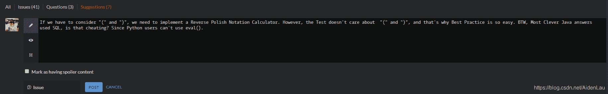

<!--yml
category: codewars
date: 2022-08-13 11:40:02
-->

# Calculator (Codewars 3kyu Java)_AidenLau的博客-CSDN博客

> 来源：[https://blog.csdn.net/AidenLau/article/details/105243666?ops_request_misc=%257B%2522request%255Fid%2522%253A%2522166036059016780357231535%2522%252C%2522scm%2522%253A%252220140713.130102334.pc%255Fall.%2522%257D&request_id=166036059016780357231535&biz_id=0&utm_medium=distribute.pc_search_result.none-task-blog-2~all~first_rank_ecpm_v1~rank_v31_ecpm-8-105243666-null-null.142^v40^control,185^v2^control&utm_term=codewars](https://blog.csdn.net/AidenLau/article/details/105243666?ops_request_misc=%257B%2522request%255Fid%2522%253A%2522166036059016780357231535%2522%252C%2522scm%2522%253A%252220140713.130102334.pc%255Fall.%2522%257D&request_id=166036059016780357231535&biz_id=0&utm_medium=distribute.pc_search_result.none-task-blog-2~all~first_rank_ecpm_v1~rank_v31_ecpm-8-105243666-null-null.142^v40^control,185^v2^control&utm_term=codewars)

**题目：**

Create a simple calculator that given a string of operators (), +, -, *, / and numbers separated by spaces returns the value of that expression

Example:

Calculator.evaluate(“2 / 2 + 3 * 4 - 6”) // => 7
Remember about the order of operations! Multiplications and divisions have a higher priority and should be performed left-to-right. Additions and subtractions have a lower priority and should also be performed left-to-right.

**我的思路：**

这题是数据结构里学完栈Stack后的典型的例题，要做一个简单的计算器。由于题目说 “ (), +, -, *, / ” 都要可以处理，所以我打算实现一个逆波兰计算器。最重要的是分为两步，第一步是将中缀表达式转化为后缀表达式，第二步是计算后缀表达式。

我打算实现如下几个方法：

```
public static ArrayList<String> InfixToSuffix(ArrayList<String> infixList) 
```

这一步是将中缀表达式转化为后缀表达式。中缀表达式方便人理解，但计算机看不懂，后缀表达式非常适合计算机计算。不了解的朋友可以参考一下百度百科提供的介绍和转换方式：[逆波兰式_百度百科](https://baike.baidu.com/item/%E9%80%86%E6%B3%A2%E5%85%B0%E5%BC%8F/128437?fromtitle=%E5%90%8E%E7%BC%80%E8%A1%A8%E8%BE%BE%E5%BC%8F&fromid=6160580&fr=aladdin)

```
public static double rock(ArrayList<String> list) 
```

这一步是根据逆波兰式计算。由于用python实现时，有些函数是不允许使用的，比如 *eval()*，直接调用这种现成算法会被视为作弊，从而不允许提交。我不想考虑会不会有重名的现成函数，就随便取了一个 *rock()* ，这个函数就是开始计算。计算的具体算法很简单，也可以参考上一个链接。

```
public static int getPriority(String op) 
```

这个用于判断运算符的优先级。

```
public static boolean isDouble(String str)
public static boolean isScientific(String input) 
```

由于测试时发现除了要能计算Double，科学计数法的数字也要能处理，所以我写了这两个方法，是用正则表达式测试这是否是Double或科学计数法，主要是在接收时判断类型（这是运算符还是数字，如果是科学计数法的数字，转成常规数字）。

**我的解答：**

```
import java.math.BigDecimal;
import java.util.ArrayList;
import java.util.Arrays;
import java.util.Stack;
import java.util.regex.Pattern;

public class Calculator {

    public static Double evaluate(String expression) {
        ArrayList<String> infixList = new ArrayList<>(Arrays.asList(expression.split(" ")));
        ArrayList<String> suffixList = InfixToSuffix(infixList);
        double res = rock(suffixList);

        return res;
    }

    public static ArrayList<String> InfixToSuffix(ArrayList<String> infixList) {
        Stack<String> stack = new Stack<>();
        ArrayList<String> suffixList = new ArrayList<>();
        for (String item : infixList) {
            System.out.println("item: " + item);
            System.out.println(isDouble(item));
            System.out.println(isScientific(item));
            if (isDouble(item)) {
                System.out.println("match!!!!!!");
                suffixList.add(item);
            } else if (isScientific(item)) {
                BigDecimal bd = new BigDecimal(item);
                suffixList.add(bd.toPlainString());
            } else if (item.equals("(")) {
                stack.push(item);
            } else if (item.equals(")")) {
                while(!stack.peek().equals("(")) {
                    suffixList.add(stack.pop());
                }
                stack.pop();
            } else {
                while (stack.size() != 0 && getPriority(stack.peek()) >= getPriority(item)) {
                    suffixList.add(stack.pop());
                }
                stack.push(item);
            }
        }
        while (stack.size() != 0) {
            suffixList.add(stack.pop());
        }

        return suffixList;
    }

    public static int getPriority(String op) {
        if (op.equals("+") || op.equals("-")) {
            return 0;
        }
        if (op.equals("*") || op.equals("/")) {
            return 1;
        }
        return -1;
    }

    public static double rock(ArrayList<String> list) {
        Stack<String> stack = new Stack<String>();
        for (String str : list) {
            if (isDouble(str)) {
                stack.push(str);
            } else {
                double num2 = Double.parseDouble(stack.pop());
                double num1 = Double.parseDouble(stack.pop());
                double res = 0;
                if (str.equals("+")) {
                    res = num1 + num2;
                } else if (str.equals("-")) {
                    res = num1 - num2;
                } else if (str.equals("*")) {
                    res = num1 * num2;
                } else if (str.equals("/")) {
                    res = num1 / num2;
                } else {
                    throw new RuntimeException("Wrong operator.");
                }
                stack.push("" + res);
            }
        }
        return Double.parseDouble(stack.pop());
    }

    public static boolean isDouble(String str) {
        Pattern pattern = Pattern.compile("^[-\\+]?\\d+(\\.\\d*)?|\\.\\d+$");
        return pattern.matcher(str).matches();
    }

    public static boolean isScientific(String input){
        Pattern pattern = Pattern.compile("^((-?\\d+.?\\d*)[Ee]{1}(-?\\d+))$");
        return pattern.matcher(input).matches();
    }
} 
```

**Most Clever：**

做完题目看一下题后投票clever最多的答案：

```
import java.sql.*;
public class Calculator {

  public static Double evaluate(String expression) {
    try (Connection conn = DriverManager.getConnection("jdbc:sqlite::memory:");
        Statement stat = conn.createStatement();) {
      Class.forName("org.sqlite.JDBC");
      ResultSet rs = stat.executeQuery("select " + expression + " amount");
      rs.next();
      return rs.getDouble(1);
    } catch (Exception e) {
      return 0.0;
    }
  }
} 
```

连接数据库，

```
ResultSet rs = stat.executeQuery("select " + expression + " amount"); 
```

用数据库内置的计算器计算，并返回结果。

和python解题企图直接用 *eval()* 是同样的意图，有点没意思，前三clever的都是这个方法，惊了。

**Best Practice:**

那再看一下投票的 Best Practice：

```
import java.util.Stack;

public class Calculator {
  public static Double evaluate(String expression) {
    String[] parts = expression.split(" ");
    Stack<Double> s = new Stack<>();

    for (int i=0; i<parts.length; i+=2) {
      if (i == 0 || parts[i-1].equals("+")) {
        s.push(Double.valueOf(parts[i]));
      } else if (parts[i-1].equals("-")) {
        s.push(-Double.valueOf(parts[i]));
      } else if (parts[i-1].equals("*")) {
        s.push(s.pop()*Double.valueOf(parts[i]));
      } else if (parts[i-1].equals("/")) {
        s.push(s.pop()/Double.valueOf(parts[i]));
      }
    }

    double r = 0.0;
    while(!s.isEmpty()) {
      r += s.pop();
    }
    return r;
  }
} 
```

他这个不是逆波兰计算器，看代码发现他也没有考虑算式中有括号的情况。但是能通过验证提交，说明测试的题目里并没有检验处理带括号算式的。

给Codewars提交一下意见。


**总结：**

数据结构和算法是编程的基础，也是编程的精髓。把这种基础却又不容易的例题实现以下，还是收获颇丰的。