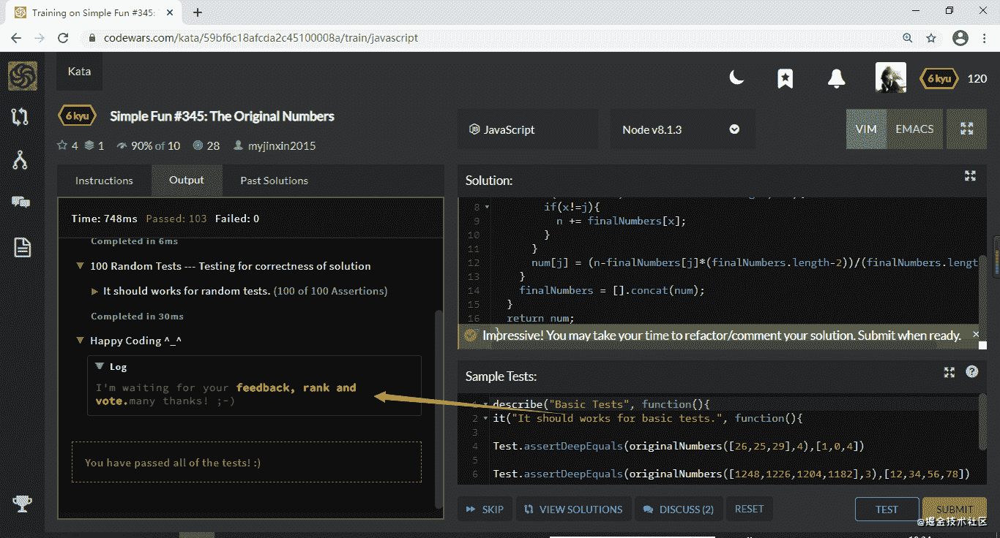
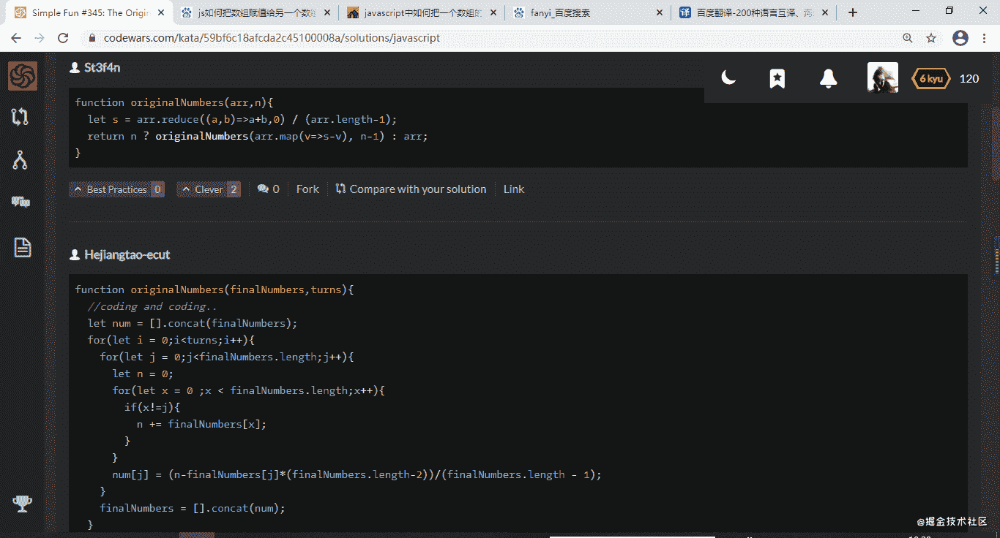
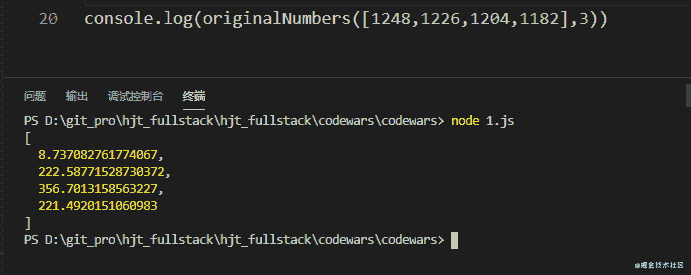
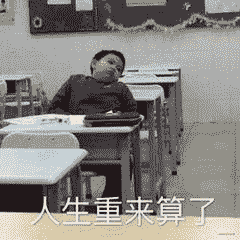
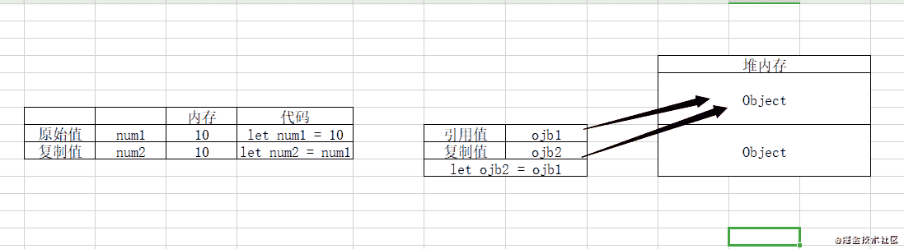
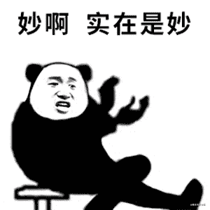

<!--yml
category: codewars
date: 2022-08-13 11:36:23
-->

# CodeWars 我二了_轻履者。的博客-CSDN博客

> 来源：[https://blog.csdn.net/weixin_45233071/article/details/112639811?ops_request_misc=%257B%2522request%255Fid%2522%253A%2522166036058716781683929565%2522%252C%2522scm%2522%253A%252220140713.130102334.pc%255Fall.%2522%257D&request_id=166036058716781683929565&biz_id=0&utm_medium=distribute.pc_search_result.none-task-blog-2~all~first_rank_ecpm_v1~rank_v31_ecpm-3-112639811-null-null.142^v40^control,185^v2^control&utm_term=codewars](https://blog.csdn.net/weixin_45233071/article/details/112639811?ops_request_misc=%257B%2522request%255Fid%2522%253A%2522166036058716781683929565%2522%252C%2522scm%2522%253A%252220140713.130102334.pc%255Fall.%2522%257D&request_id=166036058716781683929565&biz_id=0&utm_medium=distribute.pc_search_result.none-task-blog-2~all~first_rank_ecpm_v1~rank_v31_ecpm-3-112639811-null-null.142^v40^control,185^v2^control&utm_term=codewars)

## 昨天刷题，不经意间刷出来一个小彩蛋👇



## 今天醒来便发现， 卧槽，自己出现在解答列表第二，这lima，我一个小辣鸡也上榜了？🐂



## 话不多说，看键

# 警告，长文劝退，不是我啰嗦，是这题目一直在bibi赖赖

# Simple Fun #345: The Original Numbers

Task
Some players are playing a game: They stand in a circle, and each player has a card with the number on it. They put the card in front of their chest. That is to say, each player can see the numbers of other players, but can’t see his own.

In each turn, each player adds up the numbers he sees and writes it to the new card. For example:

There are 3 players: A,B and C
The original numbers of A,B,C is 1,0,4
Let’s see the next 4 turns:

Player: A B C
turn 0: 1 0 4
turn 1: 4 5 1 // A:0+4;B:1+4;C:1+0
turn 2: 6 5 9 // A:5+1;B:4+1;C:4+5
turn 3: 14 15 11 // A:5+9;B:6+9;C:6+5
turn 4: 26 25 29 // A:15+11;B:14+11;C:14+15
Hmm… Your task is coming: Now, suppose you don’t know the original numbers. You are given the final numbers(an array) and turns(a positive integer), can you get the original numbers?

Examples
For finalNumbers = [26,25,29] and turns = 4\. The output should be [1,0,4].

The validation process can be referred to the above example.

For finalNumbers = [1248,1226,1204,1182] and turns = 3\. The output should be [12,34,56,78].

The validation process:

Player: A B C D
turn 0: 12 34 56 78
turn 1: 168 146 124 102
turn 2: 372 394 416 438
turn 3: 1248 1226 1204 1182
Note
All inputs are valid.

The order of numbers must be correct.

Happy Coding <sup>_</sup>

**这bibi赖赖这么多，还（liu）真（lima）简（li）单（pu）**

# 简单的乐趣#345：原始数字

任务

有些玩家在玩一个游戏：他们站成一个圈，每个玩家都有一张上面有数字的牌。他们把卡片放在胸前。也就是说，每个玩家都能看到其他玩家的号码，但看不到自己的号码。

在每一轮中，每个玩家将看到的数字相加，并将其写入新卡中。例如：

有3个玩家：A，B和C

A，B，C的原始数字是1，0，4

让我们看看接下来的4个转弯：

玩家：A B C

turns0:1 0 4

turns1:4 5 1//A:0+4；B:1+4；C:1+0

turns2:6 5 9//A:5+1；B:4+1；C:4+5

turns3:14 15 11//A:5+9；B:6+9；C:6+5

turns4:26 25 29//A:15+11；B:14+11；C:14+15

隐马尔可夫模型。。你的任务来了：现在，假设你不知道原来的数字。给你最后的数字（一个数组）和圈数（一个正整数），你能得到原来的数字吗？

示例

对于finalNumber=[26,25,29]和turns=4。输出应为[1,0,4]。

验证过程可参考上述示例。

对于finalNumber=[1248122612041182]和turns=3。输出应为[12,34,56,78]。

验证过程：

玩家：A B C D

转弯0:12 34 56 78

转弯1:168 146 124 102

转弯2:372 394 416 438

转弯3:1248 1226 1204 1182

注意

所有输入都有效。

数字的顺序必须正确。

快乐编码<sup>_</sup>

* * *

简单来说，就是一群小屁孩在玩游戏，自己的下一个数字就是其他人的数字之和，但是自己看不到自己的数字，出题人呢就头铁了一下，想让你通过最后的结果来推算最开始的数字组合。
这不是有手就行？

### 思路

首先分析题干，

| 玩家 | A | B | C |
| --- | --- | --- | --- |
| turns0 | 1 | 0 | 4 |
| turns1 | 4 | 5 | 1 |
| turns2 | 6 | 5 | 9 |
| 计算步骤 | B+C | A+C | A+B |

*   B + C = AA B C
*   A = (B + C - A)/2 = ( AC + AB - BC )/2 = A
*   so easy

为什么会除2？再加几个玩家还是除2？

*   B + C + D + E = AAA BB CC DD
*   A = ( B + C + D + E - 2A )/3
*   假设有x个玩家，就可以得出计算公式：A = ( B + C + … + -(X-2)A)/(x-1)

NICE！

核心有了，嵌套几个循环，一个控制循环次数，另再套两个控制计算过程
同时在计算过程中涉及数组数值的变动，在给个数组复制一下，操作一下，就okk了！

* * *

```
function originalNumbers(finalNumbers,turns){
  //coding and coding..
  let num = finalNumbers;
  for(let i = 0;i<turns;i++){
    for(let j = 0;j<finalNumbers.length;j++){
      let n = 0;
      for(let x = 0 ;x < finalNumbers.length;x++){
        if(x!=j){
          n += finalNumbers[x];
        }
      }
      num[j] = (n-finalNumbers[j]*(finalNumbers.length-2))/(finalNumbers.length - 1);
    }
    finalNumbers = num;
  }
  return num;
} 
```

放一组数组试试


？？？？？？？？
我的手呢？我**********************



不急不急，BUG虐我千百遍，我待BUG如初恋！谁让我看不惯ta，又打不过ta呢

其实出现很多大佬一眼就能看出来，咱们的初恋出现就在第一行let num = finalNumbers;和倒数第二行finalNumbers = num;

在这就要扯一扯es6的原始值和引用值还有复制值之间的三角关系了。ECMAScript 变量可以包含两种不同类型的数据：**原始值和引用值**。原始值就是最简单的数据（**6 种原始值：Undefined、Null、Boolean、Number、String 和 Symbol**），**引用值则是由多个值构成的对象**，数组就是其中之一。在把一个值赋给变量时，JavaScript 引擎必须确定这个值是原始值还是引用值。

数据操作过程中，**保存原始值的变量是按值访问的，因为我们操作的就是存储在变量中的实际值**。引用值是保存在内存中的对象。与其他语言不同，JavaScript 不允许直接访问内存位置，因此也就不能直接操作对象所在的内存空间。**在操作对象时，实际上操作的是对该对象的引用而非实际的对象本身。为此，保存引用值的变量是按引访问的。**

原始值和引用值在通过变量复制时是有所不同。在通过变量把一个原始值赋值到另一个变量时，原始值会被**复制到新变量的位置**。在把引用值从一个变量赋给另一个变量时，存储在变量中的值也会被复制到新变量所在的位置。区别在于，**这里复制的值实际上是一个指针，它指向存储在堆内存中的对象**。操作完成后，两个变量实际上指向同一个对象，因此一个对象上面的变化会在另一个对象上反映出来。如图👇


**所以使用num = finalNumbers后很多萌新会以为在操作两个不同的数组，实际上操作的都是同一个**

其实解决的办法很简单，方法也很多种，只要将num = finalNumbers改成num = [].concat(finalNumbers);
用一个空的数组连接需要的数组，就可以完美的解决这个问题啦！

```
function originalNumbers(finalNumbers,turns){
  //coding and coding..
  let num = [].concat(finalNumbers);
  for(let i = 0;i<turns;i++){
    for(let j = 0;j<finalNumbers.length;j++){
      let n = 0;
      for(let x = 0 ;x < finalNumbers.length;x++){
        if(x!=j){
          n += finalNumbers[x];
        }
      }
      num[j] = (n-finalNumbers[j]*(finalNumbers.length-2))/(finalNumbers.length - 1);
    }
    finalNumbers = [].concat(num);
  }
  return num;
} 
```

同时很多人会选择将第一条赋值语句放在循环之中，这个使用方法其实也没有什么不妥，但是每一次循环就会触发内存分配和闲置资源回收。在JS中有标记清理和引用计数两个策略，现在多使用标记清理策略，在多次触发过程中启动垃圾回收程序会在一定程度上影响性能，在小程序上影响不大，但是放到大工程上可能会造成性能下降，合理使用分配的内存，同时避免多余的垃圾回收，那就可以保住因释放内存而损失的性能。在对象不存在时创建新的，在对象存在时则复用存在的那么这个实现本质上是一种贪婪算法，通过内存的重复使用减少释放内存，在理论依据上可以保持良好的性能。

最后把肝出来的代码放到codewars上跑一跑




在完成codewars题目后看看别的大神的骚操作也是一种不错学习方式！

* * *

附（题目链接）：https://www.codewars.com/kata/59bf6c18afcda2c45100008a/train/javascript/5ffdb77d464749000f9b4175