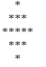
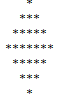

<!--yml
category: codewars
date: 2022-08-13 11:47:36
-->

# CodeWars练习之打印菱形_小陆壮士的博客-CSDN博客

> 来源：[https://blog.csdn.net/qingyi2xiaosheng/article/details/52131975?ops_request_misc=&request_id=&biz_id=102&utm_term=codewars&utm_medium=distribute.pc_search_result.none-task-blog-2~all~sobaiduweb~default-4-52131975.nonecase](https://blog.csdn.net/qingyi2xiaosheng/article/details/52131975?ops_request_misc=&request_id=&biz_id=102&utm_term=codewars&utm_medium=distribute.pc_search_result.none-task-blog-2~all~sobaiduweb~default-4-52131975.nonecase)

因为是上午刷到的题目第一次提交时未通过，再加上网速问题，关了界面。然后，就找不到原题了。只记得要求：

1.输入的如果是偶数，返回null。

2.输入的如果是奇数，返回的是String，其样式是，该数的中间值的那一行全部为“*”，往上/下一次递减两个“*”。像下面这个图：



我的思路如下：

用一个长度为n的二维数组来保存这些元素的值。（i: 行坐标，j:列坐标）分析可以知道，第一行的列坐标是n/2, 第二行是n/2-1~n/2+1, 在到i=n/2之前都能够满足j=n/2-i到j=n/2+i;这就是上半部分。在下半部分的时候，因为受上半部分的思路和一直以来总是习惯在两个for循环内对元素赋值的影响一直尝试找到j的取值范围，可是并没有找到。拖延到下午才想到，他们上下部分是对称的，我可以用行赋值的方法。就得到了下面的代码：

```
public static String[][] test(int n){
		String[][] star=new String[n][n];
		for (int i = 0; i < star.length; i++) {			
			//初始化
			for (int j = 0; j < star.length; j++) {
				star[i][j]=" ";
				}
			//设置上部分
			if (i<n/2+1) {
				for (int j = n/2-i; j < n/2+i+1; j++) {
					star[i][j]="*";
				}
			}		
		}
		//设置下半部分
		for (int i = n/2+1; i < star.length; i++) {
			int temp=n-i-1;
			star[i]=star[temp];
		}
		return star;
  } 
```

因为题目要求是返回String类型，所以后面的代码主要是把String[][]变成String。在这里我用了StringBuffer。如下：

```
 public static String print(int n) {
		    // TODO your code here

		if (n%2==0) {
			return null;
		}else{
			StringBuffer sb=new StringBuffer();
			String[][] star=test(n);
			for (int i = 0; i < star.length; i++) {
				for (int j = 0; j < star.length; j++) {
					sb.append(star[i][j]);
				}
				sb.append("\n");
			}
			return sb.toString();
		}   
	}
```

最后可得到结果如下：

n=5时，

n=7时，