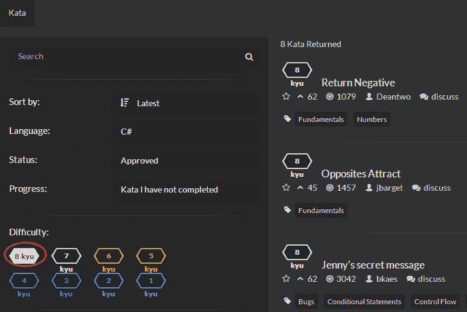

<!--yml
category: codewars
date: 2022-08-13 11:46:09
-->

# CodeWars题目筛选_weixin_30672019的博客-CSDN博客

> 来源：[https://blog.csdn.net/weixin_30672019/article/details/96876190?ops_request_misc=&request_id=&biz_id=102&utm_term=codewars&utm_medium=distribute.pc_search_result.none-task-blog-2~all~sobaiduweb~default-8-96876190.nonecase](https://blog.csdn.net/weixin_30672019/article/details/96876190?ops_request_misc=&request_id=&biz_id=102&utm_term=codewars&utm_medium=distribute.pc_search_result.none-task-blog-2~all~sobaiduweb~default-8-96876190.nonecase)

http://www.codewars.com/kata/search/csharp?q=&r%5B%5D=-8&xids=completed&beta=false

语言选择C#

进度选择未完成的

难度选择，分层  最容易的是8，最难的是1

难度为7的题目：  http://www.codewars.com/kata/search/csharp?q=&r%5B%5D=-7&xids=completed&beta=false