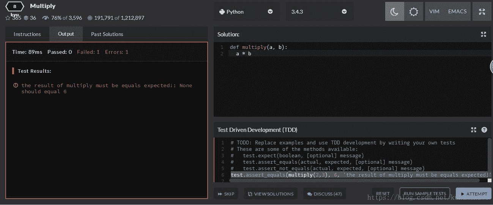
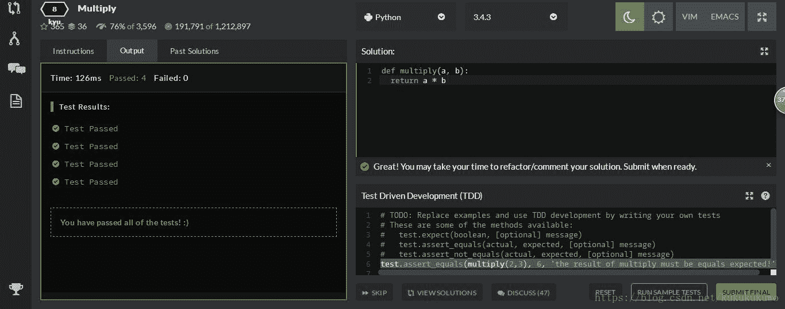

<!--yml
category: codewars
date: 2022-08-13 11:41:25
-->

# CodeWars题目训练1【Python】_会飞的鸡仔的博客-CSDN博客_def multiply(a,b)

> 来源：[https://blog.csdn.net/kukukukuwo/article/details/79713349?ops_request_misc=%257B%2522request%255Fid%2522%253A%2522166036059116782388023961%2522%252C%2522scm%2522%253A%252220140713.130102334.pc%255Fall.%2522%257D&request_id=166036059116782388023961&biz_id=0&utm_medium=distribute.pc_search_result.none-task-blog-2~all~first_rank_ecpm_v1~rank_v31_ecpm-12-79713349-null-null.142^v40^control,185^v2^control&utm_term=codewars](https://blog.csdn.net/kukukukuwo/article/details/79713349?ops_request_misc=%257B%2522request%255Fid%2522%253A%2522166036059116782388023961%2522%252C%2522scm%2522%253A%252220140713.130102334.pc%255Fall.%2522%257D&request_id=166036059116782388023961&biz_id=0&utm_medium=distribute.pc_search_result.none-task-blog-2~all~first_rank_ecpm_v1~rank_v31_ecpm-12-79713349-null-null.142^v40^control,185^v2^control&utm_term=codewars)

题目：Multiply
等级：8 【最低一级】
介绍：The code does not execute properly. Try to figure out why.
翻译：代码不能正确执行，想办法知道为什么。【可自行机翻】
正文：

```
def multiply(a, b):
  a * b
```

可以看到，该函数并没有返回值。看看测试代码：

```
test.assert_equals(multiply(2,3), 6, 'the result of multiply must be equals expected!')
```

代码是博主自己编写，题目中有提示如何编写。

最后附上运行结果截图：




总结：此题目对博主来说，最大的收获是以TDD（Test Driven Development）的模式编写代码，测试代码可能会用到的部分函数代码为：

```
test.expect(boolean, [optional] message)
test.assert_equals(actual, expected, [optional] message)
test.assert_not_equals(actual, expected, [optional] message)
```

有兴趣训练的代码的可以上去CodeWars官网：
www.codewars.com/r/z7grhQ