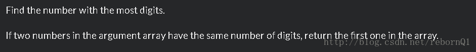

<!--yml
category: codewars
date: 2022-08-13 11:47:30
-->

# CodeWars:Most digits_rebornQ1的博客-CSDN博客

> 来源：[https://blog.csdn.net/rebornQ1/article/details/78209127?ops_request_misc=&request_id=&biz_id=102&utm_term=codewars&utm_medium=distribute.pc_search_result.none-task-blog-2~all~sobaiduweb~default-0-78209127.nonecase](https://blog.csdn.net/rebornQ1/article/details/78209127?ops_request_misc=&request_id=&biz_id=102&utm_term=codewars&utm_medium=distribute.pc_search_result.none-task-blog-2~all~sobaiduweb~default-0-78209127.nonecase)

# 题目：



# 我的解：

```
public class Kata
{
  public static int FindLongest(int[] number)
  {
    // code here
    int max = number[0], maxIndex = number[0].ToString().Length;
            for (int i = 1; i < number.Length; i++)
            {
                if (max < number[i] && maxIndex != number[i].ToString().Length)
                {
                    max = number[i];
                    maxIndex = number[i].ToString().Length;
                }
                else
                    continue;
            }
            return max;
  }
}
```

# 多种答案之一：

```
using System.Linq;
public class Kata
{
    public static int FindLongest(int[] N)
    {
        return N.OrderByDescending(X => X.ToString().Length).First();
    }
}
```