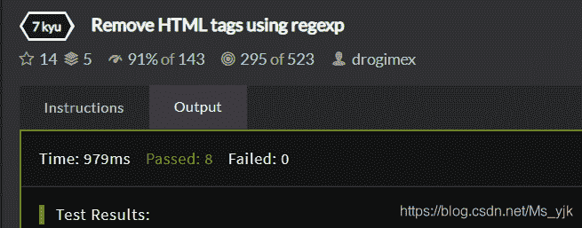

<!--yml
category: codewars
date: 2022-08-13 11:49:05
-->

# Codewars-(RegEx去除html标签)_End_less__的博客-CSDN博客

> 来源：[https://blog.csdn.net/ms_yjk/article/details/102403321?ops_request_misc=&request_id=&biz_id=102&utm_term=codewars&utm_medium=distribute.pc_search_result.none-task-blog-2~all~sobaiduweb~default-1-102403321.nonecase](https://blog.csdn.net/ms_yjk/article/details/102403321?ops_request_misc=&request_id=&biz_id=102&utm_term=codewars&utm_medium=distribute.pc_search_result.none-task-blog-2~all~sobaiduweb~default-1-102403321.nonecase)

**题目描述**

> 1) <tag> and </tag>
> 2) <tag/>
> 3) <tag />
> 4) html tags with attributes.
> Don't trim space, tab etc.
> 
> **You have to use regexp.**
> 
> Tests are using function:
> `String.prototype.replace(your regexp, "")`

<font face="monospace">题目地址：</font>[https://www.codewars.com/kata/remove-html-tags-using-regexp/train/javascript](https://www.codewars.com/kata/remove-html-tags-using-regexp/train/javascript)

**源码?：**

```
var reg = /<[^>]+>/g;
```

> *   ^                 #匹配输入字符串的开始位置，除非在方括号表达式中使用，此时它表示不接受该字符集合。要匹配 ^ 字符本身，请使用 \^。
> *   /g               #执行全局匹配（查找所有匹配而非在找到第一个匹配后停止）

测试：

```
console.log(("<div>test</div>".replace(reg, ""), "test"));;
console.log(("<a href='#'>go to <b>start</b> page</a>".replace(reg, ""), "go to start page"));
```


