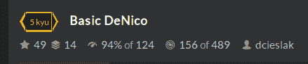
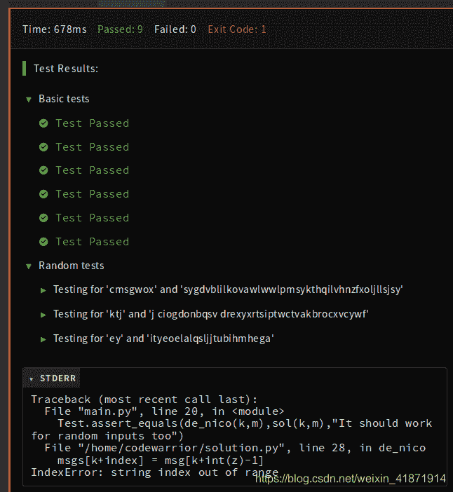

<!--yml
category: codewars
date: 2022-08-13 11:48:28
-->

# Codewars--Basic DeNico_honeybabyqinqin的博客-CSDN博客

> 来源：[https://blog.csdn.net/weixin_41871914/article/details/89221047?ops_request_misc=&request_id=&biz_id=102&utm_term=codewars&utm_medium=distribute.pc_search_result.none-task-blog-2~all~sobaiduweb~default-3-89221047.nonecase](https://blog.csdn.net/weixin_41871914/article/details/89221047?ops_request_misc=&request_id=&biz_id=102&utm_term=codewars&utm_medium=distribute.pc_search_result.none-task-blog-2~all~sobaiduweb~default-3-89221047.nonecase)

# Basic DeNico

[Click here to get the problem!](https://www.codewars.com/kata/596f610441372ee0de00006e/train/python)

### Problem



### My Solution:

```
def de_nico(key,msg):
    #key_sort = sorted(key)
    key_sort = "".join((lambda x:(x.sort(),x)[1])(list(key)))
    msgs = list(len(msg)*'n')
    dicts = {}
    sums = 0
    i = 0
    k = 0
    for item in key_sort:
        i += 1
        dicts[item] = i
    #print(dicts)
    for j in key:
        sums = sums*10+dicts[j]
    #print(sums)
    while True:
        if not msg[k:k+len(key)]:
            break
        else:
            #print(msg[k:k+len(key)])
            index = 0
            if (k+len(key))<=len(msg):
                for x,y,z in zip(msg[k:k+len(key)],msgs[k:k+len(key)],str(sums)):
                    msgs[k+index] = msg[k+int(z)-1]
                    index += 1
            else:
                for x,y,z in zip(msg[k:],msgs[k:],str(sums)):
                    msgs[k+index] = msg[k+int(z)-1]
                    index += 1
            #print(msgs)
        k += len(key)
    for x in reversed(msgs):
        if x==' ':
            msgs.remove(x)
        else:
            break
    final = ''.join(msgs)
    return final 
```

The code by myself is not good. Let’s look the picture.
一直提示的错误是下标越界，但是我也找不出为什么下标越界了，如果有知道的大佬，很开心能告诉我喔。嘻嘻。
最后为我还是看了一下正确答案，摘录了下来，留给后面的宝宝参考一下。

### method1:

```
def de_nico(key, msg):
    ll, order, s = len(key), [sorted(key).index(c) for c in key], ''
    while msg:
        s, msg = s + ''.join(msg[i] for i in order if i < len(msg)), msg[ll:]
    return s.strip() 
```

### method2:

```
def de_nico(key,msg):
    result = ''
    counter = -1
    while len(result) < len(msg):
        counter += 1
        for i in [sorted(key).index(c) for c in key]:
            try:
                result += msg[i+counter*len(key)]
            except:
                continue
    return result.strip() 
```

### method3:

```
import itertools
def de_nico(key,msg):
    pack =[list(range(len(key)))]+list(list(msg[i:i+len(key)]) for i in range(0,len(msg),len(key)))
    sor = [sorted(key).index(i) for i in key]
    sorting = sorted(itertools.zip_longest(*pack,fillvalue=""), key=lambda col: sor.index(col[0]))
    return "".join(["".join(j) for i,j in enumerate(itertools.zip_longest(*sorting,fillvalue=" ")) if i>0]).strip(" ") 
```

### method4:

```
def de_nico(key,msg):
    result = ''
    counter = -1
    while len(result) < len(msg):
        counter += 1
        for i in [sorted(key).index(c) for c in key]:
            try:
                result += msg[i+counter*len(key)]
            except:
                continue
    return result.strip() 
```