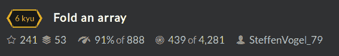
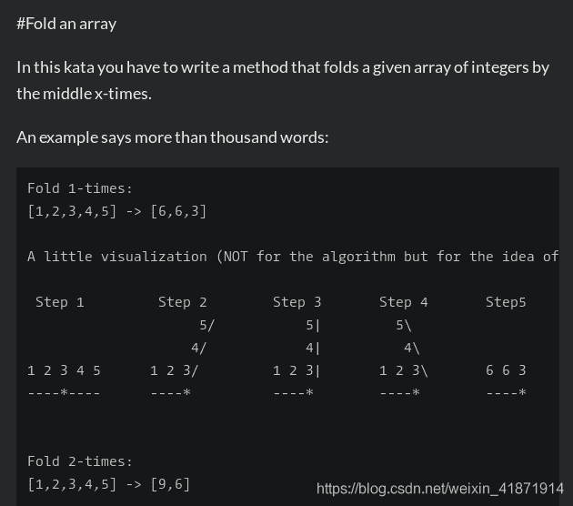
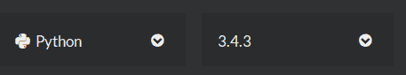
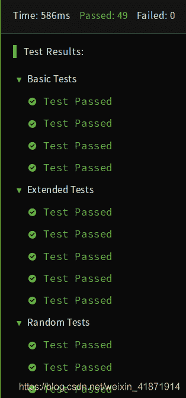

<!--yml
category: codewars
date: 2022-08-13 11:39:35
-->

# Codewars--Fold an array_honeybabyqinqin的博客-CSDN博客

> 来源：[https://blog.csdn.net/weixin_41871914/article/details/84987142?ops_request_misc=%257B%2522request%255Fid%2522%253A%2522166036058916781685355945%2522%252C%2522scm%2522%253A%252220140713.130102334.pc%255Fall.%2522%257D&request_id=166036058916781685355945&biz_id=0&utm_medium=distribute.pc_search_result.none-task-blog-2~all~first_rank_ecpm_v1~rank_v31_ecpm-30-84987142-null-null.142^v40^control,185^v2^control&utm_term=codewars](https://blog.csdn.net/weixin_41871914/article/details/84987142?ops_request_misc=%257B%2522request%255Fid%2522%253A%2522166036058916781685355945%2522%252C%2522scm%2522%253A%252220140713.130102334.pc%255Fall.%2522%257D&request_id=166036058916781685355945&biz_id=0&utm_medium=distribute.pc_search_result.none-task-blog-2~all~first_rank_ecpm_v1~rank_v31_ecpm-30-84987142-null-null.142^v40^control,185^v2^control&utm_term=codewars)

# Fold an array

## Problem Description:




As you see, if the count of numbers is odd, the middle number will stay. Otherwise the fold-point is between the middle-numbers, so all numbers would be added in a way.

The array will always contain numbers and will never be null. The parameter runs will always be a positive integer greater than 0 and says how many runs of folding your method has to do.

If an array with one element is folded, it stays as the same array.

The input array should not be modified!

## Version of Python:



## Solution:

```
def fold_array(array, runs):
    if runs<=0:
        return array
    n=len(array)
    list=[]
    for i in range(n//2):
        list.append(array[i]+array[n-i-1])
    if n%2==0:
        return fold_array(list,(runs-1))
    else:
        list.append(array[n//2])
        return fold_array(list,(runs-1)) 
```



## Grammar:

##### Within Python list, compare append() with extend():

```
list.append(array[i]+array[n-i-1]) 
```

Let’s give an example:

```
>>> a.extend([1,2])
>>> print a
[1, 2, '3', '1', 1, 2]
>>> a.append([1,2])
>>> print a
[1, 2, '3', '1', 1, 2, [1, 2]] 
```

###### Conlusion:

*   A list can contain elements of any data type, and elements in a single list need not all be of the same type.
*   The append() function adds a new element to the end of the list.
*   Lists are implemented as classes. Creating a list is actually instantiating a class. Therefore, lists can be manipulated in many ways. The extend() method takes a single list as an argument , and adds each element of that parameter list to the original list.
*   Both append() and extend() accept only one parameter.
*   The parameter of append() is random as you like.
*   The parameter of extend() must be a list.

###### Wish you succeed!