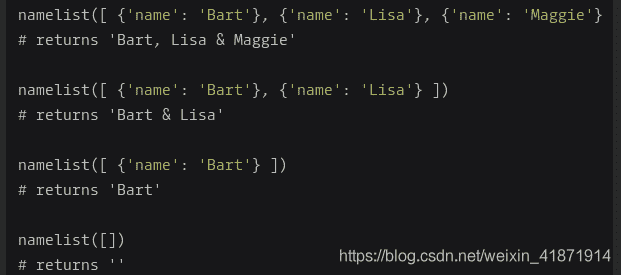
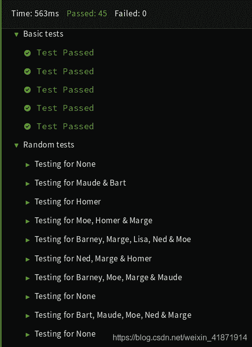

<!--yml
category: codewars
date: 2022-08-13 11:50:52
-->

# Codewars--Format a string of names like 'Bart, Lisa & Maggie'._honeybabyqinqin的博客-CSDN博客

> 来源：[https://blog.csdn.net/weixin_41871914/article/details/85005265?ops_request_misc=&request_id=&biz_id=102&utm_term=codewars&utm_medium=distribute.pc_search_result.none-task-blog-2~all~sobaiduweb~default-8-85005265.nonecase](https://blog.csdn.net/weixin_41871914/article/details/85005265?ops_request_misc=&request_id=&biz_id=102&utm_term=codewars&utm_medium=distribute.pc_search_result.none-task-blog-2~all~sobaiduweb~default-8-85005265.nonecase)

# Format a string of names like ‘Bart, Lisa & Maggie’.

## Problem Description:


Given: an array containing hashes of names

Return: a string formatted as a list of names separated by commas except for the last two names, which should be separated by an ampersand.

Example:


Note: all the hashes are pre-validated and will only contain A-Z, a-z, ‘-’ and ‘.’.

#### Sample Test:

```
Test.assert_equals(namelist([{'name': 'Bart'},{'name': 'Lisa'},{'name': 'Maggie'},{'name': 'Homer'},{'name': 'Marge'}]), 'Bart, Lisa, Maggie, Homer & Marge',
"Must work with many names")
Test.assert_equals(namelist([{'name': 'Bart'},{'name': 'Lisa'},{'name': 'Maggie'}]), 'Bart, Lisa & Maggie',
"Must work with many names")
Test.assert_equals(namelist([{'name': 'Bart'},{'name': 'Lisa'}]), 'Bart & Lisa', 
"Must work with two names")
Test.assert_equals(namelist([{'name': 'Bart'}]), 'Bart', "Wrong output for a single name")
Test.assert_equals(namelist([]), '', "Must work with no names") 
```

# Version of Python:


# Solution:

```
def namelist(names):
    #your code here
    toReturn = ''
    if(len(names) == 1):
        return names[0]['name']
    elif(len(names) == 2):
        toReturn = toReturn + names[0]['name'] + " & " + names[1]['name']
    elif(len(names) > 2):
        for i in range(0, len(names)-1):
            toReturn = toReturn + names[i]['name'] + ", "
        toReturn = toReturn[:-2] + " & " + names[len(names)-1]['name']
    return toReturn 
```

