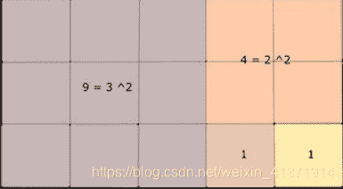
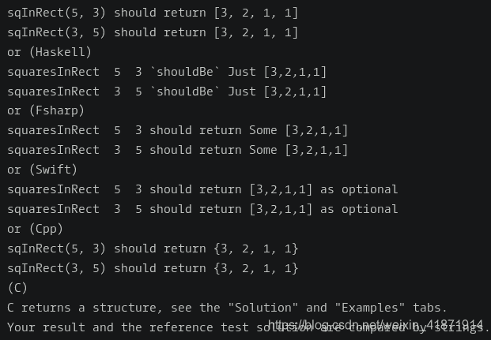

<!--yml
category: codewars
date: 2022-08-13 11:44:40
-->

# Codewars--Rectangle into Squares_honeybabyqinqin的博客-CSDN博客

> 来源：[https://blog.csdn.net/weixin_41871914/article/details/84978764?ops_request_misc=&request_id=&biz_id=102&utm_term=codewars&utm_medium=distribute.pc_search_result.none-task-blog-2~all~sobaiduweb~default-5-84978764.nonecase](https://blog.csdn.net/weixin_41871914/article/details/84978764?ops_request_misc=&request_id=&biz_id=102&utm_term=codewars&utm_medium=distribute.pc_search_result.none-task-blog-2~all~sobaiduweb~default-5-84978764.nonecase)

# Rectangle into Squares

## problem describtion


The drawing below gives an idea of how to cut a given “true” rectangle into squares (“true” rectangle meaning that the two dimensions are different).



alternative text

Can you translate this drawing into an algorithm?

You will be given two dimensions
1 、a positive integer length (parameter named lng)
2 、a positive integer width (parameter named wdth)

You will return an array or a string (depending on the language; Shell bash and Fortran return a string) with the size of each of the squares.



## the version of python:


## Methon:

### methon1:

```
def sqInRect(lng, wdth):
    # your code
    import math
    if lng==wdth:
        return None
    list=[]
    if lng<wdth:
            lng,wdth=wdth,lng 
    while lng!=wdth:
        list.append(wdth)
        lng=lng-wdth
        if lng<wdth:
            lng,wdth=wdth,lng
    list.append(wdth)
    return list 
```

The first time,I use “list[]” instead of “list=[]”. You should take care of the version of python.

### methon2:

```
# Recursive solution
def sqInRect(lng, wdth, recur = 0):
    if lng == wdth:
        return (None, [lng])[recur]            # If this is original function call, return None for equal sides (per kata requirement);
                                               # if this is recursion call, we reached the smallest square, so get out of recursion.
    lesser = min(lng, wdth)
    return [lesser] + sqInRect(lesser, abs(lng - wdth), recur = 1) 
```

It uses recursive solution.