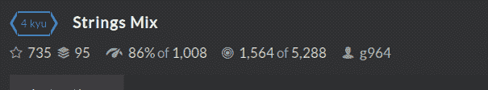
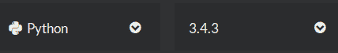
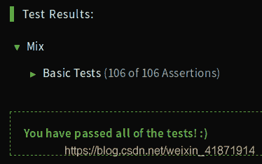

<!--yml
category: codewars
date: 2022-08-13 11:37:37
-->

# Codewars--String Mix_honeybabyqinqin的博客-CSDN博客

> 来源：[https://blog.csdn.net/weixin_41871914/article/details/85068581?ops_request_misc=&request_id=&biz_id=102&utm_term=codewars&utm_medium=distribute.pc_search_result.none-task-blog-2~all~sobaiduweb~default-3-85068581.142^v40^control,185^v2^control](https://blog.csdn.net/weixin_41871914/article/details/85068581?ops_request_misc=&request_id=&biz_id=102&utm_term=codewars&utm_medium=distribute.pc_search_result.none-task-blog-2~all~sobaiduweb~default-3-85068581.142^v40^control,185^v2^control)

# String Mix

## Problem Description:



Given two strings s1 and s2, we want to visualize how different the two strings are. We will only take into account the lowercase letters (a to z). First let us count the frequency of each lowercase letters in s1 and s2.

s1 = “A aaaa bb c”

s2 = “& aaa bbb c d”

s1 has 4 ‘a’, 2 ‘b’, 1 ‘c’

s2 has 3 ‘a’, 3 ‘b’, 1 ‘c’, 1 ‘d’

So the maximum for ‘a’ in s1 and s2 is 4 from s1; the maximum for ‘b’ is 3 from s2\. In the following we will not consider letters when the maximum of their occurrences is less than or equal to 1.

We can resume the differences between s1 and s2 in the following string: “1:aaaa/2:bbb” where 1 in 1:aaaa stands for string s1 and aaaa because the maximum for a is 4\. In the same manner 2:bbb stands for string s2 and bbb because the maximum for b is 3.

The task is to produce a string in which each lowercase letters of s1 or s2 appears as many times as its maximum if this maximum is strictly greater than 1; these letters will be prefixed by the number of the string where they appear with their maximum value and :. If the maximum is in s1 as well as in s2 the prefix is =:.

In the result, substrings (a substring is for example 2:nnnnn or 1:hhh; it contains the prefix) will be in decreasing order of their length and when they have the same length sorted in ascending lexicographic order (letters and digits - more precisely sorted by codepoint); the different groups will be separated by ‘/’. See examples and “Example Tests”.

Hopefully other examples can make this clearer.

s1 = “my&friend&Paul has heavy hats! &”
s2 = “my friend John has many many friends &”
mix(s1, s2) --> “2:nnnnn/1:aaaa/1:hhh/2:mmm/2:yyy/2:dd/2:ff/2:ii/2:rr/=:ee/=:ss”

s1 = “mmmmm m nnnnn y&friend&Paul has heavy hats! &”
s2 = “my frie n d Joh n has ma n y ma n y frie n ds n&”
mix(s1, s2) --> “1:mmmmmm/=:nnnnnn/1:aaaa/1:hhh/2:yyy/2:dd/2:ff/2:ii/2:rr/=:ee/=:ss”

s1=“Are the kids at home? aaaaa fffff”
s2=“Yes they are here! aaaaa fffff”
mix(s1, s2) --> “=:aaaaaa/2:eeeee/=:fffff/1:tt/2:rr/=:hh”

Note for Swift, R, PowerShell

The prefix =: is replaced by E:

s1 = “mmmmm m nnnnn y&friend&Paul has heavy hats! &”
s2 = “my frie n d Joh n has ma n y ma n y frie n ds n&”
mix(s1, s2) --> "1:mmmmmm/E:nnnnnn/1:aaaa/1:hhh/2:yyy/2:dd/2:ff/2

## Sample Tests:

```
Test.describe("Mix")
Test.it("Basic Tests")
Test.assert_equals(mix("Are they here", "yes, they are here"), "2:eeeee/2:yy/=:hh/=:rr")
Test.assert_equals(mix("looping is fun but dangerous", "less dangerous than coding"), "1:ooo/1:uuu/2:sss/=:nnn/1:ii/2:aa/2:dd/2:ee/=:gg")
Test.assert_equals(mix(" In many languages", " there's a pair of functions"), "1:aaa/1:nnn/1:gg/2:ee/2:ff/2:ii/2:oo/2:rr/2:ss/2:tt")
Test.assert_equals(mix("Lords of the Fallen", "gamekult"), "1:ee/1:ll/1:oo")
Test.assert_equals(mix("codewars", "codewars"), "")
Test.assert_equals(mix("A generation must confront the looming ", "codewarrs"), "1:nnnnn/1:ooooo/1:tttt/1:eee/1:gg/1:ii/1:mm/=:rr") 
```

# Version of Python:



# Solution:

## Method1:

```
def mix(s1,s2):
    alpha = 'abcdefghijklmnopqrstuvwxyz'
    count1 = []
    count2 = []
    max1 = []
    max2 = []
    equal = []
    form1 = []
    form2 = []
    forme = []
    for letter in alpha:
        lets = list(filter(lambda x: x == letter, s1))
        count1.append(lets)
    for letter in alpha:
        lets = list(filter(lambda x: x == letter, s2))
        count2.append(lets)
    for i in range(0,len(count1)):
        if len(count1[i]) == len(count2[i]) and len(count1[i]) > 1:
            equal.append(count1[i])
        elif len(count1[i]) > len(count2[i]) and len(count1[i]) > 1:
            max1.append(count1[i])
        elif len(count1[i]) < len(count2[i]) and len(count2[i]) > 1:
            max2.append(count2[i])
    for items in max1:
        form1.append('1:' + items[0]*len(items))
    for items in max2:
        form2.append('2:' + items[0]*len(items))
    for items in equal:
        forme.append('=:' + items[0]*len(items))
    final = form1 + form2 + forme
    final.sort(key=len, reverse=True)
    return '/'.join(final) 
```



## Method2:

```
from collections import Counter

def mix(s1, s2):
    c1 = Counter(filter(str.islower, s1))
    c2 = Counter(filter(str.islower, s2))
    res = []
    for c in set(c1.keys() + c2.keys()):
        n1, n2 = c1.get(c, 0), c2.get(c, 0)
        if n1 > 1 or n2 > 1:
            res.append(('1', c, n1) if n1 > n2 else
                ('2', c, n2) if n2 > n1 else ('=', c, n1))
    res = ['{}:{}'.format(i, c * n) for i, c, n in res]
    return '/'.join(sorted(res, key=lambda s: (-len(s), s))) 
```

## Method3:

```
mix=lambda a,b:'/'.join(sorted(("=12"[cmp(*k)]+":"+max(k)*r
for r,k in{(c, (a.count(c), b.count(c)))
for c in a+b if c.islower()}if max(k)>1),
key=lambda x:(-len(x),x))) 
```

I copied the code on the Internet today, the code is very simple, every line looks like the indentation of the indentation, the operation of the following error:

```
IndentationError: unindent does not match any outer indentation level 
```

*   The most common reason for this error is that there really is no indentation. If you look at the code, you can see that it is indented, and the syntax is correct.
*   After a careful study of the code, I found nothing wrong with it. It occurred to me that I should display all characters (including Spaces and TAB characters) of the current python script to see if there is any indentation or other special characters.
*   The current text editor Notepad++ has a setting that displays all characters.
*   View - > displays symbols - > displays Spaces and tabs
*   So you can see if we have any indentation in our Python code