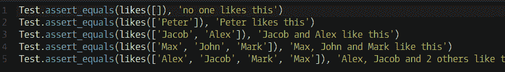
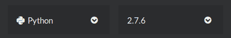

<!--yml
category: codewars
date: 2022-08-13 11:47:14
-->

# Codewars--Who likes it?_honeybabyqinqin的博客-CSDN博客

> 来源：[https://blog.csdn.net/weixin_41871914/article/details/84995268?ops_request_misc=&request_id=&biz_id=102&utm_term=codewars&utm_medium=distribute.pc_search_result.none-task-blog-2~all~sobaiduweb~default-1-84995268.nonecase](https://blog.csdn.net/weixin_41871914/article/details/84995268?ops_request_misc=&request_id=&biz_id=102&utm_term=codewars&utm_medium=distribute.pc_search_result.none-task-blog-2~all~sobaiduweb~default-1-84995268.nonecase)

# Codewars–Who likes it?

## Problem Description:

You probably know the “like” system from Facebook and other pages. People can “like” blog posts, pictures or other items. We want to create the text that should be displayed next to such an item.

Implement a function likes :: [String] -> String, which must take in input array, containing the names of people who like an item. It must return the display text as shown in the examples:


For 4 or more names, the number in and 2 others simply increases.

## Version of Python:



## Solution:

#### Method1:

```
def likes(names):
    #your code here
    textToReturn = ""

    if (len(names) == 0):
        textToReturn = "no one likes this"
    elif (len(names) == 1):
        textToReturn = str(names[0]) + " likes this"
    elif (len(names) > 1 and len(names) < 4):
        for name in range(0, len(names) - 1):
            textToReturn = textToReturn + names[name] + ", "
        textToReturn = textToReturn[:-2]
        textToReturn = textToReturn + " and " + str(names[len(names) - 1]) + " like this"
    else:
        for name in range(0, 2):
            textToReturn = textToReturn + names[name] + ", "
        textToReturn = textToReturn[:-2]
        textToReturn = textToReturn + " and " + str(len(names)-2) + " others like this"
    return textToReturn 
```

The code is a little complex.

#### Method2:

```
def likes(names):
    n = len(names)
    return {
        0: 'no one likes this',
        1: '{} likes this', 
        2: '{} and {} like this', 
        3: '{}, {} and {} like this', 
        4: '{}, {} and {others} others like this'
    }[min(4, n)].format(*names[:3], others=n-2) 
```