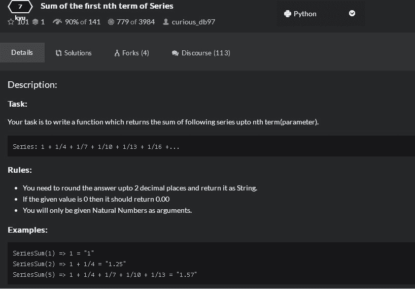

<!--yml
category: codewars
date: 2022-08-13 11:42:16
-->

# Codewars 9月刷题_bestallen的博客-CSDN博客

> 来源：[https://blog.csdn.net/bestallen/article/details/52491276?ops_request_misc=%257B%2522request%255Fid%2522%253A%2522166036059216781685328322%2522%252C%2522scm%2522%253A%252220140713.130102334.pc%255Fall.%2522%257D&request_id=166036059216781685328322&biz_id=0&utm_medium=distribute.pc_search_result.none-task-blog-2~all~first_rank_ecpm_v1~rank_v31_ecpm-8-52491276-null-null.142^v40^control,185^v2^control&utm_term=codewars](https://blog.csdn.net/bestallen/article/details/52491276?ops_request_misc=%257B%2522request%255Fid%2522%253A%2522166036059216781685328322%2522%252C%2522scm%2522%253A%252220140713.130102334.pc%255Fall.%2522%257D&request_id=166036059216781685328322&biz_id=0&utm_medium=distribute.pc_search_result.none-task-blog-2~all~first_rank_ecpm_v1~rank_v31_ecpm-8-52491276-null-null.142^v40^control,185^v2^control&utm_term=codewars)

专门开个类别，用来记录刷题中碰到的新鲜事，题目单位太小了，所以一个月为一篇，目前题目都是codewars上面的，后面可能会挑战leetcode上

第1题：



自己的答案：

```
def series_sum(n):
	sum = 0
	for i in range(0,n):
		sum += 1/(1+3*i)
	return '%.2f'%sum
```

看到其他筒子的最佳答案：

```
def series_sum(n):
    return '{:.2f}'.format(sum(1.0/(3 * i + 1) for i in range(n)))
```

这里用到了format的语言，重要的是前面花括号里面的用法，第一次看到，可以参考下面的链接

http://www.jb51.net/article/63672.htm

------------------------------------------------------------------------------------------------------------------------------------------------------------------------------

第2题：


我的答案：

```
def to_alternating_case(string):
    new=''
    for i in string:
        if i.isupper():
            new+=i.lower()
        elif i.islower():
            new+=i.upper()
        else:
            new+=i
    return new
```

然后其他筒子的答案

```
def to_alternating_case(string):
    return string.swapcase()
```

太简单粗暴了..............扫盲了，swapcase参数直接对换大小写，其他不变。

-------------------------------------------------------------------------------------------------------------------------------------------------------------------------------------

第3题：检查字符串里面是否有重复的字母，并计算有重复字母的种类个数


我的答案: 这里踩了一个坑.........没注意大小写的事情，原来text=text.lower()这句是被我漏了的，因为题目要求里是忽略大小写的。

```
def duplicate_count(text):
	result=[]
	text=text.lower()
	for i in text:
		if text.count(i) >1 and i not in result:
			result.append(i)
	return len(result)
```

别的筒子的答案

```
def duplicate_count(s):
  return len([c for c in set(s.lower()) if s.lower().count(c)>1])
```

感觉逼格蛮高，用到了set，我原本也想到了set，不过set以后没想到怎么继续下去。

他先用set把所有元素唯一化，然后再迭代出来，以此为标准去检测小写后的字符串里面的个数

这样做的好处是，避免了单纯迭代时候，前后碰到重复元素无法处理的情况

---------------------------------------------------------------------------------------------------------------------------------------------------------------------

第4题：检查该数是不是质数


我的答案

```
def divisors(integer):
	result=[]
	for i in range(2,integer):
		if integer%i==0:
			result.append(i)
	if len(result)==0:
		return "%d is prime"%integer
	else:
		return result
```

票数最高的答案，思路是一样的，写法用了推导式，逼格看起来高一些

```
def divisors(num):
    l = [a for a in range(2,num) if num%a == 0]
    if len(l) == 0:
        return str(num) + " is prime"
    return l
```

-------------------------------------------------------------------------------------------------------------------------------------------------------------------------------

第5题：在facebook这类交友网站上，肯定会有显示赞的地方，赞的边上会有写，谁谁谁赞了这条微博

那这个文本的显示的实现，就是这道题目，要求针对不同人数，显示不同的文本


我的答案：

```
def likes(names):
	if len(names)==0:
		return 'no one likes this'
	elif len(names)==1:
		return '%s likes this'%names[0]
	elif len(names)==2:
		return '%s and %s like this'%(names[0],names[1])
	elif len(names)==3:
		return '%s, %s and %s like this'%(names[0],names[1],names[2])
	elif len(names)>=4:
		return '%s, %s and %d others like this'%(names[0],names[1],(len(names)-2))
```

票数最高的答案：我擦，

**简直是扫盲**

................................

```
def likes(names):
    n = len(names)
    return {
        0: 'no one likes this',
        1: '{} likes this', 
        2: '{} and {} like this', 
        3: '{}, {} and {} like this', 
        4: '{}, {} and {others} others like this'
    }[min(4, n)].format(*names[:3], others=n-2)
```

------------------------------------------------------------------------------------------------------------------------------------------------------------------------

第6题：要求将以字典形式为元素的一个列表里面的名字取出来，要求如下图


我的答案，修改了N次，ulgy务必，不过，能通过所有测试！！哈哈

我的思路是：把最后的带&的一组名字和前面分开，这样前面就有规律可寻了，最后2个名字一组，作为特殊处理

```
def namelist(names):
	if len(names)==0:
		return ''
	elif len(names)==1:
		return names[0].get('name')
	elif len(names)==2:
		return names[0].get('name') +' & '+names[1].get('name')
	else:
		front=''
		last2=names[-2].get('name') +' & '+names[-1].get('name')
		for i in range(len(names)-2):
			front+=(names[i].get('name')+', ')
		return front+last2
```

其他老外的答案：

票数最高的，发觉在字符串的连接上，join还是用的比较多的。

```
def namelist(names):
    if len(names) > 1:
        return '{} & {}'.format(', '.join(name['name'] for name in names[:-1]), names[-1]['name'])
    elif names:
        return names[0]['name']
    else:
        return ''
```

高票数里面比较容易理解的

```
def namelist(names):
    if len(names)==0: return ''
    if len(names)==1: return names[0]['name']
    return ', '.join([n['name'] for n in names[:-1]]) + ' & ' + names[-1]['name']
```

-------------------------------------------------------------------------------------------------------------------------------------------------------------------------------

第7题：要求将字符串每2个一分组为元素，组成列表，要求如下


我的答案：

```
def solution(s):
	result=[]
	n=len(s)
	# print (n)
	if n%2 !=0:
		s=s+'_'
		for i in range(1,(len(s)//2)+1):
			result.append(s[2*(i-1):2*i])
		return result
	else:
		for i in range(1,(len(s)//2)+1):
			result.append(s[2*(i-1):2*i])
		return result
```

高票答案

```
def solution(s):
    return [s[x:x+2] if x < len(s) - 1 else s[-1] + "_" for x in range(0, len(s), 2)]
```

这个方法好在哪里？好在他用了列表推导式！！！

列表推导式的结果是生成一个列表，而**每个单独元素**是后面迭代出来的结果
复习一下写法，碰到if else的情况，先if的结果，再if条件，再else条件，最后else结果。

然后补一个觉得**最好的**！！！

```
def solution(s):
    return [(s + "_")[i:i + 2] for i in range(0, len(s), 2)]
```

注意上面列表推导式里面的(s+"_")，他在无论什么情况下，都会字符串加入了后缀"_"，因为

**当你是偶数的时候，你是不会切片刀那个符号的**

！！太棒了！！

----------------------------------------------------------------------------------------------------------------------------------------------------------------------------------------

第8题：要求将字符串里面字符数大于等于5的字符串，倒转，其他照旧


我的代码：

先用split将原来的字符串转换成列表，然后再迭代检查是否大于等于5，再重新加入新列表

```
def spin_words(sentence):
	result=[]
	new = sentence.split()
	for i in new:
		if len(i)>4:
			i=i[::-1]
		result.append(i)

	return ' '.join(result)
```

票数最高的答案：

还是用到了列表推导式，看上去比较舒服，并且，少用到了一个result的list变量

```
def spin_words(sentence):
    # Your code goes here
    return " ".join([x[::-1] if len(x) >= 5 else x for x in sentence.split(" ")])
```

-----------------------------------------------------------------------------------------------------------------------------------------------------------------------------------------

第9题：检查目标里面里的每个元素，和样本元素是否属于同一性质，也就是，元素内的字母种类一样，而且元素长度一样

但是这道题我觉得其实是有纰漏的，题目里面举的例子是aabb==abba这样的，返回True

但是我如果是aaab==aabb，这样到底是应该True还是False呢？


我的代码：

首先用set检测元素内部字母种类是否一致，再比对长度

```
def anagrams(word, words):
	new=[]
	for x in words:
		if set(word)==set(x) and len(word)==len(x):
			new.append(x)
	return new
```

得票最高的答案:

```
def anagrams(word, words): return [item for item in words if sorted(item)==sorted(word)]
```

感觉方法非常好............用了sorted来比较......只要一排序，就直接能同时知道长度和元素种类一不一样了.............

-------------------------------------------------------------------------------------------------------------------------------------------------------------------------------

第10题：寻找回数，正排反排都是一样的。


我的代码

```
def palindrome_chain_length(n):
	if str(n)==str(n)[::-1]:
		return 0
	else:
		count=0
		while True:
			if str(n)==str(n)[::-1]:
				return count
			else:
				count+=1
				n+=int(str(n)[::-1])
```

得票最高的代码修改了输入参数，并用到了递归，我感觉有些违反规则，所以没有贴，贴了第二高的，思路和我一样，不过他是用str(n) != str(n)[::-1]来做while条件

比我这个要简洁

```
def palindrome_chain_length(n):
    steps = 0
    while str(n) != str(n)[::-1]:
        n = n + int(str(n)[::-1])
        steps += 1
    return steps
```

-------------------------------------------------------------------------------------------------------------------------------------------------------------------------

第11题：根据列表内的元素，检查是否可以搭配得出目标值，并在能够搭配的选项中，选取2个元素相隔最短的那组，在相隔相同的组内，选择index靠前的组


这道题需要注意的是，如果答案如我写的那样，会引起性能的问题，也就是运算时间过长，因为他这个题目的测试里面，会用超过10000000个元素的列表来进行测试

所以，我的答案在短列表里测试没问题，但是长列表里就挂了

```
def sum_pairs(ints, s):
	n=len(ints)
	distance=[]
	for i in range(n):
		for x in range(i+1,n):
			if ints[i]+ints[x]==s:
				distance.append((i,x))
	distance.sort(key = lambda x:x[1]-x[0])
	if len(distance)==0:
		return None
	else:
		return [ints[m] for m in distance[0]]
```

得票最高的答案，算法思路很巧妙，用减法来倒推.......

```
def sum_pairs(lst, s):
    cache = set()
    for i in lst:
        if s - i in cache:
            return [s - i, i]
        cache.add(i)
```