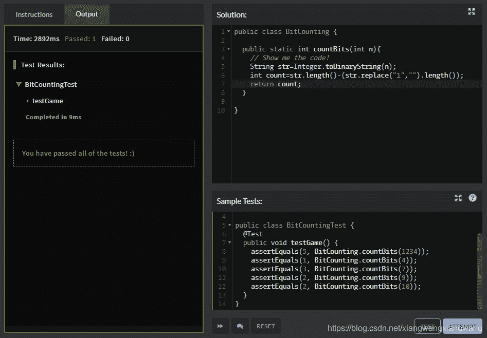

<!--yml
category: codewars
date: 2022-08-13 11:38:24
-->

# Codewars-Java编程刷题学习3-Bit Counting_禾女白儿厶的博客-CSDN博客

> 来源：[https://blog.csdn.net/xiangwangxiangwang/article/details/117930002?ops_request_misc=%257B%2522request%255Fid%2522%253A%2522166036058816781685396932%2522%252C%2522scm%2522%253A%252220140713.130102334.pc%255Fall.%2522%257D&request_id=166036058816781685396932&biz_id=0&utm_medium=distribute.pc_search_result.none-task-blog-2~all~first_rank_ecpm_v1~rank_v31_ecpm-26-117930002-null-null.142^v40^control,185^v2^control&utm_term=codewars](https://blog.csdn.net/xiangwangxiangwang/article/details/117930002?ops_request_misc=%257B%2522request%255Fid%2522%253A%2522166036058816781685396932%2522%252C%2522scm%2522%253A%252220140713.130102334.pc%255Fall.%2522%257D&request_id=166036058816781685396932&biz_id=0&utm_medium=distribute.pc_search_result.none-task-blog-2~all~first_rank_ecpm_v1~rank_v31_ecpm-26-117930002-null-null.142^v40^control,185^v2^control&utm_term=codewars)

点此欢迎光临我的个人网站[【一几文星球】](https://yijiwen.cn/)

端午已经收假了，刷题继续，最近广州这边疫情还是有点人心惶惶，前天下楼吃个晚饭，看到核酸检测又开始排队，才知道白云区也有确诊，赶紧排后面，没想到10多分钟就排到了，效率越来越高了，一点题外话，希望疫情早点结束啊。

> 题目：
> 
> Write a function that takes an integer as input, and returns the number of bits that are equal to one in the binary representation of that number. You can guarantee that input is non-negative.
> 
> *Example*: The binary representation of `1234` is `10011010010`, so the function should return `5` in this case
> 
> [谷歌翻译]
> 
> 编写一个函数，将一个整数作为输入，并返回该数字的二进制表示中等于 1 的位数。 您可以保证输入是非负的。
> 
> 示例：1234 的二进制表示为 10011010010，因此在这种情况下该函数应返回 5

第一遍看题是真没看明白，多看了两遍才明白，就是整数转为二进制，然后二进制表示中出现1的个数。

所以该题的解决就是两步：整数（十进制）转二进制，统计1的个数。

整数转二进制：

```
int x=1234;
String str=Integer.toBinaryString(x);
```

统计二进制中1的个数：

循环统计也可以，但是还有种更方便的，用空字符代替特定字符，然后计算与此前字符串的长度差。

```
int count=str.length()-(str.replace("1","").length());
```

ok,完成。（提交后发现等级更新为7kyu了，开森！）



然后照例是观摩大神代码的时候：

高赞第一且提交人数最多的解决方案-

```
public class BitCounting {

  public static int countBits(int n){

    return Integer.bitCount(n);
  }

}
```

我枯了，看来还是代码写少了，源码读少了。

点进Integer.bitCount()方法看了下，

```
/**
 * Returns the number of one-bits in the two's complement binary
 * representation of the specified {@code int} value.  This function is
 * sometimes referred to as the <i>population count</i>.
 *
 * @param i the value whose bits are to be counted
 * @return the number of one-bits in the two's complement binary
 *     representation of the specified {@code int} value.
 * @since 1.5
 */
public static int bitCount(int i) {
    // HD, Figure 5-2
    i = i - ((i >>> 1) & 0x55555555);
    i = (i & 0x33333333) + ((i >>> 2) & 0x33333333);
    i = (i + (i >>> 4)) & 0x0f0f0f0f;
    i = i + (i >>> 8);
    i = i + (i >>> 16);
    return i & 0x3f;
}
```

不好意思，这三个尖括号是啥意思来着？（ORZ，学渣看啥都是未知的）搜索一番

> **>>>表示无符号右移，也叫逻辑右移，即若该数为正，则高位补0，而若该数为负数，则右移后高位同样补0**

高赞第二

```
public class BitCounting {

  public static int countBits(int n){
    int ret = n % 2;
    while ((n /= 2) > 0) ret += n % 2;
    return ret;
  }

}
```

越来越看不懂了,好像是平时转二进制的规则，对2取余什么的。

高赞第三

```
public class BitCounting {

  public static int countBits(int n){
    return (int) Integer.toBinaryString(n).chars()
              .filter(c -> c == '1')
              .count();
  }

}
```

转二进制后过滤等于1的字符然后计数，跟我的方案思路类似。

高赞第四

```
public final class BitCounting {

    public static int countBits(int n) {
        int i = 0;

        for (int j = n; j > 0; j >>= 1) {
            i += j & 1;
        }

        return i;
    }
}
```

有点怀疑自己了，是同一道题吗？有点看不懂。

翻到第9个方案是和我的一样，且有9人提交了类似代码，

但是当了点开该方案下的讨论，我看到了这样一句话

Hi! Yea, you right. This approach is for more general case and was used hastily.
Thanks for your attention.

[你好！ 是的，你说得对。 这种方法适用于更一般的情况，并且被仓促使用。
感谢您的关注。]

行叭，我学，我努力学还不行吗。 哭唧唧.jpg

点此欢迎光临我的个人网站[【一几文星球】](https://yijiwen.cn/)

上一篇：[Codewars编程刷题学习2（Java）Create Phone Number-有时候越简单的题越容易被人想得很难](https://blog.csdn.net/xiangwangxiangwang/article/details/117854255)

下一篇：[Codewars-Java编程刷题学习4-Jaden Casing Strings](https://blog.csdn.net/xiangwangxiangwang/article/details/117957621)

微信公众号，欢迎关注，一起学习。

