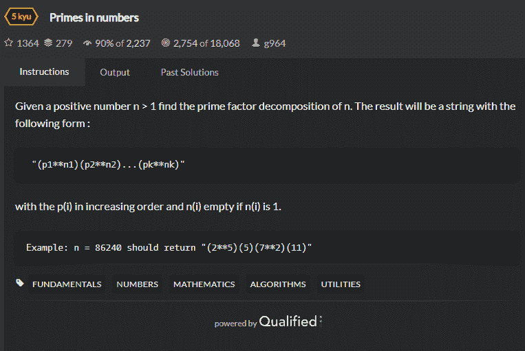

<!--yml
category: codewars
date: 2022-08-13 11:39:23
-->

# Codewars-Kata：Common Denominators问题_翎qian的博客-CSDN博客

> 来源：[https://blog.csdn.net/ROK_LI/article/details/121426056?ops_request_misc=%257B%2522request%255Fid%2522%253A%2522166036058916781685355945%2522%252C%2522scm%2522%253A%252220140713.130102334.pc%255Fall.%2522%257D&request_id=166036058916781685355945&biz_id=0&utm_medium=distribute.pc_search_result.none-task-blog-2~all~first_rank_ecpm_v1~rank_v31_ecpm-24-121426056-null-null.142^v40^control,185^v2^control&utm_term=codewars](https://blog.csdn.net/ROK_LI/article/details/121426056?ops_request_misc=%257B%2522request%255Fid%2522%253A%2522166036058916781685355945%2522%252C%2522scm%2522%253A%252220140713.130102334.pc%255Fall.%2522%257D&request_id=166036058916781685355945&biz_id=0&utm_medium=distribute.pc_search_result.none-task-blog-2~all~first_rank_ecpm_v1~rank_v31_ecpm-24-121426056-null-null.142^v40^control,185^v2^control&utm_term=codewars)

# Primes in numbers

## 题目



*   Title

    Given a positive number n > 1 find the prime factor decomposition of n. The result will be a string with the following form :

    ```
     "(p1**n1)(p2**n2)...(pk**nk)" 
    ```

    with the p(i) in increasing order and n(i) empty if n(i) is 1.

    ```
    Example: n = 86240 should return "(2**5)(5)(7**2)(11)" 
    ```

## 解题思路

1.  用map集合来计数，如果是他的因子，则存入map集合
2.  最后进行输出

### 代码

```
public static String factors(int n) {
    String str = "";
    Map<Integer,Integer> map = new HashMap<>();
    for(int i = 2; i <= n; i++){
        if(n%i == 0){
            if(!map.containsKey(i)){
                map.put(i,1);
            }else {
                map.put(i,map.get(i)+1);
            }
            if(i == n){
                str += "(" + i + (map.get(i) > 1 ? "**" + map.get(i) : "") + ")";
            }
            n /= i;
            i--;
            continue;
        }
        if(map.containsKey(i)){
            str += "(" + i + (map.get(i) > 1 ? "**" + map.get(i) : "") + ")";
        }
    }
    return str;
} 
```