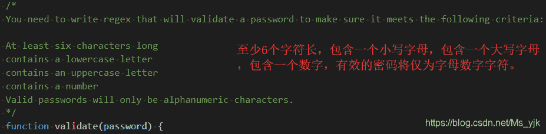
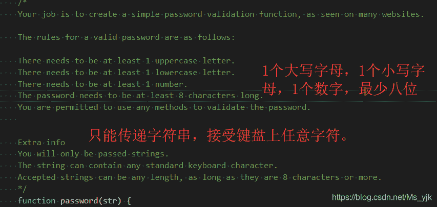

<!--yml
category: codewars
date: 2022-08-13 11:52:22
-->

# Codewars-Regex Password Validation(正则检验密码格式)_End_less__的博客-CSDN博客

> 来源：[https://blog.csdn.net/Ms_yjk/article/details/102313195?ops_request_misc=&request_id=&biz_id=102&utm_term=codewars&utm_medium=distribute.pc_search_result.none-task-blog-2~all~sobaiduweb~default-6-102313195.nonecase](https://blog.csdn.net/Ms_yjk/article/details/102313195?ops_request_misc=&request_id=&biz_id=102&utm_term=codewars&utm_medium=distribute.pc_search_result.none-task-blog-2~all~sobaiduweb~default-6-102313195.nonecase)

## 5kyu



测试源码：

```
function validate(password) {
    var flag = false;
    var re = /^(?=.*[a-z])(?=.*[A-Z])(?=.*\d)[A-Za-z\d] ]{6,}$/;
    var result = re.test(password);
    if (result) {
        flag = true;
    } else {
        flag = false;
    }
    return flag ? password + ' - Expected true' : password + ' - Expected false';
}
```

测试：

```
console.log(validate('djI38D55'));
console.log(validate('a2.d412'));
```


> *   ^                   # 开始字符
> *   (?=.*?[a-z])   # 至少有一个小写字母
> *   (?=.*?[A-Z])   # 至少有一个大写字母
> *   (?=.*?[0-9])   # 至少有一个数字
> *   [A-Za-z\d]     # 只有字母数字字符。
> *   {6,}               # 至少有6个字符长
> *   $                  # 结束字符


提交代码：


* * *

## 7kyu



```
function password(str) {
        //validate password
        return/^(?=.*[A-Z])(?=.*[a-z])(?=.*\d)\S{8,}$/.test(str);
    }
```

测试：

```
console.log(password("Abcd1234"));
console.log(password("Abcd123"));
console.log(password("abcd1234"));
console.log(password("AbcdefGhijKlmnopQRsTuvwxyZ1234567890"));
console.log(password("ABCD1234"));
console.log(password("Ab1!@#$%^&*()-_+={}[]|\:;?/>.<,"));
console.log(password("!@#$%^&*()-_+={}[]|\:;?/>.<,"));
```

