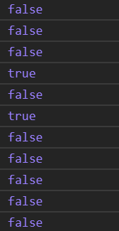
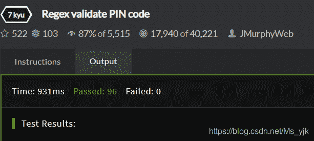

<!--yml
category: codewars
date: 2022-08-13 11:52:24
-->

# Codewars-Regex validate PIN code(正则检验PIN码)_End_less__的博客-CSDN博客

> 来源：[https://blog.csdn.net/Ms_yjk/article/details/102401649?ops_request_misc=&request_id=&biz_id=102&utm_term=codewars&utm_medium=distribute.pc_search_result.none-task-blog-2~all~sobaiduweb~default-7-102401649.nonecase](https://blog.csdn.net/Ms_yjk/article/details/102401649?ops_request_misc=&request_id=&biz_id=102&utm_term=codewars&utm_medium=distribute.pc_search_result.none-task-blog-2~all~sobaiduweb~default-7-102401649.nonecase)

**题目描述**

ATM机允许4位或6位密码，而密码只能包含4位或6位数字。

如果函数传递了一个有效的PIN字符串，返回true，否则返回false。

源码：

```
function validatePIN(pin) {
        //return true or false
        return /(^\d{4}$)|(^\d{6}$)/.test(pin);
    }
```

> *   \d                 #表示数字
> *   \d{n}             #只存在n位数字

测试：

```
console.log(validatePIN("1"));
console.log(validatePIN("12"));
console.log(validatePIN("123"));
console.log(validatePIN("1234"));
console.log(validatePIN("12345"));
console.log(validatePIN("123456"));
console.log(validatePIN("1234567"));
console.log(validatePIN("-1234"));
console.log(validatePIN("00000000"));
console.log(validatePIN("1.234"));
console.log(validatePIN("-12.34"));
```



