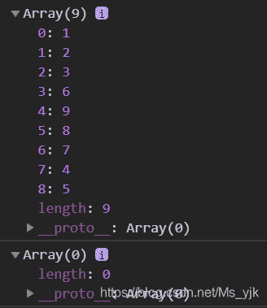

<!--yml
category: codewars
date: 2022-08-13 11:50:31
-->

# Codewars-Snail(Javascript实现螺旋数组)_End_less__的博客-CSDN博客

> 来源：[https://blog.csdn.net/Ms_yjk/article/details/102219632?ops_request_misc=&request_id=&biz_id=102&utm_term=codewars&utm_medium=distribute.pc_search_result.none-task-blog-2~all~sobaiduweb~default-3-102219632.nonecase](https://blog.csdn.net/Ms_yjk/article/details/102219632?ops_request_misc=&request_id=&biz_id=102&utm_term=codewars&utm_medium=distribute.pc_search_result.none-task-blog-2~all~sobaiduweb~default-3-102219632.nonecase)

话不多说，直接上源码：

```
function snail(array) {
    var results = [];

    while (array.length > 0) {
        //使用shift返回当前数组中的第一个元素
        // 使用concat方法连接被弹出的第一个元素，将其放在最后一位
        results = results.concat(array.shift());
        //forEach方法进行数组的遍历
        array.forEach(function (current) {
            //使用pop方法弹出最后一个元素，并进行在数组尾添加该元素
            results.push(current.pop());
        });

        array.forEach(function (current) {
            //reverse() 方法用于颠倒数组中元素的顺序
            current.reverse();
        });
        //再次用于颠倒数组中元素的顺序
        array.reverse();
    }

    return results;
}
```

测试：

```
console.log(snail([
        [1, 2, 3],
        [4, 5, 6],
        [7, 8, 9]
    ]));
    console.log(snail([
        []
    ]));
    console.log(snail([
        [1, 2, 3, 4, 5],
        [6, 7, 8, 9, 10],
        [11, 12, 13, 14, 15],
        [16, 17, 18, 19, 20],
        [21, 22, 23, 24, 25]
    ]));
```



题目地址：[https://www.codewars.com/kata/snail/train/javascript](https://www.codewars.com/kata/snail/train/javascript)