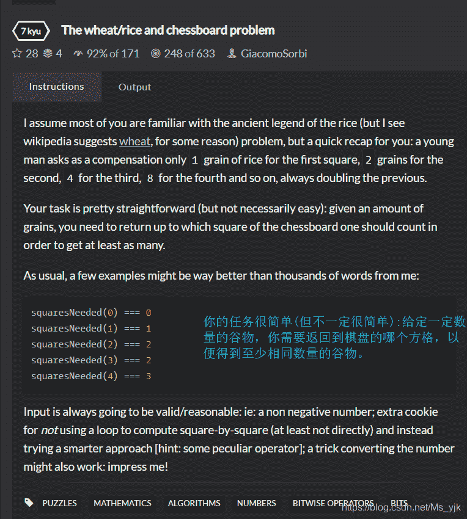
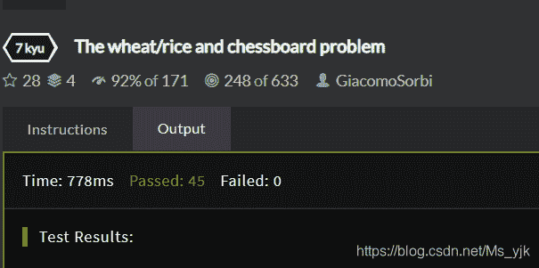
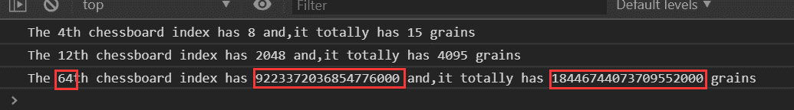

<!--yml
category: codewars
date: 2022-08-13 11:40:45
-->

# Codewars-The wheat/rice and chessboard problem（棋盘放谷粒）_End_less__的博客-CSDN博客

> 来源：[https://blog.csdn.net/Ms_yjk/article/details/102471842?ops_request_misc=%257B%2522request%255Fid%2522%253A%2522166036059016780357231535%2522%252C%2522scm%2522%253A%252220140713.130102334.pc%255Fall.%2522%257D&request_id=166036059016780357231535&biz_id=0&utm_medium=distribute.pc_search_result.none-task-blog-2~all~first_rank_ecpm_v1~rank_v31_ecpm-28-102471842-null-null.142^v40^control,185^v2^control&utm_term=codewars](https://blog.csdn.net/Ms_yjk/article/details/102471842?ops_request_misc=%257B%2522request%255Fid%2522%253A%2522166036059016780357231535%2522%252C%2522scm%2522%253A%252220140713.130102334.pc%255Fall.%2522%257D&request_id=166036059016780357231535&biz_id=0&utm_medium=distribute.pc_search_result.none-task-blog-2~all~first_rank_ecpm_v1~rank_v31_ecpm-28-102471842-null-null.142^v40^control,185^v2^control&utm_term=codewars)

## 棋盘放谷粒

科学作家大卫·布拉特纳说，从前，有一个骗子为高端客户制作棋盘——在这个例子中，他是一个国王。

工匠很好;他的棋盘不仅仅是漂亮。他知道，国王喜欢下棋。于是他想出一个计谋，骗国王交出一大笔财产。怎样实现他的计划呢 ？他想，“**这个国王的数学不是很好。**”

于是，当工匠把他的棋盘呈给国王时，他对国王说:

**“殿下，我不要钱。或珠宝。我只要一点米饭。”**

**“嗯，”**国王想，他自己就是个骗子。**“我有米饭。大米多少钱?”**

**“我所要的，”**工匠说，**“就是你把一粒米放在第一格上，两粒放在第二格上，四粒放在第三格上，八粒放在第四格上，如此类推，直到整整六十四格。”**

**“我能做到。”**国王不假思索地说。他命令他的粮仓付钱给这个人买棋盘。

好吧，这结果是相当困难的。棋盘上的前几格花了国王一粒，然后是两粒，然后是四粒……到第一行结束时，他收获了128粒。

在第二排，事情失控了。到第21格时，他欠了一百多万粒粮食;到第四十一年时，已经有超过一万亿粒米——比他、他的臣民或任何地方的国王所能负担的都要多。

毕竟，他是一个国王。他对谈判略知一二。

**“我给你钱，”**他对工匠说。**“但是在你收到钱之前，为了确保你得到了你想要的，我想让你数一数我给你的每一粒粮食。”**

“**噢，不必了，”**工匠说。

**“噢，这是必须的。”**国王说。**“我不想骗你。”**

数一粒米需要一秒钟。要数一数答应给他的粮食的数量，这位工匠得花上万亿年，大约是我们**宇宙年龄的42倍**，才能完成他的计算。伯爵还没有算完，国王是不会付钱的。工匠很快意识到这个数永远也做不完。他的骗局被戳穿了。

这里的道德吗?国王可能有时会忘记数学，但他们很少总是忘记数学。这就是为什么他们是国王。

来源：[That Old Rice-Grains-On-The-Chessboard Con](https://www.npr.org/sections/krulwich/2012/09/15/160879929/that-old-rice-grains-on-the-chessboard-con-with-a-new-twist)

## **题目描述**



简单思路：根据输入的数字判断在2的几次方之间，并返回最终的棋盘位置。

个人想法：使用for循环+if条件判断，当然这是最笨的方法，也是复杂度最高的，属于暴力破解。

### **源码**

```
function squaresNeeded(grains) {
    //your code here
    if (grains == 0) {
        return 0;
    } else {
        for (var i = 0; i < grains; i++) {
            // 刚好等于2的几次方，直接跳出
            if ((grains == Math.pow(2, i))) {
                return i + 1;
                // break;
            } else if (grains > Math.pow(2, i) && grains < Math.pow(2, (i + 1))) {
                return i + 1;
            }
        }
    }
}
```

### **测试结果**



别的大佬的写法（调用Math方法）：

```
function squaresNeeded(grains){
  return Math.ceil(Math.log2(grains+1))
}
```

二叉树**：**

```
function squaresNeeded(grains){
  return grains > 0 ? grains.toString(2).split("").length : 0
}
```

策略:我们可以转换成一个二进制字符串，然后通过分割成一个数组，因为二进制是以2为基数的数字系统，我们用2的幂来计数

棋盘格。它不满足的一种情况是0粒;用三进制来解释。

### 计算某位置的谷粒数

```
function qipan(num) {
    var sum = 0;
    var grains = 0;
    for(var i=0;i<num;i++){
        grains = Math.pow(2,i);
        sum += grains;
    }
    console.log('The ' + num + 'th chessboard index has ' + grains + ' and,it totally has '+sum+' grains');
}
```

**测试：**

```
qipan(4);
qipan(12);
qipan(64);
```

64格式的棋盘：

