<!--yml
category: codewars
date: 2022-08-13 11:44:23
-->

# Codewars-parseInt() reloaded(实现英文单词和数字的转换)_End_less__的博客-CSDN博客

> 来源：[https://blog.csdn.net/Ms_yjk/article/details/102486766?ops_request_misc=&request_id=&biz_id=102&utm_term=codewars&utm_medium=distribute.pc_search_result.none-task-blog-2~all~sobaiduweb~default-2-102486766.nonecase](https://blog.csdn.net/Ms_yjk/article/details/102486766?ops_request_misc=&request_id=&biz_id=102&utm_term=codewars&utm_medium=distribute.pc_search_result.none-task-blog-2~all~sobaiduweb~default-2-102486766.nonecase)

## 题目描述

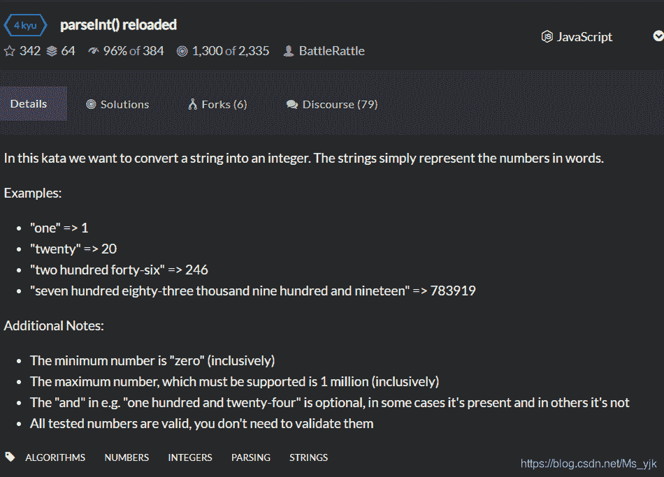

从题目描述中很清楚地看见：要求将字符串转换成对应的数字

> *   "one" => 1
> *   "twenty" => 20
> *   "two hundred forty-six" => 246
> *   "seven hundred eighty-three thousand nine hundred and nineteen" => 783919

在这里，学过数据结构或者Java。肯定会想着使用Map来实现数字和相应的字符串的转换。鉴于本人数据结构掌握不太好，未使用Map。本人采取方法：使用**键值对**。

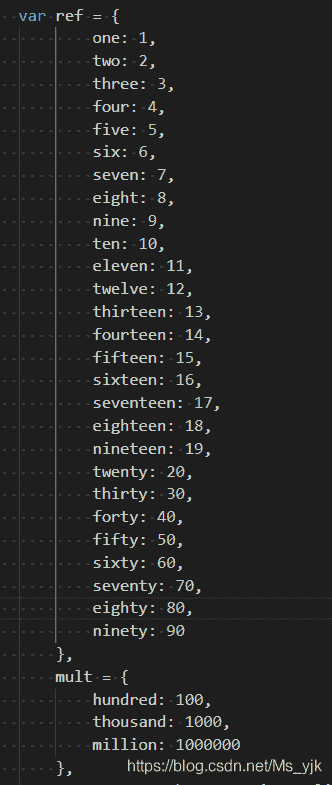

将基本的字符串和相对应的数字进行配对。然后使用循环和判断进行计算。

首先要做的事情就是将字符串中的单词进行分割：

例如:将 **seven hundred eighty-three thousand nine hundred and nineteen** 返回** ["nineteen", "and", "hundred", "nine", "thousand", "eighty-three", "hundred", "seven"]，**从而使用数组进行相关操作。

```
numbersInString.split(' ').reverse()
```

为什么要将数组中的质颠倒呢？

答：使用for...in循环时，从第一位开始。然而进行数字的计算。对于从电脑来说，从个位开始计算是最简单的。因为电脑不会知道你输入的是什么，更不知道这个数字又有多大。注意：题目要求最大数字可达100万。

> *   The maximum number, which must be supported is 1 million (inclusively)

## 核心代码

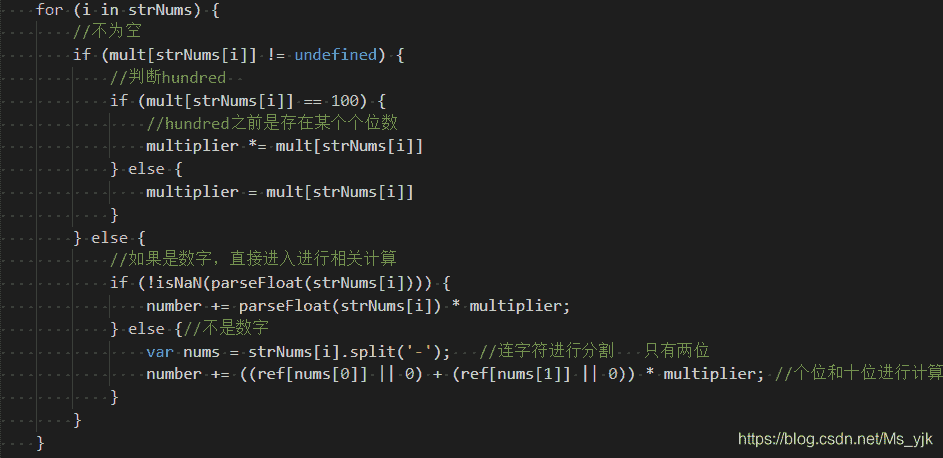

## 举例讲解

以 **"seven hundred eighty-three thousand nine hundred and nineteen" **为例：

循环从0开始（判断为undefined）：

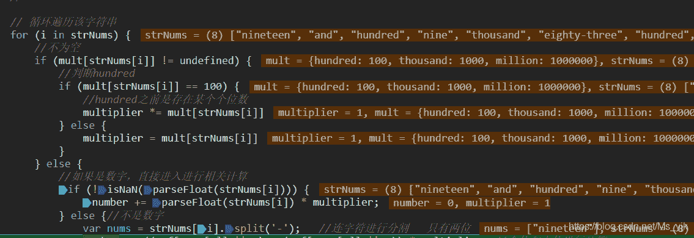

<figure class="image">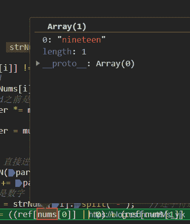

<figcaption>**此时返回number为19**</figcaption>

</figure>

<figure class="image">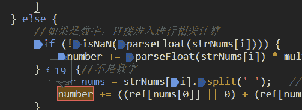

<figcaption>**由于第二个单词为 and，同样未定义，不进行循环。值仍为19**</figcaption>

</figure>

<figure class="image">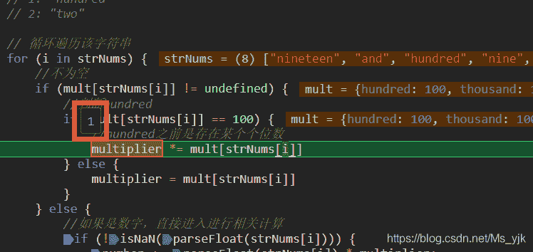

<figcaption>**再次进行循环，判断为hundred:将 multiplier赋值为1，并进行保存。**</figcaption>

</figure>

<figure class="image">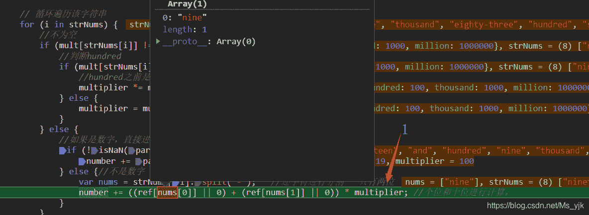

<figcaption>进行再次循环，nine不进入hundred判断，图中展示进行Number的操作</figcaption>

</figure>

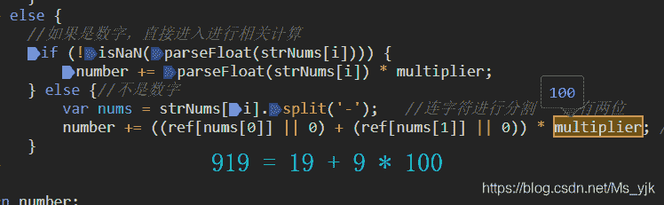

<figure class="image">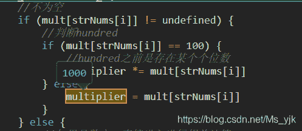

<figcaption>**从下一个字符判断为 thousand,赋值1000**</figcaption>

</figure>

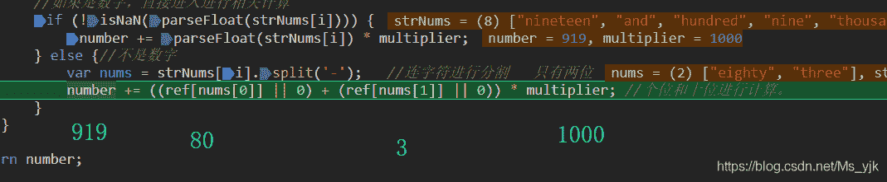

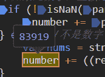

再次进入循环后，判断为100，进行**multiplier *= mult[strNums[i]]，此时赋值为 1000*100 = 100000；**

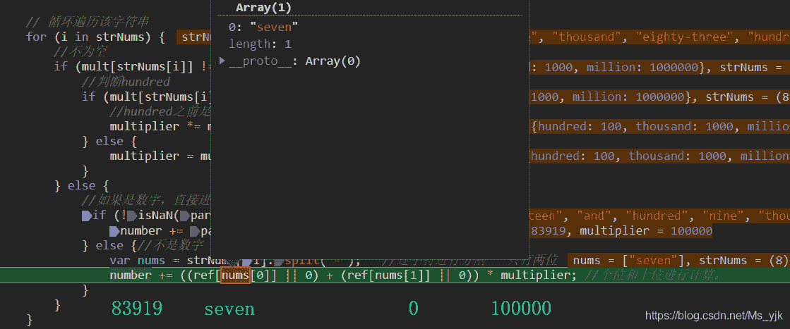

**最终输出：**

## 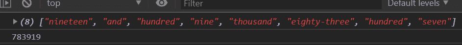

## 其他方法

代码来源：[ParseInt() reloaded soultions](https://www.codewars.com/kata/parseint-reloaded/solutions/javascript)(点进去估计也看不见，只有自己解题之后才会给予展示)

### 使用正则表达式

使用正则表达式的大佬挺多的。这里选一个比较快速简单计算的：

来源：[ZozoFouchtra](https://www.codewars.com/users/ZozoFouchtra)

```
function parseInt(string) {
  var vals = {
    "zero"   :0,  "one"     :1,  "two"      :2,  "three"   :3,  "four"    :4,
    "five"   :5,  "six"     :6,  "seven"    :7,  "eight"   :8,  "nine"    :9,    
    "ten"    :10, "eleven"  :11, "twelve"   :12, "thirteen":13, "fourteen":14,
    "fifteen":15, "sixteen" :16, "seventeen":17, "eighteen":18, "nineteen":19,   
    "twenty" :20, "thirty"  :30, "forty"    :40, "fifty"   :50,
    "fifty"  :50, "sixty"   :60, "seventy"  :70, "eighty"  :80, "ninety"  :90,
    "hundred":100,"thousand":1e3,"million"  :1e6
  }
  var ww = string.replace(/ and /gi, ",").replace(/(\s+|\-)/g,"," ).split(",");
  var e3 = 0;
  var int = ww.reduce( function(i,v){
    var val = vals[v];
    return (val<100 && i+val) || (val==100 && i*100) || (e3=e3+i*val)*0;
  }, 0 )
  return int+e3;
}
```

### 使用Map

说实话，个人表示有点蒙。（来源：[rajatkantinandi](https://www.codewars.com/users/rajatkantinandi)）

```
function parseInt(string) {
  const u20=["zero","one","two","three","four","five","six","seven","eight","nine","ten","eleven","twelve","thirteen","fourteen","fifteen","sixteen","seventeen","eighteen","nineteen"];
  const f20=["twenty","thirty","forty","fifty","sixty","seventy","eighty","ninety"];
  let strArr=string.toLowerCase()
                    .split("million")
                    .map(e=>e.split("thousand")
                              .map(e=>e.split("hundred")
                                        .map(e=>e.split(/[- ]/)
                                                  .filter(e=>e!=''&&e!='and')
                                                  .map(s=>{
                                                    if(u20.indexOf(s)>-1) return u20.indexOf(s);
                                                    else if(f20.indexOf(s)>-1) return (f20.indexOf(s)+2)*10;
                                                  })
                                                  .reduce((a,b)=>a+b,0)
                                        )
                              )
                              .map(e=>{
                                    if(e.length==1) return e[0];
                                    else return e[0]*100+e[1];
                              })
                    )
                    .map(e=>{
                          if(e.length==1) return e[0];
                          else return e[0]*1000+e[1];
                    })
  return strArr.length>1?strArr[0]*1000000+strArr[1]:strArr[0];
}
```

个人在讨论区见到最简单的：

感兴趣的可以自己调试。

```
function parseInt(string) {
  string = string.replace(' and', '').trim();
  if (string === 'one million') { return 1000000; }
  if (string === 'zero' || string === '') {return 0; }
  var arr = string.split('thousand');
  if (arr.length === 2) {return parseInt(arr[0]) * 1000 + parseInt(arr[1]);}
  arr = string.split('hundred');
  if (arr.length === 2) {return parseInt(arr[0]) * 100 + parseInt(arr[1]);}
  arr = string.split('-');
  if (arr.length === 2) {return parseInt(arr[0]) + parseInt(arr[1]);}
  return {one: 1, two: 2, three: 3, four: 4, five: 5, six: 6, seven: 7, eight: 8, nine: 9, ten: 10,
    eleven: 11, twelve: 12, thirteen: 13, fourteen: 14, fifteen: 15, sixteen: 16, seventeen: 17, eighteen: 18,
    nineteen: 19, twenty: 20, thirty: 30, forty: 40, fifty: 50, sixty: 60, seventy: 70, eighty: 80, ninety: 90}[string];
}
```

### 个人源码地址

[Mr.J--ParseInt() reloaded source demo](https://github.com/Jackyjk/MyDemo/blob/master/Mydemo/codewars/Solved/4-kyu-ParseInt%20reload.html)